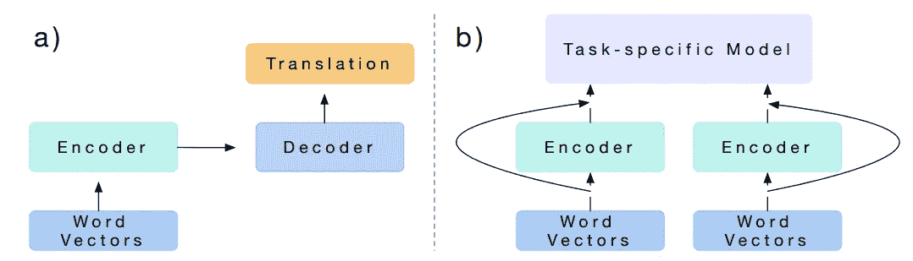
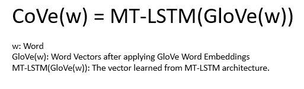
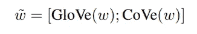

# 用语境化的单词向量代替你的单词嵌入

> 原文：<https://towardsdatascience.com/replacing-your-word-embeddings-by-contextualized-word-vectors-9508877ad65d?source=collection_archive---------5----------------------->


“high-rise buildings” by [Micaela Parente](https://unsplash.com/@mparente?utm_source=medium&utm_medium=referral) on [Unsplash](https://unsplash.com?utm_source=medium&utm_medium=referral)

受 Mikolov 等人(2013)和 Pennington 等人(2014)的影响，单词嵌入成为初始化 NLP 项目的基本步骤。之后又引入了很多嵌入如[LDA 2 vec](/combing-lda-and-word-embeddings-for-topic-modeling-fe4a1315a5b4)(Moody Christopher，2016)[字符嵌入](/besides-word-embedding-why-you-need-to-know-character-embedding-6096a34a3b10)，doc2vec 等等。今天，我们有了新的嵌入，即语境化的单词嵌入。这种想法是相似的，但他们实现了相同的目标，即使用更好的单词表示来解决 NLP 任务。

看完这篇帖子，你会明白:

*   语境化的词向量设计
*   体系结构
*   履行
*   拿走

# 语境化的词向量设计


“white sand beach under white sky” by [Itchy Feet](https://unsplash.com/@boredbanker?utm_source=medium&utm_medium=referral) on [Unsplash](https://unsplash.com?utm_source=medium&utm_medium=referral)

受 CNN 的启发，McCAnn 等人专注于训练编码器，并将其转换为其他任务，以便可以利用更好的单词表示。不使用 skip-gram (Mikolov 等人，2013 年)或矩阵分解(Pennington 等人，2014 年)，而是利用机器翻译来构建上下文化的词向量(CoVe)。

假设机器翻译(MT)足够通用以捕获单词的“含义”，我们建立一个编码器和解码器架构来训练 MT 的模型。之后，我们将编码器层“转移”到其他 NLP 任务(如分类问题和问题回答问题)中转移单词向量。



McCann B., Bradbury J., Xiong C., Socher R. (2017)

图 a 显示了如何为机器翻译训练模型。给出单词向量(例如 GloVe ),以便我们可以从模型中获得上下文向量(CoVe)。

# 体系结构



McCann B., Bradbury J., Xiong C., Socher R. (2017)

图 b 显示了重用结果 a 中的编码器并将其应用于其他 NLP 问题。



McCann B., Bradbury J., Xiong C., Socher R. (2017)

如图 b 所示，“特定任务模型”的输入是单词向量(例如 GloVe 或 word2vec)和编码器(即来自 MT 的结果)。因此，McCann 等人引入了上述公式来获得新词嵌入(串联 GloVe(w)和 CoVe(w))。

***实现***

在此之前，您需要安装相应的库(从 CoVe github 复制):

```
git clone https://github.com/salesforce/cove.git # use ssh: git@github.com:salesforce/cove.git
cd cove
pip install -r requirements.txt
python setup.py develop
# On CPU
python test/example.py --device -1
# On GPU
python test/example.py
```

如果您在“pip install-r requirements . txt”上遇到问题，您可以用以下命令替换它

```
conda install -c pytorch pytorch
pip install -e git+[https://github.com/jekbradbury/revtok.git#egg=revtok](https://github.com/jekbradbury/revtok.git#egg=revtok)
pip install [https://github.com/pytorch/text/archive/master.zip](https://github.com/pytorch/text/archive/master.zip)
```

如果用 Keras (Tensorflow)，可以按照这个[笔记本](https://github.com/rgsachin/CoVe/blob/master/PortFromPytorchToKeras.ipynb)建 CoVe。但是，在原来的笔记本上有一些问题，你可以看看我修改的版本作为参考。问题在于原始凹穴(pytorch 将层名称从“rnn”更新为“rnn1”)。[预训练模型](https://github.com/rgsachin/CoVe)(下载 Keras_CoVe.h5)也可用。

另一方面，你也可以使用预先转换的 Keras 版本。

```
# Init CoVe Model
cove_model = keras.models.load_model(cove_file)# Init GloVe Model
glove_model = GloVeEmbeddings()        glove_model.load_model(dest_dir=word_embeddings_dir, process=False)# Encode sentence by GloVe
x_embs = glove_model.encode(tokens)# Encode GloVe vector by CoVe
x_embs = cove_model.predict(x_embs)
```

# 拿走

要访问所有代码，可以访问这个 [github](https://github.com/makcedward/nlp/blob/master/sample/nlp-embeddings-word-cove.ipynb) repo。

*   CoVe **需要标签数据**来获得上下文单词向量。
*   **用手套建造洞穴**
*   CoVe **无法解决 OOV 问题**它建议使用零向量来表示未知单词。

# 关于我

我是湾区的数据科学家。专注于数据科学、人工智能，尤其是 NLP 和平台相关领域的最新发展。你可以通过[媒体博客](http://medium.com/@makcedward/)、 [LinkedIn](https://www.linkedin.com/in/edwardma1026) 或 [Github](https://github.com/makcedward) 联系我。

# 参考

放大图片作者:Michael b ...在翻译中学习:语境化的词向量。2017.[http://papers . nips . cc/paper/7209-learned-in-translation-contextualized-word-vectors . pdf](http://papers.nips.cc/paper/7209-learned-in-translation-contextualized-word-vectors.pdf)

[py torch 的小海湾](https://github.com/salesforce/cove)(原文)

[喀拉斯湾](https://github.com/rgsachin/CoVe)