# 神经网络的表示能力

> 原文：<https://towardsdatascience.com/representation-power-of-neural-networks-8e99a383586?source=collection_archive---------6----------------------->

我们知道神经网络及其在从数据科学到计算机视觉等多个领域的无数成就。众所周知，他们擅长解决涉及概括的复杂任务。从数学上来说，它们非常擅长于逼近任何复杂函数的行为。让我们直观地理解这种近似的概念，而不是预测误差最小化的向前和向后传播方法。假设您了解前向和后向传播的一些基本知识，前向和后向传播旨在借助梯度和网络中的误差传播来近似函数的行为。让我们用另一种视觉解释来理解神经网络的近似能力。涉及基础数学和图形分析。

> 从数学上讲，我们将着眼于给定神经网络对于所提供的要近似的函数的表示能力。

表示能力与神经网络将适当的标签分配给特定实例并为该类创建良好定义的精确决策边界的能力相关。在本文中，我们将探索一种视觉方法来学习更多关于神经网络的近似行为，这与神经网络的表示能力直接相关。

# 旅程

这都是从 **MP 神经元**开始的，这是一个非常简化的神经元模型。对于一个给定的函数，只要所有输入的总和大于阈值，神经元就会触发，否则就不会触发。非常原始的开始。为了检验它的表示能力，让我们看一个几何解释。首先用 2 个输入进行二维分析，以近似 or 函数，然后再用 3 个输入进行三维分析。

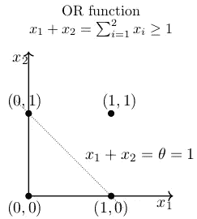

For separation in a 2-D coordinate system a line is required. The neuron will fire for points right to the line. Hence, a separation boundary created.

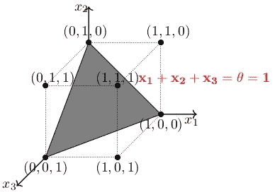

For separation in 3-D coordinate system a plane is required. Neuron will fire for all points above the plane.

因此，*麦卡洛克皮茨神经元*可以用来表示任何线性可分的布尔函数
。此外，我们可以看到一个严格的划分规则，而不是一个渐进的决策边界，任何略高于分离边界的内容都称为 **1** ，略低于分离边界的内容称为 **0** 。神经元触发类似阶跃函数的行为。使用*感知器*可以获得更大的灵活性，感知器的每个输入都有权重，但仍然存在严格的界限。但是，上述机制不适用于非线性可分函数。一个非常简单的例子是 XOR，想象一下在二维平面上为这个函数画一条分隔线。不会有了！与 XOR 非常相似，大多数数据在本质上都是线性不可分的。

因此，需要像当前神经网络这样的高级计算模型来为这些功能创建分离的边界。只是看到一个基本的插图，其中有一个隐藏层和一些预定义的权重，复制异或函数。

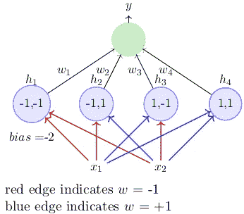

Conditions for implementation of XOR: w1<w0, w2≥w0, w3≥w0, w4<w0

> **记住:**任何输入为 **n** 的布尔函数都可以用一个感知器网络来表示，这个网络包含一个带有 **2^n** 感知器的隐藏层和一个包含 1 个感知器的输出层。这是一个充分条件，不是必要条件。

通过我们对单隐层网络的阶跃函数近似分析。它有局限性，其苛刻的判断标准相当于一个阶跃函数。让我们深入研究具有 s 形非线性近似函数的多层深度网络。

# 今日故事

s 形神经元的表达能力要高得多。具有单个隐藏层的多层神经元网络可以用来以任何期望的精度逼近任何连续函数。

> 数学上有一个保证，对于任意一个函数 f(x): R(n) → R(m)，我们总能找到一个隐层/s 的神经网络，它的输出 g(x)满足| g(x)—f(x)|< Θ

The above claim is **性质上相当大的**。因为这意味着我们可以用一个给定的神经网络来逼近任何函数。在数学术语中，**通用逼近定理**陈述了在激活函数的温和假设下，具有包含有限数量神经元的单个隐藏层的自动编码器网络可以逼近 **R(n)** 的紧致子集上的连续函数。因此，该定理指出，当给定适当的参数时，简单的神经网络可以代表多种功能。然而，它没有触及这些参数的算法收敛性。收敛部分与前向和后向传播算法有关。让我们来理解对上述定理的直观解释，它作为神经网络中学习行为的基本基础。

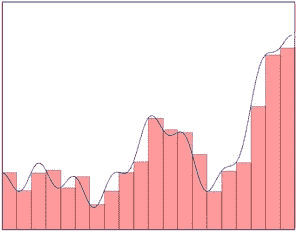

Geometric Interpretation of Function Approximations. Classical mathematical approach in Numerical Approximation.

# 最终游戏:Sigmoids 塔

继续上述用神经网络逼近函数的讨论。看看下面的图表，自己决定吧。一个函数可以用几个塔函数叠加**来近似。**该过程将形成一个形状，该形状相当于给定函数被近似，其中有一些微小的近似误差。现在，通用逼近定理的上述解释告诉我们，我们用于逼近的塔的数量越多，逼近行为越好。因此，在 s 形激活中调整参数，目的是创建这样的近似塔。按照这种解释，理论上对神经网络的准确性没有限制。

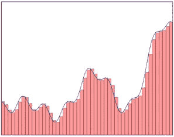

Clearly, more the number of towers better the approximation & lesser the approximation error.

让我们更深入地研究这个解释过程。所有这些“塔”功能都是相似的，只是在 x 轴上的高度和位置不同。现在，我们必须看看这些**塔**是如何用 sigmoid 激活函数创建的。

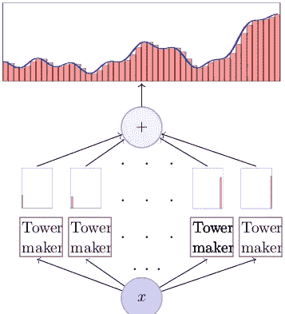

Our aim is to figure out the black-box **Tower Maker** for tower construction.

典型逻辑 sigmoid 激活函数方程如下所示。

w: represents **weights** | b: represents **bias**

> 随着 **w** 的增加，函数变得更加陡峭，就像阶跃函数一样。 **b** 的正值越大，曲线从原始曲线向左移动。

因此，通过改变这些值，我们可以创建不同版本的 sigmoids，我们可以将它们相互叠加，以获得类似塔的结构。为了在二维坐标系中创建塔，减去具有两个不同偏差值的曲线。

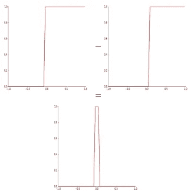

Left curve is having more positive value of **bias b.** Hence, with multiple such towers above random curve can be approximated or represented.

我们可以将这种操作扩展到神经网络的隐藏层，以构建模拟这种曲线减法行为的神经网络。因此，神经网络可以用权重和偏差的参数值来表示任何这样的函数，我们用我们的前向和后向传播算法连续确定这些参数值，直到达到收敛标准。

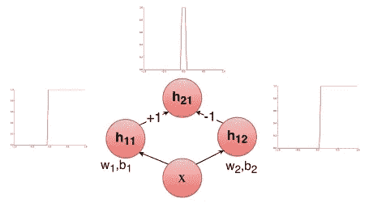

Now, the above illustrated random curve of a function can be approximated by superimposing such towers.

# 个案研究

考虑具有多个输入的场景。假设我们正试图决定是否会在海底的特定位置找到石油。此外，假设我们的决定基于两个因素:盐度(x1)和压力(x2)。给我们一些数据，似乎 y(oil|no-oil)是 x1 和 x2 的复变函数。我们想要一个神经网络来近似这个函数。

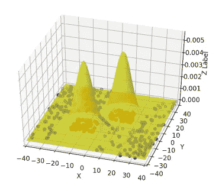

Illustration above plots the above scenario. Clearly, we need 3-D towers which approximates the distribution function.

在我们的理解中，我们需要在三维坐标系中制作这样的三维封闭塔。如果我们进行上述在三维空间中具有不同偏差的两个 sigmoids 相减的类似方法。我们将得到下面的等价曲线。

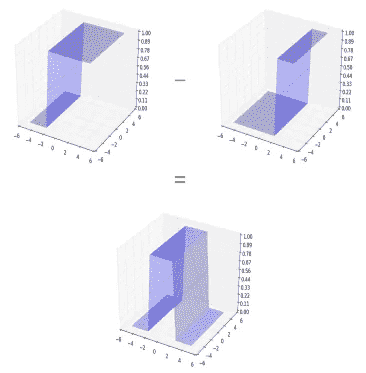

We still didn’t get a closed tower.

但是，我们可以看到，如果我们采取另一个水平垂直塔电流合成曲线以上。将这两个水平垂直的开放塔叠加起来，我们可以得到封闭塔。

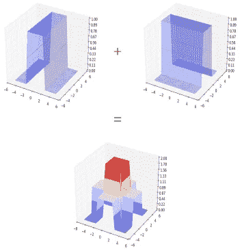

我们可以通过另一个组合 sigmoid 激活函数来传递上述输出，以获得最佳近似的适当塔。

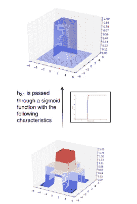

We can now approximate any function by summing up many such
towers

在多个这样的塔的帮助下，可以重建上述案例研究中的复杂分布函数。这里，让我们看一个神经网络来代表上述程序。

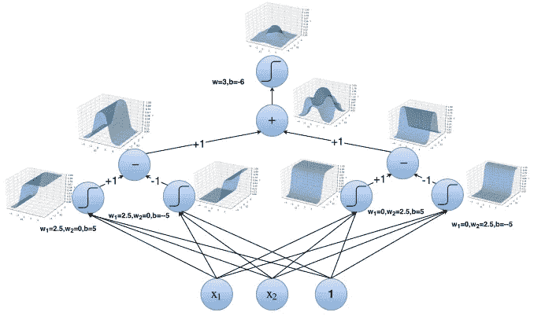

我们刚刚看到的说明性证明告诉我们，我们可以有一个具有两个隐藏层的神经网络，它可以通过一些塔来近似上述函数。这意味着我们可以有一个神经网络，它可以像上面案例研究中提到的那样准确地分离这种分布。对神经网络的精确度没有理论上的限制。

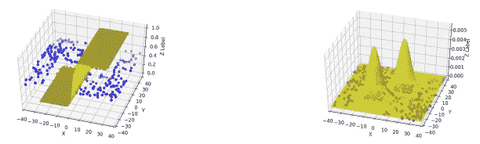

我们感兴趣的是把蓝点和红点分开。对于单个 s 形神经元，显然会存在误差。但是，有了两个隐藏层，我们可以用一组塔来近似上述函数。我们可以有一个神经网络，可以准确地将蓝点和红点分开！！

# 承认

近似的可视化方法是非常独特和有趣的，这就是为什么我觉得有必要进行这次讨论。我只是重组了 neuralnetworksanddeeplearning.com 已经存在的解释。描述性插图借用自深度学习课程 CS7015。感谢 Mitesh M. Khapra 教授和他的助教们的精彩课程！！