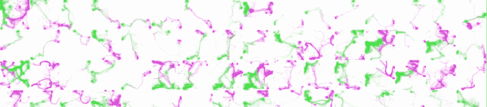
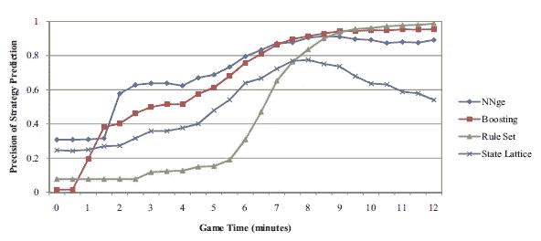
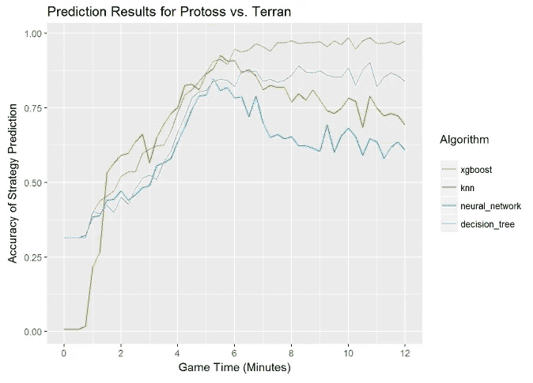
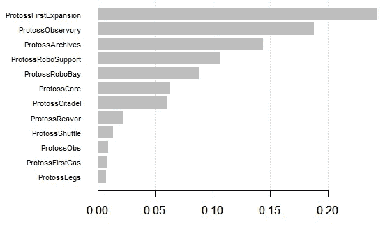

# 可再生研究:星际采矿

> 原文：<https://towardsdatascience.com/reproducible-research-starcraft-mining-ea140d6789b9?source=collection_archive---------2----------------------->



Troop movements in StarCraft

2009 年，我发表了一篇关于使用不同分类算法预测《星际争霸:繁殖战争》建造顺序的论文。我把 T2 的数据集 T3 提供给其他研究人员测试，一些 T4 的学术项目 T5 已经使用了这个数据集。然而，我从来没有为实验提供源代码，最终丢失了它，类似于暴雪和最初的星际争霸的源代码。自从转行到游戏行业，我开始倡导我的同事建立可重复的研究。这意味着编写输出结果的代码，删除手动步骤，并使用可以在不同机器和平台上重现的环境。

自从宣布[星际争霸重制版](https://starcraft.com/en-us/)和谷歌的 [DeepMind](http://www.gamasutra.com/view/news/284951/DeepMind_and_Blizzard_team_up_to_release_API_aimed_at_AI_enhancement.php) 应用于星际争霸 2 以来，人们对星际争霸人工智能的研究又有了新的兴趣。自从我第一次发表这项研究以来，近十年过去了，我很好奇我是否可以重现这个实验，看看最近的技术，如 [XGBoost](https://en.wikipedia.org/wiki/Xgboost) 是否会优于我之前测试的分类算法。

**初始设置** 我对这些实验的初始设置是 Java 代码和 [Weka](http://www.cs.waikato.ac.nz/ml/weka/) 库的混合。我首先使用交互式 Weka GUI 测试了不同的分类器，然后当我想要运行实验时，就切换到使用 Weka API。我的 Java 脚本会运行实验并将结果输出到文本文件中，在制作图表时，我会手动将这些文本文件复制到 excel 中。我在我的 Windows 笔记本电脑和大学的 Unix 服务器上都进行了实验。



Protoss vs. Terran Build Order Prediction

我想重现的关键实验是预测对手在游戏中不同模拟时间的建造顺序。我的论文中的这个实验的输出如上所示。随着不同的算法获得更多的信息，它们在识别对手的建造顺序方面变得更好。这 1000 多个回放被标记为 6 个不同的构建顺序，我标记构建顺序的方法在本文中有更详细的介绍。

**新脚本** 我的以可重复的方式运行这个实验的新方法是使用 [R Markdown](http://rmarkdown.rstudio.com/) ，这是一种可以嵌入 R 代码和可视化的 Markdown 语言。这种方法的目标是在运行实验时消除所有手动步骤。markdown 脚本从 github 下载必要的数据文件，运行实验，并将结果呈现为 pdf 文档或 html 文件。脚本在[这里](https://github.com/bgweber/StarCraftMining/blob/master/SC_Data_Mining.Rmd)可用，结果在 [pdf](https://github.com/bgweber/StarCraftMining/blob/master/SC_Data_Mining.pdf) 和 [html](https://github.com/bgweber/StarCraftMining/blob/master/SC_Data_Mining.html) 格式可用。该脚本的输出之一如下图所示。



Reproduced Experiment for Protoss vs Terran Build Order prediction

该脚本直接从 Github 加载神族对人族建造命令的数据帧。这消除了在本地复制实验文件的需要。

```
df <- read.csv("https://github.com/bgweber/StarCraftMining/
                         raw/master/data/scmPvT_Protoss_Mid.csv")
```

实验从 12 分钟的游戏时间开始，然后后退以模拟游戏过程中不同的时间步长。我使用这种方法来避免多次重新加载数据框。下面的片段显示了数据帧( *df* )如何被过滤到特定的比赛时间(*帧*)。

```
for (i in colnames(df)) {
  if (i != 'label') {
    index <- df[i] > frame 
    df[i][index] <- 0
  }
}
```

我应用了以下包中的分类器:最近邻( *class* )、决策树( *rpart* )、神经网络( *nnet* )和 xgboost( *xgboost* )。

```
predict <- knn(train, test, train$label, use.all = FALSE)
reg <- nnet::multinom(label ~ ., data=train, trace = FALSE)
model<- rpart(factor(label) ~ ., data = train)
bst <- xgboost(data = trainM, label = train$label, ... )
```

并使用 ggplot2 绘制结果，生成上图:

```
ggplot(data=melt(results, id="minutes"), aes(x=minutes, y=value,   
                         colour=variable)) + geom_line() + ...
```

结果显示，xgboost 在 10 分钟的游戏时间内，以 96%对 94%的准确率，确实优于论文中性能最好的算法 [LogitBoost](https://en.wikipedia.org/wiki/LogitBoost) 。然而，在早期游戏中最近邻方法优于其他分类器的最初发现仍然存在。

该脚本还生成了第二个图表，这是游戏开始 8 分钟时不同特性的重要性。这是一种我在原始论文中没有包括的分析，但在这里包括是有趣的，因为它显示了球员在侦察对手时应该注意什么。基于训练好的模型，特征的重要性随着时间而变化。下面的可视化是使用 xgboost 函数 *xgb.importance* 和 *xgb.plot.importance* 生成的。



Feature importance at 8 minutes game time identified by xgboost

**新环境** 我在我的 Windows 笔记本电脑上写了 R Markdown 脚本进行测试。为了使实验在不同的机器和环境中可重复，我使用了 [Docker](https://www.docker.com/) 。我从 CentOS 映像开始，安装 R，设置库和其他依赖项，如 pandoc，然后运行脚本，输出一个带有可视化效果的 html 文件。我使用 Amazon Linux 实例在 AWS 上构建了一个 EC2 实例，并运行了下面的[命令](https://github.com/bgweber/StarCraftMining/blob/master/Docker_Setup)。以下部分突出显示了一些命令:

```
# install and start docker 
sudo yum -y install docker 
sudo service docker start# get the centos image, and start it in interactive mode 
sudo docker pull centos 
sudo docker run -t -i centos /bin/bash# install R, which requires updating the repo 
yum -y install R# install required R packages 
R -e "install.packages('caTools', repos='[http://cran.us.r-project.org'](http://cran.us.r-project.org'))"
...# download the RMD file 
wget [https://github.com/bgweber/StarCraftMining/SC_Data_Mining.Rmd](https://github.com/bgweber/StarCraftMining/raw/master/SC_Data_Mining.Rmd)# run the script! 
Rscript -e "rmarkdown::render('SC_Data_Mining.Rmd')"
```

对于这个例子，我在交互模式下运行容器。如果我想在将来持久化运行实验的环境，我将创建并应用一个 docker 文件，并将结果图像保存到 docker 注册表中。这将确保对 R 库或其他依赖项的更改不会影响实验环境。

**结论** 如果我今天要重写这篇研究论文，我会推荐使用让实验可重复的工具。使用 R Markdown 和 Docker 是帮助实现这个目标的一种方法。