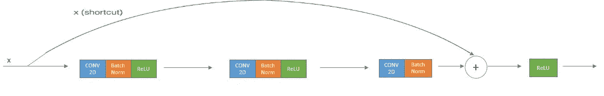
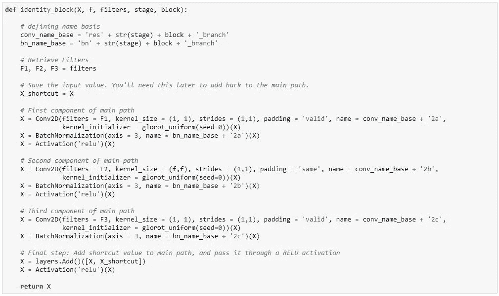
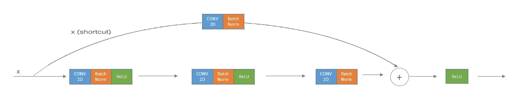
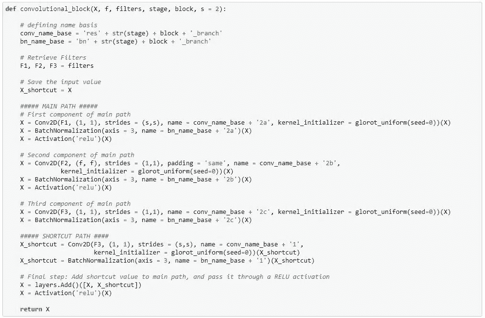
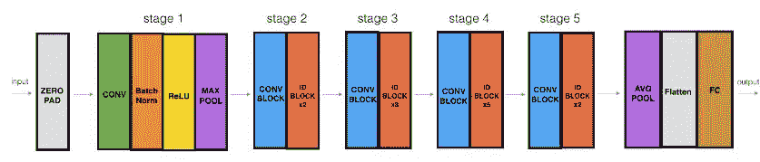

# 剩余网络

> 原文：<https://towardsdatascience.com/residual-networks-resnets-cb474c7c834a?source=collection_archive---------4----------------------->


在之前的帖子中，我们看到了深度[卷积神经网络](https://engmrk.com/convolutional-neural-network-3/)的 [LeNet-5](https://engmrk.com/lenet-5-a-classic-cnn-architecture/) 、 [AlexNet](https://engmrk.com/alexnet-implementation-using-keras/) 、 [VGG16](https://engmrk.com/vgg16-implementation-using-keras/) 的实现。同样，我们可以在理论上建立自己的超过 100 层的深度神经网络，但在现实中，它们很难训练。何、、任和在他们的研究[图像识别的深度残差学习](https://arxiv.org/pdf/1512.03385.pdf)中引入了残差网络(ResNets)的概念。ResNets 允许更深的网络有效地训练。

**非常深度的神经网络有什么问题？**
在训练神经网络的每次迭代期间，所有权重接收与误差函数相对于当前权重的偏导数成比例的更新。如果梯度非常小，那么权重将不能有效地改变，并且它可能完全停止神经网络的进一步训练。这种现象被称为消失梯度。更具体地说，我们可以说，由于非常缓慢的梯度下降，数据正在通过深度神经网络的各层消失。[1]

微软研究发现，将深度网络分成三层块，并将每个块的输入直接传递到下一个块，以及该块的剩余输出减去重新引入的块的输入，有助于消除这种信号消失问题。不需要额外的参数或改变学习算法[1]。换句话说，ResNets 将一个非常深的平面神经网络分解为通过跳过或快捷连接连接的小块网络，以形成一个更大的网络。


ResNets Vs Plain Neural Network

ResNet 中使用两种主要类型的块，主要取决于输入/输出维度是相同还是不同。

## a-身份块

标识块是 ResNets 中使用的标准块，对应于输入激活(比如 a[l])与输出激活(比如 a[l+2])具有相同维数的情况。下面是一个标识块的例子，上面的路径是“快捷路径”，下面的路径是“主路径”。



ResNets Identity block



Identity block implementation using keras

## b 卷积块

当输入和输出维度不匹配时，我们在捷径路径中添加一个卷积层。这种排列称为卷积块。



ResNets convolutional block



Convolutional block implementation using keras

# 构建完整的 ResNet 模型(50 层)

现在你已经有了构建一个非常深的 ResNet 所必需的模块。下图详细描述了该神经网络的体系结构。图中的“ID BLOCK”代表“身份块”，而“ID BLOCK x3”意味着您应该将 3 个身份块堆叠在一起。



50 layers ResNets Architecture

上述 ResNet-50 型号的详细信息如下:

*   零填充:用(3，3)填充输入
*   阶段 1:2D 卷积具有 64 个形状为(7，7)的滤波器，并使用(2，2)的步长。它的名字叫“conv1”。BatchNorm 应用于输入的通道轴。最大池使用(3，3)窗口和(2，2)步距。
*   阶段 2:卷积块使用三组大小为 64×64×256 的滤波器，f=3，s=1，块是“a”。这两个单位块使用三组大小为 64×64×256 的滤波器，f=3，块是“b”和“c”。
*   阶段 3:卷积块使用三组大小为 128×128×512 的滤波器，f=3，s=2，块为“a”。3 个单位块使用三组大小为 128×128×512 的滤波器，f=3，块为“b”、“c”和“d”。
*   阶段 4:卷积块使用三组大小为 256×256×1024 的滤波器，f=3，s=2，块为“a”。这 5 个单位块使用三组大小为 256×256×1024 的滤波器，f=3，块是“b”、“c”、“d”、“e”和“f”。
*   阶段 5:卷积块使用三组大小为 512×512×2048 的滤波器，f=3，s=2，块为“a”。这两个单位块使用三组大小为 256×256×2048 的滤波器，f=3，块是“b”和“c”。
*   2D 平均池使用形状为(2，2)的窗口，其名称为“avg_pool”。
*   展平没有任何超参数或名称。
*   全连接(密集)层使用 softmax 激活将其输入减少到类的数量。它的名字应该是' fc' + str(类)。

```
from keras import layers from keras.layers import Input, Add, Dense, Activation, ZeroPadding2D, BatchNormalization, Flatten, Conv2D from keras.layers import AveragePooling2D, MaxPooling2D, GlobalMaxPooling2D from keras.models import Modelfrom keras.initializers import glorot_uniforminput_shape = (64, 64, 3)
 classes = 6# Define the input as a tensor with shape input_shape
 X_input = Input(input_shape)# Zero-Padding
 X = ZeroPadding2D((3, 3))(X_input)# Stage 1 X = Conv2D(64, (7, 7), strides = (2, 2), name = ‘conv1’,)(X) X = BatchNormalization(axis = 3, name = ‘bn_conv1’)(X) X = Activation(‘relu’)(X)X = MaxPooling2D((3, 3), strides=(2, 2))(X)# Stage 2 X = convolutional_block(X, f = 3, filters = [64, 64, 256], stage = 2, block=’a’, s = 1) X = identity_block(X, 3, [64, 64, 256], stage=2, block=’b’)X = identity_block(X, 3, [64, 64, 256], stage=2, block=’c’)# Stage 3 X = convolutional_block(X, f = 3, filters = [128, 128, 512], stage = 3, block=’a’, s = 2) X = identity_block(X, 3, [128, 128, 512], stage=3, block=’b’) X = identity_block(X, 3, [128, 128, 512], stage=3, block=’c’)X = identity_block(X, 3, [128, 128, 512], stage=3, block=’d’)# Stage 4 X = convolutional_block(X, f = 3, filters = [256, 256, 1024], stage = 4, block=’a’, s = 2) X = identity_block(X, 3, [256, 256, 1024], stage=4, block=’b’) X = identity_block(X, 3, [256, 256, 1024], stage=4, block=’c’) X = identity_block(X, 3, [256, 256, 1024], stage=4, block=’d’) X = identity_block(X, 3, [256, 256, 1024], stage=4, block=’e’)X = identity_block(X, 3, [256, 256, 1024], stage=4, block=’f’)# Stage 5 X = convolutional_block(X, f = 3, filters = [512, 512, 2048], stage = 5, block=’a’, s = 2) X = identity_block(X, 3, [512, 512, 2048], stage=5, block=’b’)X = identity_block(X, 3, [512, 512, 2048], stage=5, block=’c’)# AVGPOOL
 X = AveragePooling2D((2,2), name=’avg_pool’)(X)# output layer X = Flatten()(X)X = Dense(classes, activation=’softmax’, name=’fc’ + str(classes))(X)# Create model
 model = Model(inputs = X_input, outputs = X, name=’ResNet50′)#Compile the model
 model.compile(optimizer=’adam’, loss=’categorical_crossentropy’, metrics=[‘accuracy’])
```

## 摘要

*   非常深的神经网络(普通网络)实现起来不实际，因为它们由于消失梯度而难以训练。
*   跳跃连接有助于解决消失梯度问题。它们还使得 ResNet 块很容易学习标识函数。
*   有两种主要类型的 ResNets 块:身份块和卷积块。
*   通过将这些块堆叠在一起，构建非常深的剩余网络。

## 参考

*   [https://en.wikipedia.org/wiki/Vanishing_gradient_problem](https://en.wikipedia.org/wiki/Vanishing_gradient_problem)
*   吴恩达卷积神经网络(Coursera)
*   何，，，，任，—深度残差学习在图像识别中的应用(2015)
*   Francois Chollet 的 GitHub 资源库:[https://GitHub . com/fchollet/deep-learning-models/blob/master/resnet 50 . py](https://github.com/fchollet/deep-learning-models/blob/master/resnet50.py)