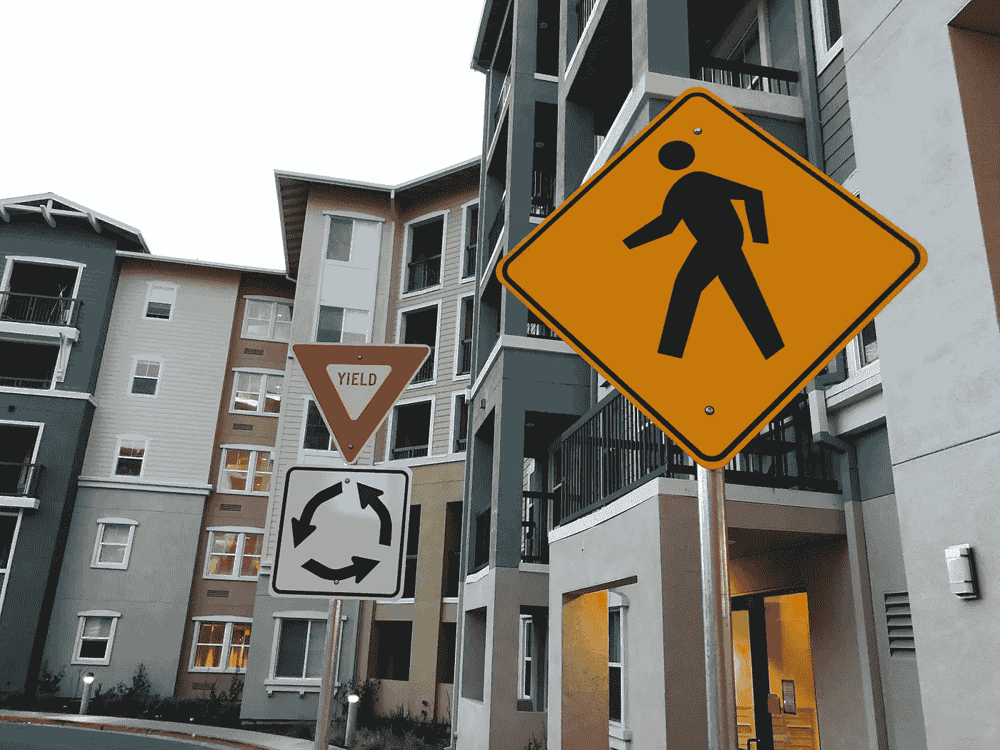
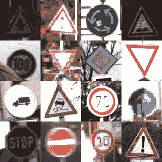
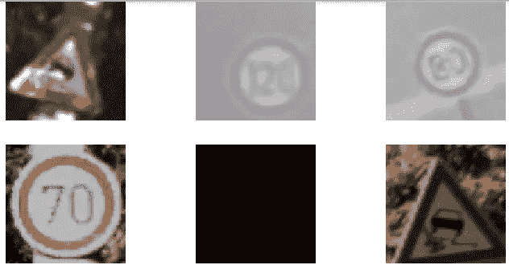
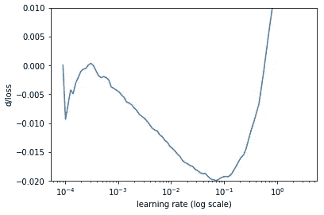
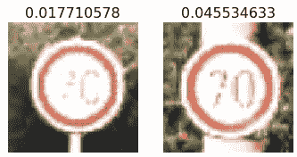

# PyTorch 在交通标志分类中的应用

> 原文：<https://towardsdatascience.com/resnet-for-traffic-sign-classification-with-pytorch-5883a97bbaa3?source=collection_archive---------6----------------------->

[德国交通标志识别基准数据集](http://benchmark.ini.rub.de/?section=gtsrb&subsection=about)可能是与自动驾驶汽车相关的最流行的图像分类。自动驾驶汽车需要检测和分类交通标志，以理解应用于一段道路的交通规则。也许，这个数据集太小，不够完整，不能用于实际应用。然而，它是计算机视觉算法的一个很好的基准。

# 资料组

数据集由两部分组成:训练集和测试集。训练集包含 39209 幅交通标志图像，分为 43 类，如停车标志、自行车穿越和限速 30 公里/小时

Examples of German Traffic Sign Recognition Dataset images

数据集非常不平衡。例如，有 1800 个“速度限制(50 公里/小时)”标志的实例，但只有 168 个“向左转弯危险”标志的实例。

测试集有 12630 个标记图像。这些图像被用于 2011 年 IJCNN 竞赛的评估。

你可以从[官网](http://benchmark.ini.rub.de/?section=gtsrb&subsection=dataset)下载数据集。

# 方法

我尝试使用在 ImageNet 数据集上预先训练的 [ResNet34](https://arxiv.org/abs/1512.03385) 卷积神经网络进行迁移学习。

我在 fast.ai 最新版[《程序员深度学习》课程中学到的解决计算机视觉问题的通用方法。我去年在旧金山大学参加了那个课程的离线版本。课程使用了](http://course.fast.ai/) [fastai](https://github.com/fastai/fastai) ，一个基于 PyTorch 构建的深度学习库。它为训练深度学习模型提供了易于使用的构建模块。

我花了大部分时间优化超参数和调整图像增强。

# 密码

我[在 GitHub 上发布了](https://github.com/surmenok/GTSRB)我的代码。您可以下载一个 [Jupyter 笔记本](https://github.com/surmenok/GTSRB/blob/master/german-traffic-signs.ipynb)，它包含了从下载数据集到基于未标记的测试集创建提交文件的所有步骤。训练 CNN 模型的代码大多基于 [fast.ai 课程](http://course.fast.ai/)的 CNN 课程。

让我们来看看训练和评估模型的步骤。

# 准备

准备环境。我必须安装 [fastai](https://github.com/fastai/fastai) 库及其所有依赖项。

下载数据集，解包。将训练集(39209 个图像)拆分为训练集和验证集，并将文件移动到正确的文件夹中。我用 80%的样本进行训练，20%的样本进行验证。

小心分裂。该数据集包含每个物理交通标志的 30 张照片。根据文件名区分不同的系列是很容易的。如果您只是随机拆分数据集，那么将会有信息从验证集泄漏到训练集。

我一开始就犯了这个错误。我随机分割数据集，得到了超过 99.6%的惊人的验证准确率。当测试准确率只有 87%时，我很惊讶:测试准确率和验证准确率之间的巨大差异是验证集设计不良或过度适应验证集的标志。

正确的方法是找到图像系列，并将每个系列完全放入训练集或验证集中，确保它不会分成两部分。要了解更多关于创建好的验证集的信息，请阅读[的这篇文章](http://www.fast.ai/2017/11/13/validation-sets/)，作者[雷切尔·托马斯](https://twitter.com/math_rachel?lang=en)。

# 探索性分析

浏览数据集。检查班级的分布，看看每个班级的一些图片示例。

图像有不同的大小。看看尺寸的直方图。它将让您了解 CNN 的输入维度应该是多少。

# 培养

加载在 ImageNet 数据集上预先训练的 ResNet34 模型。删除最后一层，并在顶部添加一个新的 softmax 层。

我的一般训练方法是:从一个小的模型输入(我从 32x32 的图像尺寸开始)和一个短的训练程序(总共 7 个时期)开始，以优化训练速度。你需要快速迭代。理想情况下，实验不应该超过几分钟。

此外，优化批量大小。在 GPU 内存允许的情况下，尽量增大批量大小。较大的批量有助于减少培训时间。但是，通过实验，我发现太大的批量(例如，1024 个样本或更多)会导致较低的验证准确性。我猜模型很早就开始过度拟合了。我最后得到了一个批量 256。

只有在你找到一组像样的超参数后，才切换到更大的图像和更长的细粒度训练。最后我用了 96x96 的图像，训练了 19 个纪元。

## 图像增强

设置图像增强。这是一种帮助模型更好地概括的技术。你在训练集中添加了很多人为的例子。这些例子是基于已经存在的例子，但是你稍微改变了它们:旋转几度，改变照明，放大，等等。

Examples of augmented images

我使用了以下变换的组合:旋转最大 20 度，光照变化最大 80%，缩放最大 20%。

灯光增强非常重要。在项目的早期阶段，我看到非常暗的图像有最不正确的预测。在照明增强方面的进取性将验证准确性提高了 3%以上。通过直接改变 R、G 和 B 通道的值来改变照明。详见 [RandomLighting](https://github.com/fastai/fastai/blob/master/fastai/transforms.py) 类。

我尝试过并拒绝的其他东西:直方图均衡化以提高对比度，随机模糊，填充。

## 学习率

使用这里描述的简单算法为训练搜索一个好的开始学习率。

## 微调最后一层

冻结除最后一层以外的所有层。以该学习速率训练一个时期的模型。以我为例，学习率是 0.01。这里的目标是为最后一层获得合理的权重。如果我们不这样做，稍后训练一个未冻结的模型会导致更低的层混乱，因为梯度会更大。我尝试了这两个选项，训练一个时期的最后一层在验证准确性方面有大约 1%的提高。我还使用了重量衰减来做一个小小的改进。

## 微调整个模型

解冻所有层。训练三个时代。

然后使用[带热重启的随机梯度下降(SGDR)](https://arxiv.org/abs/1608.03983) 训练几个时期。

我尝试使用[区别性微调](https://arxiv.org/abs/1609.04747)，为模型的不同部分设置不同的学习率。在这种情况下，我们希望模型的第一层比最后一层训练得少。第一层比其他层更通用。当在 ImageNet 数据集上训练时，这些层学到了对我们的任务非常有用的模式，我们不想失去这些知识。另一方面，最后一层是非常特定于任务的，我们希望在我们的任务中重新训练它们。不幸的是，它对改进度量没有帮助。如果对所有层应用较大的学习率，模型的训练效果会更好。我猜这是因为交通标志与狗、猫和飞机非常不同，因此较低层的信息不像在其他计算机视觉应用中那样有用。

验证集上最佳模型的准确率为 99.0302%。

## 误差分析

除了像混淆矩阵这样的常用工具，您还可以通过检查一些极端情况来分析错误:最不正确的预测、最正确的预测、最不确定的预测。

要查找每个类最不正确的预测，必须对验证集进行推理，并选择正确类的预测概率最小的示例。

Most incorrect images

这些图像看起来太模糊太亮。

类似地，您可以找到将最高概率分配给正确类(“最正确”)的示例，以及正确类的概率接近 1/num_classes(“最不确定”)的示例。

此分析的结果有助于您调整图像增强参数，可能还有模型的一些超参数。

## 在完整训练集上重新运行训练

在之前的所有步骤中，我们将 80%的训练集用于训练，20%用于验证。现在，由于我们发现了好的超参数，我们不再需要验证集，可以将这 20%的图像添加到训练集中，以进一步改进模型。

在这里，我只是使用相同的参数重新运行所有的训练步骤，但是使用所有 32909 个训练图像进行训练。

# 在测试集上测试

测试集(12630 幅图像)旨在测试最终模型的性能。我们没有在前面的步骤中查看测试集，以避免过度适应测试集。现在，我们可以在测试集上评估模型。我在测试集上获得了 99.2953%的准确率。相当不错！我们能进一步改进它吗？

# 测试时间增加

测试时间增强(TTA)通常有助于进一步提高精确度。诀窍是创建输入图像的几个增强版本，对每个版本进行预测，然后平均结果。这背后的直觉是，模型在分类一些图像时可能是错误的，但是稍微改变图像可以帮助模型更好地分类它。这就像如果一个人想对一个物体进行分类，他们从不同的角度看它，稍微改变一下照明，把它移到离眼睛更近的地方，直到他们能找到最有信心识别这个物体的最佳视角。

的确，TTA 帮我把准确率从 99.2953%提高到了 99.6120%。它将误差减少了 45%(从 0.7047%减少到 0.388%)。

# 有多好？

测试集上的准确率为 **99.6120%** 。我们来对比几个基准。

最先进的是由 Mrinal Haloi 基于《T2》的 CNN。99.81%.错误率比我好两倍。

2011 年 IJCNN 竞赛排行榜上的[前几名:](http://benchmark.ini.rub.de/?section=gtsrb&subsection=results#156ref)

*   [Á·阿尔瓦罗阿科斯-加西亚等人制作的带 3 个空间转换器的 CNN](https://doi.org/10.1016/j.neunet.2018.01.005)
*   [CNN 委员会](https://www.sciencedirect.com/science/article/pii/S0893608012000524?via%3Dihub)由 Dan Cireş an 等人提出 99.46%
*   用于物体识别的基于颜色斑点的 COSFIRE 过滤器作者:巴里斯·格瑟。98.97%

如果我的模特参加比赛，她会获得第二名。总的来说，几天的工作还不错。

接下来阅读:

 [## 估计深度神经网络的最佳学习速率

### 学习率是用于训练深度神经网络的最重要的超参数之一。

towardsdatascience.com](/estimating-optimal-learning-rate-for-a-deep-neural-network-ce32f2556ce0)  [## NVIDIA Jetson TX2 入门

### Jetson TX2 是 NVIDIA 的一款高能效嵌入式人工智能计算设备。这是一台小型计算机，有一个信用卡那么大…

medium.com](https://medium.com/@surmenok/getting-started-with-nvidia-jetson-tx2-5952a2d8d7ae)  [## Fast.ai:我从第 1-3 课中学到了什么

### Fast.ai 是一个非常棒的深度学习课程，适合那些喜欢通过做来学习的人。与其他课程不同，在这里您将…

hackernoon.com](https://hackernoon.com/fast-ai-what-i-learned-from-lessons-1-3-b10f9958e3ff)