# 回顾:带有身份映射的预激活 ResNet 已达到 1000 多个图层(图像分类)

> 原文：<https://towardsdatascience.com/resnet-with-identity-mapping-over-1000-layers-reached-image-classification-bb50a42af03e?source=collection_archive---------5----------------------->

## 预激活 ResNet:卷积前的批量 Norm 和 ReLU

在这个故事中，我们回顾了微软改进的 ResNet [1]。**通过身份映射，深度学习架构可以达到 1000 层以上**，不会增加错误。

在 ResNet [2]的上一版本中，当 ResNet 从 101 层到 1202 层时，虽然 ResNet-1202 仍然可以收敛，但是错误率从 6.43%下降到 7.93%(这个结果可以在[2]中看到)。并且在[2]中被陈述为开放问题而没有任何解释。

下图显示了使用标识映射的 ResNet 的结果。在层数达到 1001 的情况下，先前的 ResNet [2]仅获得 7.61%的误差，而对于 CIFAR-10 数据集，具有身份映射[1]的新 ResNet 可以获得 4.92%的误差。

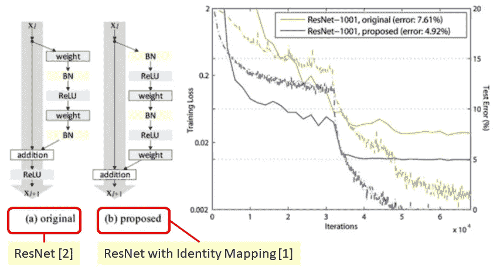

**(a) Previous ResNet [2] (7.61%) (b) New ResNet with Identity Mapping [1] (4.92%) for CIFAR-10 Dataset**

但是**为什么保持快捷连接路径干净**(如图将 ReLU 层从快捷连接路径移动到 conv 层路径)会更好？本文对此进行了很好的解释。一系列的消融研究证实了这种身份映射的重要性。

结果是**比 Inception-v3**【3】还要好。(如果有兴趣，也请阅读我的 [Inception-v3 评测](https://medium.com/@sh.tsang/review-inception-v3-1st-runner-up-image-classification-in-ilsvrc-2015-17915421f77c)。)这么好的成绩，发表在我写这个故事的时候 **2016 ECCV** 论文上**1000 多篇引用**。( [Sik-Ho Tsang](https://medium.com/u/aff72a0c1243?source=post_page-----bb50a42af03e--------------------------------) @中)

# 涵盖哪些内容

1.  **身份映射重要性的解释**
2.  **消融研究**
3.  **与最先进方法的比较**

# **1。身份映射重要性的解释**

前馈、反向传播和梯度更新似乎使深度学习成为一个秘密。我觉得这里的解释非常好。

## 1.1 前馈

在具有身份映射的 ResNet 中，在没有任何 conv 层 BN 和 ReLU 的情况下，保持从输入到输出的快捷连接路径的干净是至关重要的。

xl 是 l 层的输入，F(。)是代表 conv 层 BN 和 ReLU 的函数。那么我们可以这样表述:

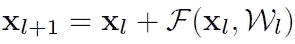

**One Particular Layer**

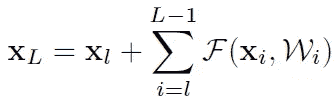

**L layers from l-th layer**

我们可以看到**输入信号 xl 仍然保持在这里！**

## 1.2 反向传播

在反向传播过程中，我们可以得到分解成两个附加项的梯度:

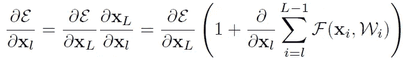

**Gradient which decomposed into two additive terms**

在毯子里面，**无论网络有多深**，我们总能在左边的项得到“1”。右项不能总是-1，这使得梯度为零。因此，**这个渐变并没有消失！！**

## 1.2 违反身份映射时的反向传播

另一方面，如果左边的项不等于 1 呢:

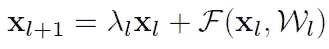

**One Particular Layer**

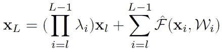

**L layers from l-th layer**

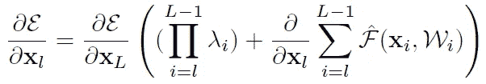

**Gradient which decomposed into two additive terms**

同样，梯度的左项是λ的乘积。

如果 **λ > 1** ，左项将呈指数大，出现**梯度爆炸**问题。我们应该记得，当梯度爆炸时，**损失无法收敛**。

如果 **λ < 1** ，左项将呈指数小，出现**梯度消失**问题。我们不能用大值更新梯度，**损耗停留在平稳状态，最终以大损耗收敛**。

因此，这就是为什么我们需要保持从输入到输出的捷径连接路径没有任何 conv 层，BN 和 ReLU。

# **2。消融研究**

## **2.1 各种快捷连接方式**

**110 层 ResNet (54 个两层剩余单元)**与各种类型的快捷连接在 **CIFAR-10** 数据集上测试如下:

**Performance of Various Types of Shortcut Connections**

**原文**:即[2]中 ResNet 的上一版本，误差 6.61%。

**常数缩放** : λ=0.5，存在上述梯度消失问题，仔细选择偏置 bg 后，误差为 12.35%。

**排他门控&仅快捷门控**:两者都试图增加快捷路径的复杂性，同时仍然保持路径等于“1”。但是两者都不能得到更好的结果。

**1×1 Conv 快捷方式**:类似于之前 ResNet [2]中的选项 C。在以前的 ResNet 中，发现使用选项 c 更好。但现在发现，当有许多剩余单元(太深)时，情况并非如此。

**辍学捷径**:实际上是统计执行λ=0.5。

## 2.2 激活的各种用法

通过在 BN 和 ReLU 的位置附近玩耍，获得以下结果:

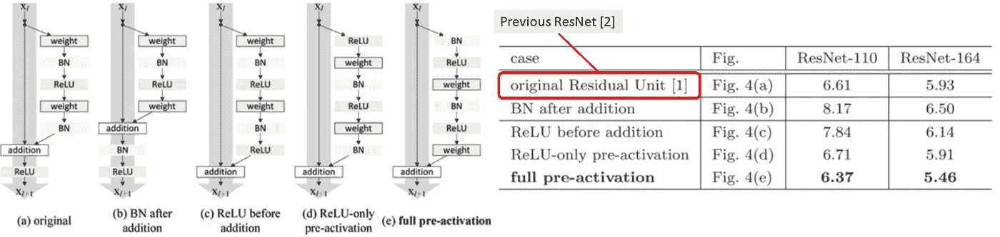

**Performance of Various Usages of Activation**

**添加**后之前的 ResNet & BN:两者都不能在违反身份映射的快捷连接上保持干净。

**加法前的 ReLU**:ReLU 后的残差函数必须是非负的，使得正向传播的信号是单调递增的，而残差函数最好也是负值。

**ReLU-only 预激活** : ReLU 不配合 BN 使用，不能很好的享受 BN 的好处。

**全预激活**:快捷路径干净，ReLU 配合 BN 使用，成为最佳设置。

## 2.3 预激活的双重优势

**2.3.1 优化的简易性**

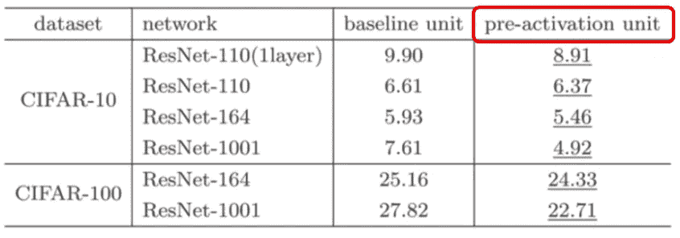

**Previous ResNet structure (Baseline) vs Pre-activation Unit**

由于 ReLU 层的错误位置，使用先前的 ResNet 结构(基线)在太深(1001)时具有更差的结果。**当网络从 110 到 1001 越来越深的时候，使用预激活单元总能得到一个比较好的结果。**

**2.3.2 减少过拟合**

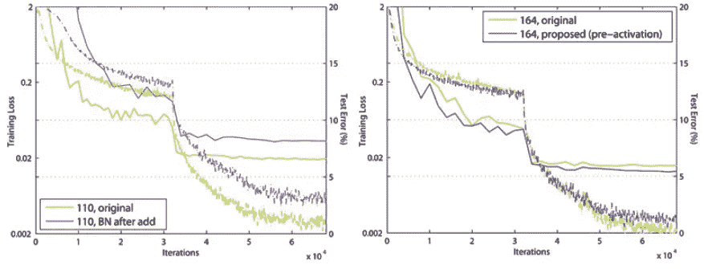

**Training Error vs Iterations**

预激活单元处于**正则化**状态，即**收敛时的训练损失略高，但测试误差**较低。

# 3.**与最先进方法的比较**

## 3.1 西法尔-10 和西法尔-100

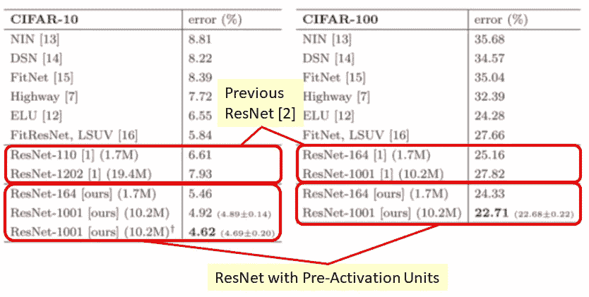

**CIFAR-10 & CIFAR-100 Results**

对于 CIFAR-10，使用具有建议预激活单元的**ResNet-1001(4.62%)，甚至优于使用以前版本 ResNet 的 ResNet-1202 (7.93%)** ，**少 200 层**。

对于 CIFAR-100，使用 **ResNet-1001 和建议的预激活单元(22.71%)，甚至优于使用 ResNet 早期版本的 ResNet-1001 (27.82%)** 。

对于 CIFAR-10 和 CIFAR-100 来说，**带有建议预激活单元的 ResNet-1001 并不比 ResNet-164 有更大的误差，但是以前的 ResNet [2]有**。

在 CIFAR-10 上，ResNet-1001 用 2 个 GPU 训练大约需要 27 个小时。

## 3.2 ILSVRC

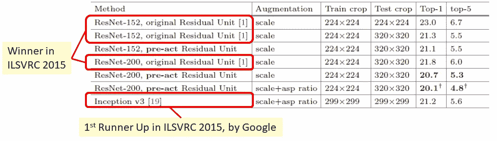

**ILSVRC Image Classification Results**

仅在规模上有所增强，ILSVRC 2015 的获胜者 ResNet-152 (5.5%)上一版本由于 ReLU 位置错误，在往更深处走时，比 ResNet-200 (6.0%) **上一版本**性能差**。**

并且所提出的具有预激活的 ResNet-200(5.3%)具有比先前的 ResNet-200 (6.0%)更好的结果。

随着规模和纵横比的增加，提议的预激活 ResNet-200(4.8%)优于谷歌的 Inception-v3[3](5.6%)。

同时，谷歌也有一个 Inception-ResNet-v2，它有 4.9%的误差，有了预激活单元，误差有望进一步降低。

在 ILSVRC 上，ResNet-200 在 8 个 GPU 上训练大约需要 3 周时间。

在回顾了 ResNet 和带有身份映射的 ResNet，以及 Inception-v1、Inception-v2 和 Inception-v3 之后，我还将回顾 Inception-v4。敬请关注！

# 参考

1.  【2016 ECCV】【带有身份映射的 ResNet】
    [深度剩余网络中的身份映射](https://arxiv.org/abs/1603.05027)
2.  【2016 CVPR】【ResNet】
    [用于图像识别的深度残差学习](https://www.cv-foundation.org/openaccess/content_cvpr_2016/papers/He_Deep_Residual_Learning_CVPR_2016_paper.pdf)
3.  【2016 CVPR】【盗梦空间-v3】
    [重新思考计算机视觉的盗梦空间架构](https://www.cv-foundation.org/openaccess/content_cvpr_2016/papers/Szegedy_Rethinking_the_Inception_CVPR_2016_paper.pdf)

# 我的评论

1.  [回顾:ResNet——2015 年国际影像分类、定位、检测奖得主](/review-resnet-winner-of-ilsvrc-2015-image-classification-localization-detection-e39402bfa5d8)
2.  [回顾:Inception-v3–ils vrc 2015 亚军(图像分类)](https://medium.com/@sh.tsang/review-inception-v3-1st-runner-up-image-classification-in-ilsvrc-2015-17915421f77c)
3.  [回顾:批量归一化(Inception-v2/BN-Inception)——ILSVRC 2015 中第二个超越人类水平的性能(图像分类)](https://medium.com/@sh.tsang/review-batch-normalization-inception-v2-bn-inception-the-2nd-to-surpass-human-level-18e2d0f56651)
4.  [回顾:谷歌网(Inception v1)——ILSVRC 2014(图像分类)获奖者](https://medium.com/coinmonks/paper-review-of-googlenet-inception-v1-winner-of-ilsvlc-2014-image-classification-c2b3565a64e7)