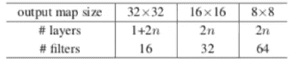
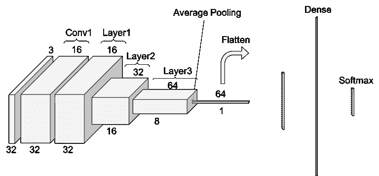
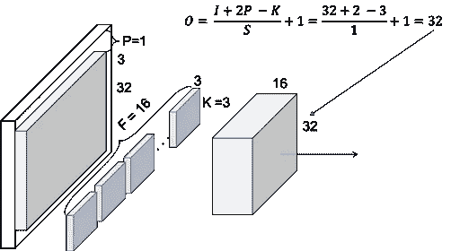
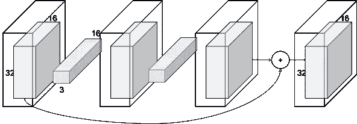
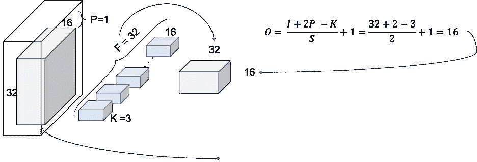
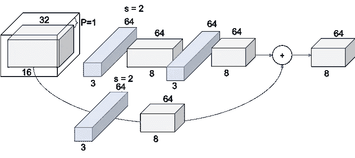
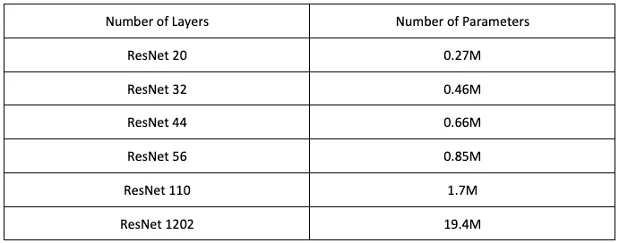

# CIFAR-10 的结果

> 原文：<https://towardsdatascience.com/resnets-for-cifar-10-e63e900524e0?source=collection_archive---------6----------------------->

这篇文章可以在 PDF [这里](http://www.pabloruizruiz10.com/resources/CNNs/ResNet-on-CIFAR10.pdf)下载。

这是关于 CNN 架构的[系列教程的一部分](https://medium.com/@pabloruizruiz/deep-convolutional-neural-networks-ccf96f830178)。

主要目的是当应用于 CIFAR-10 数据集时，深入了解 ResNets。

*   对于 ResNets 应用于 ImageNet，这是一个更深入的教程，这里还有另一个教程。
*   还有 PyTorch 实现详细教程[这里](http://www.pabloruizruiz10.com/resources/CNNs/ResNet-PyTorch.html)。
*   在这里还可以找到[构建这些架构的代码。](https://github.com/PabloRR100/Convolutional-Neural-Networks/blob/master/2_ResNets/resnets_Paper.py)

**索引**

*   介绍
*   结构
*   卷积 1
*   第一层
*   第二层
*   第三层
*   摘要

# 介绍

这项工作是[之前教程](https://medium.com/@pabloruizruiz/understanding-and-visualizing-resnets-442284831be8)的延续，在之前的教程中，我们对原论文[1]之后的 ResNet 进行了去神秘化。但是，这种结构是为了在 ImageNet 数据集上运行良好而构建的。

ImageNet 数据集由属于 1000 个不同类别的一组大小(224x224)的图像(作者使用了 128 万幅训练图像、5 万幅验证图像和 10 万幅测试图像)组成。但是，CIFAR10 由一组不同的映像(45k 训练映像、5k 验证映像和 10k 测试映像)组成，这些映像分布在 10 个不同的类别中。

因为输入体积(图像)的大小完全不同，所以很容易认为相同的结构不适合在该数据集上训练。我们无法在没有维度不匹配的情况下对数据集执行相同的缩减。

我们将遵循作者提供给 ResNets 的解决方案，在 CIFAR10 上进行训练，这也像 ImageNet 数据集一样很难遵循。在论文[1]的第 ***节 4.2 CIFAR-10 和分析*** 中，我们找到了下表:

Figure 1\. Schema for ResNet from the paper

让我们按照他们给出的字面解释来构造 ResNet。为简化起见，我们将使用 n=1，结果为 20。

# 结构

按照之前关于 ResNets 工作的相同方法，让我们先看看整体情况，稍后再一层一层地深入细节。

Figure 2\. Scheme for ResNet Structure on CIFAR10

# 卷积 1

在进入公共层行为之前，ResNet 的第一步是一个带有批处理规范化操作的 3x3 卷积。步幅为 1，填充为 1，以使输出大小与输入大小相匹配。请注意，我们与 ResNet for ImageNet 的第一个重大区别是，我们在第一个块中没有包括最大池操作。

Figure 3\. Conv1

我们可以通过图 2 来验证 Conv1 的输出音量确实是 32x32x16。

# 第一层

作者用来构建 ResNet 的其余注释是:

——用 ***一叠 6 层 3x3 卷积*** 。的选择将决定我们的网的大小。

特征图大小分别为{32，16，8}，每个特征图大小有 2 个卷积。此外，过滤器的数量分别为{16，32，64}。

--通过 ResNet 的 ***下采样*** 的卷是将 ***的步距增加到 2*** ，进行每层的第一次卷积。因此，在密集层之前不会使用池化操作。

-对于 ***旁路连接*** ，不使用投影。在卷的形状有所不同的情况下，输入的 ***会简单地用零*** 填充，所以 ***输出的大小与添加*** 之前的卷的大小相匹配。

这将留下图 4 作为我们第一层的表示。在这种情况下，我们的旁路连接是一个常规的 ***恒等短连接，因为体的维数在整个层操作中是恒定的。因为我们选择 n=1，所以在层 1 中应用了 2 个卷积。***

Figure 4\. Layer 1

我们仍然可以从图 2 中看出，第 1 层的输出体积确实是 32x32x16。我们再深入一点！

# 第二层

我们现在来看看如何处理输入音量的下采样。请记住，我们遵循与 ImageNet 数据集相同的结构和符号[。如果没有遵循任何步骤，请务必看一看，因为有更详细的解释。](https://medium.com/@pabloruizruiz/understanding-and-visualizing-resnets-442284831be8)

对于第 2 层和下一个第 3 层，其行为与第 1 层相同，只是第一个卷积使用的步幅为 2，因此输出音量的大小是输入音量的一半(填充为 1)。这意味着快捷连接也需要额外的步骤，以在求和之前调整体积的大小。

Figure 5.Layer 2, Block 1, Convolution

整个层 2 的最终外观如图 6 所示。我们可以看到步长为 2 的卷积是如何用于向下采样的跳过连接以及层的第一个卷积的。此外，我们可以根据文件中的表格检查，我们确实有一个 16x16x32 的体积。

Figure 6\. Layer 2

# 第三层

第 3 层将应用与第 2 层完全相同的原理，导致图 7。

Figure 7\. Layer 3

我们可以根据文章中的表格来检查，我们确实有一个 8x8x64 的卷。

# 摘要

遵循作者建立的解释规则的结果产生以下结构，改变图 1 中的 *n* 的值:

Table 1\. ResNets architectures for CIFAR-10

请注意，直观地说，这些架构与在 ImageNet 的[工作结束时展示的 ImageNet 架构并不匹配。](https://medium.com/@pabloruizruiz/understanding-and-visualizing-resnets-442284831be8)

# 文献学

[1]何国光，张，任，孙军，“深度残差学习在图像识别中的应用”，*，2016。*