# 受限玻尔兹曼机器—简化

> 原文：<https://towardsdatascience.com/restricted-boltzmann-machines-simplified-eab1e5878976?source=collection_archive---------1----------------------->

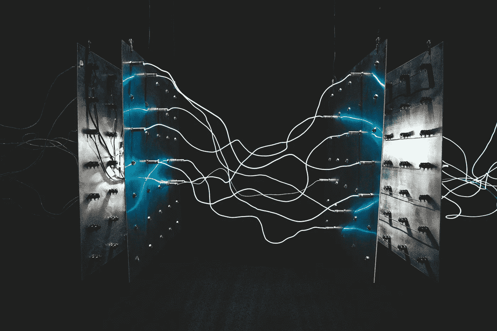

Photo by [israel palacio](https://unsplash.com/photos/ImcUkZ72oUs?utm_source=unsplash&utm_medium=referral&utm_content=creditCopyText) on [Unsplash](https://unsplash.com/search/photos/connections?utm_source=unsplash&utm_medium=referral&utm_content=creditCopyText)

**编辑**:这几天我在 substack 上写博客，如果你喜欢这篇文章，想了解更多关于科技、生活和生产力的内容，请在这里订阅:[tinyurl.com/substackblog](http://tinyurl.com/substackblog)。

在这篇文章中，我将尝试阐明关于受限玻尔兹曼机器及其工作方式的直觉。这应该是一个简单的解释，用一点数学知识，不要太深入每个概念或方程式。因此，让我们从 RBM 的起源开始，并随着我们的前进而深入研究。

# 什么是玻尔兹曼机器？

玻尔兹曼机器是能够学习内部表示的随机生成神经网络，并且能够表示和(给定足够的时间)解决困难的组合问题。

它们以[玻尔兹曼分布](https://en.wikipedia.org/wiki/Boltzmann_distribution)(也称为吉布斯分布)命名，这是统计力学的一个组成部分，有助于我们理解熵和温度等参数对热力学中量子态的影响。这就是为什么它们被称为基于能量的模型(EBM)。它们是 1985 年由卡内基梅隆大学的杰弗里·辛顿和约翰·霍普金斯大学的特里·塞伊诺夫斯基发明的

# 玻尔兹曼机器是如何工作的？

玻尔兹曼机器看起来像这样:

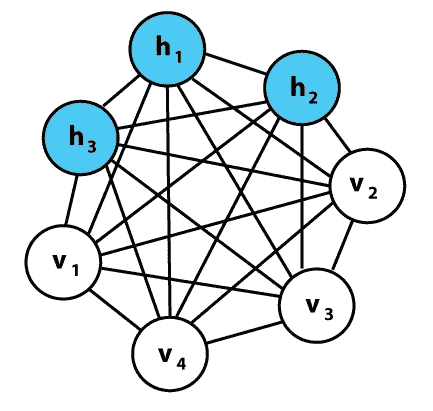

Author: Sunny vd on [Wikimedia](https://upload.wikimedia.org/wikipedia/commons/7/7a/Boltzmannexamplev1.png)

玻尔兹曼机器是非确定性(或随机)生成深度学习模型，只有两种类型的节点— `hidden`和`visible`节点。没有输出节点！这可能看起来很奇怪，但这就是给他们这种不确定性的特征。它们没有典型的 1 或 0 型输出，通过这种输出，可以使用随机梯度下降来学习和优化模式。他们学习模式却没有这种能力，这就是他们如此特别的原因！

这里要注意的一个区别是，与输入节点之间没有任何连接的其他传统网络(A/C/R)不同，玻尔兹曼机器在输入节点之间有连接。从图中我们可以看到，所有节点都与所有其他节点相连，不管它们是输入节点还是隐藏节点。这使他们能够在自己之间共享信息，并自行生成后续数据。我们只测量可见节点上的内容，而不测量隐藏节点上的内容。当输入被提供时，他们能够捕获所有的参数、模式和数据之间的相关性。这就是为什么它们被称为`Deep Generative Models`并被归入`Unsupervised Deep Learning`一类的原因。

# 什么是受限玻尔兹曼机？

RBMs 是一个具有生成能力的两层人工神经网络。他们有能力学习一组输入的概率分布。RBM 是 Geoffrey Hinton 发明的，可用于降维、分类、回归、协同过滤、特征学习和主题建模。

RBM 是一类特殊的[波尔兹曼机器](https://en.wikipedia.org/wiki/Boltzmann_machine)，它们受限于可见单元和隐藏单元之间的连接。与玻尔兹曼机器相比，这使得实现它们更容易。如前所述，它们是一个两层的神经网络(一层是可见层，另一层是隐藏层)，这两层由完全二分图连接。这意味着可见层中的每个节点都连接到隐藏层中的每个节点，但同一组中没有两个节点相互连接。这种限制允许比一般玻尔兹曼机器更有效的训练算法，特别是基于[梯度的](https://en.wikipedia.org/wiki/Gradient_descent)对比发散算法。

受限玻尔兹曼机器看起来像这样:

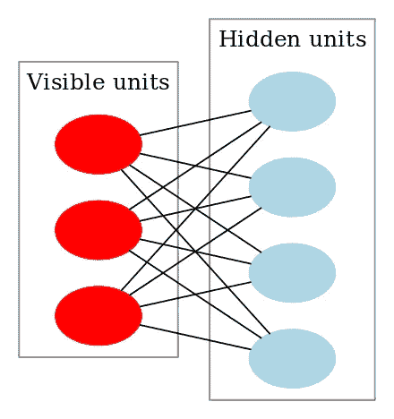

# 受限玻尔兹曼机器是如何工作的？

在 RBM 中，我们有一个对称二部图，其中同一组中没有两个单元是相连的。多个 RBM 也可以`stacked`并可以通过梯度下降和反向传播的过程进行微调。这样的网络被称为深度信念网络。虽然 RBM 偶尔会被使用，但深度学习社区中的大多数人已经开始用一般的敌对网络或变型自动编码器来取代它们的使用。

RBM 是一个随机神经网络，这意味着每个神经元在激活时都会有一些随机行为。RBM 中还有另外两层偏差单位(隐藏偏差和可见偏差)。这就是 RBMs 不同于自动编码器的地方。隐藏的偏置 RBM 在前向传递中产生激活，而可见的偏置帮助 RBM 在后向传递中重建输入。重建的输入总是不同于实际的输入，因为在可视单元之间没有连接，因此，没有办法在它们之间传递信息。

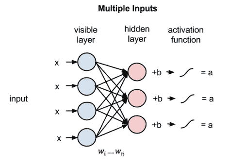

[Image Source](https://skymind.ai/images/wiki/multiple_inputs_RBM.png)

上图显示了使用多个输入训练 RBM 的第一步。输入乘以权重，然后添加到偏差中。然后，结果通过 sigmoid 激活函数传递，输出确定隐藏状态是否被激活。权重将是一个矩阵，输入节点的数量作为行数，隐藏节点的数量作为列数。在相应的偏置项被添加到第一隐藏节点之前，第一隐藏节点将接收乘以第一列权重的输入的向量乘法。

如果你想知道什么是 sigmoid 函数，这里有一个公式:

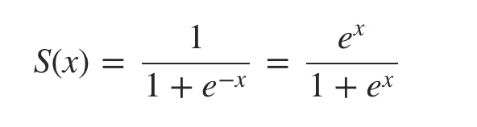

[Image Source: My Blog](https://adityashrm21.github.io/Restricted-Boltzmann-Machines/)

所以我们在这一步得到的等式是，

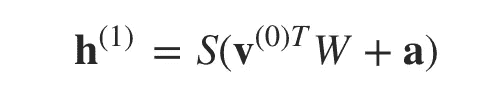

其中 **h(1)** 和 **v(0)** 是隐藏层和可见层的对应向量(列矩阵)，上标为迭代(v(0)表示我们提供给网络的输入)，而 **a** 是隐藏层偏置向量。

(注意，我们在这里处理的是向量和矩阵，而不是一维值。)

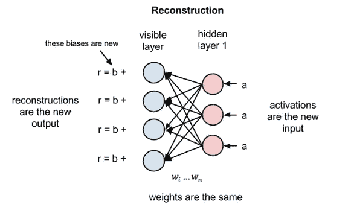

[Image Source](https://skymind.ai/images/wiki/reconstruction_RBM.png)

现在这个图像显示了相反的阶段或者说是**重建**阶段。它与第一遍相似，但方向相反。等式结果是:

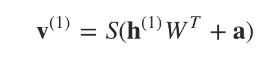

其中 **v(1)** 和 **h(1)** 是可见层和隐藏层的对应向量(列矩阵)，以上标为迭代， **b** 是可见层偏移向量。

# 学习过程

现在，差异 **v(0)-v(1)** 可以被认为是我们需要在训练过程的后续步骤中减少的重建误差。因此，在每次迭代中调整权重，以最小化该误差，这就是学习过程的本质。现在，让我们试着用数学术语来理解这个过程，不要太深入数学。在前向传递中，给定输入 **v(0)** 和权重 ***W*** ，我们正在计算输出 **h(1)** 的概率，表示为:

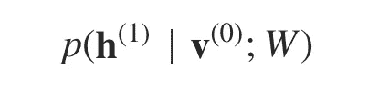

在后向传递中，在重构输入的同时，我们在给定输入 **h(1)** 和权重 ***W*** 的情况下计算输出 **v(1)** 的概率，表示为:

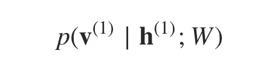

向前和向后传递中使用的权重是相同的。这两个条件概率一起将我们引向输入和激活的联合分布:

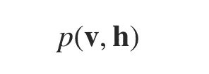

重构不同于回归或分类，因为它估计原始输入的概率分布，而不是将连续/离散值与输入示例相关联。这意味着它试图同时猜测多个值。这被称为生成学习，与分类问题中发生的判别学习(将输入映射到标签)相反。

让我们尝试看看算法如何减少损失，或者简单地说，它如何减少每一步的误差。假设我们有两个正态分布，一个来自输入数据(用 p(x)表示)，另一个来自重构的输入近似值(用 q(x)表示)。这两种分布之间的差异是我们在图形意义上的误差，我们的目标是将其最小化，即，使图形尽可能接近。这个想法用一个叫做[库尔贝克-莱布勒分歧](https://en.wikipedia.org/wiki/Kullback%E2%80%93Leibler_divergence)的术语来表示。KL-divergence 测量两个图形下的非重叠区域，并且 RBM 优化算法试图通过改变权重来最小化该差异，使得重建非常类似于输入。右侧的图表显示了左侧曲线面积差异的积分。

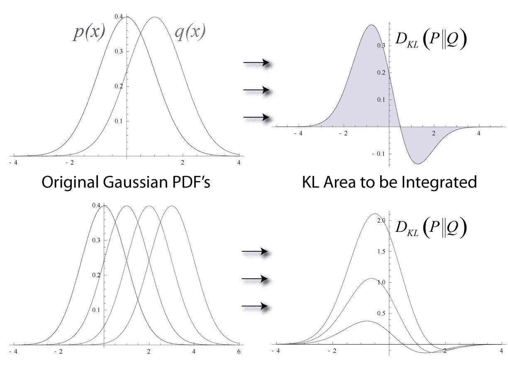

Image by [Mundhenk](https://en.wikipedia.org/wiki/User:Mundhenk) on [Wikimedia](https://en.wikipedia.org/wiki/File:KL-Gauss-Example.png)

这给了我们一个关于误差项的直觉。现在，为了了解 RBM 实际上是如何做到这一点的，我们必须深入了解损失是如何计算的。给定一些数据，RBM 的所有常见训练算法近似对数似然梯度，并在这些近似上执行梯度上升。

# 对比分歧

玻尔兹曼机器(和 RBM)是基于能量的模型，可见和隐藏单元的联合配置( **v，h** )具有由下式给出的能量:

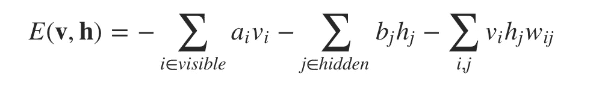

其中 *vi，hj* ，是可见单元 *i* 和隐藏单元 *j 的二元状态，ai，bj* 是它们的偏差， *wij* 是它们之间的权重。

网络分配给可见向量 *v* 的概率通过对所有可能的隐藏向量求和给出:

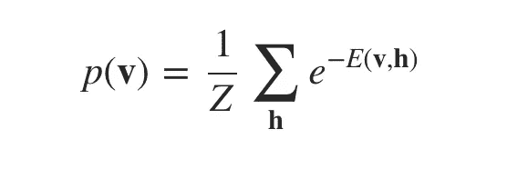

*Z* 这是配分函数，通过对所有可能的可见和隐藏向量对求和得出:

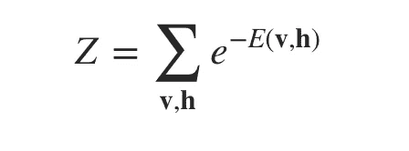

这给了我们:

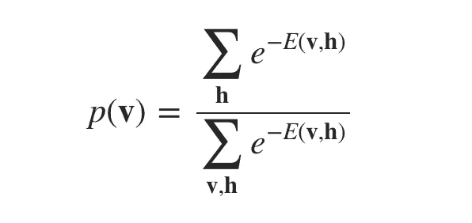

训练向量相对于权重的对数似然梯度或对数概率的导数非常简单:

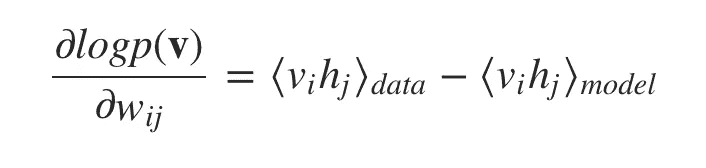

其中尖括号用于表示由下面的下标指定的分布下的期望。这导致了用于在训练数据的对数概率中执行随机最速上升的非常简单的学习规则:

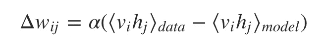

其中α是学习率。有关上述等式的含义或推导方法的更多信息，请参考 Geoffrey Hinton 撰写的[RBM 训练指南。这里需要注意的重要一点是，因为 RBM 中的隐藏单元之间没有直接的联系，所以很容易得到 *⟨vi hj⟩data* 的无偏样本。然而，获得一个⟨vi hj⟩model 的无偏样本要困难得多。这是因为它需要我们运行马尔可夫链，直到达到稳定分布(这意味着分布的能量最小化——平衡！)来近似第二项。因此，我们没有这样做，而是从分布中执行](https://www.csrc.ac.cn/upload/file/20170703/1499052743888438.pdf)[吉布斯采样](https://en.wikipedia.org/wiki/Gibbs_sampling)。这是一种马尔可夫链蒙特卡罗(MCMC)算法，用于在直接采样困难时(如我们的情况)，获得从指定的多元概率分布近似得到的一系列观察值。吉布斯链用训练集的训练样本 **v(0)** 初始化，并在 *k* 步后产生样本 **v(k)** 。每个步骤 *t* 都包括从 p( **h | v(t)** )中采样 **h(t)** 以及随后从 p( **v | h(t)** )中采样 **v(t+1)** (值 *k =* 1 令人惊讶地工作得相当好)。学习规则现在变成了:

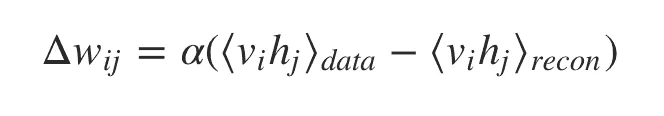

即使只是粗略地近似训练数据的对数概率的梯度，该学习也工作得很好。学习规则更加接近另一个目标函数的梯度，该目标函数称为**对比散度**，它是两个 Kullback-Liebler 散度之间的差。

当我们应用这个时，我们得到:

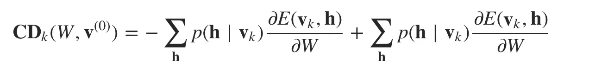

其中第二项是在吉布斯采样的每个 *k* 步之后获得的。以下是 CD 算法的伪代码:

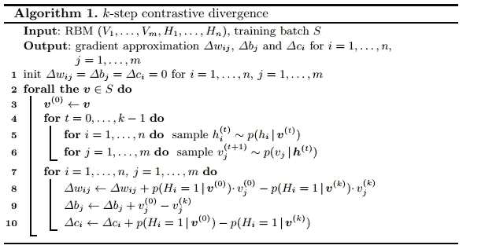

[Image Source](https://cdn-images-1.medium.com/max/1600/1*cPYfytQ30HP-2rpe_NKqmg.png)

# 结论

我们在这篇文章中讨论的是一个简单的受限玻尔兹曼机器架构。RBM 和用于训练和优化的算法有许多变化和改进(我希望在以后的文章中涉及)。我希望这有助于你理解和了解这个令人敬畏的生成算法。在下一篇文章中，我们将应用 RBMs 来构建图书推荐系统！

不要犹豫，纠正评论中的任何错误或为未来的帖子提供建议！我喜欢写与人工智能、深度学习、数据科学和机器学习相关的主题(无论是数学、应用还是简化)。

如果你觉得这篇文章有帮助，请随意点击👏s！如果你想看用 Python 实现一个 RBM 的代码，在这里看我的资源库****。****

## **了解成果管理制的参考资料和一些极好的资源:**

*   **[维基百科—受限玻尔兹曼机](https://en.wikipedia.org/wiki/Restricted_Boltzmann_machine)**
*   **[维基百科—玻尔兹曼机](https://en.wikipedia.org/wiki/Boltzmann_machine)**
*   **杰弗里·辛顿的《RBM 训练指南》**
*   **[Skymind — RBM](https://skymind.ai/wiki/restricted-boltzmann-machine)**
*   **[https://www.cs.toronto.edu/~rsalakhu/papers/rbmcf.pdf](https://www.cs.toronto.edu/~rsalakhu/papers/rbmcf.pdf)**
*   **[Artem Oppermann 关于理解和培训成果管理制的中期文章](/deep-learning-meets-physics-restricted-boltzmann-machines-part-ii-4b159dce1ffb)**
*   **[苏宁杜数据](https://medium.com/@neuralnets/boltzmann-machines-transformation-of-unsupervised-deep-learning-part-1-42659a74f530)波尔兹曼机器上的中等帖子**