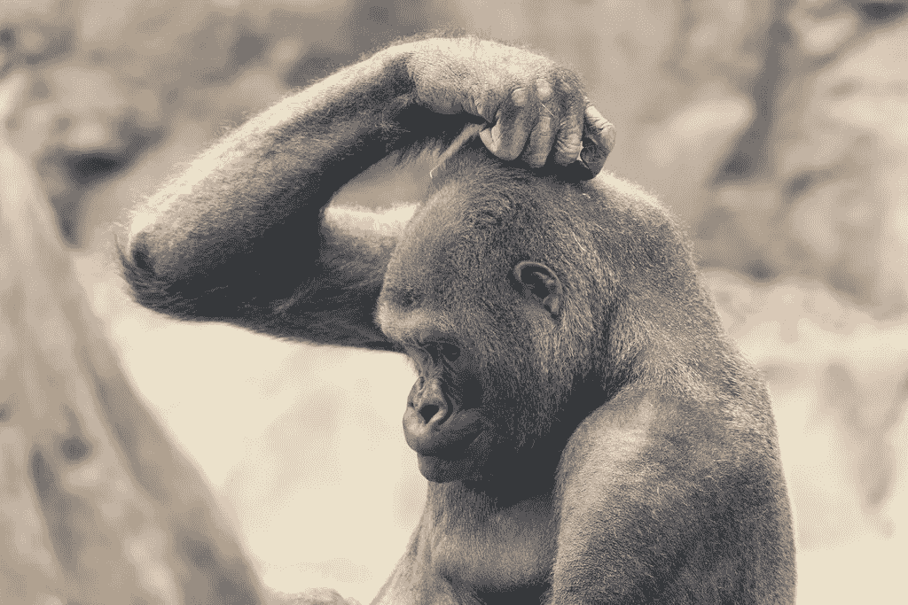
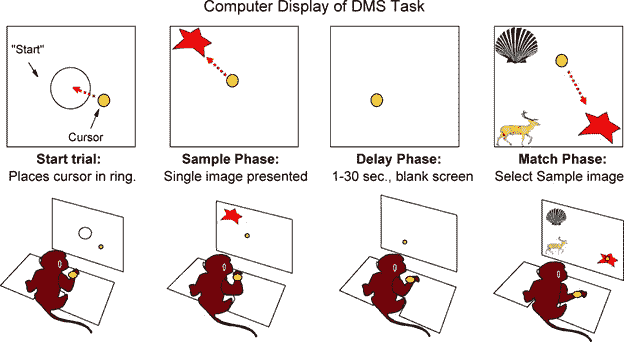
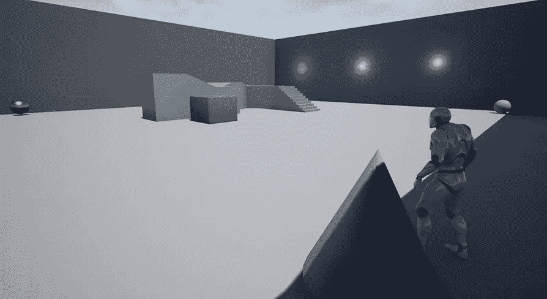

# 重新思考自主代理

> 原文：<https://towardsdatascience.com/rethinking-the-autonomous-agent-a-q-learning-behavior-system-8839a07c10b6?source=collection_archive---------15----------------------->

## 一个面向具身智能体的 Q 学习行为系统

Image courtesy of [Eric Kilby](https://www.flickr.com/photos/ekilby/)

本文介绍了一个基于 Q 学习的行为系统，用于包括机器人和视频游戏角色在内的具身智能体。

大多数最近的强化学习(RL)成功案例都专注于在一些虚拟任务中实现超人水平的表现——无论是视频游戏还是机器人控制测试。强化学习的一个独立的、不那么耸人听闻的分支是所谓的规范强化学习，它试图模仿人类或动物行为的主观概念。这里的目标不是优化到一个任意的完美水平，而是复制一些“像人”或“像动物”的东西。虽然这种方法还没有像 RL 的其他例子一样成为头条新闻，但它无疑会在未来产生许多重要的用例。想想开放世界视频游戏的出现，这种游戏要求高度逼真地再现人类和动物的行为，或者老年护理机器人的情况，在这种情况下，超人的表现水平可能会感到陌生和迷失方向。

AI Agent using Q Learning to succeed at a Match To Sample Task

在这篇文章中，我介绍了一个行为系统的具身代理使用流行的 Q 学习算法，旨在规范强化学习。虽然面向游戏引擎，但直觉可以扩展到其他平台，并有望激发各种用例。Q-learning 也是更高级的智能行为系统的基础，比如在[自主情绪工具包](https://www.unrealengine.com/marketplace/artificial-intelligence-emotions)中发现的那些，我在别处写过关于[的](https://medium.com/datadriveninvestor/reinforcement-learning-towards-an-emotion-based-behavior-system-73e833c1ba75)。在这篇文章中，我将对行为系统进行一个高层次的介绍，那些想要更深入了解的人可以下载行为系统的[项目文件](https://www.unrealengine.com/marketplace/artificial-intelligence-q-learning)，并附带一个教程。

q 学习是许多强化学习技术中的一种，与类似的算法相比，它有许多优点——也就是说，它简单而健壮。下面是对 Q 学习的粗略介绍。学习可以分为训练阶段和活动开发阶段。在训练阶段，代理探索其环境，采取随机行动。在此期间，它会填充一个名为 Q 表的表，其中包含关于它所采取的行动和收到的奖励的值关联。然后，这成为代理人在其活动的开发阶段如何选择决策的基础。导致奖励的行为会在开发阶段重复出现。如果希望代理人避免某些行为，奖励也可以取负值。因此，Q 学习提供了大棒和胡萝卜来驱动角色行为，其方式与人类和许多其他动物的学习方式一致。它可以用来取代或补充基于效用的计算，以前赋予人工智能体动态逼真的行为。

在所展示的行为系统中，我利用 Q 学习及其表格来驱动合成代理或 NPC(非玩家角色)的学习。Q 学习算法基本上是一种逆向归纳的方法，允许代理在状态和动作之间及时地逆向重新分配奖励信息，使其到达期望的位置。因此，需要一长串任意动作的奖励，可以按照行动者到达目的地之前的状态来分配。当这个过程重复足够多次时，就像奶油浮出水面一样，代理人就知道哪些行为和环境线索对获得奖励有帮助，哪些没有。

下面给出 Q 学习方程，其中状态和动作对分别指 Q 表和奖励表中的坐标，γ是 0 和 1 之间的固定贴现率。Gamma 控制代理人对当前奖励和未来奖励的重视程度。

Q(状态，动作)= R(状态，动作)+ Gamma * Max[Q(下一个状态，所有动作)]

在所展示的行为系统中，Q 学习被用于解决样本匹配任务，在该任务中，NPC 学习到它必须在灯打开的同时激活游戏环境中的开关，以便接收“食物奖励”。与样本匹配的任务已经被广泛应用于探索联想学习和工作记忆的动物学习实验中。

一个在灵长类动物身上进行的真实匹配样本任务的例子。图片**引用:** Porrino LJ，Daunais JB，Rogers GA，Hampson RE，戴德韦勒 SA (2005)在非人类灵长类动物中促进任务执行和消除安巴金(CX717)睡眠剥夺的影响。PLoS Biol 3(9): e299。

关键是代理人必须学会预测，只有在特定的情况下，它才能采取行动以获得报酬。在测试 Q 学习行为系统的“与样本匹配”任务中，代理了解到，当灯亮时，它可以收到奖励，它首先触摸开关，然后前进到金碗。绿灯熄灭时采取的相同行动不会产生奖励。

任务的设置从训练阶段开始，在该阶段中，代理随机地在四个位置之间移动，三个食物碗和一个开关，分别由球和圆锥表示。在训练期间，它学习关于这些元素中每一个的值的关联，它们如何受周期性打开和关闭的光的影响，以及它自己的动作。

当代理学习解决匹配样本任务时，Q 学习行为系统的屏幕截图。

在探索足够长的时间后，代理将显示有意的行为，首先去开关(圆锥体)，然后在灯亮时去食物碗，以便获得奖励。相同的系统可以用于提供各种各样的有意行为，包括避开敌方玩家、收集生命点以及人类或动物能够在游戏环境中表现的许多行为。在这个例子的修改版本中，代理学习接近玩家的角色以获得“食物奖励”,就像狗或猫可能学习接近人类主人以获得奖励一样。

与其他强化学习任务不同，这个任务可以被校准以产生模拟真实世界认知代理的结果。将简单的学习速率添加到 Q 算法中，可以产生模拟动物测试对象的学习曲线。因此，匹配样本任务提供了一种微调智能体“大脑”的方法，并产生与相似条件下许多动物行为的[例子相一致的规范性结果。](https://www.sciencedirect.com/science/article/abs/pii/S0376635714003027)

[*亚伦·克鲁明斯*](mailto: aaron.krumins@gmail.com) *是 AI 相关软件的自由开发者。*