# RetinaNet:焦点损失如何修正单次探测

> 原文：<https://towardsdatascience.com/retinanet-how-focal-loss-fixes-single-shot-detection-cb320e3bb0de?source=collection_archive---------3----------------------->

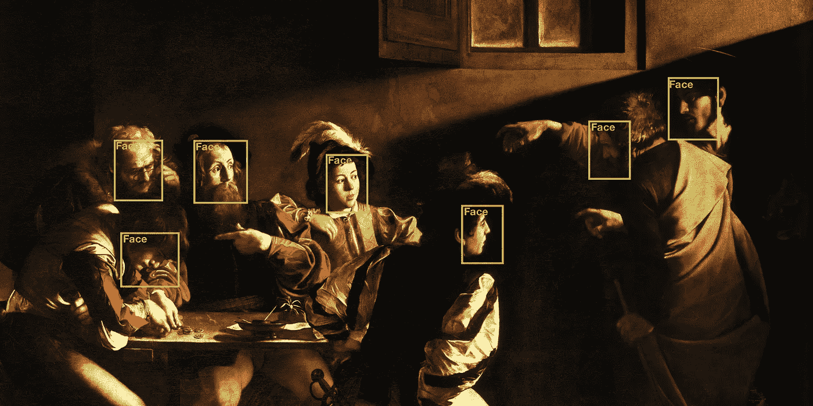

The Calling of St Matthew by Caravaggio, in case you like art :)

## 目标检测是自动驾驶、视频监控、医疗应用和许多其他领域所需的计算机视觉中的一个非常重要的领域。你听说过 YOLO 或固态硬盘这样的流行词吗？在本文中，我将向您解释最近在使用深度学习的最新物体检测方面取得的几项重要进展，并向您介绍演示如何实现它们的重要资源。读完这篇文章后，你会对这个领域有一个很好的了解，不需要物体检测方面的先验知识。

本文组织如下:

首先，我向你解释一个简单的模型，它能够检测和分类图像中的一个单独的物体。然后，我总结了用于对一幅图像中的*多个*目标进行检测和分类的不同方法，重点比较了*区域提议*和*单次拍摄*方法。之后，我会详细解释*像 *SSD* 或 *YOLO* 这样的检测器是如何工作的，为什么它们比*区域提议*方法更快但准确性更低，最后是最近开发的 *RetinaNet* 如何解决这些问题。*

# *单一目标检测*

*神经网络可用于解决*分类问题*(预测类别)和*回归问题*(预测连续值)。今天我们将同时做这两件事。我们从一个简化的任务开始:检测和分类图像中的一个*单个对象，而不是几个对象。**

## *数据*

*对象检测数据集看起来像什么？当然，我们的模型的输入是图像，标签通常是四个值，它们描述了一个真实边界框，加上这个框中的对象所属的类别。*

*例如，这四个值可以描述边界框左下角和右上角的 *x* 和 *y* 坐标。或者一个特定角的坐标和边界框的高度和宽度。*

## *体系结构*

*将图像作为输入的我们的神经网络必须预测代表*预测的*边界框坐标的*四个值*，并且我们将与四个*地面真实值*边界框坐标(标签)*进行比较。**

*除此之外，神经网络还必须预测我们想要分类的 *n* 个类别中的每一个类别的概率。这给了我们网络必须预测的总共 4 + *n* 个值。*

*为了构建我们的*单个对象检测器*，我们可以采用任何卷积图像分类器网络，如 VGG-16 或 ResNet(理想情况下经过预训练),并移除网络顶部的任何分类层，平坦化截断的基础网络的输出，并添加一个或两个线性层，最终输出 4 + *n* 个值。您还应该在分类图层之前移除任何(自适应)池图层，因为它们会破坏我们回归边界框边缘坐标所需的空间信息。*

## *失败*

*那么我们将如何训练这样一个产生 4 + *n* 个值的*单个物体检测*网络呢？预测物体的类别( *n* 类别概率)是一个*分类*问题。预测包围盒的四个坐标是一个*回归*问题。我们需要一个结合这两个问题的损失函数。*

*让我们从边界框开始:*定位损失*可以是预测边界框坐标 *x_pred* 和地面真实边界框坐标 *x_label* 的 *L1* 损失:*

*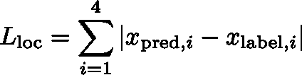*

*这是四个预测和四个地面真实边界框坐标之间的所有*绝对差值*的总和。预测框与地面真实边界框的差异越大，这种损失就越大。您也可以使用 *L2* 损失，但是，该模型将对异常值更加敏感，并将调整以最小化单个异常值情况，代价是具有小得多的误差的正常示例。*

*我们如何处理网络输出的类别概率值？首先，为了将这些 *n* 值转换成概率，我们对它们应用 *softmax activation* 函数。然后我们使用*交叉熵损失函数*将它们与标签*进行比较。我们称之为信心丧失。**

*组合损失函数简单地是*定位损失*(边界框)和*置信度损失*(类别)的加权和:*

*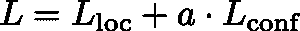**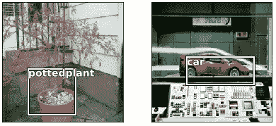*

*Examples from the Pascal VOC 2007 dataset with a single detected object*

*什么是 *a* ？原则上，定位损失可能远大于置信度损失(反之亦然)。在这种情况下，网络将只专注于学习预测边界框，而完全忽略分类任务。因此，你必须查看两个损失的值，并将其中一个乘以一个系数 *a* ，使它们的数量级大致相同。*

*我们现在知道了对象检测数据集可能是什么样子，我们如何建立一个*单对象检测*架构，以及如何制定损失函数。我们有训练网络所需的一切。如果你想训练这样一个模型，我建议你按照 [fastai 第八课](https://course.fast.ai/lessons/lesson8.html):)开始编码*

*好了，我们讨论了检测图像中的单个对象所需的最少步骤。但这还不够，对吗？在现实世界的场景中，我们可能需要在一幅图像中检测许多对象(数量未知)。我们如何做到这一点？*

*经典的计算机视觉经常使用一种叫做*滑动窗口*的方法。检测器在图像上滑动，一旦检测到物体，就会在检测器当前正在查看的区域周围绘制一个边界框。*

*随着深度学习的兴起，所谓的*两阶段*或*区域提议*方法开始占据主导地位:第一阶段预测一组*候选对象位置*，其应该包含所有对象，但过滤掉大部分背景。第二阶段，一个 *convnet* ，然后将这些候选位置中的对象分类为搜索类别之一或背景。如果你对这项技术感兴趣，可以在谷歌上搜索 R-CNN。*

*区域提议方法产生最先进的结果，但是对于实时对象检测，尤其是在嵌入式系统上，通常计算量太大。*

**你只看一次* ( [Redmon et al. 2015](https://arxiv.org/pdf/1506.02640.pdf) )和*SSD-Single Shot multi box Detector*([Liu et al . 2015](https://arxiv.org/abs/1512.02325))是旨在通过在通过网络的*单次向前传递*中预测不同类别的边界框坐标和概率来解决该问题的架构。它们是以牺牲准确性为代价来优化速度的。*

*[林等(2017)](https://arxiv.org/abs/1708.02002) 最近发表了一篇漂亮的论文:他们解释了为什么像 SSD 这样的方法不如两阶段方法准确，并提出通过重新调整损失函数来解决这个问题。通过这种改进，单次方法不仅比两阶段方法更快，而且现在也一样准确，允许实时对象检测的令人敬畏的新现实世界应用。*

## *现在，我将向您详细解释 SSD 的工作原理，为什么单次拍摄方法不如两阶段方法准确，以及 RetinaNet 和焦损如何修复这个问题。*

# *SSD:单次多盒探测器*

*让我们看看 SSD 的架构(类似于 fastai 中的实现)，并讨论激活的*感受域的概念。YOLO 的工作方式与 SSD 类似，不同之处在于它在网络顶部使用全连接层，而不是卷积层。我们将专注于卓越的固态硬盘。**

*图像被馈送到用于高质量图像分类的标准架构。网络末端的任何分类层再次被*截断*。SSD 论文使用了 *VGG-16* 网络，但其他网络如 R *esNets* 也可以工作。*

*例如，假设输入图像具有形状[3，224，224]，截断网络的输出具有形状[256，7，7]。通过三次以上的卷积，我们在网络顶部创建了三个*特征图*，分别是形状【256，4，4】(蓝色)、【256，2，2】(黄色)，最后是【256，1，1】(绿色):*

*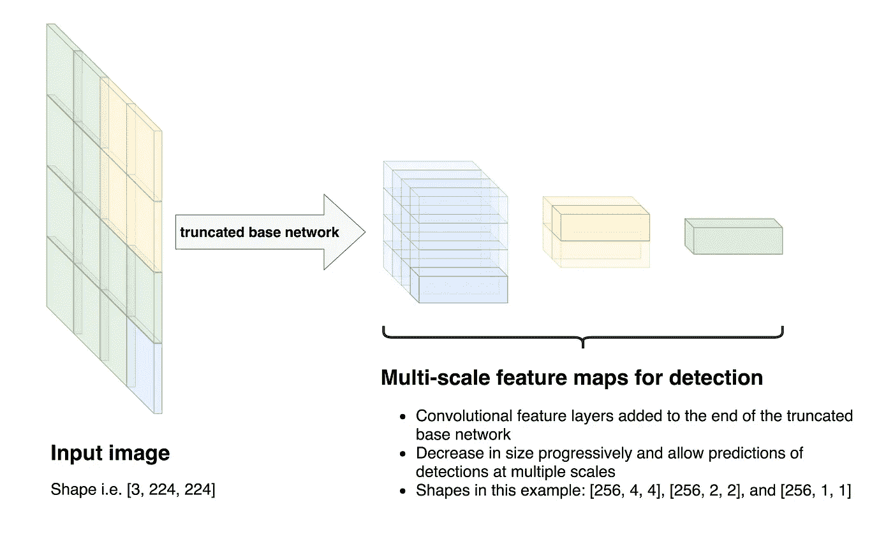*

*SSD 白皮书中的架构在网络顶部有更多功能图，但出于演示目的，我们坚持使用三层。原理完全一样。*

*让我们来看看这些不同层中激活的*感受野*:*

*我们从最后一层(绿色)开始。最终绿色层中的激活依赖于先前层中的所有激活，因此感受野是整个输入图像:*

*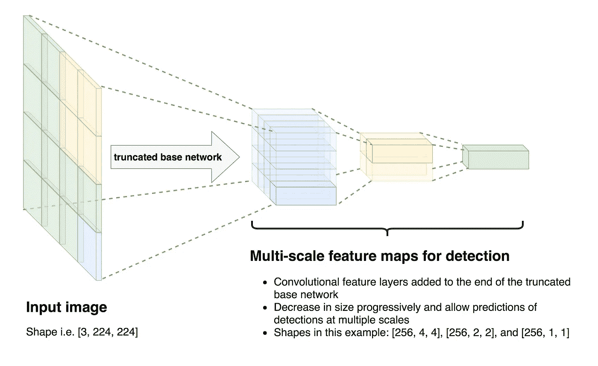*

*现在让我们看看倒数第二层(黄色)。注意，黄色层激活的感受野只有输入图像的四分之一:*

*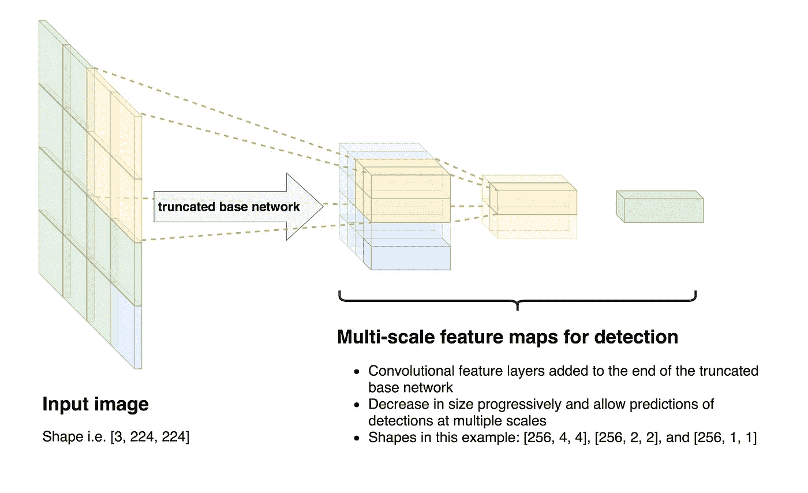*

*蓝色层中激活的感受野是输入图像的十六分之一。*

**请注意，我所做的说明是出于演示目的而简化的，例如，没有考虑到这样一个事实，即与周围区域相比，激活对来自其感受野中心的依赖更多。请看* [*这里*](https://youtu.be/0frKXR-2PBY?t=2309) *有很棒的解释。**

*然而，我想要表达的想法是，几乎填满整个图像的对象应该通过最后一层(绿色层)的激活来检测，而大约填满输入图像左下四分之一的对象应该通过黄色层的激活来检测，这是有意义的。*

*因此，我们定义了一些所谓的*默认框*或*锚框*:*

*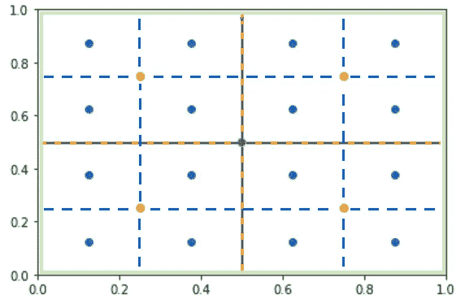*

*这些点就是所谓的*锚*并且标记了它们各自的*默认*或*锚盒*的中心。中间的绿色锚点是整个图像周围绿色框的中心，这是对应于最后一个卷积层(绿色)的默认框。*

*黄色/橙色锚点定义了属于倒数第二个卷积层(黄色)的四个黄色/橙色框的中心，16 个蓝色默认框属于所示 SSD 架构中的蓝色层。*

*你可能会问自己这在代码中会是什么样子。例如，您可以创建一个数组，其中每一行定义一个默认框，有四列，例如左下角和右上角的 x 和 y 坐标或一个角的坐标加上高度和宽度。*

*我们下一步做什么？当我们研究如何检测图像中的单个对象时，我们预测了边界框坐标的 4 个值和每个 *n* 类的一个概率，从而给出了我们的神经网络返回的总共 4 + *n* 个数字。请记住，我们现在还想对*背景*进行分类，因此 *n* 应该是您的数据集中的类别数+ 1。*

*这就是我们现在对每个缺省框所需要的*:每个缺省框需要 *n 个*值，它们表示在该框中检测到某个类的概率，以及 4 个值，它们现在不是预测边界框的绝对坐标，而是到相应缺省框的偏移量。**

*对于 4x4 蓝色默认框，我们需要总共 16 乘以 4 的值来计算预测边界框的坐标，以及我们试图分类的 *n* 个类别的 16 乘以 *n* 个概率。*

*对于 2x2 黄色默认框，我们总共需要 4 乘 4 的坐标值和 4 乘 *n* 类的 *n* 概率。*

*我们如何做到这一点？更多卷积层！*

*草图 SSD 架构中的最后三个功能图(蓝色、黄色和绿色层)具有形状[256，4，4]、[256，2，2]和[256，1，1]。它们对应于蓝色默认框的 4x4 网格、黄色默认框的 2x2 网格和一个跨越上图所示网格中整个图像的绿色默认框。*

*三个特征图中的每一个都被输入到另外两个卷积层。我知道这很令人困惑，但请耐心等待，我们就快成功了:)*

*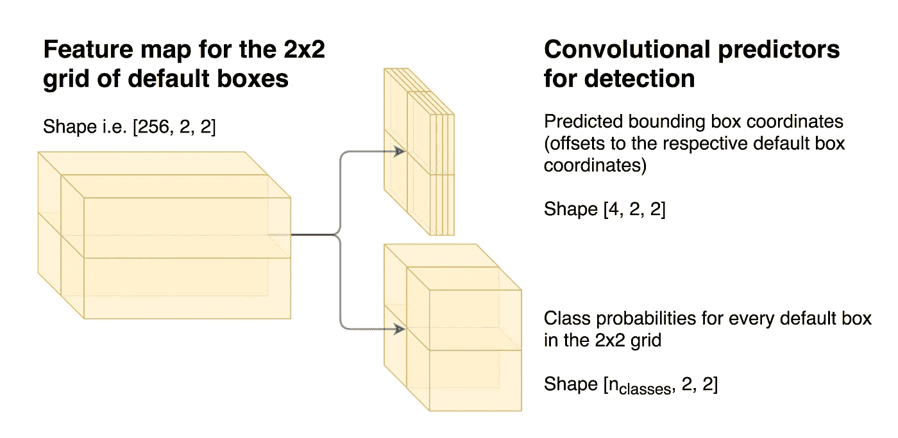*

*我们来看看黄色的特征图(2x2 网格)。我们有[256，2，2]个激活，需要 shape [4，2，2]的输出和 shape[*n*，2，2]的第二个输出(其中*n*是类的数量)。因此特征图的宽度和高度不能改变，但是两个卷积输出层需要分别将特征图从 256 减少到 4 和 *n* 个滤波器。*

*对于蓝色特征地图(对应于 4x4 网格)，我们需要两个输出图层，将[256，4，4]特征地图简化为[4，4，4]和[*n*，4，4]张量。*

*查看整个图像的绿色默认框对应于形状为[256，1，1]的绿色特征地图。我们最后还需要两个卷积输出层，它们将绿色特征图作为输入，产生[4，1，1]和[*n*，1，1]形状的输出。*

**我知道这是很多。重要的想法是，我们对不同大小的网格中的每个默认框都做了我们在预测图像中的单个对象时所做的事情。**

## *好了，我们总结一下:*

1.  *我们定义了几个不同大小默认框的网格，这将允许我们在*一次向前传递*中检测不同比例的对象。许多以前的体系结构检测不同比例的物体，例如通过将相同图片的不同大小的版本传递到检测器，这在计算上更昂贵。*
2.  *对于每个网格中的每个缺省框，网络输出 *n* 个分类概率和 4 个到相应缺省框坐标的偏移，这给出了预测的边界框坐标。*

**

*Ground truth bounding boxes*

## *那么我们如何训练网络呢？*

*在左侧，您可以看到一个来自 Pascal VOC 2007 数据集的对象检测示例。一张餐桌和两把椅子有三个地面真实边界框。*

*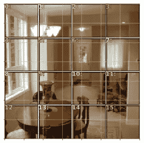*

*4x4 grid of default boxes*

*在下图中，您可以看到默认框的 4x4 网格(2x2 和 1x1 网格未显示)。*

*网络为 16 个默认框中的每一个预测 4 个坐标(偏移)和 *n* 类概率。但是，在训练时，我们应该将这些预测中的哪些与损失函数中的基本事实默认框进行比较呢？*

**我们需要将训练示例中的每个基本事实边界框与(至少)一个默认框进行匹配。**

## *匹配问题*

*我们希望将地面真实边界框与一个默认框匹配，这个默认框与它尽可能“相似”。我说的相似是什么意思？当两个盒子尽可能多地重叠，同时尽可能少地具有不重叠的区域时，它们是相似的。这由 *Jaccard* 索引或 *IoU* 索引定义:*

*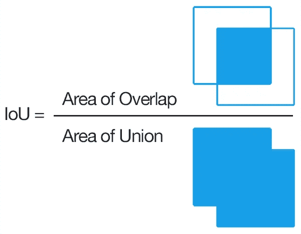*

*[Source](https://en.wikipedia.org/wiki/Jaccard_index)*

*让我们看几个例子:*

*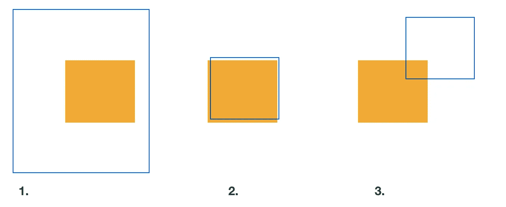*

1.  *重叠区域(交叉点)是整个橙色区域，因此重叠达到最大值。但是联盟(蓝色区域)要大得多。这不是一个很好的匹配，会导致较低的 Jaccard 指数。*
2.  *这是最佳匹配:重叠区域和联合区域几乎具有相同的大小。Jaccard 指数应该接近 1。*
3.  *这里，重叠也比两个盒子(联合)的整个面积小得多，这给出了低的 Jaccard 指数。*

*在我们的训练示例中，我们使用 4x4、2x2 和 1x1 网格中的 *every* default box 来计算*every*ground truth bounding box 的 Jaccard 索引。*

*基础事实边界框与其共享最高 Jaccard 索引的默认框相匹配，并且与其具有大于特定阈值的 Jaccard 索引的每个其他默认框相匹配。*

*我知道这些细节可能听起来令人困惑。重要的想法是，我们希望将训练示例中的基本事实边界框与默认框所做的预测进行比较，默认框已经与基本事实边界框非常相似。*

*我们现在知道…*

1.  *… 4 个预测坐标(默认框的偏移量)和每个默认框的*的 *n* 预测类别概率和…**
2.  *…哪个基本事实边界框与哪个默认框匹配。*

*现在，我们做同样的事情，当我们想检测一个单一的对象。*

*损失再次是*定位损失*(边界框)和*置信度损失*(类)的加权和:我们计算预测的边界框(默认框坐标+预测的偏移)与匹配的地面真实边界框(L1 损失)有多大差异，以及默认框预测类的正确程度(二进制交叉熵)。我们将每个匹配的默认框和基本事实边界框对的这两个值加在一起，并有一个损失函数，当预测框更接近基本事实边界框时，以及当网络在分类对象方面做得更好时，该损失函数将返回更低的值。*

*当没有一个类别概率超过某个阈值时，网络会将该框中的对象视为背景。在现实中，你会发现，对于图像中的每个真实对象，网络都会产生几个几乎相互重叠的边界框。一种称为*非最大值抑制*的技术用于将预测相同类别并且具有大于特定阈值的 Jaccard 索引的所有框减少到每个检测到的对象一个预测框。*

*为了便于理解，我省略了一个小细节。对于每个锚点，SSD 定义了不同纵横比和大小的 *k* 默认框，而不是本文中讨论的一个。这意味着我们还需要 4 倍于 *k* 的相对于各自默认框坐标的预测偏移量，而不是 4 和 *n* 倍于 *k* 的类概率，而不是 *n* 。更多不同尺寸和长宽比的盒子=更好的物体检测。这个细节对于一般的理解来说并不是太重要，但是如果你对这个细节感兴趣的话，可以看看[刘等人 2015](https://arxiv.org/abs/1512.02325) 中的图 1 进行说明。*

*SSD 和 YOLO 只需要通过网络向前传递一次来预测对象包围盒和类别概率。与*滑动窗口*和*区域提议*方法相比，它们要快得多，因此适合于*实时*物体检测。SSD(在网络顶部使用多尺度卷积特征地图，而不是像 YOLO 那样使用全连接层)比 YOLO 更快更准确。*

***唯一剩下的问题:**区域提议方法如 R-CNN 更*准确*。*

# *焦点损失*

*两阶段方法的优势在于，它们首先预测*几个*候选物体位置，然后使用卷积神经网络将这些候选物体位置中的每一个分类为类别之一或背景。这里的重点是*几个候选位置*。*

*像 SSD 或 YOLO 这样的方法遭受极端的*类别不平衡*:检测器评估大约一万到十万个候选位置(比我们这里的例子中的 4x4、2x2 + 1 默认框多得多)，当然这些框中的大多数不包含对象。即使检测器容易地将这些大量的盒子分类为底片/背景，仍然存在问题。*

*我会向你解释原因:*

*这是交叉熵损失函数，其中 *i* 是类的索引， *y_i* 是标签(如果对象属于类 *i* 则为 1，否则为 0)，而 *p_i* 是对象属于类 *i* 的预测概率。*

*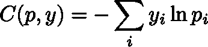*

*我们会看剧情，不用太担心方程:)*

*假设一个盒子包含背景，网络 80%确定它实际上只是背景。这种情况下 *y(背景)=1* ，其他所有 *y_i* 都是 0， *p(背景)=0.8* 。*

**

*可以看到，在 80%确定盒子只包含背景的情况下，损失仍然是~0.22。*

*例如，假设图像中有 10 个实际对象，网络并不确定它们属于哪一类，因此它们的损失为 3。这将为我们提供大约 30 个*(顺便说一下，所有数字都是虚构的，是为了演示目的而选择的)*。*

*所有其他约 10，000 个默认框都是背景，网络 80%确定它们只是背景。这样我们的损失在 10000 * 0.22 = 2200 左右。*

*告诉我，什么占主导地位？网络很难对少数真实对象进行分类？还是网络容易归类为背景的所有框？*

*好吧，大量容易分类的例子绝对支配了损失，从而支配了梯度，因此压倒了网络仍然有困难并应该从中学习的少数有趣的例子。*

*那我们该怎么办？[林等人(2017)](https://arxiv.org/abs/1708.02002) 有一个很好的想法，缩放交叉熵损失，以便网络已经非常确定的所有简单示例对损失的贡献更小，以便学习可以*将*集中在少数有趣的案例上。作者称他们的损失函数为*焦点损失*和他们的架构 *RetinaNet* (注意 RetinaNet 还包括特征金字塔网络(FPN)，这基本上是 *U-Net* 的新名称)。*

*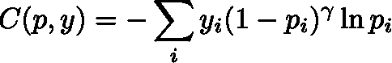*

*根据该论文，γ= 2 效果最佳。还是那句话，如果你不愿意，也不要太担心这个等式，一旦你看到这个情节，你就会明白这有什么不同了:*

*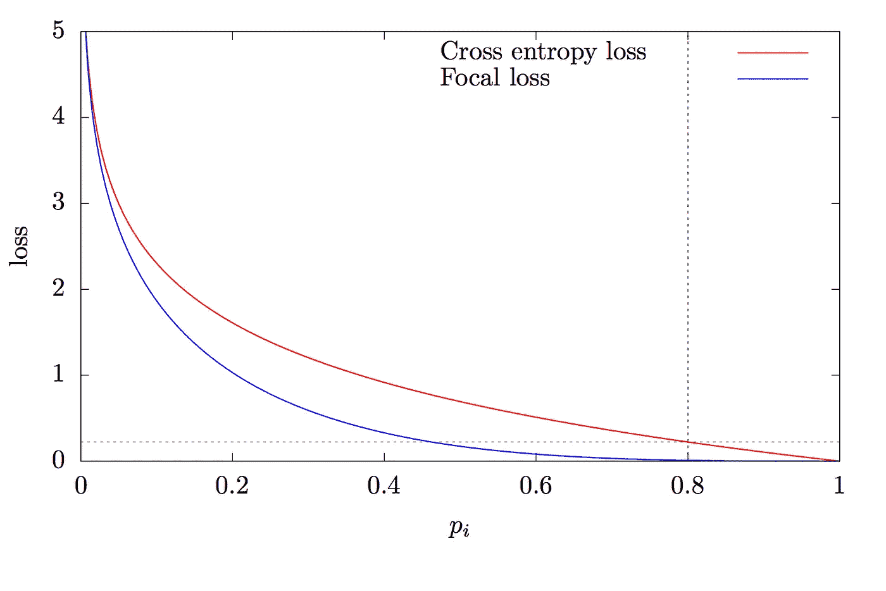*

*请注意，当网络对预测非常确定时，损失现在明显降低了。在我们之前 80%确定性的例子中，交叉熵损失的值约为 0.22，现在焦点损失的值仅为 0.009。对于网络不太确定的预测，损耗减少了一个小得多的系数！*

*通过这种重新调整，大量容易分类的例子(主要是背景)不再主导损失，学习可以集中在少数有趣的案例上。*

*通过这种强大的改进，只需要通过网络进行一次前向传递的对象检测器突然能够在准确性方面与两阶段方法竞争，同时在速度方面轻松击败它们。这为甚至在嵌入式系统上进行精确的实时对象检测开辟了许多新的可能性。厉害！*

*如果你和我一样对这种东西着迷，我强烈建议你自己实现一个单次对象检测网络。我建议你跟着伟大的课程*fastai——程序员的前沿深度学习*的[第 8 课和第 9 课](https://course.fast.ai/lessons/lesson8.html)一起编码。你在这里找到相应的笔记本[。在这个笔记本中，所有关于匹配问题的函数都写在一个单元格中，它们的输出稍后才显示。这大大降低了代码的可理解性。我重新实现了笔记本，添加了更多的注释，并把所有东西(尤其是匹配问题)按顺序排列，希望能让你从上到下阅读笔记本，同时在继续实现用于此目的的功能之前，逐渐建立对基础事实边界框如何与默认框匹配的理解。也可以随意使用我的](https://github.com/fastai/fastai/blob/master/courses/dl2/pascal-multi.ipynb)[笔记本](https://github.com/fg91/fastai/blob/master/Single%20shot%20detection%20(SSD)%20and%20Focal%20loss.ipynb)作为额外参考。*

*我希望你从这篇文章中学到了一些有趣的东西:)如果任何部分不清楚或者你需要额外的解释，请留下评论，我很乐意帮助你理解。*