# 逆向工程反向传播

> 原文：<https://towardsdatascience.com/reverse-engineering-back-propagation-8ecbc94ad36c?source=collection_archive---------18----------------------->


有时候，从例子开始可能是一种更快的学习方法，而不是在进入详细的例子之前先学习理论。这就是我将在这里尝试做的，使用一个来自官方 PyTorch 教程的例子，它实现了反向传播和反向工程数学及其背后的概念。

下面是教程([https://py torch . org/tutorials/beginner/py torch _ with _ examples . html # warm-up-numpy](https://pytorch.org/tutorials/beginner/pytorch_with_examples.html#warm-up-numpy))的快照，其中 numpy 被用来实现一个具有一个隐藏层的网络。

```
*# -*- coding: utf-8 -*-*
**import** numpy **as** np

*# N is batch size; D_in is input dimension;*
*# H is hidden dimension; D_out is output dimension.*
N, D_in, H, D_out **=** 64, 1000, 100, 10

*# Create random input and output data*
x **=** np**.**random**.**randn(N, D_in)
y **=** np**.**random**.**randn(N, D_out)

*# Randomly initialize weights*
w1 **=** np**.**random**.**randn(D_in, H)
w2 **=** np**.**random**.**randn(H, D_out)

learning_rate **=** 1e-6
**for** t **in** range(500):
    *# Forward pass: compute predicted y*
    h **=** x**.**dot(w1)
    h_relu **=** np**.**maximum(h, 0)
    y_pred **=** h_relu**.**dot(w2)

    *# Compute and print loss*
    loss **=** np**.**square(y_pred **-** y)**.**sum()
    print(t, loss)

    *# Backprop to compute gradients of w1 and w2 with respect to loss*
    grad_y_pred **=** 2.0 ***** (y_pred **-** y)
    grad_w2 **=** h_relu**.**T**.**dot(grad_y_pred)
    grad_h_relu **=** grad_y_pred**.**dot(w2**.**T)
    grad_h **=** grad_h_relu**.**copy()
    grad_h[h **<** 0] **=** 0
    grad_w1 **=** x**.**T**.**dot(grad_h)

    *# Update weights*
    w1 **-=** learning_rate ***** grad_w1
    w2 **-=** learning_rate ***** grad_w2
```

在此示例中，每个输入都是大小为 1000 的一维数组，输出也是一维的，大小设置为 10。除了每个 NN 将具有的输入和输出层之外，还有一个隐藏层，该隐藏层在示例中被设置为大小为 100。

这是一个简单的例子，如果大小为 64，我们有 1 批训练数据。换句话说，我们有 64 组大小为 1000 的随机初始化输入和大小为 100 的输出。目标是使用这 64 个随机初始化的训练数据来训练网络。

让我们看看向前传球。与连接输入和隐藏层相关联的权重矩阵的大小为 1000×100(即输入维度大小×隐藏维度大小)。并且 1000 大小的输入和权重矩阵之间的矩阵乘法将导致 100 大小的隐藏层。我们不是真的一个一个地做，而是对整批做，就像这里看到的:“h **=** x **。**点(w1)”。对得到的 64 x 100 应用 ReLU 函数来去除负数，但是这一步不会以任何方式影响尺寸。得到的 64×100 矩阵乘以大小为 100×10 的第二个权重矩阵，得到大小为 10 的输出。损失计算看起来也很简单，是误差平方和。

在进入反向投影步骤之前，我们先来看一下这个设置。让我们从输出层开始。

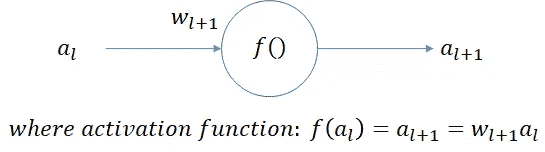

Note: I am not using the variable names but different notations like “a” and “f” as this will help get a better general understanding of back propagation (and to make the equations look less congested).

我没有使用变量名，而是使用不同的符号，如“a”和“f ”,因为这将有助于更好地理解反向传播(并使方程看起来不那么拥挤)。我还把最后一层表示为“l+1”，这样前一层就可以用“l”来表示了。这是因为我们需要再返回一层，以获得一个概括的理解，并获得一个可重复调用的反向传播函数，我希望这一层的索引为“l”。

损失函数定义为:

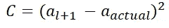

这是在下面几行代码中计算的。

```
*# Compute and print loss*
loss **=** np**.**square(y_pred **-** y)**.**sum()
```

现在我们的目标是找出这种损失相对于网络中的权重的变化率，以便我们可以相应地调整权重并使损失最小化。让我们从最后一层开始。我们的目标是确定:

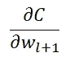

但是我们现在只知道损失的价值。所以让我们扩展一下，让它发挥作用。

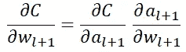

我们上面所做的是，保持因变量被微分(在这种情况下“C”的损失)固定，我们试图找到导数 wrt 它的子表达式递归。换句话说，因为我们知道“C”是输出激活“a”的函数，所以我们利用“链规则”重写以找到“C”wrt 对“a”的导数，然后找到“a”wrt“w”的导数——这种通过函数的子表达式递归向后移动以导出损耗 wrt 对函数输入的导数的逻辑，假定损耗 wrt 对函数输出的导数被称为“反向传播”或“反向模式自动差分”([反向累加 AD](https://en.wikipedia.org/wiki/Automatic_differentiation) )。一般来说，从最后一个输出层开始，通过神经网络的所有层，一层一层地重复这个逻辑。

回过头来，我们实际上知道了等式的第一部分，因为这可以使用幂法则来推导。


这是示例中得出的结果:

```
grad_y_pred **=** 2.0 ***** (y_pred **-** y)
```

让我们解决第二部分:

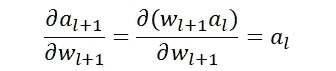

将所有这些放在一起，最后一层的损耗 wrt 对 w 的偏导数可以写成:

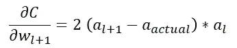

计算结果如下:

```
grad_w2 **=** h_relu**.**T**.**dot(grad_y_pred)
```

虽然这是在每个图层中计算权重梯度的方式，但输出图层得到了简化，因为激活函数只是一个点积。在前一层中，我们在产品上使用了一个整流线性单元(ReLU)。示例中的代码片段是:h **=** x **。**圆点(w1)；h_relu **=** np **。**最大值(h，0)。Sigmoid 函数也是常用函数，两种函数同时使用也很常见。让我们直观地表现这一层，并获得 w1 的梯度。

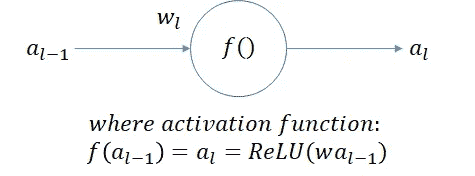

就像上一层一样，让我们展开损失 wrt 对权重的偏导数。

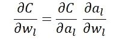

让我们处理第一部分。在输出层，我们知道损耗对输出激活的偏导数，因为我们将损耗定义为激活(也称为预测输出和实际值)之间的差值。但是对于这一层，我们需要推导出来。因为我们知道下一层的损耗输出激活的导数，所以让我们使用它并将第一部分重写为:

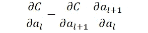

下一层的输出激活的偏导数 wrt 该层的输出激活可以求解如下:


所以第一部分是，


这是教程代码中的计算结果:

```
grad_h_relu **=** grad_y_pred**.**dot(w2**.**T)
```

插回去:

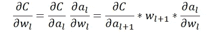

这留给我们第二部分，这是这一层的输出激活相对于这一层的权重的偏导数。

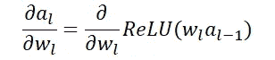

这里的激活功能是一个两步功能。首先，我们将权重乘以前一层的输出。接下来，我们应用一个 ReLU 函数。应用反向传播的原理，这可以重写如下。

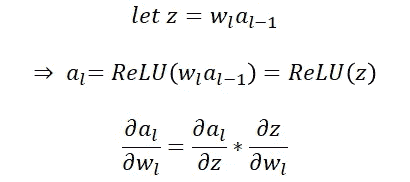

第一部分是:

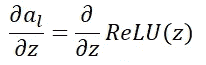

让我们放大 ReLU 函数及其导数。ReLU 的导数恰好是一个单位阶跃函数，所有“x <0” “1”s for all other values of “x”.

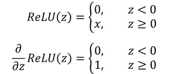

The second part of the equation can be solved as:

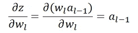

Bringing both together:

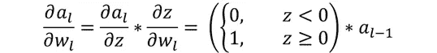

Plugging it back to our goal of finding the partial derivative of loss wrt weights in this layer,

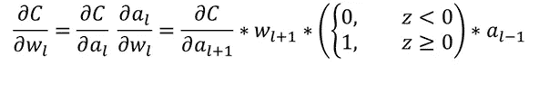

There are four terms being multiplied above. As seen earlier, the first product is what is calculated in the tutorial code as “grad_h_relu **=** grad_y_pred **都是“0”。**点(w2 **)。** T)”。第二个产品具有单位阶跃函数，当 z 小于 0 时为 0，否则为 1。最后一部分是具有输入激活的产品，在我们的示例中是“x”输入层。下面是完成所有这些工作的三行代码:

```
grad_h **=** grad_h_relu**.**copy()
grad_h[h **<** 0] **=** 0
grad_w1 **=** x**.**T**.**dot(grad_h)
```

前两行代码表示前三项之间的乘积，最后一行代码表示输入值的最终乘积。下面的映射将有助于匹配代码和派生。

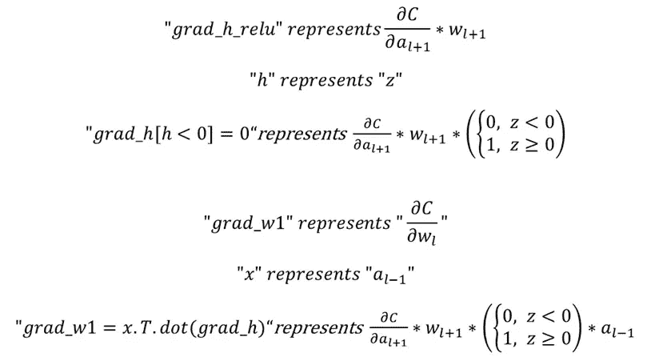

如前所述，通常也使用 sigmoid 函数进行激活，我们将使用 sigmoid 函数的导数来代替上述计算中的单位阶跃函数。因此，如果我们要编写一个独立的反向传播函数，它会将损耗 wrt 对输出激活的导数作为输入，并且必须从中计算两个值。首先，将是损失对权重的导数。这将在梯度下降计算中用于更新权重。第二，该函数应计算输入激活的损耗导数。这将必须被返回以便继续反向传播，因为这一层的输入激活只不过是前一层的输出激活。调用函数可以使用这个返回值为前一层再次调用 backprop 函数，但这次将返回值作为输入传递给函数。

虽然我花了一些时间试图通过教程了解 backprop、自动微分和 PyTorch，但很快就发现，并行使用一个解释另一个是比单独使用更有效的了解这些主题的方法。希望这有所帮助。