# 综述:ARCNN —减少伪影 CNN(编解码器滤波)

> 原文：<https://towardsdatascience.com/review-arcnn-deblocking-denoising-a098deeb792?source=collection_archive---------6----------------------->

在这个故事中，**神器还原 CNN (ARCNN)** 被回顾。ARCNN 用于减少以下图像伪影:

*   **分块伪像:** JPEG 图像由 8 个 **×** 8 个不重叠块压缩而成。块效应是沿着 8**×8**块边界的不连续性
*   **沿锐边的振铃效应**:为了有效地压缩图像，对高频分量进行量化，以从图像中去除一些高频信号。然而，当边缘尖锐时，当量化太强时，在尖锐边缘附近存在像波一样的环状伪像。
*   **模糊:**高频成分的损失也会引起模糊。这些伪像会影响其他程序，例如超分辨率和边缘检测。

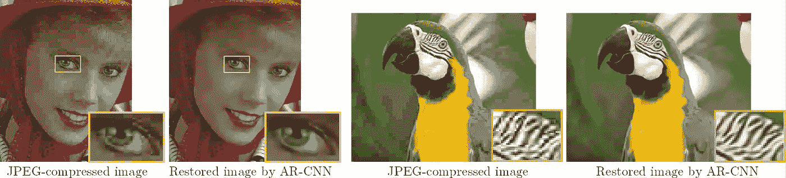

**Original JPEG (left) JPEG After ARCNN (Right)**

**ARCNN** 已经在 **2015 ICCV** 发表，一个改良的 **fast ARCNN** 在**arXiv 2016**发表。由于 ARCNN 是基于 SRCNN 构建的，并且 SRCNN 有**浅层 CNN 架构**，ARCNN 涉及**迁移学习**概念，所以学习 CNN 是一个**良好的开端。( [Sik-Ho Tsang](https://medium.com/u/aff72a0c1243?source=post_page-----a098deeb792--------------------------------) @中)**

# 涵盖哪些内容

1.  **快速回顾 SRCNN**
2.  **ARCNN**
3.  **ARCNN —易到难转**
4.  **快速 ARCNN**

# 1.SRCNN 快速回顾

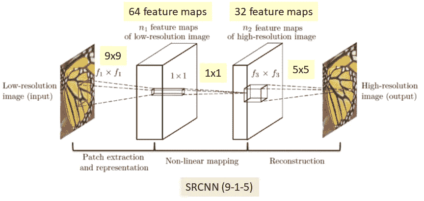

**SRCNN (9–1–5)**

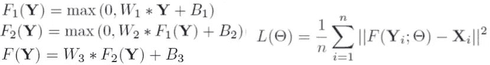

**Feed Forward Functions (Left) Loss Function (Right)**

上图是 SRCNN 架构。图像经过 9×9、1×1、5×5 变换，得到输入图像的超分辨率。

注意，在网络中的网络(NIN)中使用 1×1 conv。在 NIN 中，1 **×** 1 conv 被建议引入更多的非线性以提高精度。GoogLeNet [4]中也建议减少连接数。

损失函数就是输入图像和超分辨率输出图像之间的误差。

SRCNN 只有 3 个 conv 层。这是学习深度学习的入门文章之一。

(如有兴趣，请访问我在 [SRCNN](https://medium.com/coinmonks/review-srcnn-super-resolution-3cb3a4f67a7c) 上的评论。)

# 2.ARCNN

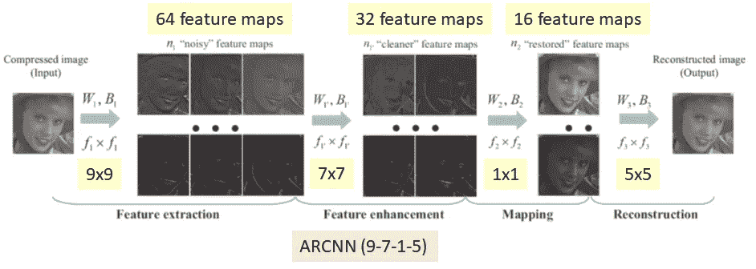

**ARCNN (9–7–1–5)**

与 SRCNN 相比，ARCNN 多了一层 7×7 的滤波器。

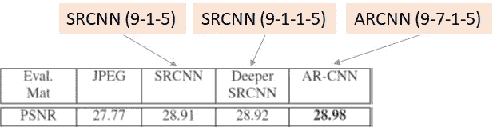

**JPEG Images compressed with Quality Factor of 10**

带原 **JPEG** :平均 PSNR 为 **27.77 dB** 。

使用**Sr CNN(9–1–5):28.91 dB**，意味着图像质量提高。

使用**更深的 Sr CNN(9–1–1–5):28.92 dB**，多一层 1×1 的滤镜帮助不大。

**使用 ARCNN(9–7–1–5):得到 28.98 dB。**

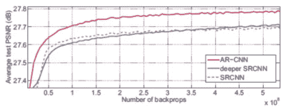

**Average PSNR along the number of backprops**

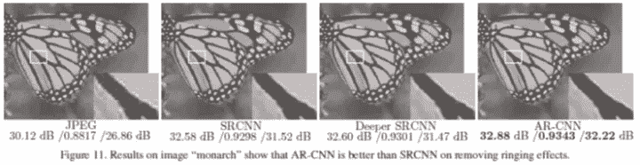

**ARCNN has a better visual quality**

# 3.ARCNN —由易到难的转移

## 3.1 由浅入深的转移

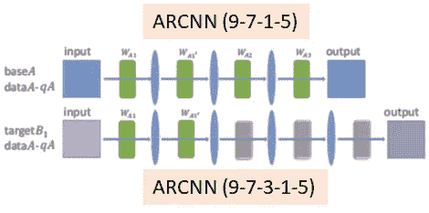

**Transfer from Shallower to Deeper**

*   首先学习 ARCNN(9–7–1–5 ),然后保留前两层。
*   并在 ARCNN(9–7–3–1–5)学习第 3 层到第 5 层。

由于已经学习了前两层，这比随机初始化好得多，如下所示:

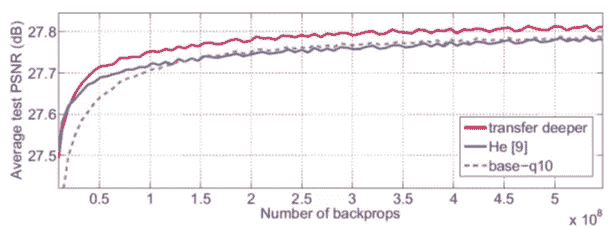

**Average PSNR along the number of backprops (He [9] is one kind of random initialization)**

## 3.2 从高质量向低质量转移

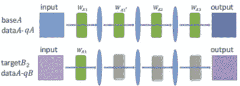

**Transfer from higher to lower quality**

*   同样，先用更高质量的样本进行训练。
*   然后转移第一层或前 2 层。

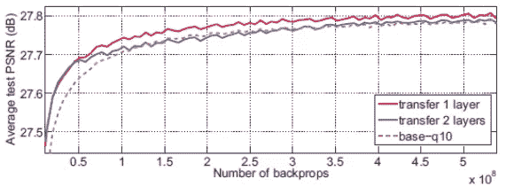

**Average PSNR along the number of backprops**

## 3.3 从标准到真实案例的转换

在 Twitter 中，3264×2448 的图像会被重新缩放和压缩成 600×450 的图像。因此，

*   学习网络使用标准图像，传输第一层。
*   然后用 40 张 Twitter 照片进行训练(335209 个样本)。

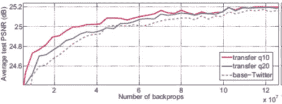

**Average PSNR along the number of backprops**

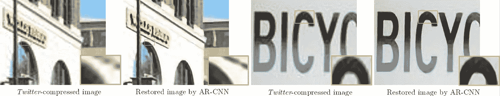

**Twitter Image Visual Quality**

# **4。快速 ARCNN**

## **4.1 层分解**

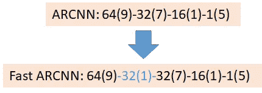

**one more layer with a 1×1 filter is added for Fast ARCNN, (number of filters(filter size))**

**通过在两个空间卷积之间添加 1×1 卷积，可以减少参数的总数。**

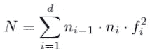

**N: Total Number of Parameters of a Model**

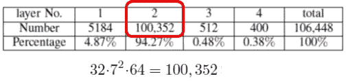

**ARCNN**

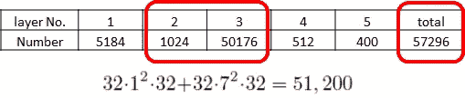

**Fast ARCNN**

*   ARCNN 在第二层有 100，352 个参数，总共有 106448 个参数
*   **Fast ARCNN 只有第二层和第三层的 51200 个参数，总共只有 57296 个参数！！！**

使用 1×1 卷积来减小模型尺寸实际上已经在 GoogLeNet 中提出。

## 4.2 第一层的步幅较大，最后一层的过滤器较大

*   将第一卷积层中的步长从 1 增加到 2。
*   将最后一个卷积层中的滤波器大小从 5 增加到 9。

**参数数量(N)仍然只有 56496。**

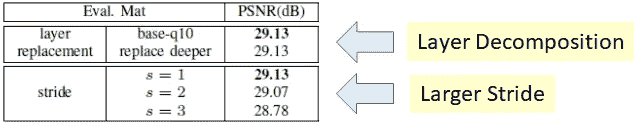

**Results**

*   ARCNN: 29.13 分贝
*   **快速 ARCNN (s=2): 29.07 dB** 下降很少。

通过比较速度

*   ARCNN 中每幅图像 0.5 秒
*   **快速 ARCNN** 中每幅图像 0.067 秒，这是一个 **7.5 的加速比！！**

# 参考

1.  【2015 ICCV】【ARCNN】
    [深度卷积网络压缩伪像还原](https://arxiv.org/abs/1504.06993)
2.  【2016 arXiv】【快速 ARCNN】
    [用于压缩伪像减少的深度卷积网络](https://arxiv.org/pdf/1608.02778)

# 我的评论

[[Sr CNN](https://medium.com/coinmonks/review-srcnn-super-resolution-3cb3a4f67a7c)][[Google net](https://medium.com/coinmonks/paper-review-of-googlenet-inception-v1-winner-of-ilsvlc-2014-image-classification-c2b3565a64e7)]