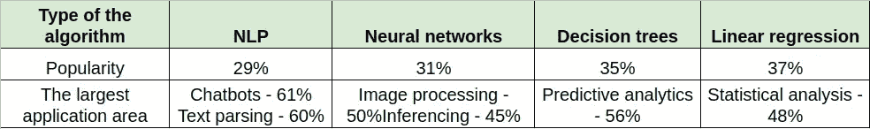
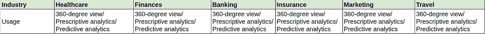
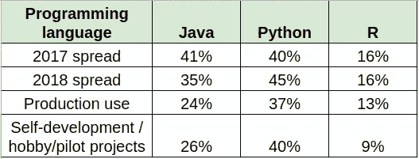

# 回顾:2018 年的人工智能

> 原文：<https://towardsdatascience.com/review-artificial-intelligence-in-2018-403ca386980f?source=collection_archive---------9----------------------->

人工智能不再是一个时髦的词。截至 2018 年，它是大数据分析的一个发展良好的分支，拥有多个应用程序和活跃的项目。以下是对该主题的简要回顾。

人工智能是各种大数据分析方法的总称，如机器学习模型和深度学习网络。我们最近揭开了 AI、ML 和 DL 的神秘面纱，以及它们之间的区别，所以请随意查看。简而言之，人工智能算法是各种数据科学数学模型，有助于改善特定过程的结果或自动化一些日常任务

然而，该技术现在已经足够成熟，可以将这些数据科学进步从试点项目阶段转移到大规模生产就绪部署阶段。下面是 2018 年整个 IT 行业人工智能技术采用的各个方面的概述。

我们来看看这些参数，比如:

*   最广泛使用的人工智能算法，
*   公司应用人工智能的方式，
*   人工智能实施将产生最大影响的行业
*   用于人工智能开发的最流行的语言、库和 API

因此，本文中使用的数字来自各种公开来源，如 Statista、Forbes、BigDataScience、 [DZone](https://dzone.com/guides/api-management-comparative-views-of-real-world-des) 等。

# 最广泛使用的人工智能算法类型

有多种类型的 ML 模型适用于不同的目的。各种算法被用于有监督的、无监督的和强化的机器学习、光学字符识别、语音和文本识别等。四种最流行的算法是决策树、自然语言处理(NLP)工具、线性回归和神经网络。

# 公司使用人工智能的方式

人工智能算法大多已经超过了试点项目的阶段，目前正处于全公司采用的不同阶段。 **36%** 的美国和欧盟企业正在**积极投资**他们的人工智能计划， **31%的企业正计划在不久的将来这样做**，而 **17%** **的企业已经开始了**他们的数字化转型之旅，现在已经收获了收益。只有 16%的公司没有投资人工智能技术的计划。正如美国伟大的工程师和演说家威廉·爱德华兹·曼宁所说的那样，没有必要去适应。你的生存不是必要的。

# 人工智能将最大程度颠覆的行业

行业渐变呢？说人工智能将使任何商业受益，这很好也很简单，但是如何指出特定行业的好处呢？这很容易做到，因为几乎任何从事大数据分析的公司都可以从人工智能算法的数据分析增强中受益匪浅。360 度客户视角同样有益于医疗保健、金融、[银行](https://itsvit.com/blog/big-data-analytics-banking-sector/)、保险、营销、旅游等。

# 最流行的人工智能语言、库和 API

正如我们之前提到的，在各种规模的公司中，投资开发人员培训是使用人工智能算法的最受欢迎的方式之一。事实上，近 **75%的调查受访者**从事某种软件开发，其中 **56%** 培训他们的开发人员**使用另一种语言**来创建和训练机器学习模型以满足他们的需求。用于人工智能开发的三种主要编程语言是 Java、Python 和 R，下表重点介绍了它们在 IT 行业的使用情况。

# 关于 2018 年人工智能状况的最终想法

正如你所看到的，Python 显然正在成为 AI/ML 开发的领导者，无论是业务部署还是爱好项目。r 也是领先的三种语言之一，主要是因为 JuPyteR 笔记本的强大功能，它与 Python 协同工作。尽管如此，Java 仍然是企业级软件开发的堡垒，而且不会被抛弃。

因此，投资 AI/ML/DL 项目对任何企业来说都无疑是非常有利可图的。成本优化、客户数据处理、服务个性化、大数据挖掘和分析——所有这些都是永无止境的业务改进和增长过程中同等重要的部分。

你的公司在日常运营中使用人工智能吗？请和我们分享你的经历！