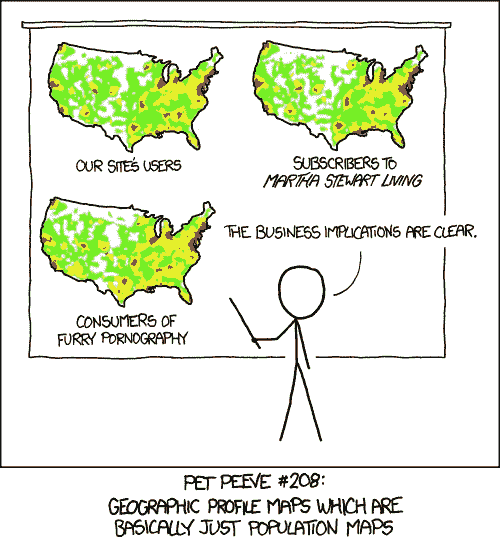

# 数据科学家的工具箱(JHU Coursera，课程 1)

> 原文：<https://towardsdatascience.com/review-course-1-the-data-scientists-toolbox-jhu-coursera-4d7459458821?source=collection_archive---------1----------------------->

Image from Quiz 3 in Data Scientist’s Toolbox

数据科学专业的第一门课程“数据科学家的工具箱”是一门非常入门的课程，旨在帮助学生设置成为数据科学家所需的一些工具(R、RStudio 和 Git)。像往常一样，测验和作业的代码位于我的 [github](https://github.com/mGalarnyk/datasciencecoursera/tree/master/1_Data_Scientist_Toolbox) 上。

**第一周回顾:**第一周主要是介绍专门化以及如何安装用于整个专门化的 R。测验是一系列非常基本的问题。这让我有点失望。

Data Scientist’s Toolbox John Hopkins Quiz 1

**第二周回顾:**本周远远好于第一周。这么多有用的东西在短时间内涵盖了。git、markdown 和命令行的基础是必不可少的。Git 和命令行基础是我每天都要用到的技能。Markdown 用得比较少，但是它出现在这篇文章的所有测试题中。

Data Scientist’s Toolbox John Hopkins Quiz 2

第三周:第二周很棒。第三周更加概念化。研究设计和将数据转化为知识背后的问题很好了解，但并不那么令人兴奋。

Data Scientist’s Toolbox John Hopkins Quiz 3

第四周复习:本周只是一个简单的作业。下面的任务只是为了确保每个人都知道如何使用 git(制作一个 repo，创建一个 markdown 文件，并分叉),以及确保每个人都安装了 R 和 RStudio。

Data Scientist’s Toolbox John Hopkins Project

总的来说，这个课程有点令人失望。这门课的大部分内容都是在谈论其他课程，复习极端的 git 基础知识。如果我还没有对数据科学专业接下来的几门课程写一篇积极的评论，我不会建议继续下去。然而，专业化的其余部分对工业非常有用。接下来的几门课程将教授如何获取数据文件，操作它们，并提供有用的见解。请看我的[课程 2 R 编程复习](https://medium.com/towards-data-science/in-progress-review-course-2-r-programming-jhu-coursera-ad27086d8438#.16beo1yci)！