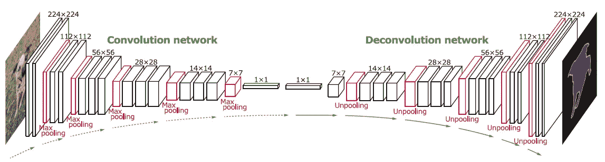
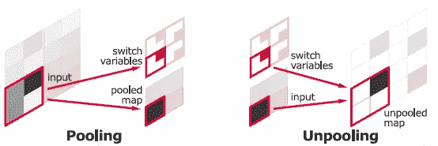
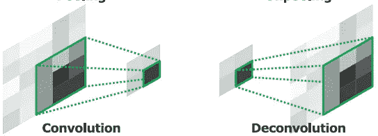
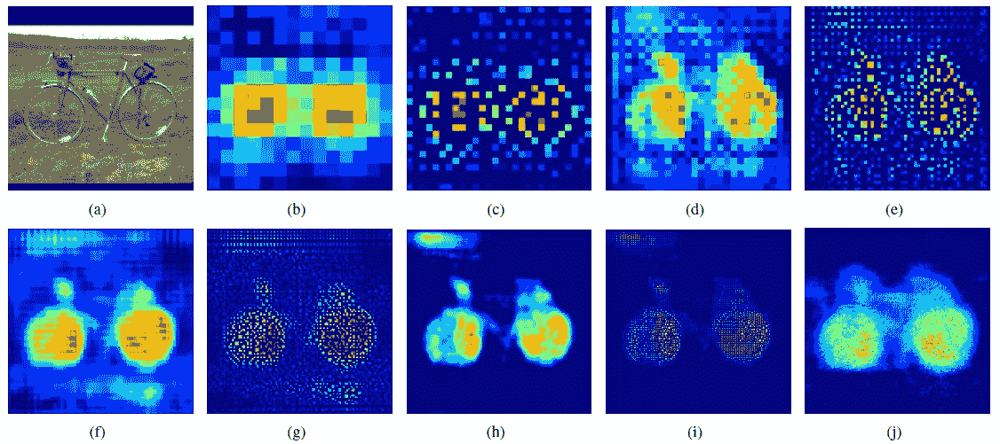
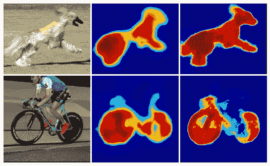
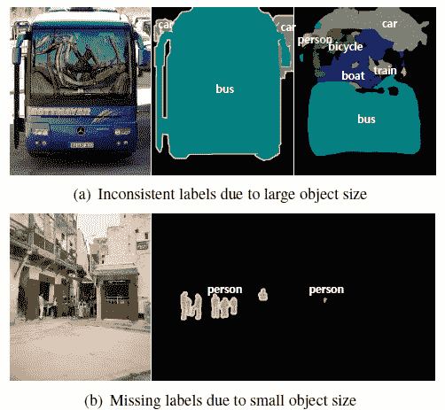
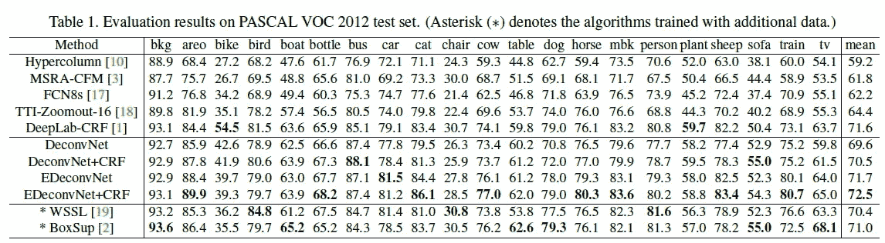
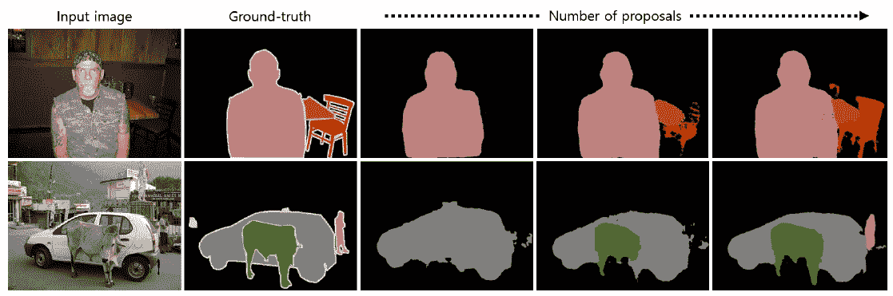
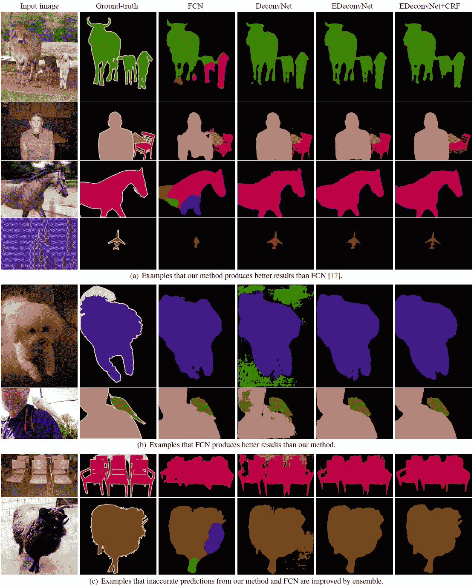

# 回顾:de convnet-un pooling 层(语义分段)

> 原文：<https://towardsdatascience.com/review-deconvnet-unpooling-layer-semantic-segmentation-55cf8a6e380e?source=collection_archive---------7----------------------->

在这个故事中，**反褶积网络**被简单回顾，反褶积网络(DeconvNet)是由反褶积层和反褶积层组成的**。**

对于传统的 FCN，输出是通过高比率(32 倍、16 倍和 8 倍)上采样获得的，这可能导致粗糙的分割输出(标签图)。在这个去卷积网络中，通过逐步去卷积和去卷积来获得输出标签图。而且是我写这个故事的时候在 **2015 ICCV** 发表的一篇论文【1000 多篇引用。( [Sik-Ho Tsang](https://medium.com/u/aff72a0c1243?source=post_page-----55cf8a6e380e--------------------------------) @中)

# 涵盖哪些内容

1.  **解卷积和去卷积**
2.  **实例式分割**
3.  **两阶段训练**
4.  **结果**

# 1.去极化和去卷积

以下是 DeconvNet 的整体架构:

**DeconvNet Architecture**

正如我们所见，它使用 VGGNet 作为主干。第一部分是一个卷积网络，通常像 FCN，conv 和池层。第二部分是反卷积网络，这是本文的一个新部分。

**Remember positions when Pooling (Left), Reuse the position information during Unpooling (right)**

要执行取消池化，我们需要在进行最大池化时记住每个最大激活值的位置，如上所示。然后，如上所示，记忆的位置被用于取消绕线。

**Convolution is to conv the input to smaller size (Left) Deconvolution is to conv the input back to larger size (Right)**

反卷积只是将 conv 输入恢复到更大的尺寸。(如有兴趣，请阅读[我的 FCN 评论](/review-fcn-semantic-segmentation-eb8c9b50d2d1)了解详情。)

**An example of Deconvolution and Unpooling**

上图就是一个例子。(b)是 14×14 解卷积层的输出。(c)是取消轮询后的输出，依此类推。我们可以在(j)中看到，自行车可以在最后的 224×224 解卷积层中重建，这表明**学习过的滤波器可以捕捉特定于类的形状信息。**

**Input Image (Left), FCN-8s (Middle), DeconvNet (Right)**

如上所示的其他示例表明，DeconvNet 可以重建比 FCN-8s 更好的形状。

# **2。实例式分割**

**Bad Examples of Semantic Segmentation Without Using Region Proposals**

如上所示，比感受野大得多或小得多的对象可能被分割或错误标记。小物体经常被忽略，被归类为背景

语义分割被提出为基于实例的分割问题。首先，2000 个区域提议(边界框)中的前 50 个由对象检测方法 EdgeBox 检测。然后， **DeconvNet 应用于每个提议**，并将所有提议的输出聚合回原始图像。通过使用建议，**可以有效处理各种规模。**

# **3。两阶段训练**

## 第一阶段培训

使用地面实况注释裁剪对象实例，以便对象在裁剪的边界框处居中，然后执行训练。这有助于减少对象位置和大小的变化。

## 第二阶段培训

使用了更具挑战性的例子。这些示例是由与基本事实分段重叠的建议生成/裁剪的。

## 一些其他细节

*   使用批量标准化。
*   conv 部分使用 VGGNet 中的权重进行初始化。
*   deconv 部分用零均值和高斯函数初始化。
*   每批 64 个样品。

# 4.结果

**mean IoU results**

*   FCN-8s 的平均欠条只有 64.4%。
*   **下降率** : 69.6%
*   **DeconvNet+CRF** : 70.5%(其中 CRF 只是一个后处理步骤)
*   EDeconvNet:71.5%(EDeconvNet 表示用 FCN-8 组合的结果)
*   EDeconvNet+CRF : 72.5%，平均 IoU 最高。

**Benefits of Instance-wise segmentation**

从上图可以看出，基于实例的分段有助于逐个实例地进行分段，而不是一次对所有实例进行分段。

应当注意，DeconvNet 的增益不仅仅来自于逐渐的 deconv 和 unpooling，还可能来自于实例式分割和两阶段训练。

**Some Visualization Results**

EConvNet+CRF 通常有好的结果，即使比 FCN 差。

# 参考

1.  【2015 ICCV】【de convnet】
    [用于语义切分的学习反卷积网络](https://www.cv-foundation.org/openaccess/content_iccv_2015/papers/Noh_Learning_Deconvolution_Network_ICCV_2015_paper.pdf)

# 我的评论

[[FCN](/review-fcn-semantic-segmentation-eb8c9b50d2d1)][[VGGNet](https://medium.com/coinmonks/paper-review-of-vggnet-1st-runner-up-of-ilsvlc-2014-image-classification-d02355543a11)]