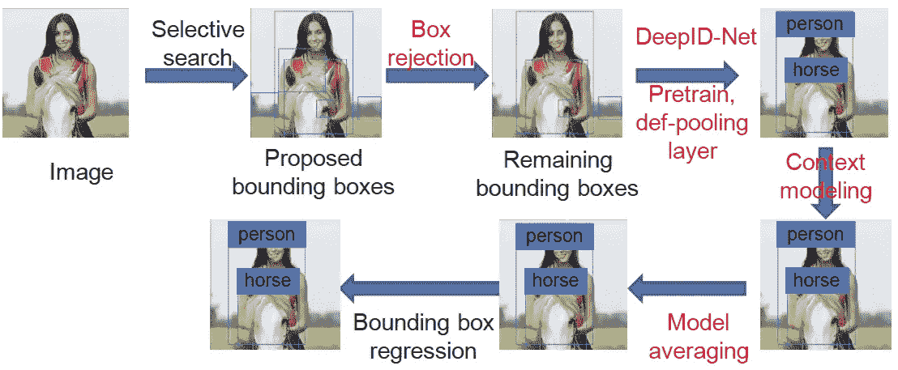
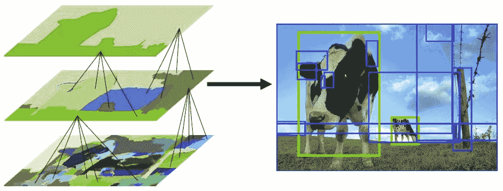
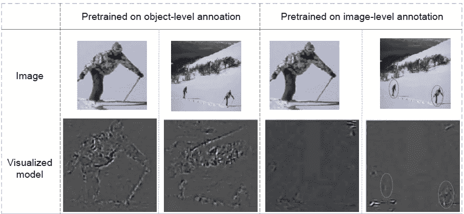
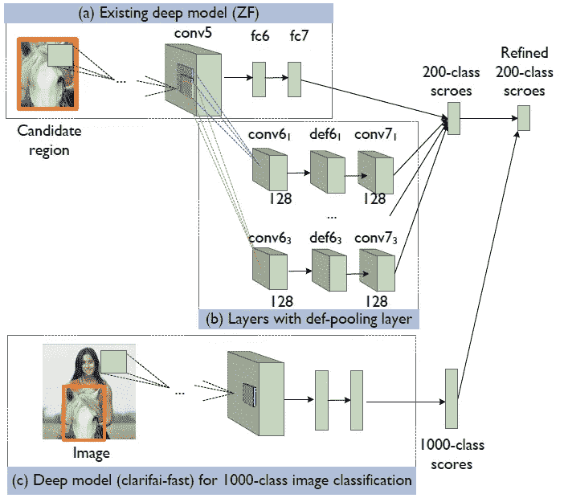
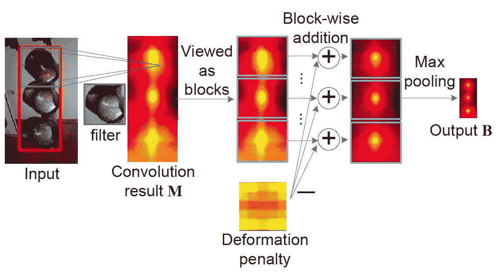
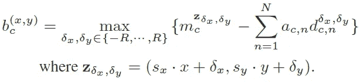
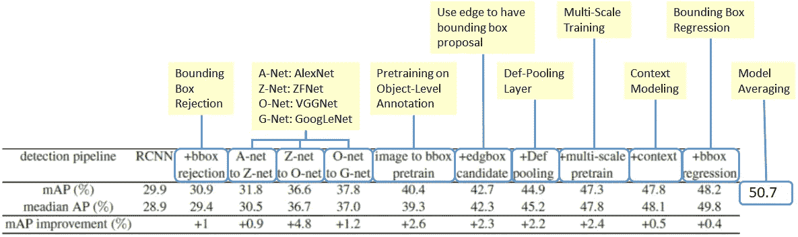

# 复习:DeepID-Net-Def-Pooling 层(对象检测)

> 原文：<https://towardsdatascience.com/review-deepid-net-def-pooling-layer-object-detection-f72486f1a0f6?source=collection_archive---------3----------------------->

在这个故事里， **DeepID-Net** 简单回顾一下。介绍了一种基于可变形零件的细胞神经网络。一个新的**可变形约束池(def-pooling)层**被用于**建模具有几何约束和惩罚的物体部分的变形。**

这意味着，除了直接检测整个对象之外，检测对象的部分也是至关重要的，然后这些部分可以帮助检测整个对象。是 ILSVRC 2014 中 **任务**的**亚军。并在**2015 CVPR**【1】和**2017 TPAMI**【2】发表论文，共引用**约 300 篇**。( [Sik-Ho Tsang](https://medium.com/u/aff72a0c1243?source=post_page-----f72486f1a0f6--------------------------------) @中)**

**DeepID-Net**

**黑色**彩色的台阶实际上是 R-CNN 中存在的**老东西** **。**红色**颜色的步骤实际上是**没有出现在 R-CNN** 中。**

我会提到上图中的每一步，并在故事的结尾给出结果。

# 步伐

1.  **选择性搜索**
2.  **箱子拒收**
3.  **使用对象级注释进行预训练**
4.  **定义池层**
5.  **情境建模**
6.  **模型平均**
7.  **包围盒回归**

# **1。选择性搜索**

**Selective Search**

1.  首先，颜色相似性、纹理相似性、区域大小和区域填充被用作**非基于对象的分割**。因此，我们得到了许多小的分割区域，如上图左下方所示。
2.  然后，使用自下而上的方法，将**小的分割区域合并在一起，形成更大的分割区域。**
3.  因此，如图像所示，生成了大约 2K 个 **区域提议(边界框候选)**。****

# 2.盒子拒绝

R-CNN 用于**拒绝最有可能是背景的包围盒**。

# 3.使用对象级注释进行预训练

****

****Object-Level Annotation (Left), Image-Level Annotation (Right)****

**通常，预训练在**图像级注释**上进行。当图像中的对象太小时**是不好的，因为对象应该在选择性搜索创建的边界框中占据大的区域。****

**因此，**预训练是在对象级注释**上进行的。而**深度学习模型可以是 ZFNet、VGGNet、GoogLeNet 等任何模型**。**

# ****4。Def-Pooling 层****

****

****Overall Architecture with More Details****

**例如，我们使用 ZFNet，在 conv5 之后，输出将经过原始 FC 层 fc6 和 fc7，以及一组 conv 和建议的 def-pooling 层。**

****

****Def-Pooling Layers (Deformable Constrained Pooling), High Activation Value for the Circle Center of Each Light****

****

****Def-Pooling Equations****

**对于 def-pooling 路径，conv5 的输出经过 conv 层，然后经过 def-pooling 层，最后是 max pooling 层。**

**简而言之，**AC 乘以 dc，n 的总和就是上图中的 5×5 变形罚分**。**惩罚是从假定的锚位置放置目标部分的惩罚。****

**def-pooling 层**学习具有不同大小和语义含义的对象部分的变形。****

**通过训练该 def-pooling 层，要检测的对象的对象部分将在 def-pooling 层之后给出高的激活值，如果它们靠近它们的锚位置的话。并且这个输出将连接到 200 级分数以进行改进。**

# **5.**情境建模****

**在 ILSVRC 的目标检测任务中，只有 200 个类。并且在 ILSVRC 中还有一个分类竞争任务，用于对 1000 类对象进行分类和定位。与目标检测任务相比，内容更加多样化。因此，**通过分类网络获得的 1000 类分数被用于细化 200 类分数。****

# **6.**模型平均****

****使用多个模型**来提高精确度，并且**对所有模型的结果进行平均**。这种技术从 LeNet、AlexNet 等开始使用。**

# **7.**包围盒回归****

**包围盒回归只是为了**微调包围盒位置**，在 R-CNN 中已经使用。**

# **结果**

****

****Incremental Results****

*   **具有选择性搜索的 R-CNN(步骤 1): 29.9% mAP(平均平均预测)**
*   **+ **包围盒拒绝**(第二步):30.9%**
*   **从 AlexNet 改为 ZFNet(第三步):31.8%**
*   **从 ZFNet 更改为 VGGNet(步骤 3): 36.6%**
*   **从 VGGNet 更改为 GoogLeNet(第三步):37.8%**
*   **+ **对象级标注的预处理**(第三步):40.4%**
*   **+边缘有更多的边界框建议来自[参考文件 60]: 42.7%**
*   **+ **Def-Pooling 层**(第 4 步):44.9%**
*   **+建议在 VGGNet 进行多尺度培训:47.3%**
*   **+ **情境建模**(第五步):47.8%**
*   **+边界框回归(第 7 步):48.2%**
*   **+模型平均(第六步): **50.7%！****

**与多模型多作物 GoogLeNet 相比，DeepID-Net 的地图高出 6.1%。然而，正如我们所看到的，有些投稿实际上来自其他论文。然而，有两个最新颖的想法是****对对象级注释进行预处理，以及定义池层。******

# ****参考****

1.  ****【2015 CVPR】【DeepID-Net】
    [DeepID-Net:用于物体检测的可变形深度卷积神经网络](https://www.cv-foundation.org/openaccess/content_cvpr_2015/papers/Ouyang_DeepID-Net_Deformable_Deep_2015_CVPR_paper.pdf)****
2.  ****【2017 TPAMI】【DeepID-Net】
    [DeepID-Net:用于物体检测的可变形深度卷积神经网络](https://ieeexplore.ieee.org/document/7298854)****

# ****我的评论****

****[[R-CNN](https://medium.com/coinmonks/review-r-cnn-object-detection-b476aba290d1)][[AlexNet](https://medium.com/coinmonks/paper-review-of-alexnet-caffenet-winner-in-ilsvrc-2012-image-classification-b93598314160)][[ZFNet](https://medium.com/coinmonks/paper-review-of-zfnet-the-winner-of-ilsvlc-2013-image-classification-d1a5a0c45103)][[VGGNet](https://medium.com/coinmonks/paper-review-of-vggnet-1st-runner-up-of-ilsvlc-2014-image-classification-d02355543a11)][[Google net](https://medium.com/coinmonks/paper-review-of-googlenet-inception-v1-winner-of-ilsvlc-2014-image-classification-c2b3565a64e7)]****