# 复习:DeepLabv1 和 DeepLabv2 —阿特鲁卷积(语义分割)

> 原文：<https://towardsdatascience.com/review-deeplabv1-deeplabv2-atrous-convolution-semantic-segmentation-b51c5fbde92d?source=collection_archive---------4----------------------->

在这个故事中， **DeepLabv1** 和 **DeepLabv2** 被放在一起回顾，因为它们都使用了**阿特鲁卷积**和**全连通条件随机场(CRF)** ，除了 DeepLabv2 多了一项技术叫做 **Atous 空间金字塔池(ASPP)** ，这是与 DeepLabv1 的主要区别。(当然也有其他的区别，比如:DeepLabv2 用 [ResNet](/review-resnet-winner-of-ilsvrc-2015-image-classification-localization-detection-e39402bfa5d8) 和 [VGGNet](https://medium.com/coinmonks/paper-review-of-vggnet-1st-runner-up-of-ilsvlc-2014-image-classification-d02355543a11) 做实验，而 DeepLabv1 只用 [VGGNet](https://medium.com/coinmonks/paper-review-of-vggnet-1st-runner-up-of-ilsvlc-2014-image-classification-d02355543a11) 。)

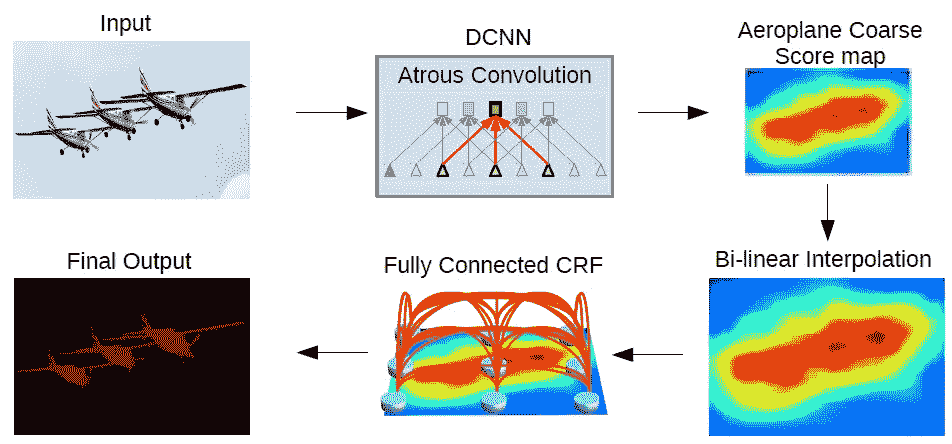

**DeepLab Model**

上图是 DeepLab 模型架构。首先，输入图像通过使用 atrous 卷积和 ASPP 的网络。然后对网络输出进行双线性插值，并通过全连接 CRF 对结果进行微调，得到最终输出。

DeepLabv1 和 DeepLabv2 已经发表在 **2015 ICLR 和 2018 TPAMI** 上，分别有大约 **400 次和 2000 次引用**在我写这个故事的时候。( [Sik-Ho Tsang](https://medium.com/u/aff72a0c1243?source=post_page-----b51c5fbde92d--------------------------------) @中)

# 涵盖哪些内容

1.  **阿特鲁卷积**
2.  **阿特鲁空间金字塔汇集(ASPP)**
3.  **全连通条件随机场**
4.  **结果**

# **1。阿特鲁卷积**

术语“**阿特鲁**”确实来源于法语“ **à trous** ”意思是洞。因此，它也被称为“**算法à trous** ”和“**洞算法**”。有些论文还称之为“**膨胀卷积**”。它通常用于小波变换，现在它被应用于深度学习的卷积中。

下面是 atrous 卷积的等式:

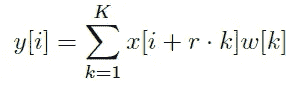

**1D Atrous Convolution (r>1: atrous convolution, r=1: standard convolution)**

*   当 r=1 时，就是我们通常使用的标准卷积。
*   **当 r > 1 时，为 atrous 卷积，即卷积过程中对输入样本进行采样的步长。**

下图说明了这个想法:

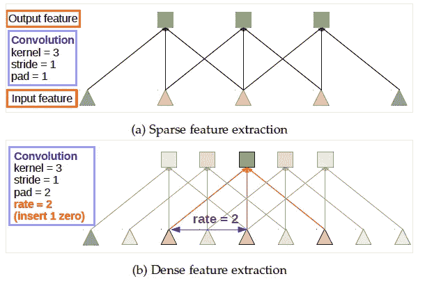

**Standard Convolution (Top) Atrous Convolution (Bottom)**

阿特鲁斯卷积的思想很简单。上图顶部，是标准卷积。

在图的底部，是阿特鲁斯卷积。我们可以看到，当 rate = 2 时，输入信号是交替采样的。首先，pad=2 意味着我们在左右两边都填充 2 个零。然后，当 rate=2 时，我们每隔 2 个输入对输入信号进行采样以进行卷积。因此，在输出端，我们将有 5 个输出，**使输出特征图更大。**

如果我们还记得 [FCN](/review-fcn-semantic-segmentation-eb8c9b50d2d1) ，一系列的卷积和池化使得输出的特征图非常小，需要 32 倍的上采样，这是一种激进的上采样。

此外，atrous 卷积**允许我们扩大过滤器的视野，以纳入更大的背景。**因此，它提供了一种有效的机制来控制视野，并在精确定位(小视野)和上下文同化(大视野)之间找到最佳折衷。

在 DeepLab 中，使用 VGG-16 或 ResNet-101，最后一个池(pool5)或卷积 conv5_1 的步幅分别设置为 1，以避免信号抽取过多。并且使用 rate = 2，使用 atrous 卷积来替换所有后续的卷积层。**产量大很多**。我们只需要 **8 倍上采样**来对输出进行上采样。而**双线性插值**对于 8 倍上采样有相当不错的表现。

# **2。阿特鲁空间金字塔池(ASPP)**

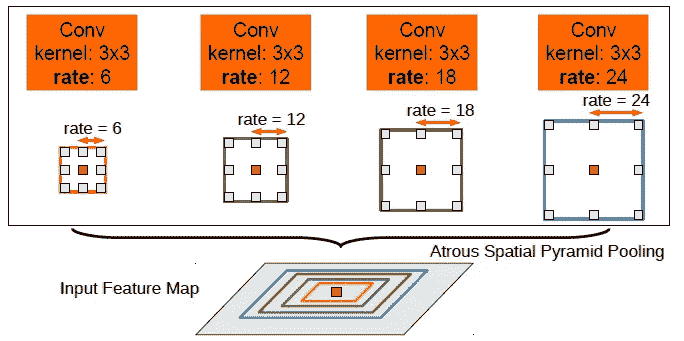

**Atrous Spatial Pyramid Pooling (ASPP)**

ASPP 实际上是 SPP 的一个**老版，其中的概念已经在 [SPPNet](https://medium.com/coinmonks/review-sppnet-1st-runner-up-object-detection-2nd-runner-up-image-classification-in-ilsvrc-906da3753679) 中使用。在 ASPP，**不同速率的并行 atrous 卷积**应用于输入特征图，并融合在一起。**

由于同一类别的对象在图像中可能具有不同的比例， **ASPP 有助于说明不同的对象比例**，这可以提高准确性。

# 3.**全连通条件随机场**

双线性插值后，全连接 CRF 应用于网络输出:

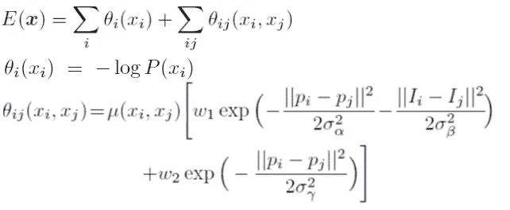

**Fully Connected CRF**

x 是像素的标签分配。P(xi)是像素 I 处的标签分配概率。因此，第一项θi 是对数概率。

对于第二项，θij，它是一个滤波器。= 1 当 xi！= xj。当 xi = xj 时= 0。在括号中，它是两个核的加权和。**第一核**依赖于像素值差和像素位置差，这就是**一种双边滤波器**。双边滤波器具有**保持边缘的特性。****第二核**只依赖像素位置差，是一个**高斯滤波器**。σ和 w 是通过交叉验证得到的。迭代次数为 10 次。

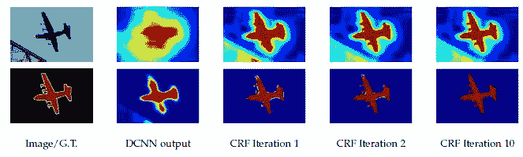

**Top: Score map (input before softmax function), Bottom: belief map (output of softmax function)**

使用 10 倍的 CRF，飞机周围那些不同颜色的小区域被平滑掉了。

但是，CRF 是一个**后处理过程**使得 DeepLabv1 和 DeepLabv2 成为**而不是一个端到端的学习框架**。而且是**在 DeepLabv3 和 DeepLabv3+已经不使用**。

# 4.**结果**

## 4.1.消融研究

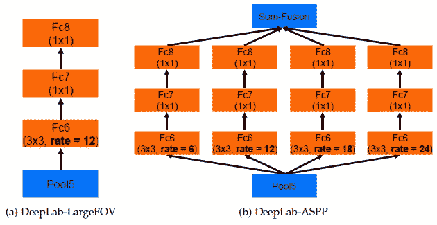

**DeepLab-LargeFOV (Left: i.e. only single atrous conv), DeepLab-ASPP (Right, i.e. ASPP)**

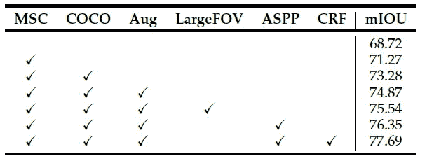

**Results of Each Component Using ResNet-101 in PASCAL VOC 2012 Validation Set**

*   最简单的 ResNet-101 : 68.72%
*   **MSC** :多刻度输入
*   **COCO**:COCO 数据集预处理的模型
*   **Aug** :通过随机缩放输入图像(从 0.5 到 1.5)进行数据扩充
*   **LargeFOV** :使用单遍 atrous 卷积的 DeepLab
*   **ASPP:** 使用并行 atrous 卷积的深度实验室
*   **CRF** :后处理全连接 CRF。

最后得到了 **77.69%** 。可以看出，MSC、COCO 和 Aug 贡献了从 68.72%到 74.87%的提高，这与 LargeFOV、ASPP 和 CRF 同样重要。

## 4.2.与最先进方法的比较

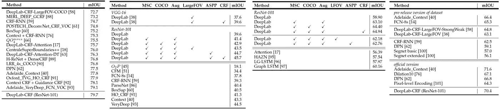

**PASCAL VOC 2012 Test Set (Leftmost) PASCAL-Context (2nd Left) PASCAL-Person-Part (2nd Right) Cityscape (Rightmost)**

也如上测试了四个数据集。结果表明，与最先进的方法相比，DeepLabv2 具有竞争力的结果。

## 4.3.定性结果

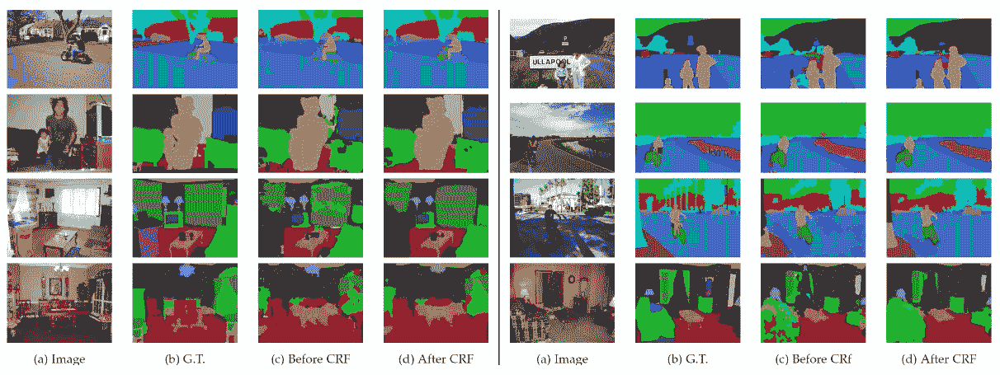

**Qualitative Results: PASCAL-Context**

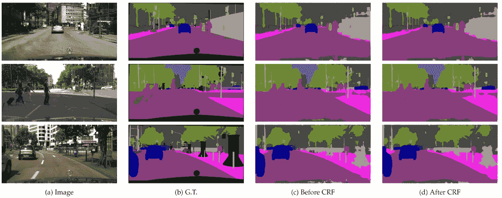

**Qualitative Results: Cityscape**

但 DeepLab 也有一些失败的例子，其中自行车和椅子由多个薄零件组成，如自行车和椅子腿的零件:

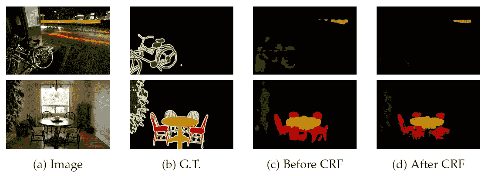

**Failure Examples**

希望以后能覆盖 DeepLabv3 和 DeepLabv3+。

# 参考

1.  【2015 ICLR】【DeepLabv1】
    [深度卷积网和全连通 CRF 的语义图像分割](https://arxiv.org/abs/1412.7062)
2.  【2018 TPAMI】【deeplabv 2】
    [DeepLab:深度卷积网、阿特鲁卷积、全连通 CRFs 的语义图像分割](https://arxiv.org/abs/1606.00915)

# 我的相关评论

[[SPPNet](https://medium.com/coinmonks/review-sppnet-1st-runner-up-object-detection-2nd-runner-up-image-classification-in-ilsvrc-906da3753679)][[VGGNet](https://medium.com/coinmonks/paper-review-of-vggnet-1st-runner-up-of-ilsvlc-2014-image-classification-d02355543a11)][[ResNet](/review-resnet-winner-of-ilsvrc-2015-image-classification-localization-detection-e39402bfa5d8)][[FCN](/review-fcn-semantic-segmentation-eb8c9b50d2d1)]