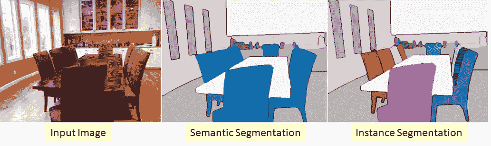
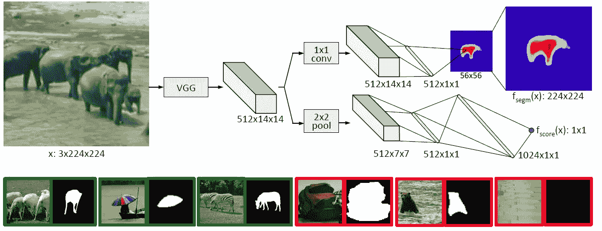
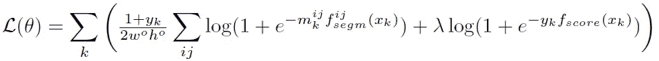
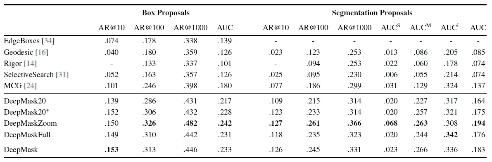
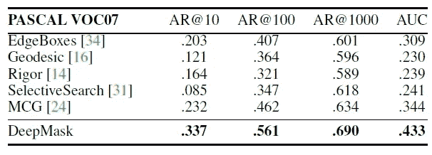
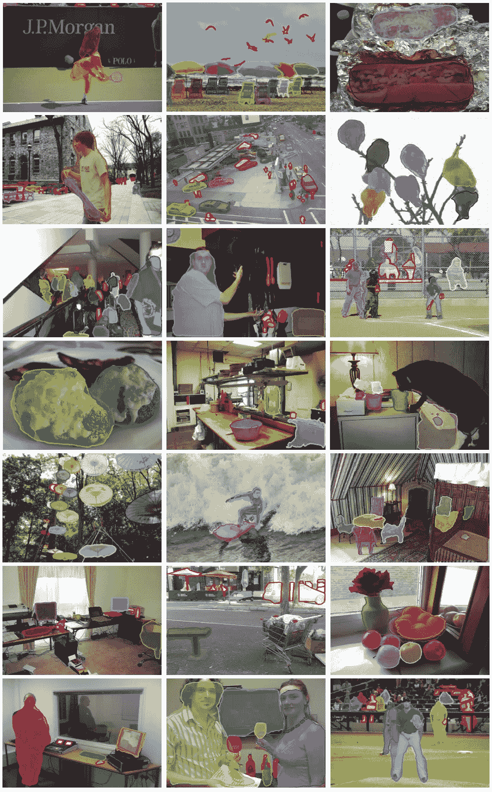

# 复习:深度遮罩(实例分段)

> 原文：<https://towardsdatascience.com/review-deepmask-instance-segmentation-30327a072339?source=collection_archive---------5----------------------->

## 一种卷积神经网络驱动的实例分段建议方法

T 他的时代， **DeepMask** ，由**脸书 AI Research (FAIR)** 点评。从 [AlexNet](https://medium.com/coinmonks/paper-review-of-alexnet-caffenet-winner-in-ilsvrc-2012-image-classification-b93598314160) 开始，卷积神经网络(CNN)获得了图像分类的高精度，许多 CNN 方法被开发用于其他任务，如对象检测、语义分割和实例分割。DeepMask 是用于实例分割的 CNN 方法。

**Semantic Segmentation vs Instance Segmentation**

*   **图像分类**:对图像内的主要物体类别进行分类。
*   **对象检测**:识别对象类别，并使用图像中每个已知对象的边界框定位位置。
*   **语义分割**:识别图像中每个已知物体的每个像素的物体类别。**标签是类感知的。**
*   **实例分割**:识别图像中每个已知对象的每个像素的每个对象实例。**标签是实例感知的。**

## 与语义分割的一些区别

*   **对实例个体的更多理解。**
*   **关于遮挡的推理。**
*   对于计算物体数量等任务至关重要。

## 与对象检测的一些区别

*   边界框是一个非常粗糙的对象边界，许多与被检测对象无关的像素也被包含在边界框中。
*   而非最大抑制(NMS)将**抑制遮挡对象或倾斜对象。**

因此，实例分段在难度上增加了一个级别！！！

而 DeepMask 是 **2015 NIPS** 论文，引用 **300 多**。虽然这是一篇发表于 2015 年的论文，但它是最早使用 CNN 进行实例分割的论文之一。为了了解基于深度学习的实例切分的发展，有必要对其进行研究。( [Sik-Ho Tsang](https://medium.com/u/aff72a0c1243?source=post_page-----30327a072339--------------------------------) @中)

因为可以基于预测的分割掩模生成区域提议，所以也可以执行对象检测任务。

# 涵盖哪些内容

1.  **模型架构**
2.  **联合学习**
3.  **全场景推理**
4.  **结果**

# 1.模型架构

**Model Architecture (Top), Positive Samples (Green, Left Bottom), Negative Samples (Red, Right Bottom)**

## 左下方:阳性样本

第 *k* 个阳性样本被赋予标签 ***yk* =1** 。要成为阳性样本，需要满足两个标准:

*   **面片包含一个大致位于输入面片中心的对象**。
*   **物体完全包含在面片中，并在给定的比例范围内。**

当 *yk* =1 时，**地面真实遮罩 *mk* 对于属于位于图像块中心的**单个物体**的像素具有正值**。

## 右下方:阴性样本

否则，即使物体部分存在，阴性样本也会被赋予标签 ***yk* =-1** 。**当 *yk* =-1 时，不使用掩膜。**

## **顶层，模型架构:主分支**

如上图所示的模型，给定输入图像块 *x* ，经过 [VGGNet](https://medium.com/coinmonks/paper-review-of-vggnet-1st-runner-up-of-ilsvlc-2014-image-classification-d02355543a11) 的特征提取后，去除源于 [VGGNet](https://medium.com/coinmonks/paper-review-of-vggnet-1st-runner-up-of-ilsvlc-2014-image-classification-d02355543a11) 的全连通(FC)层。 [VGGNet](https://medium.com/coinmonks/paper-review-of-vggnet-1st-runner-up-of-ilsvlc-2014-image-classification-d02355543a11) 中的最后一个 max pooling 层也被删除，因此在分成两路之前的输出是输入的 1/16。例如如上，输入是 224×224 (3 是输入图像的通道数，即 RGB)，主分支末端的输出是(224/16)×(224/16) =14×14。(512 是卷积后的特征图个数。)

在 [VGGNet](https://medium.com/coinmonks/paper-review-of-vggnet-1st-runner-up-of-ilsvlc-2014-image-classification-d02355543a11) 之后有两条路径:

*   **第一条路径是预测类别不可知的分割掩码，即 *fsegm* ( *x* )。**
*   **第二条路径是分配一个分数，该分数对应于补丁包含一个对象**的可能性，即***fs core*(*x*)**。

## 顶部，第一条路径:预测分段图

**先进行 1×1 卷积**而不改变特征图的数量，**这里进行的是没有降维的非线性映射**。之后，执行**两个 FC 层**。(注意，在这两个 FC 层之间没有 ReLU！)

与语义分割不同，即使存在多个对象，网络也必须输出单个对象的掩码。(就像上图输入图像中央的大象一样。)

最后，**生成一个 56×56 的分割图**。而一个简单的**双线性插值**就是将分割图上采样到 **224×224** 。

## 顶部，第二条路径:预测对象得分

2×2 最大池，后跟两个 FC 层。最后，获得一个单值预测对象分数， *fscore* ( *x* )。由于正样本是基于上述两个标准给出的， *fscore* ( *x* )用于预测输入图像是否满足这两个标准。

# 2.联合学习

## 2.1.损失函数

对网络进行训练，共同学习每个位置(I，j)的逐像素分割图***fsegm*(*xk*)**和预测对象得分***fs core*(*xk*)。**损失函数如下所示:

简言之，损失函数是二元逻辑回归损失的和，一个用于分割网络***fsegm*(*xk*)**的每个位置，一个用于对象分数***fs core*(*xk*)**。第一项意味着如果 *yk* =1，我们仅在分割路径上反向传播误差。

如果 *yk* =-1，即负样本，第一项变为 0，不会造成损失。只有第二项造成了损失。

为了数据平衡，使用相同数量的阳性和阴性样本。

## 2.2.其他详细信息

**使用 32** 的批量。**使用预训练的 ImageNet 模型**。总共有 **75M 个参数**。该模型需要大约 **5 天**在 Nvidia Tesla K40m 上进行训练。

# 3.全场景推理

## 3.1.多个位置和规模

推理(测试)时，模型在**多个位置密集应用，步长**为 16 个像素，**从 1/4 到 2 的多个尺度，步长为 2 的平方根**。这确保了至少有一个完全包含图像中每个对象的测试图像块。

## 3.2.精细步幅最大汇集

由于输入测试图像大于训练输入小块尺寸，我们需要一个相应的 **2D 评分图**作为输出，而不是一个单一的评分值。在评分分支的最后一个最大池层之前使用了一个交织技巧，即[over fat](https://medium.com/coinmonks/review-of-overfeat-winner-of-ilsvrc-2013-localization-task-object-detection-a6f8b9044754)中提出的**精细步长最大池**。

简而言之，多最大池是在特征图上完成的。在每次最大汇集之前执行像素移动。

# 4.结果

## 4.1.可可女士(盒子和分段遮罩)

80，000 幅图像和总共近 500，000 个分割对象用于训练。2014 年可可小姐的前 5000 张照片用于验证。

**Average Recall (AR) Detection Boxes (Left) and Segmentation Masks (Right) on MS COCO Validation Set (AR@n: the AR when *n* region proposals are generated. AUCx: x is the size of objects)**

*   DeepMask20 :只对属于 20 个帕斯卡类别之一的对象进行训练。与 DeepMask 相比，AR 较低，这意味着网络没有推广到看不见的类。(看不到的课分数低。)
*   **DeepMask20*** :类似于 DeepMask，但评分路径使用原始的 DeepMask。
*   **DeepMaskZoom** :额外的小尺度提升 AR，但代价是增加了推理时间。
*   **DeepMaskFull** :预测分割掩膜路径上的两个 FC 层被一个从 512×14×14 特征图直接映射到 56×56 分割图的 FC 层代替。整个架构有超过 300 米的参数。比 DeepMask 略逊一筹，慢很多。

## 4.2.PASCAL VOC 2007(盒子)

**Average Recall (AR) for Detection Boxes on PASCAL VOC 2007 Test Set**

*   基于预测的分割掩模产生区域提议，其可以用作目标检测任务的第一步。
*   **使用深度屏蔽的快速 R-CNN**优于使用选择性搜索的原始[快速 R-CNN](https://medium.com/coinmonks/review-fast-r-cnn-object-detection-a82e172e87ba) 以及其他最先进的方法。

## 4.3.推理时间

*   《可可小姐》中的推理时间是每张图片 1.6s。
*   PASCAL VOC 2007 中的推理时间是每张图片 1.2s。
*   通过在单个批次中并行化所有秤，推断时间可以进一步下降约 30%。

## 4.4.定性结果

**DeepMask proposals with highest IoU to the ground truth on selected images from COCO. Missed objects (no matching proposals with IoU > 0.5) are marked with a red outline.**

**More Results from COCO. Missed objects (no matching proposals with IoU > 0.5) are marked with a red outline.**

DeepMask 已经更新，在 [GitHub](https://github.com/facebookresearch/deepmask) 中 [VGGNet](https://medium.com/coinmonks/paper-review-of-vggnet-1st-runner-up-of-ilsvlc-2014-image-classification-d02355543a11) 主干被 [ResNet](/review-resnet-winner-of-ilsvrc-2015-image-classification-localization-detection-e39402bfa5d8) 取代。

继 DeepMask 之后，FAIR 还发明了 SharpMask。希望我以后也能报道它。

## 参考

【2015 NIPS】【deep mask】
[学习分割对象候选](http://Learning to Segment Object Candidates)

## 我的相关评论

)(我)(们)(都)(不)(想)(到)(这)(些)(人)(,)(我)(们)(都)(不)(想)(要)(到)(这)(些)(人)(,)(但)(是)(这)(些)(人)(还)(不)(想)(到)(这)(些)(人)(,)(我)(们)(还)(没)(想)(到)(这)(些)(事)(,)(我)(们)(就)(想)(到)(了)(这)(些)(人)(们)(,)(我)(们)(们)(都)(不)(想)(要)(到)(这)(些)(人)(,)(但)(我)(们)(还)(没)(想)(到)(这)(些)(事)(,)(我)(们)(还)(没)(想)(到)(这)(里)(来)(。 )(我)(们)(都)(不)(知)(道)(,)(我)(们)(还)(是)(不)(知)(道)(,)(我)(们)(还)(是)(不)(知)(道)(,)(我)(们)(还)(是)(不)(知)(道)(,)(我)(们)(还)(是)(不)(知)(道)(,)(我)(们)(还)(是)(不)(知)(道)(,)(我)(们)(还)(是)(不)(知)(道)(,)(我)(们)(还)(是)(不)(知)(道)(。

**物体检测** [过食](https://medium.com/coinmonks/review-of-overfeat-winner-of-ilsvrc-2013-localization-task-object-detection-a6f8b9044754)[R-CNN](https://medium.com/coinmonks/review-r-cnn-object-detection-b476aba290d1)[快 R-CNN](https://medium.com/coinmonks/review-fast-r-cnn-object-detection-a82e172e87ba)[快 R-CNN](/review-faster-r-cnn-object-detection-f5685cb30202)[DeepID-Net](/review-deepid-net-def-pooling-layer-object-detection-f72486f1a0f6)】[R-FCN](/review-r-fcn-positive-sensitive-score-maps-object-detection-91cd2389345c)】[yolo v1](/yolov1-you-only-look-once-object-detection-e1f3ffec8a89)[SSD](/review-ssd-single-shot-detector-object-detection-851a94607d11)[yolo v2/yolo 9000](/review-yolov2-yolo9000-you-only-look-once-object-detection-7883d2b02a65)

**语义切分
[[FCN](/review-fcn-semantic-segmentation-eb8c9b50d2d1)][[de convnet](/review-deconvnet-unpooling-layer-semantic-segmentation-55cf8a6e380e)][[deeplabv 1&deeplabv 2](/review-deeplabv1-deeplabv2-atrous-convolution-semantic-segmentation-b51c5fbde92d)][[parse net](https://medium.com/datadriveninvestor/review-parsenet-looking-wider-to-see-better-semantic-segmentation-aa6b6a380990)][[dilated net](/review-dilated-convolution-semantic-segmentation-9d5a5bd768f5)][[PSPNet](/review-pspnet-winner-in-ilsvrc-2016-semantic-segmentation-scene-parsing-e089e5df177d)]**

**生物医学图像分割** [cumed vision 1](https://medium.com/datadriveninvestor/review-cumedvision1-fully-convolutional-network-biomedical-image-segmentation-5434280d6e6)[cumed vision 2/DCAN](https://medium.com/datadriveninvestor/review-cumedvision2-dcan-winner-of-2015-miccai-gland-segmentation-challenge-contest-biomedical-878b5a443560)[U-Net](/review-u-net-biomedical-image-segmentation-d02bf06ca760)[CFS-FCN](https://medium.com/datadriveninvestor/review-cfs-fcn-biomedical-image-segmentation-ae4c9c75bea6)