# 综述:DenseNet 密集卷积网络(图像分类)

> 原文：<https://towardsdatascience.com/review-densenet-image-classification-b6631a8ef803?source=collection_archive---------2----------------------->

在这个故事中， **DenseNet(密集卷积网络)**进行了回顾。这是在 **2017 CVPR** 获得**最佳论文奖**的论文，引用超过 **2000 次**。它是由康维尔大学、清华大学和脸书人工智能研究所(FAIR)联合发明的。( [Sik-Ho Tsang](https://medium.com/u/aff72a0c1243?source=post_page-----b6631a8ef803--------------------------------) @中)

密集连接，与 [*ResNet*](/review-resnet-winner-of-ilsvrc-2015-image-classification-localization-detection-e39402bfa5d8) 和 [*预激活 ResNet*](/resnet-with-identity-mapping-over-1000-layers-reached-image-classification-bb50a42af03e) 相比，参数少，精度高。那么，让我们来看看它是如何工作的。

# 涵盖哪些内容

1.  **密集街区**
2.  **DenseNet 架构**
3.  **dense net 的优势**
4.  **CIFAR & SVHN 小规模数据集结果**
5.  **ImageNet 大规模数据集结果**
6.  **特征复用的进一步分析**

# **1。密集块**

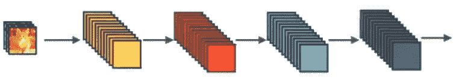

**Standard ConvNet Concept**

在**标准 ConvNet** 中，输入图像经过多重卷积，获得高层特征。

**ResNet Concept**

在[***ResNet***](/review-resnet-winner-of-ilsvrc-2015-image-classification-localization-detection-e39402bfa5d8)中，提出了身份映射来促进梯度传播。**使用元素加法**。它可以被看作是具有从一个 ResNet 模块传递到另一个 ResNet 模块的状态的算法。

**One Dense Block in DenseNet**

在 **DenseNet** 中，每一层从所有前面的层获得额外的输入，并将自己的特征映射传递给所有后面的层。**使用串联**。**每一层都从所有前面的层接收“集体知识”**。

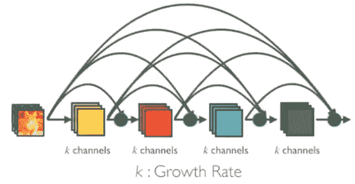

**Dense Block in DenseNet with Growth Rate k**

**由于每一层都从所有前面的层接收特征图，网络可以更细更紧凑，即通道数量可以更少**。增长率 *k* 是每层增加的通道数。

因此，它具有较高的计算效率和存储效率。下图显示了正向传播过程中串联的概念:

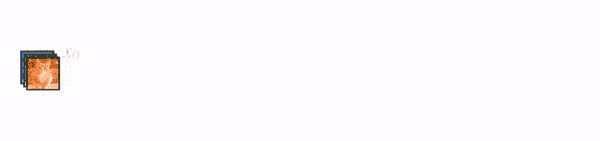

**Concatenation during Forward Propagation**

# 2. **DenseNet 架构**

## 2.1.基本 DenseNet 成分层

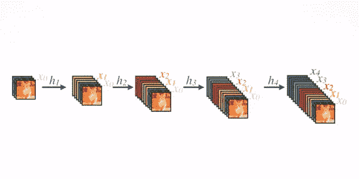

**Composition Layer**

对于每一个构图层，**预激活** [**批范数(BN)**](https://medium.com/@sh.tsang/review-batch-normalization-inception-v2-bn-inception-the-2nd-to-surpass-human-level-18e2d0f56651) **和 ReLU，然后 3×3 Conv** 用 *k* 通道的输出特征图完成，比如变换 *x* 0， *x* 1， *x* 2， *x* 3 到 *x* 4。这是来自 [*的创意，预激活 ResNet*](/resnet-with-identity-mapping-over-1000-layers-reached-image-classification-bb50a42af03e) *。*

## 2.2.DenseNet-B(瓶颈层)

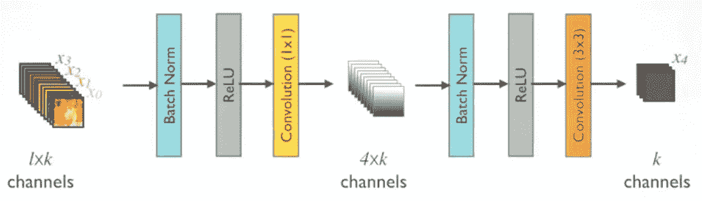

**DenseNet-B**

为了降低模型的复杂度和尺寸， **BN-ReLU-1×1 Conv** 在 **BN-ReLU-3×3 Conv** 之前完成。

## 2.4.具有过渡层的多个密集块

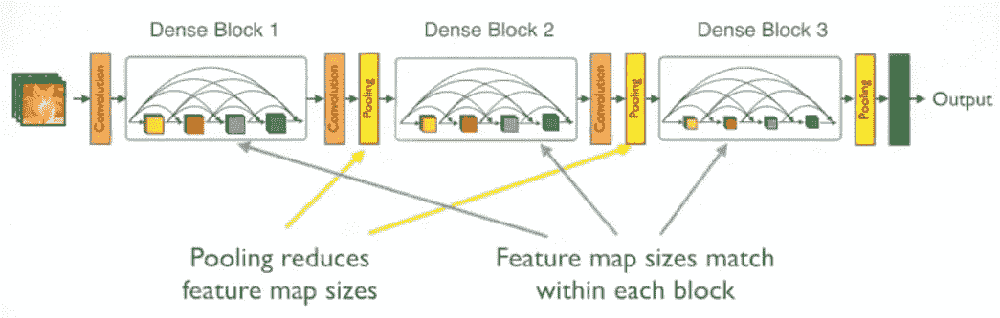

**Multiple Dense Blocks**

1×1 Conv，然后是 2×2 平均池，用作两个相邻密集区块之间的过渡层。

在密集块中，要素地图的大小是相同的，因此可以很容易地将它们连接在一起。

在最后一个密集块的末尾，执行全局平均池化，然后附加 softmax 分类器。

## 2.3.DenseNet-BC(进一步压缩)

**如果一个密集块包含 *m* 个特征图，过渡层生成 *θm* 个输出特征图**，其中 0 < *θ* ≤1 称为压缩因子。

当 *θ* =1 时，跨过渡层的特征映射的数量保持不变。 *θ* <为 1 的 DenseNet 称为 **DenseNet-C** ，实验中 ***θ* =0.5** 。

当使用**θ*<1 的瓶颈层和过渡层时****，该型号称为 **DenseNet-BC** 。*

*最后训练有/无 B/C 和不同 ***L* 层**和 ***k* 生长率**的 DenseNets **。***

# *3.**dense net 的优势***

## *3.1.强梯度流*

*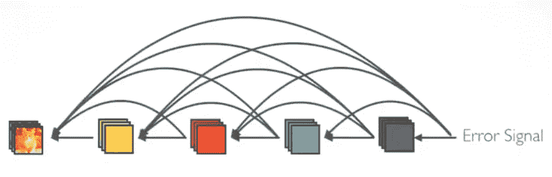*

***Implicit “Deep Supervision”***

*误差信号可以容易地更直接地传播到更早的层。这是一种隐式深度监督，因为较早的层可以从最终分类层获得直接监督。*

## *3.2.参数和计算效率*

*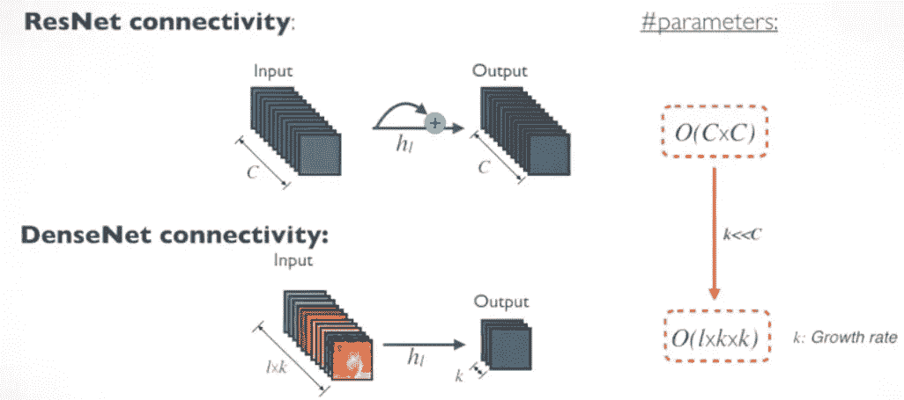*

***Number of Parameters for ResNet and DenseNet***

*对于每一层， [*ResNet*](/review-resnet-winner-of-ilsvrc-2015-image-classification-localization-detection-e39402bfa5d8) 中的参数个数与 *C* ×C 成正比，而 DenseNet 中的参数个数与 *l* × *k* × *k* 成正比。*

*由于 *k* < < *C* ，DenseNet 的尺寸比 [*ResNet*](/review-resnet-winner-of-ilsvrc-2015-image-classification-localization-detection-e39402bfa5d8) 小很多。*

## *3.3.更加多样化的功能*

*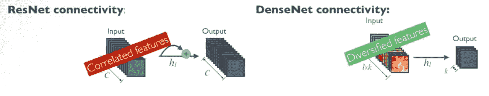*

***More Diversified Features in DenseNet***

*由于 DenseNet 中的每一层都接收所有前面的层作为输入，因此更多样化的特性和模式更丰富。*

## *3.4.保持低复杂性特征*

*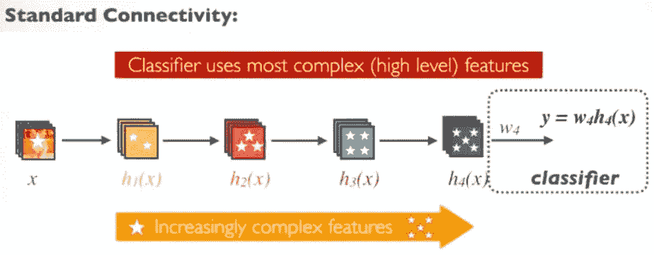*

***Standard ConvNet***

*在标准的 ConvNet 中，分类器使用最复杂的特征。*

*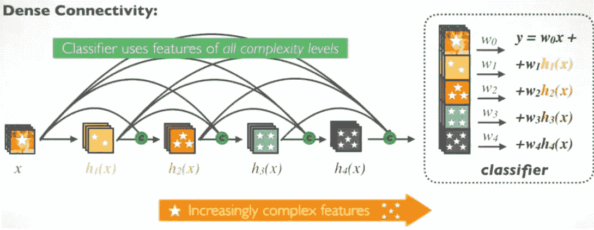*

***DenseNet***

*在 DenseNet 中，分类器使用所有复杂级别的特征。它倾向于给出更平滑的决策边界。也解释了为什么 DenseNet 在训练数据不足的情况下表现良好。*

# *4. **CIFAR & SVHN 小规模数据集结果***

## *4.1.CIFAR-10*

*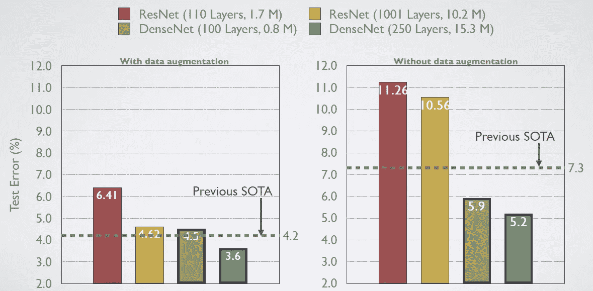*

***CIFAR-10 Results***

*[*预激活 ResNet*](/resnet-with-identity-mapping-over-1000-layers-reached-image-classification-bb50a42af03e) 用于详细比较。*

*使用数据扩充(C10+)，测试误差:*

*   *小型 ResNet-110: 6.41%*
*   *大尺寸 ResNet-1001(10.2 米参数):4.62%*
*   *最先进的(SOTA) 4.2%*
*   *小型 DenseNet-BC ( *L* =100， *k* =12)(仅 0.8M 参数):4.5%*
*   *大尺寸 DenseNet ( *L* =250， *k* =24): 3.6%*

*无数据扩充(C10)，测试误差:*

*   *小型 ResNet-110: 11.26%*
*   *大尺寸 ResNet-1001(10.2 米参数):10.56%*
*   *最先进的(SOTA) 7.3%*
*   *小型 DenseNet-BC ( *L* =100， *k* =12)(仅 0.8M 参数):5.9%*
*   *大尺寸 DenseNet ( *L* =250， *k* =24): 4.2%*

*严重的过拟合出现在 [*预激活 ResNet*](/resnet-with-identity-mapping-over-1000-layers-reached-image-classification-bb50a42af03e) 中，而 DenseNet 在训练数据不足时表现良好，因为 DenseNet 使用所有复杂度级别的特征。*

*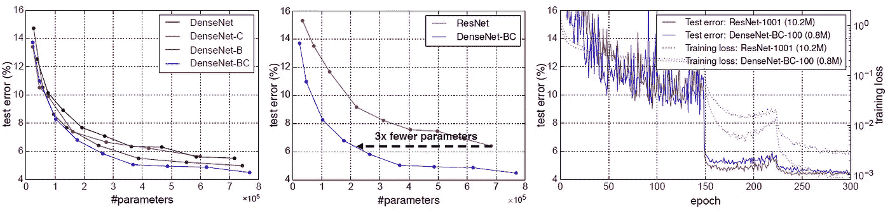*

***C10+: Different DenseNet Variants (Left), DenseNet vs ResNet (Middle), Training and Testing Curves of DenseNet and ResNet (Right)***

***左** : DenseNet-BC 获得最佳结果。*

***中间** : [*预激活 ResNet*](/resnet-with-identity-mapping-over-1000-layers-reached-image-classification-bb50a42af03e) 已经比[*Alex net*](https://medium.com/coinmonks/paper-review-of-alexnet-caffenet-winner-in-ilsvrc-2012-image-classification-b93598314160)*和 [*VGGNet*](https://medium.com/coinmonks/paper-review-of-vggnet-1st-runner-up-of-ilsvlc-2014-image-classification-d02355543a11) 得到的参数少，DenseNet-BC ( *k* =12)在相同测试误差下比 [*预激活 ResNet*](/resnet-with-identity-mapping-over-1000-layers-reached-image-classification-bb50a42af03e) 得到的参数少 3 倍。**

****右**:参数为 0.8 的 DenseNet-BC-100 与参数为 10.2M 的 [*预激活 ResNet-1001*](/resnet-with-identity-mapping-over-1000-layers-reached-image-classification-bb50a42af03e) 测试误差相近。**

## **4.2.西发尔-100**

**CIFAR-100 的类似趋势如下:**

**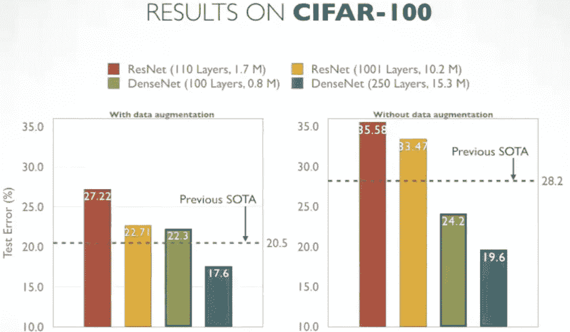**

****CIFAR-100 Results****

## **4.3.详细结果**

**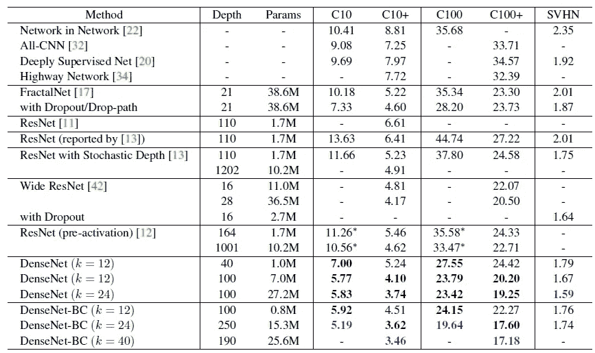**

****Detailed Results, + means data augmentation****

**SVHN 是街景门牌号码数据集。蓝色意味着最好的结果。DenseNet-BC 不能获得比基本 DenseNet 更好的结果，作者认为 SVHN 是一个相对容易的任务，并且非常深的模型可能会过度适应训练集。**

# **5.ImageNet **大规模数据集**结果**

**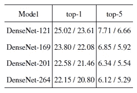**

****Different DenseNet Top-1 and Top-5 Error Rates with Single-Crop (10-Crop) Results****

**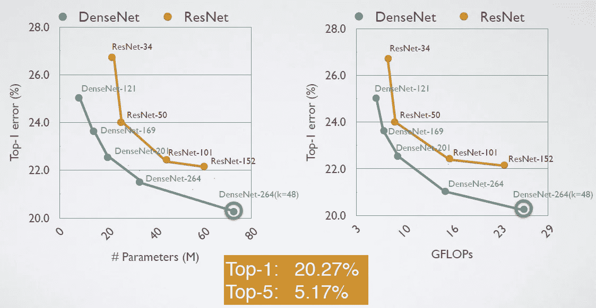**

****ImageNet Validation Set Results Compared with Original ResNet****

**[在](/review-resnet-winner-of-ilsvrc-2015-image-classification-localization-detection-e39402bfa5d8)[中实现的原始 ResNet](https://github.com/facebook/fb.resnet.torch) 该链接用于详细比较。**

****左**:参数为 20M 的 DenseNet-201 与参数超过 40M 的 ResNet-101 产生相似的验证误差。**

****右**:类似的计算次数趋势(GFLOPs)**

****底:dense net-264(*k*= 48)**得到了 20.27% Top-1 误差和 5.17% Top-5 误差的最好结果。**

# **6.特征重用的进一步分析**

****

****Heat map on the average absolute weights of how Target layer (*l*) reuses the source layer (s)****

*   **由非常早期的层提取的特征被遍及同一密集块的更深的层直接使用。**
*   **过渡层的权重也会将其权重分布到所有前面的层。**
*   **第二和第三密集块内的层一致地将最小权重分配给过渡层的输出。(第一排)**
*   **在最终分类层，权重似乎是对最终特征地图的集中。一些更高级的功能在网络后期产生。**

**作者还发表了多尺度 DenseNet。希望我以后也能报道它。**

# **参考**

**【2017 CVPR】【dense net】
[密集连接的卷积网络](https://arxiv.org/abs/1608.06993)**

# **我的相关评论**

**[[LeNet](https://medium.com/@sh.tsang/paper-brief-review-of-lenet-1-lenet-4-lenet-5-boosted-lenet-4-image-classification-1f5f809dbf17)][[AlexNet](https://medium.com/coinmonks/paper-review-of-alexnet-caffenet-winner-in-ilsvrc-2012-image-classification-b93598314160)][[ZFNet](https://medium.com/coinmonks/paper-review-of-zfnet-the-winner-of-ilsvlc-2013-image-classification-d1a5a0c45103)][[VGGNet](https://medium.com/coinmonks/paper-review-of-vggnet-1st-runner-up-of-ilsvlc-2014-image-classification-d02355543a11)][[SPPNet](https://medium.com/coinmonks/review-sppnet-1st-runner-up-object-detection-2nd-runner-up-image-classification-in-ilsvrc-906da3753679)][[PReLU-Net](https://medium.com/coinmonks/review-prelu-net-the-first-to-surpass-human-level-performance-in-ilsvrc-2015-image-f619dddd5617)][[Google Net/Inception-v1](https://medium.com/coinmonks/paper-review-of-googlenet-inception-v1-winner-of-ilsvlc-2014-image-classification-c2b3565a64e7)][[BN-Inception/Inception-v2](https://medium.com/@sh.tsang/review-batch-normalization-inception-v2-bn-inception-the-2nd-to-surpass-human-level-18e2d0f56651)][[Inception-v3](https://medium.com/@sh.tsang/review-inception-v3-1st-runner-up-image-classification-in-ilsvrc-2015-17915421f77c)][[Inception-v4](/review-inception-v4-evolved-from-googlenet-merged-with-resnet-idea-image-classification-5e8c339d18bc)**