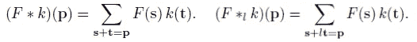
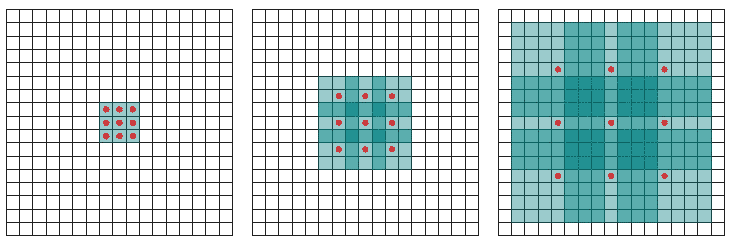
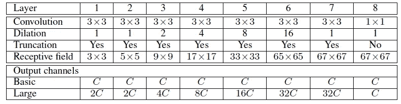
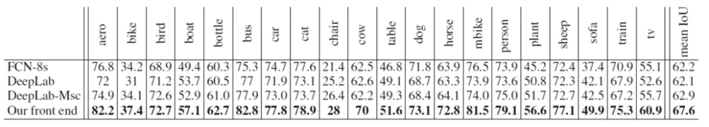
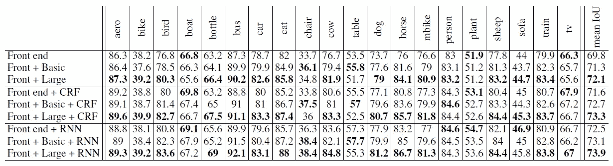
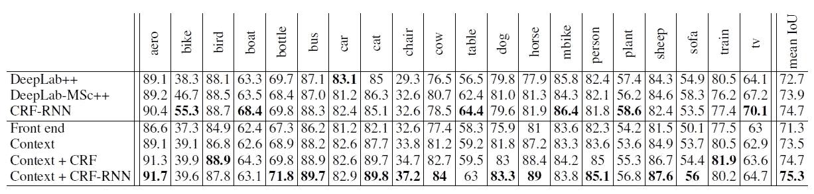
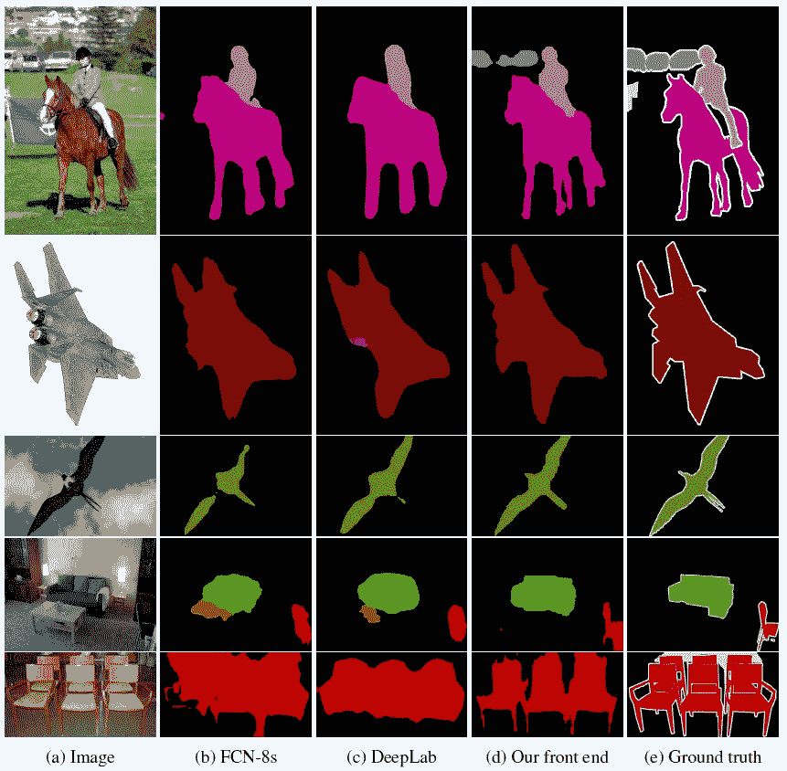
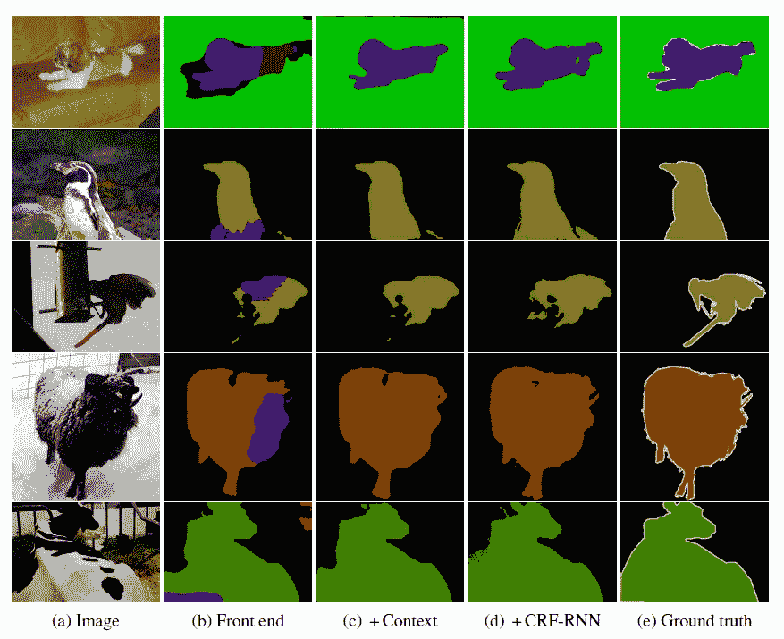
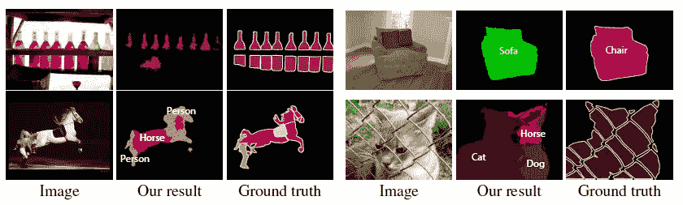

# 综述:扩展网络—扩展卷积(语义分割)

> 原文：<https://towardsdatascience.com/review-dilated-convolution-semantic-segmentation-9d5a5bd768f5?source=collection_archive---------2----------------------->

## 又名“ **atrous 卷积**”、“**算法à trous** ”和“**空洞算法**

T 他的时代，**膨胀卷积，**来自普林斯顿大学和英特尔实验室，简要回顾。扩展卷积的思想来源于小波分解。又称为“ **atrous 卷积**”、“ **algorithme à trous** ”和“ **hole algorithm** ”。因此，如果我们可以将过去的任何想法转化为深度学习框架，它们仍然是有用的。

而这个膨胀的卷积在我写这个故事的时候已经发表在 **2016 ICLR** 上有超过 **1000 次引用**。( [Sik-Ho Tsang](https://medium.com/u/aff72a0c1243?source=post_page-----9d5a5bd768f5--------------------------------) @中)

# 涵盖哪些内容

1.  **扩张回旋**
2.  **多尺度上下文聚合(上下文模块)**
3.  **结果**

# 1.扩张卷积

**Standard Convolution (Left), Dilated Convolution (Right)**

左边的是标准卷积。右边的是扩张的回旋。我们可以看到在求和的时候，就是 s+ *l* t=p 我们在卷积的时候会跳过一些点。

**当 *l* =1 时，为标准卷积。**

**当*l*1 时，为扩张卷积。**

**Standard Convolution (l=1)**

**Dilated Convolution (l=2)**

以上举例说明了当 *l* =2 时**展开卷积的例子。我们可以看到**感受野比标准感受野大**。**

**l=1 (left), l=2 (Middle), l=4 (Right)**

上图显示了更多关于感受野的例子。

# **2。多尺度上下文聚合(上下文模块)**

基于扩展卷积构建**上下文模块**如下:

**The Basic Context Module and The Large Context Module**

上下文模块有 7 层，应用具有不同膨胀因子的 3×3 卷积。**扩容 1，1，2，4，8，16，1。**

最后一个是 1×1 卷积，用于将通道数映射为与输入通道数相同。因此，**输入和输出有相同数量的通道。**并且可以插入不同种类的卷积神经网络。

**基本上下文模块**在整个模块中只有**1 个通道(1C ),而**大型上下文模块**有**增加通道数，从 1C 输入到第 7 层的 32C**。**

# 3.结果

## 3.1.帕斯卡 VOC 2012

[*VGG-16*](https://medium.com/coinmonks/paper-review-of-vggnet-1st-runner-up-of-ilsvlc-2014-image-classification-d02355543a11) 作为**前端模块**。最后两个池层和跨层被完全移除，并插入了上下文模块。中间特征图的填充也被移除。作者仅填充宽度为 33 的输入要素地图。在我们的实验中，零填充和反射填充产生了类似的结果。此外，使用考虑输入和输出通道数量的权重初始化来代替标准随机初始化。

**PASCAL VOC 2012 Test Set**

通过对比原作者训练的公开模型，在测试集上，扩张卷积比[*【FCN-8s】*](/review-fcn-semantic-segmentation-eb8c9b50d2d1)和 [*DeepLabv1*](/review-deeplabv1-deeplabv2-atrous-convolution-semantic-segmentation-b51c5fbde92d) 均高出约 5 个百分点。

可以获得 67.6%的平均 IoU。

**PASCAL VOC 2012 Validation Set**

通过对来自 Microsoft COCO 数据集的额外图像进行训练，对扩张卷积本身进行消融研究，如上所示。

*   **前端**:前端模块
*   **基本**:基本上下文模块
*   **大**:大上下文模块
*   **CRF** :使用[*deeplab v1*](/review-deeplabv1-deeplabv2-atrous-convolution-semantic-segmentation-b51c5fbde92d)*和 [*DeepLabv2*](/review-deeplabv1-deeplabv2-atrous-convolution-semantic-segmentation-b51c5fbde92d) 中条件随机字段的后处理步骤*
*   ***RNN** :通过递归神经网络使用条件随机场的后处理步骤*

*我们可以看到，**膨胀卷积(基本或大)总是可以改善结果，并且不与任何其他后处理步骤重叠。***

*并且可以获得 73.9%的平均 IoU。*

**

***PASCAL VOC 2012 Test Set***

*上表中的前端模块也是通过对来自微软 COCO 数据集的附加图像进行训练而获得的。使用通用报告格式-RNN(即上表中的 RNN)，平均 IoU 为 75.3%。*

## *3.2.定性结果*

**

***PASCAL VOC 2012***

*全部采用 [*VGG-16*](https://medium.com/coinmonks/paper-review-of-vggnet-1st-runner-up-of-ilsvlc-2014-image-classification-d02355543a11) 进行特征提取，使用扩张卷积在分割结果上有更好的质量*

**

***PASCAL VOC 2012***

*用条件随机场 RNN 作为后处理步骤，得到了稍好的结果。但是 CRF-RNN 使这个过程不是一个端到端的学习。*

**

***Failure Cases***

*一些失败案例如上图，**当物体被遮挡时，分割出错。***

*附录中尝试了不同的数据集，即 CamVid、KITTI 和 Cityscapes，请随意阅读本文。他们还发表了**扩张的残余网络**。希望以后能覆盖。:)*

# *参考*

*【2016 ICLR】【扩张卷积】
[扩张卷积的多尺度上下文聚合](https://arxiv.org/abs/1511.07122)*

# *我的相关评论*

*[[VGGNet](https://medium.com/coinmonks/paper-review-of-vggnet-1st-runner-up-of-ilsvlc-2014-image-classification-d02355543a11)][[FCN](/review-fcn-semantic-segmentation-eb8c9b50d2d1)][[DeconvNet](/review-deconvnet-unpooling-layer-semantic-segmentation-55cf8a6e380e)][[deep lab v1&deep lab v2](/review-deeplabv1-deeplabv2-atrous-convolution-semantic-segmentation-b51c5fbde92d)]*