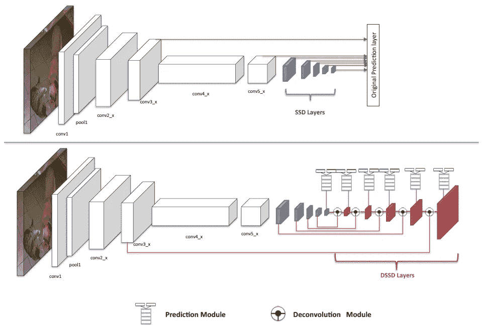
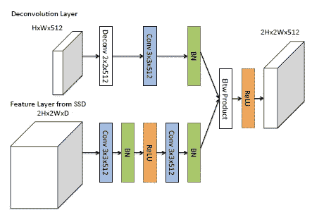
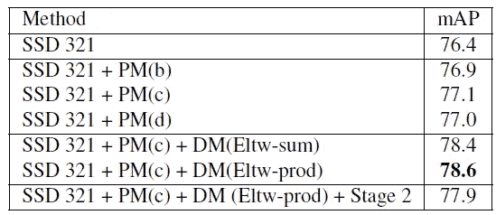
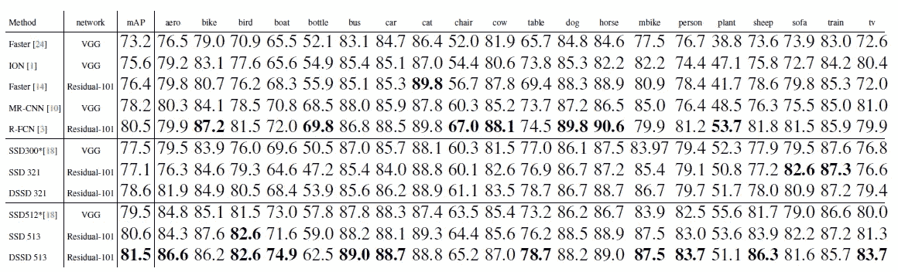
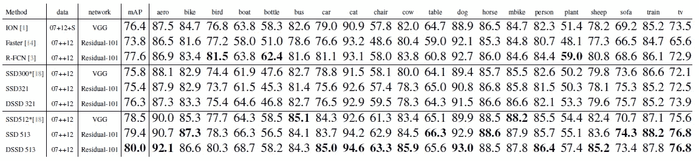
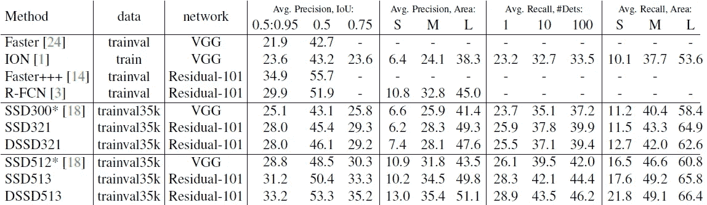
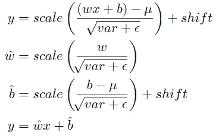
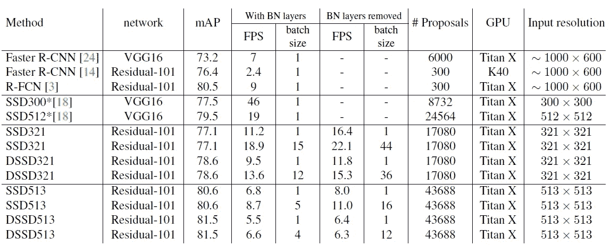
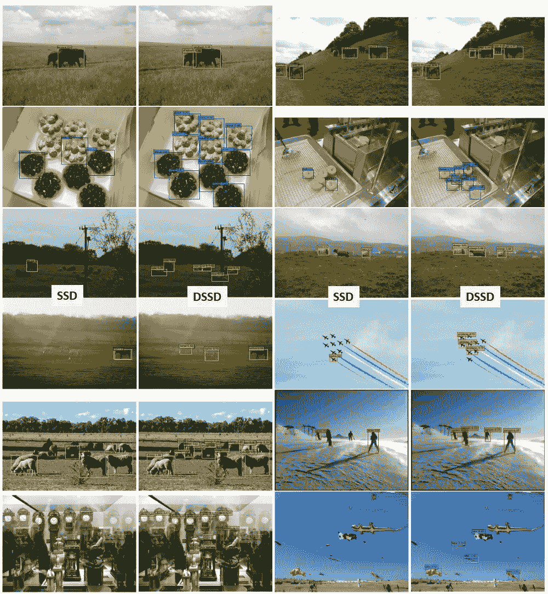

# 综述:DSSD —解卷积单次探测器(目标探测)

> 原文：<https://towardsdatascience.com/review-dssd-deconvolutional-single-shot-detector-object-detection-d4821a2bbeb5?source=collection_archive---------4----------------------->

## 反卷积层:引入额外的大规模背景，提高小对象的准确性

T 他的时代， **DSSD(反卷积单次检测器)**被回顾。DSSD，用**去进化路径**，改进了之前的 [SSD](/review-ssd-single-shot-detector-object-detection-851a94607d11) 。是 **2017 arXiv** 中的一篇技术报告，引用超过 **100 次**。( [Sik-Ho Tsang](https://medium.com/u/aff72a0c1243?source=post_page-----d4821a2bbeb5--------------------------------) @ Medium)。

*   **逐步反卷积**放大特征图
*   **来自卷积路径和反卷积路径的特征组合**

# 涵盖哪些内容

1.  **整体架构**
2.  **反卷积模块**
3.  **预测模块**
4.  **一些训练细节**
5.  **结果**

# **1。整体架构**

**SSD (Top) DSSD (Bottom)**

*   **白色转换**:可以是 [**VGGNet**](https://medium.com/coinmonks/paper-review-of-vggnet-1st-runner-up-of-ilsvlc-2014-image-classification-d02355543a11) **或** [**ResNet**](/review-resnet-winner-of-ilsvrc-2015-image-classification-localization-detection-e39402bfa5d8) 骨干进行特征提取
*   **蓝色转换率**:是**原来的** [**SSD**](/review-ssd-single-shot-detector-object-detection-851a94607d11) 部分，涉及到去掉原来的 [VGGNet](https://medium.com/coinmonks/paper-review-of-vggnet-1st-runner-up-of-ilsvlc-2014-image-classification-d02355543a11) / [ResNet](/review-resnet-winner-of-ilsvrc-2015-image-classification-localization-detection-e39402bfa5d8) 的全连通层，使用萎缩/扩张卷积(源自小波，由 [DeepLab](/review-deeplabv1-deeplabv2-atrous-convolution-semantic-segmentation-b51c5fbde92d) 或 [DilatedNet](/review-dilated-convolution-semantic-segmentation-9d5a5bd768f5) 使用)添加 conv 层。(有兴趣请访问 [SSD](/review-ssd-single-shot-detector-object-detection-851a94607d11) 。)
*   **剩余转换**:由反卷积模块和预测模块组成，后面会详细介绍。

# 2.去卷积模块

**Deconvolution Module**

*   反卷积路径上的那些特征图通过 Deconv2×2 然后 Conv3×3+ [BN](https://medium.com/@sh.tsang/review-batch-normalization-inception-v2-bn-inception-the-2nd-to-surpass-human-level-18e2d0f56651) 进行上采样。
*   另一方面，对应的相同大小的特征图具有 con v3×3+[BN](https://medium.com/@sh.tsang/review-batch-normalization-inception-v2-bn-inception-the-2nd-to-surpass-human-level-18e2d0f56651)+ReLU+con v3×3+[BN](https://medium.com/@sh.tsang/review-batch-normalization-inception-v2-bn-inception-the-2nd-to-surpass-human-level-18e2d0f56651)。
*   然后，它们按元素相乘(Eltw 乘积),并进行 ReLU，然后传递给预测模块。

# **3。预测模块**

**Various Prediction Module**

*   测试了各种预测模块。
*   (a):是 [SSD](/review-ssd-single-shot-detector-object-detection-851a94607d11) 中使用的最基本的一个，直接预测对象类，进行包围盒回归。
*   (b):在特征图上执行 Conv1×1 的附加集合，以增加维度。还有一个与元素相加的 skip 连接。
*   (c):除了在跳过连接路径上执行一个额外的 Conv1×1 之外，它是(b)的一个。
*   (d):两个(c)是级联的。

# 4.一些训练细节

## 两阶段训练

*   使用 ImageNet 预训练模型训练有素的 SSD 。
*   对于第一阶段，仅训练反卷积侧。
*   第二阶段，对整个网络进行微调。

## **其他**

*   还使用了广泛的数据扩充，包括随机裁剪、翻转和随机光度失真。
*   在使用 K-均值聚类进行分析之后，添加纵横比为 1.6 的先前盒子，即使用{1.6，2.0，3.0}。

基于以上所述，在 PASCAL VOC 2007 上进行消融研究:

**Results on PASCAL VOC 2007**

*   **SSD 321** :原装 [SSD](/review-ssd-single-shot-detector-object-detection-851a94607d11) 带输入 321×321，76.4% mAP。
*   **SSD 321 + PM(c)** :原装 [SSD](/review-ssd-single-shot-detector-object-detection-851a94607d11) 使用预测模块(c)，77.1 % mAP，比使用 PM (b)和 PM (d)的要好。
*   **SSD 321+PM(c)+DM(Eltw-prod)**:DM 表示解卷积模块，因此，这是 DSSD 使用 PM(c)和用于特征组合的元素式产品，78.6% mAP。它比使用元素相加的方法要好一点。
*   **SSD 321+PM(c)+DM(Eltw-prod)+Stage 2**:采用两阶段训练，成绩下降。

# 5.结果

## 5.1.帕斯卡 VOC 2007

**Results on PASCAL VOC 2007 Test**

SSD 和 DSSD 在 2007 trainval 和 2012 trainval 的联合上接受培训。

*   **SSD300*** 和 **SSD512*** (*表示使用了新的数据扩充技巧。):凭借*，最初的[固态硬盘](/review-ssd-single-shot-detector-object-detection-851a94607d11)已经超越了除 [R-FCN](/review-r-fcn-positive-sensitive-score-maps-object-detection-91cd2389345c) 之外的其他最先进的方法。
*   **SSD 321** 和 **SSD 513** :以 [ResNet](/review-resnet-winner-of-ilsvrc-2015-image-classification-localization-detection-e39402bfa5d8) 为骨干，性能已经和 SSD300*和 SSD512*差不多。
*   **DSSD 321** 和 **DSSD 513** :通过反卷积路径，它们分别优于 SSD 321 和 SSD 513。
*   特别是， **DSSD513 的表现优于**[**R-FCN**](/review-r-fcn-positive-sensitive-score-maps-object-detection-91cd2389345c)**。**

## 5.2.帕斯卡 VOC 2012

**Results on PASCAL VOC 2012 Test**

VOC 2007 trainval+测试和 2012 trainval 用于培训。既然发现两阶段训练没用，这里就用一阶段训练。

*   **DSSD 513 以 80.0%的 mAP 表现优于其他品种。**并且不使用 COCO 数据集的额外训练数据进行训练。

## 5.3.可可女士

**Results on MS COCO Test**

还是那句话，没有两阶段训练。

*   **SSD300*** 已经比[更快 R-CNN](/review-faster-r-cnn-object-detection-f5685cb30202) 和 ION。
*   **DSSD321 在小物体上的 AP 更好**，7.4%相比 SSD321 只有 6.2%。
*   对于更大的车型， **DSSD513** 获得 33.2%的 mAP，比 29.9% mAP 的 [**R-FCN**](/review-r-fcn-positive-sensitive-score-maps-object-detection-91cd2389345c) 要好**。它已经和更快的 R-CNN++取得了竞争结果。(+++表示它也使用 VOC2007 和 VOC2012 进行培训。)**

## 5.4.推理时间

为了在测试过程中简化网络， [BN](https://medium.com/@sh.tsang/review-batch-normalization-inception-v2-bn-inception-the-2nd-to-surpass-human-level-18e2d0f56651) 被移除，并与 conv 合并，如下所示:

简而言之，他们试图将 BN 效应合并到 conv 层的权重和偏差计算中，从而简化网络。这将速度提高了 1.2 到 1.5 倍，并将内存减少了三倍。

**Speed & Accuracy on PASCAL VOC 2007 Test**

*   **SSD 513** 与 [**R-FCN**](/review-r-fcn-positive-sensitive-score-maps-object-detection-91cd2389345c) (9 FPS)相比，速度(8.7 fps)和精度差不多。**去除 BN 层**并与 conv 层合并，得到 **11.0 fps** 更快。
*   DSSD513 比 [R-FCN](/review-r-fcn-positive-sensitive-score-maps-object-detection-91cd2389345c) 精度更高，但速度稍慢。
*   DSSD321 比 [R-FCN](/review-r-fcn-positive-sensitive-score-maps-object-detection-91cd2389345c) 精度低，但速度更快。

## 5.5.定性结果

**SSD (Left) DSSD (Right)**

由于输入尺寸较小， [SSD](/review-ssd-single-shot-detector-object-detection-851a94607d11) 在小对象上效果不佳。随着反卷积路径，DSSD 显示出明显的改善。

## 参考

【2017 arXiv】【DSSD】
[DSSD:解卷积单粒子探测器](https://arxiv.org/abs/1701.06659)

## 我的相关评论

)(我)(们)(都)(不)(想)(到)(这)(些)(人)(,)(我)(们)(都)(不)(想)(要)(到)(这)(些)(人)(,)(但)(是)(这)(些)(人)(还)(不)(想)(到)(这)(些)(人)(,)(我)(们)(还)(没)(想)(到)(这)(些)(事)(,)(我)(们)(就)(想)(到)(了)(这)(些)(人)(们)(,)(我)(们)(们)(都)(不)(想)(要)(到)(这)(些)(人)(,)(但)(我)(们)(还)(没)(想)(到)(这)(些)(事)(,)(我)(们)(还)(没)(想)(到)(这)(里)(来)(。 )(我)(们)(都)(不)(知)(道)(,)(我)(们)(还)(是)(不)(知)(道)(,)(我)(们)(还)(是)(不)(知)(道)(,)(我)(们)(还)(是)(不)(知)(道)(,)(我)(们)(还)(是)(不)(知)(道)(,)(我)(们)(还)(是)(不)(知)(道)(,)(我)(们)(还)(是)(不)(知)(道)(,)(我)(们)(还)(是)(不)(知)(道)(。

**物体检测** [过食](https://medium.com/coinmonks/review-of-overfeat-winner-of-ilsvrc-2013-localization-task-object-detection-a6f8b9044754)[R-CNN](https://medium.com/coinmonks/review-r-cnn-object-detection-b476aba290d1)[快 R-CNN](https://medium.com/coinmonks/review-fast-r-cnn-object-detection-a82e172e87ba)[快 R-CNN](/review-faster-r-cnn-object-detection-f5685cb30202)[DeepID-Net](/review-deepid-net-def-pooling-layer-object-detection-f72486f1a0f6)】[R-FCN](/review-r-fcn-positive-sensitive-score-maps-object-detection-91cd2389345c)】[yolo v1](/yolov1-you-only-look-once-object-detection-e1f3ffec8a89)[SSD](/review-ssd-single-shot-detector-object-detection-851a94607d11)[yolo v2/yolo 9000](/review-yolov2-yolo9000-you-only-look-once-object-detection-7883d2b02a65)

**语义切分
[[FCN](/review-fcn-semantic-segmentation-eb8c9b50d2d1)][[de convnet](/review-deconvnet-unpooling-layer-semantic-segmentation-55cf8a6e380e)][[deeplabv 1&deeplabv 2](/review-deeplabv1-deeplabv2-atrous-convolution-semantic-segmentation-b51c5fbde92d)][[parse net](https://medium.com/datadriveninvestor/review-parsenet-looking-wider-to-see-better-semantic-segmentation-aa6b6a380990)][[dilated net](/review-dilated-convolution-semantic-segmentation-9d5a5bd768f5)][[PSPNet](/review-pspnet-winner-in-ilsvrc-2016-semantic-segmentation-scene-parsing-e089e5df177d)]**