# 回顾:更快的 R-CNN(目标检测)

> 原文：<https://towardsdatascience.com/review-faster-r-cnn-object-detection-f5685cb30202?source=collection_archive---------1----------------------->

在这个故事中，**更快的 R-CNN**【1–2】被回顾。在之前的快速 R-CNN [3]和 R-CNN [4]中，区域建议是通过选择性搜索(SS) [5]而不是使用卷积神经网络(CNN)来生成的。

在更快的 R-CNN[1–2]，**中，区域提案生成和异议检测任务都由同一个 conv 网络完成。**采用这样的设计，物体检测速度更快。

为了更好地了解深度学习对象检测，作为一系列的对象检测方法，如果有足够的时间，最好按照顺序阅读 R-CNN、Fast R-CNN 和 Fast R-CNN，以了解对象检测的演变，特别是为什么区域提议网络(RPN)存在于该方法中。如果有兴趣，我建议看看我对他们的评论。

由于更快的 R-CNN 是一种最先进的方法，当我写这个故事时，它被发表为 **2015 NIPS** 论文和 **2017 TPAMI** 论文，分别有超过 **4000 和 800 篇引用****。( [Sik-Ho Tsang](https://medium.com/u/aff72a0c1243?source=post_page-----f5685cb30202--------------------------------) @中)**

# **涵盖哪些内容**

1.  ****地区提案网络****
2.  ****检测网络****
3.  ****四步交替训练****
4.  ****消融研究****
5.  ****检测结果****

# **1.区域提案网络**

**简而言之，R-CNN [4]和快速 R-CNN [3]首先通过选择性搜索(SS) [5]生成区域建议，然后使用基于 CNN 的网络对对象类别进行分类并检测边界框。(主要区别在于 R-CNN 在像素级将区域建议输入到 CNN 中用于检测，而快速 R-CNN 在特征映射级输入区域建议。)**因此，在 R-CNN [4]和快速 R-CNN [3]中，区域提议方法/网络(即 SS)和检测网络是解耦的。****

**脱钩不是一个好主意。比如说 SS 有假阴性的时候，这个误差会直接伤害到检测网络。最好将它们耦合在一起，使它们相互关联。**

****在更快的 R-CNN[1–2]中，使用 SS [5]的 RPN 被使用 CNN 的 RPN 取代。并且该 CNN 与检测网络共享。这个 CNN 可以是论文中的 ZFNet 或者 VGGNet。因此，整个网络如下:****

**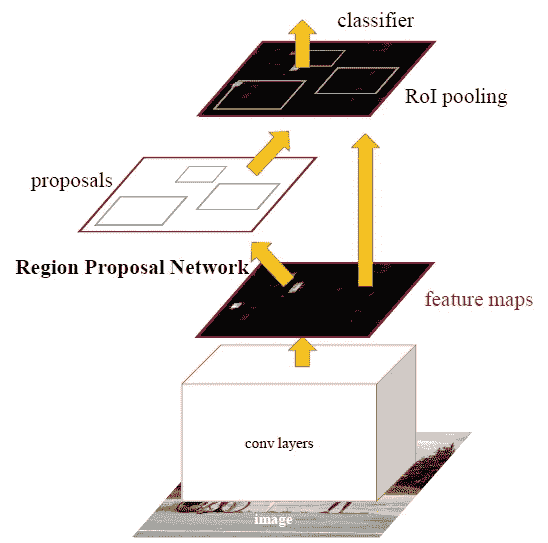**

****Faster R-CNN****

1.  **首先，图片经过 conv 层和特征地图提取。**
2.  **然后在 RPN 中为特征图上的每个位置使用一个**滑动窗口**。**
3.  **对于每个位置，使用 **k (k=9)个锚定框**(**128、256 和 512 的 3 个比例，以及 1:1、1:2、2:1** 的 3 个纵横比)来生成区域提议。**
4.  **一个 ***cls*** 层输出 *2k* 分数**对于 *k* 盒子是否有对象**。**
5.  **一个 ***reg*** 层输出*k*盒子的**坐标**(盒子中心坐标，宽度和高度)4k 。**
6.  **一张大小为*W*×H 的特征图，总共有 *WHk* 个主播。**

**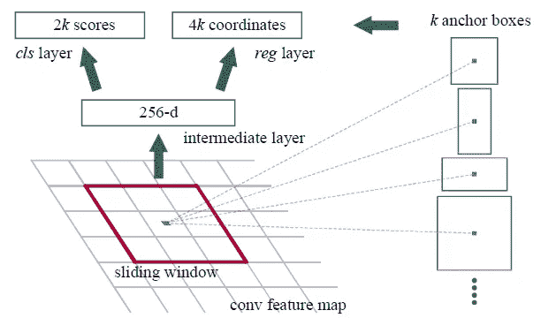**

****The Output of RPN****

**128、256 和 512 三种比例以及 1:1、1:2 和 2:1 三种纵横比的平均建议尺寸为:**

**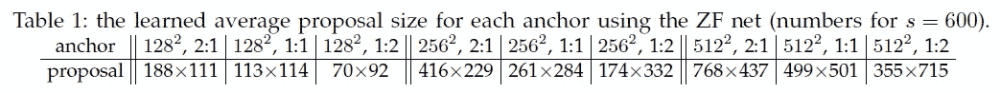**

****Average Proposal Sizes****

**损失函数是:**

**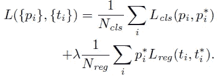**

****RPN Loss Function****

**第一项是 2 类(有无对象)上的分类损失。第二项是仅当存在对象(即 p_i* =1)时边界框的回归损失。**

**因此， **RPN 网络就是预检查哪个位置包含对象**。并且**相应的位置和边界框将传递到检测网络**用于检测对象类别并返回该对象的边界框。**

**由于区域可以彼此高度重叠，所以使用非最大抑制(NMS)来将提议的数量从大约 6000 减少到 N (N=300)。**

# ****2。检测网络****

**除了 RPN，其余部分与快速 R-CNN 类似。首先执行 ROI 合并。然后汇集的区域通过 CNN 和两个 FC 分支，用于类 softmax 和边界框回归器。(如果有兴趣，请阅读[我对 Fast R-CNN](https://medium.com/coinmonks/review-fast-r-cnn-object-detection-a82e172e87ba) 的评论。)**

**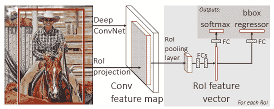**

****Fast R-CNN Detection Network****

# **3.**四步交替训练****

**由于 conv 层被共享以提取最终具有不同输出的特征图，因此，训练过程非常不同:**

1.  **用 imagenet 预训练模型训练(微调)RPN。**
2.  **使用 imagenet 预训练模型训练(微调)单独的检测网络。(Conv 图层尚未共享)**
3.  **使用检测器网络来初始化 PRN 训练，修复共享的 conv 层，仅微调 RPN 的独特层。**
4.  **保持 conv 层固定，微调探测器网络的独特层。**

# ****4。消融研究****

## **4.1.区域提案**

**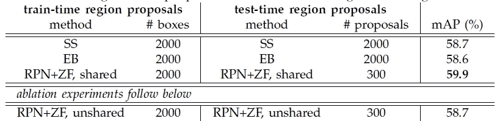**

**如上所述，利用非共享 conv 层(在交替训练中只有前 2 步)，获得了 58.7%的 mAP。**共享 conv 图层，获得 59.9%的地图。并且它优于现有技术的 SS 和 EB。****

## **4.2 比例和比率**

**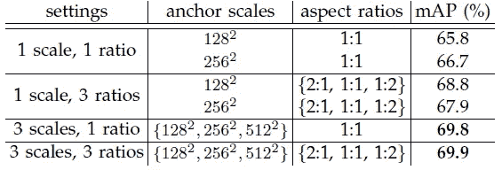**

****在 3 个尺度和 3 个比例的情况下，获得了 69.9%的地图，与 3 个尺度和 1 个比例的地图相比只有很小的改进。**但是仍然使用 3 个刻度和 3 个比率。**

## **损失函数中的 4.3 λ**

**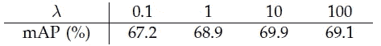**

****λ = 10 达到最佳效果。****

# ****5。检测结果****

## **5.1 帕斯卡 VOC 2007**

**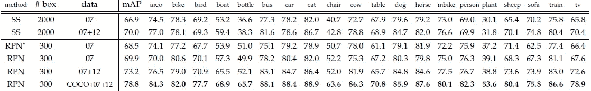**

****Detailed Results****

**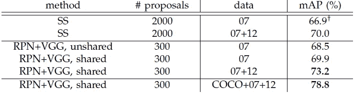**

****Overall Results****

**通过使用 COCO、VOC 2007 (trainval)和 VOC 2012 (trainval)数据集的训练数据，获得了 78.8%的 mAP。**

## **5.2 帕斯卡 VOC 2012**

**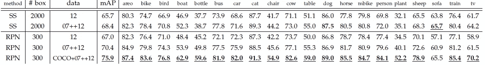**

****Detailed Results****

**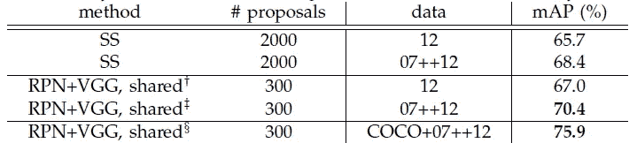**

****Overall Results****

**利用使用 COCO、VOC 2007 (trainval+test)和 VOC 2012 (trainval)数据集的训练数据，获得了 75.9%的 mAP。**

## **5.3 可可女士**

**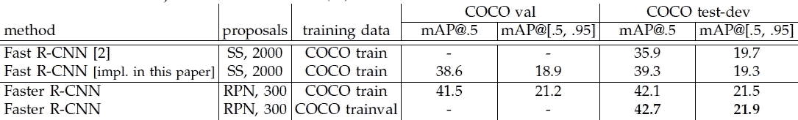**

****Overall Results****

**使用 COCO 训练集进行训练，用 IoU @ 0.5 获得 42.1%的 mAP。当 IoU 从 0.5 到 0.95，步长为 0.05 时，可以获得 21.5%的 mAP。**

## **5.4 检测时间**

**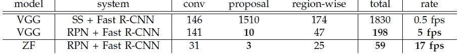**

****Detection Time****

**用 SS 做 RPN，VGGNet 做检测网络:0.5 fps / 1830ms
用 **VGGNet 做 RPN 和检测网络** : **5fps / 198ms**
用 **ZFNet 做 RPN 和检测网络** : **17fps / 59ms
比 SS 快很多。****

## **5.5.一些例子**

**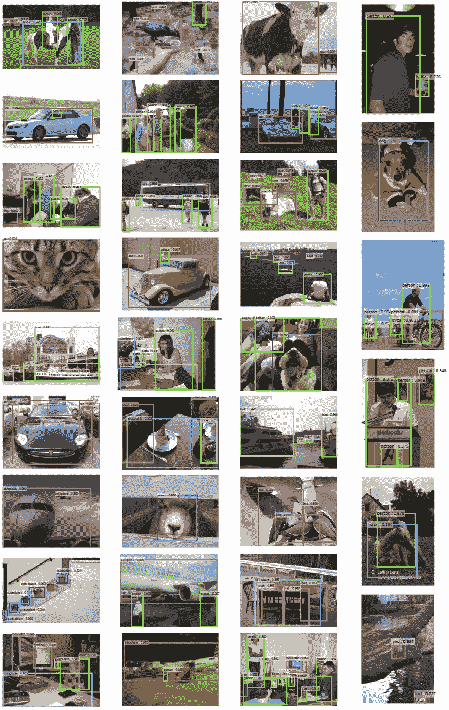**

****VOC 2007****

# **参考**

1.  **[2015 NIPS][更快的 R-CNN]
    [更快的 R-CNN:利用区域提议网络实现实时对象检测](https://papers.nips.cc/paper/5638-faster-r-cnn-towards-real-time-object-detection-with-region-proposal-networks.pdf)**
2.  **【2017 TPAMI】【更快的 R-CNN】
    [更快的 R-CNN:利用区域提议网络实现实时对象检测](https://ieeexplore.ieee.org/document/7485869/)**
3.  **【2015 ICCV】【快速 R-CNN】
    [快速 R-CNN](https://www.cv-foundation.org/openaccess/content_iccv_2015/papers/Girshick_Fast_R-CNN_ICCV_2015_paper.pdf)**
4.  **【2014 CVPR】【R-CNN】
    [丰富的特征层次，用于精确的对象检测和语义分割](https://arxiv.org/pdf/1311.2524)**
5.  **【2013 IJCV】【选择性搜索】
    [选择性搜索对象识别](http://www.huppelen.nl/publications/selectiveSearchDraft.pdf)**

# **我的评论**

1.  **[回顾:快速 R-CNN(物体检测)](https://medium.com/coinmonks/review-fast-r-cnn-object-detection-a82e172e87ba)**
2.  **[回顾:R-CNN(物体检测)](https://medium.com/coinmonks/review-r-cnn-object-detection-b476aba290d1)**