# 综述:FCN —完全卷积网络(语义分段)

> 原文：<https://towardsdatascience.com/review-fcn-semantic-segmentation-eb8c9b50d2d1?source=collection_archive---------4----------------------->

在这个故事中，**完全卷积网络(FCN)对语义分割**进行了简要回顾。与分类和检测任务相比，分割是一项更加困难的任务。

*   **图像分类**:对图像中的物体进行分类(识别出**物体类别**)。
*   **物体检测**:用包围物体的包围盒对图像内的物体进行分类和检测。这意味着我们还需要知道每个对象的**类、位置和大小。**
*   **语义分割**:对图像中的每个像素进行**对象分类。这意味着每个像素都有一个标签。**

语义分割的一个例子如下:

**An example of Semantic Segmentation**

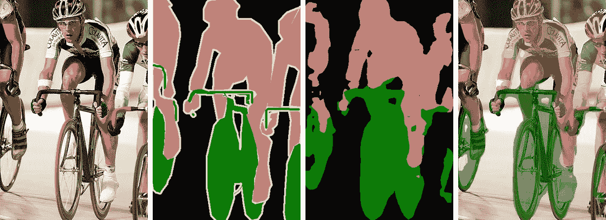

**Original Image (Leftmost), Ground Truth Label Map (2nd Left), Predicted Label Map (2nd Right), Overlap Image and Predicted Label (Rightmost)**

在我写这个故事的时候，它已经发表在**2015 CVPR**【1】和**2017 TPAMI**【2】上，引用次数超过 6000 次。因此，它也是使用 FCN 进行语义分割的最基本的论文之一。( [Sik-Ho Tsang](https://medium.com/u/aff72a0c1243?source=post_page-----eb8c9b50d2d1--------------------------------) @中)

# 涵盖哪些内容

1.  **从图像分类到语义分割**
2.  **通过去卷积进行上采样**
3.  **定影输出**
4.  **结果**

# **1。从图像分类到语义分割**

在分类中，传统上，输入图像被缩小并经过卷积层和全连接(FC)层，并输出输入图像的一个预测标签，如下:

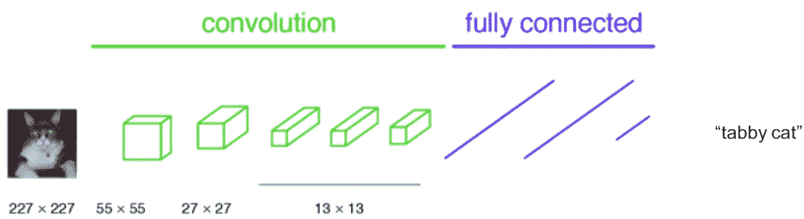

**Classification**

假设我们将 FC 层变成 1×1 卷积层:

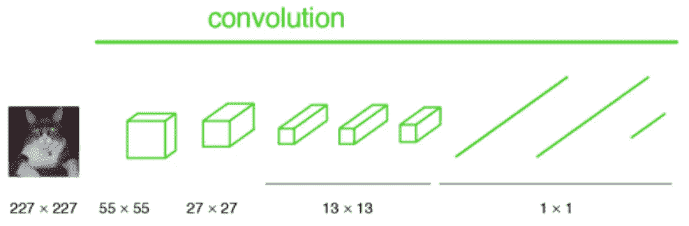

All layers are convolutional layers

如果图像没有缩小，输出将不会是单个标签。相反，输出的大小小于输入图像(由于最大池化):

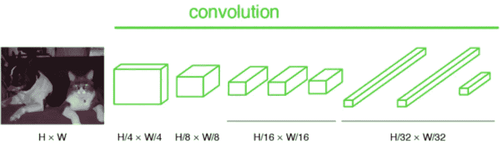

**All layers are convolutional layers**

如果我们对上面的输出进行上采样，那么我们可以如下计算逐像素输出(标签映射):

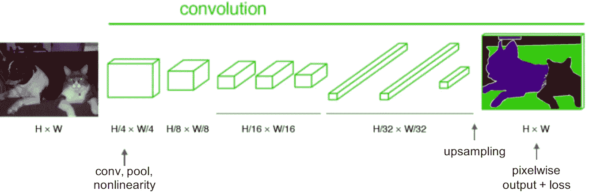

**Upsampling at the last step**

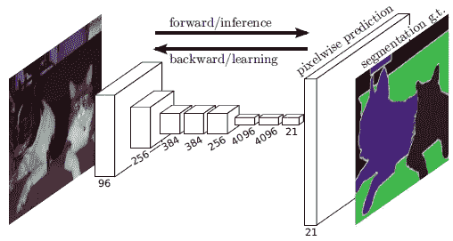

**Feature Map / Filter Number Along Layers**

# **2。通过去卷积进行上采样**

卷积是使输出变小的过程。因此，反卷积这个名称来自于我们希望通过上采样来获得更大的输出。(但名字，反卷积，被曲解为卷积的逆过程，其实不是。)又叫，**上卷积，转置卷积。**当使用分数步距时，也称为**分数步距卷积**。

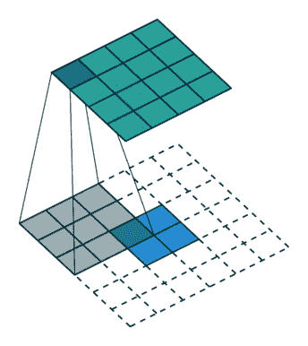

**Upsampling Via Deconvolution (Blue: Input, Green: Output)**

# 3.融合输出

经过如下 conv7 后，输出尺寸较小，则进行 32 倍上采样，使输出具有与输入图像相同的尺寸。但也让输出标签图粗糙。它叫做 **FCN-32s** :

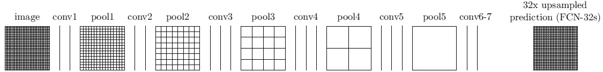

**FCN-32s**

这是因为，**深入时可以获得深层特征，深入时也会丢失空间位置信息。**这意味着来自较浅层的输出具有更多的位置信息。如果我们把两者结合起来，我们可以提高结果。

为了合并，我们**融合输出(通过元素相加)**:

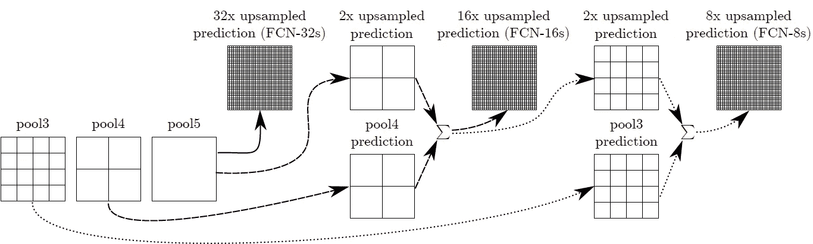

**Fusing for FCN-16s and FCN-8s**

**FCN-16s**:pool 5 的输出经过 2 倍上采样，与 pool4 融合，进行 16 倍上采样。与上图中 **FCN-8s** 类似的操作。

**Comparison with different FCNs**

**由于丢失了位置信息，FCN-32s 的结果非常粗略**，而 FCN-8s 的结果最好。

这种融合操作实际上就像 AlexNet、VGGNet 和 GoogLeNet 中使用的 boosting / ensemble 技术一样，他们通过多个模型添加结果，使预测更加准确。但在这种情况下，它是针对每个像素完成的，并且它们是从模型内不同层的结果添加的。

# 4.结果

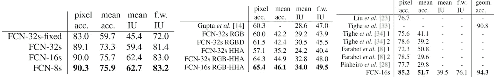

**Pascal VOC 2011 dataset** (Left), **NYUDv2 Dataset (Middle), SIFT Flow Dataset (Right)**

*   FCN-8s 是 2011 年帕斯卡 VOC 的最佳产品。
*   FCN-16s 是 NYUDv2 中最好的。
*   FCN-16s 是最好的筛流。

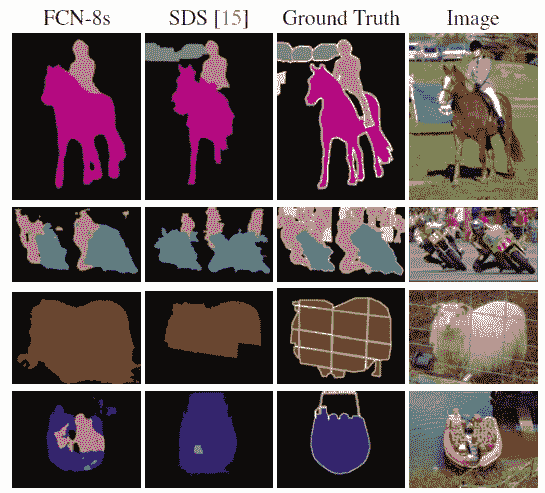

**Visualized Results Compared with [Ref 15]**

第四行显示了一个失败案例:网络将船上的救生衣视为人。

希望以后能多复习一下语义切分的深度学习技术。

# 参考

1.  【2015 CVPR】【FCN】
    [用于语义分割的全卷积网络](https://people.eecs.berkeley.edu/~jonlong/long_shelhamer_fcn.pdf)
2.  【2017 TPAMI】【FCN】
    [用于语义分割的全卷积网络](https://ieeexplore.ieee.org/document/7478072)