# 复习:FSRCNN(超分辨率)

> 原文：<https://towardsdatascience.com/review-fsrcnn-super-resolution-80ca2ee14da4?source=collection_archive---------1----------------------->

CUHK 的《他的时代》、 **FSRCNN** 被评论。本文提出了一种**实时超分辨率方法**。**快速超分辨率卷积神经网络(FSRCNN)** 在我写这个故事的时候，已经在 **2016 ECCV** 发表了近 **300 次引用**。( [Sik-Ho Tsang](https://medium.com/u/aff72a0c1243?source=post_page-----80ca2ee14da4--------------------------------) @中)

FSRCNN 具有相对较浅的网络，这使得我们更容易了解每个组件的效果。如下图所示，它比以前的 SRCNN 速度更快，重建图像质量更好。

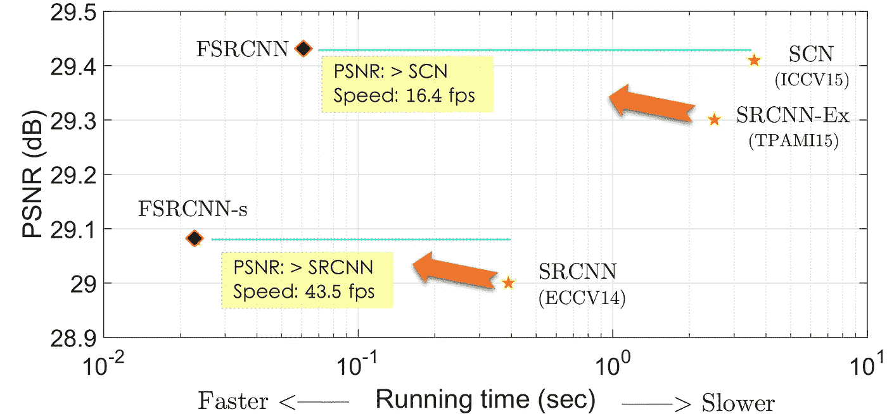

**From SRCNN to FSRCNN**

通过比较 SRCNN 和 FSRCNN-s，fsr CNN-s(fsr CNN 的小模型尺寸版本)具有更好的 PSNR(图像质量)和更短的运行时间，其中获得了 43.5 fps。

通过比较 SRCNN-Ex(一种更好的 SRCNN)和 FSRCNN，FSRCNN 具有更好的 PSNR(图像质量)和更短的运行时间，其中获得了 16.4 fps。

那么，让我们看看它是如何实现这一点的。

# 涵盖哪些内容

1.  **简要回顾 SRCNN**
2.  **FSRCNN 网络架构**
3.  **1×1 卷积用于缩小和扩展的说明**
4.  **非线性映射中多重 3×3 卷积的解释**
5.  **消融研究**
6.  **结果**

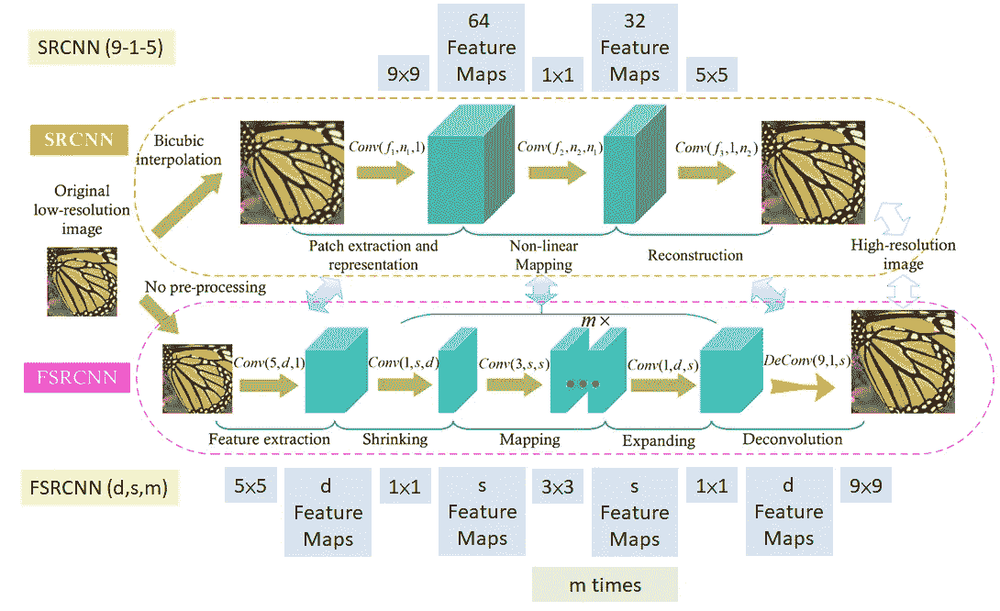

**Network Architecture: SRCNN (Top) and FSRCNN (Bottom)**

上图显示了 SRCNN 和 f SRCNN 的网络架构。图中， **Conv(f，n，c)** 表示 **n 个滤波器**和 **c 个输入通道数**与 **f×f 滤波器大小**的卷积。

# **1。简要回顾 SRCNN**

在 SRCNN 中，步骤如下:

1.  首先进行双三次插值，以向上采样到所需的分辨率。
2.  然后进行 9×9，1×1，5×5 卷积以提高图像质量。对于 1×1 conv，其被声称用于低分辨率(LR)图像向量和高分辨率(HR)图像向量的非线性映射。

计算复杂度为:

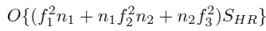

其中它与 HR 图像的尺寸 SHR 成线性比例。**HR 图像越大，复杂度越高。**

# 2. **FSRCNN 网络架构**

在 FSRCNN 中，涉及如图所示的具有更多卷积的 5 个主要步骤:

1.  **特征提取**:将之前 SRCNN 中的双三次插值替换为 5×5 conv。
2.  **收缩** : 1×1 conv，将特征图的数量从 d 减少到 s，其中 s<d
3.  **非线性映射**:用多个 3×3 层代替单个宽层
4.  **扩展** : 1×1 conv，将特征地图的数量从 s 增加到 d
5.  **反卷积** : 9×9 滤波器用于重建 HR 图像。

上面的整体结构称为 FSRCNN(d，s，m)。计算复杂度是:

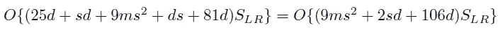

其中它与 LR 图像的大小 SLR 成线性比例，SLR 远低于 SRCNN。

**PReLU 用作激活功能**。PReLU 是有参数泄漏 ReLU 的，号称比 ReLU 好。([如果感兴趣，也请阅读我的 PReLU 评论。](https://medium.com/coinmonks/review-prelu-net-the-first-to-surpass-human-level-performance-in-ilsvrc-2015-image-f619dddd5617))

成本函数就是标准均方差(MSE):

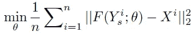

# 3.1×1 卷积在伸缩中的应用

假设我们需要执行 5×5 卷积**而不使用 1×1 卷积**，如下所示:

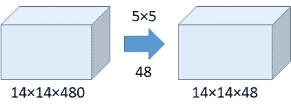

**Without the Use of 1×1 Convolution**

**运算次数=(14×14×48)×(5×5×480)= 112.9 米**

**使用 1×1 卷积:**

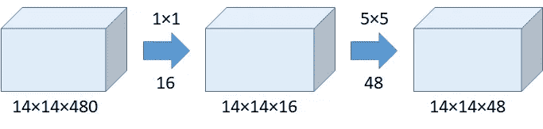

**With the Use of 1×1 Convolution**

**1×1 的运算次数=(14×14×16)×(1×1×480)= 1.5M
5×5 的运算次数=(14×14×48)×(5×5×16)= 3.8M**
**总运算次数= 1.5M + 3.8M = 5.3M
比 112.9M 小很多！！！！！！！！！！！！！！！**

**网络中的网络(NIN)建议 1×1 conv 引入更多非线性并提高性能** **而 GoogLeNet 建议 1×1 conv 有助于在保持性能的同时减小模型尺寸。如果有兴趣，请阅读我的 GoogLeNet 评论。)**

因此，在两个卷积之间使用 1×1 来减少连接(参数)的数量。通过减少参数，我们只需要更少的乘法和加法运算，最终加快网络速度。这就是为什么 FSRCNN 比 SRCNN 快。

# **4。非线性映射中多重 3×3 卷积的解释**

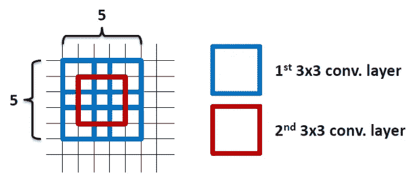

**2 layers of 3×3 filters already covered the 5×5 area**

**通过使用 2 层 3×3 的滤波器，实际上已经覆盖了 5×5 的区域，并且参数数量更少**，如上图所示。

通过使用 **1 层 5×5 滤波器**，参数数量= 5 **×5=25** 通过使用 **2 层 3×3 滤波器**，参数数量= **3×3+3×3=18
参数数量减少 28%**

需要学习的参数越少**，越有利于**更快的收敛**，**减少过拟合问题**。**

这个问题已经在 VGGNet 中解决了。([如果有兴趣，请阅读我的 VGGNet 评论。](https://medium.com/coinmonks/paper-review-of-vggnet-1st-runner-up-of-ilsvlc-2014-image-classification-d02355543a11))

# **5。消融研究**

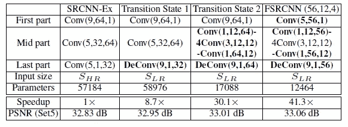

**Ablation Study of Each Step**

*   **Sr CNN-Ex**:Sr CNN 的更好版本，参数**57184**。
*   **过渡状态 1** :使用 Deconv，参数 **58976，**获得更高的 PSNR。
*   **过渡状态 2** :中间使用更多的 convs，参数 **17088，**获得更高的 PSNR。
*   **FSRCNN (56，12，4)** :更小的滤波器尺寸和更少的滤波器数目，用 **12464 个参数，**获得更高的 PSNR。这种改进是由于需要训练的参数更少，更容易收敛。

这表明每个组成部分都有贡献。

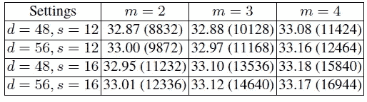

**Study of m, s, d**

m 越高(m=4)，PSNR 越高。

当 m=4，d=56，s=12 时，它在 HR 图像质量(33.16dB)和模型复杂度(12464 个参数)之间具有较好的折衷。

最后我们得到了 **FSRCNN: FSRCNN (56，12，4)。**
还有一个更小的版本， **FSRCNN-s: FSRCNN (32，5，1)** 。

# 6.**结果**

*   使用 91-影像数据集在放大因子 3 下从头训练网络，然后仅通过在放大因子 2 和 4 下添加 General-100 数据集来微调反卷积图层。
*   缩放数据:0.9，0.8，0.7，0.6，旋转 90，180，270 度。

**All trained on 91-image dataset.**

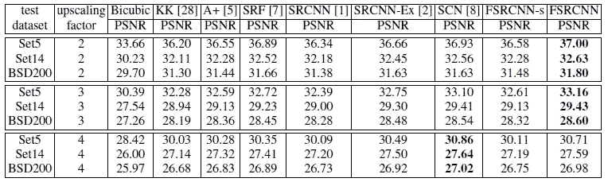

**FSRCNN and FSRCNN-s are trained on 91-image and general-100 dataset.**

从上面的结果来看，FSRCNN 和 FSRCNN-s 对于放大因子 2 和 3 工作良好。但是对于放大因子 4，FSRCNN 和 FSRCNN-s 比 SCN 稍差。

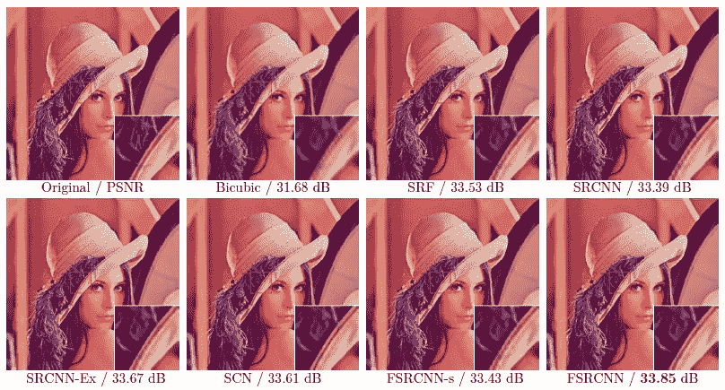

**Lenna image with upscaling factor 3**

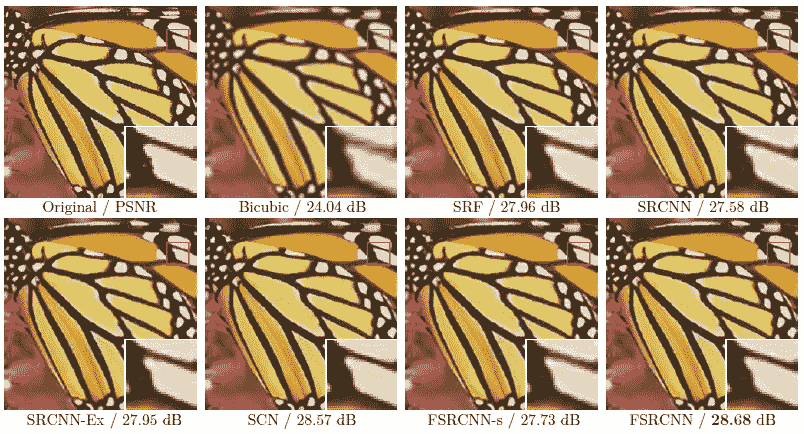

**Butterfly image with upscaling factor 3**

从上面的图中，我们可以看到 FSRCNN 有更清晰的图像。

在本文中，使用这样的浅层网络，我们可以了解每个组件或技术的效果，例如 1×1 卷积和多个 3×3 卷积。

# 参考

1.  【2016 ECCV】【fsr CNN】
    [加速超分辨率卷积神经网络](https://arxiv.org/abs/1608.00367)

# 我的评论

[ ] [ ] [ ] [ ] [ ] [ ] [ ] [ ] [ ] [ ] [ ] [ ] [ ] [ ] [ ] [ ]