# 回顾:Inception-v4——从 GoogLeNet 发展而来，与 ResNet Idea(图像分类)合并

> 原文：<https://towardsdatascience.com/review-inception-v4-evolved-from-googlenet-merged-with-resnet-idea-image-classification-5e8c339d18bc?source=collection_archive---------5----------------------->

在这个故事中，谷歌的**Inception-v4【1】被评论。从 GoogLeNet / Inception-v1 演化而来的 Inception-v4，比 Inception-v3 有一个**更统一的简化架构和更多的 Inception 模块。****

从下图中，我们可以看到从 v1 到 v4 的 **top-1 精度。而且 **Inception-v4 比 ResNet** 好。**

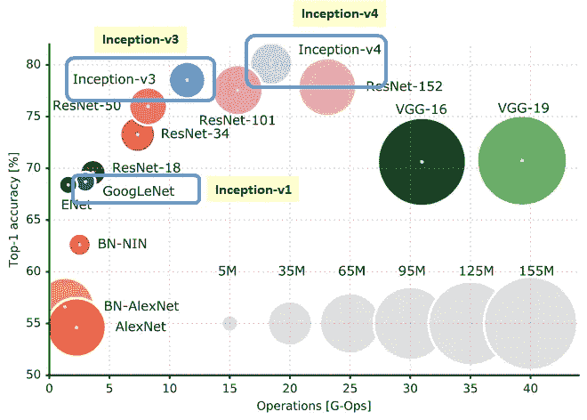

**Top-1 Accuracy against Number of Operations (Size is the number of parameters)**

**有剩余连接的初始网络，**微软 ResNet 提出的一个想法，**优于同样昂贵的没有剩余连接的初始网络。**

**利用 1 个初始 v4 和 3 个残差网络的集成，在 ILSVRC 分类任务中可以实现 3.08%的误差**。这是一篇 **2017 AAAI** 的论文，在我写这篇文章的时候有超过 **1000 次引用**。([曾植和](https://medium.com/u/aff72a0c1243?source=post_page-----5e8c339d18bc--------------------------------) @中)

# 涵盖哪些内容

1.  **从 Inception-v1 到 Inception-v3 的简要概述**
2.  **盗梦空间-v4**
3.  **盗梦空间-ResNet-v1**
4.  **盗梦空间-ResNet-v2**
5.  **与最先进方法的比较**

# 1.从初始版本 1 到初始版本 3 的简要概述

在开始谈论 Inception-v4 之前，让我们先回顾一下从 v1 到 v3。

## 1.1.Inception-v1/Google net[2]:Inception 模块

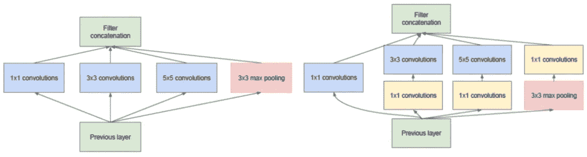

**Inception Module (Left), Inception Module with Dimensionality Reduction (Right)**

**Overall Architecture**

**Inception 模块**在 Inception-v1 / GoogLeNet 中首次引入。**输入同时通过 1×1、3×3 和 5×5 conv 以及最大池**并连接在一起作为输出。因此，我们不需要考虑每一层应该使用哪种过滤器尺寸。

([我对《盗梦空间》的详细回顾-v1 / GoogLeNet](https://medium.com/coinmonks/paper-review-of-googlenet-inception-v1-winner-of-ilsvlc-2014-image-classification-c2b3565a64e7) )

## 1.2.Inception-v2 / BN-Inception [3]:批量规范化

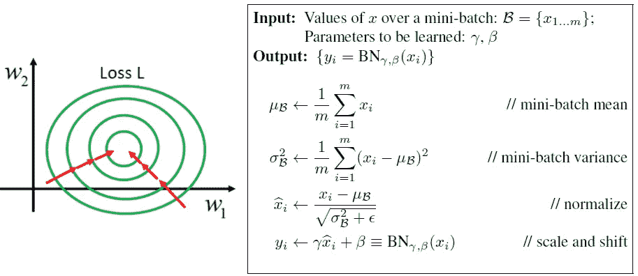

**Batch Normalization (BN)**

**批量规范化(BN)** 在 Inception-v2 / BN-Inception 中引入。ReLU 被用作激活函数来解决饱和问题和由此产生的消失梯度。但是这也使得输出更加不规则。随着时间的推移，X 的分布保持固定是有利的，因为当网络变得更深时，小的变化将被放大。可以使用更高的学习率。

此外， **5×5 conv 被两个 3×3 conv**取代，用于在保持感受野大小的同时降低参数。

([我对 Inception-v2 / BN-Inception 的详细回顾](https://medium.com/@sh.tsang/review-batch-normalization-inception-v2-bn-inception-the-2nd-to-surpass-human-level-18e2d0f56651))

## **1.3。Inception-v3 [4]:因式分解**

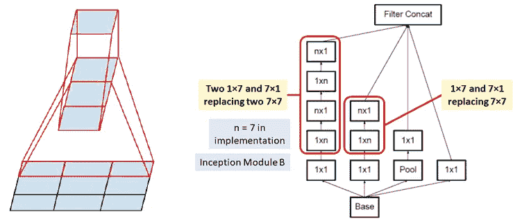

**3×3 conv becomes 1×3 and 3×1 convs (Left), 7×7 conv becomes 1×7 and 7×1 convs (Right)**

**如上图卷积层引入因子分解**进一步降维，减少过拟合问题。例如:

通过使用 **3×3 滤波器**，参数数量= **3×3=9** 通过使用 **3×1 和 1×3 滤波器**，参数数量= **3×1+1×3=6
参数数量减少 33%**

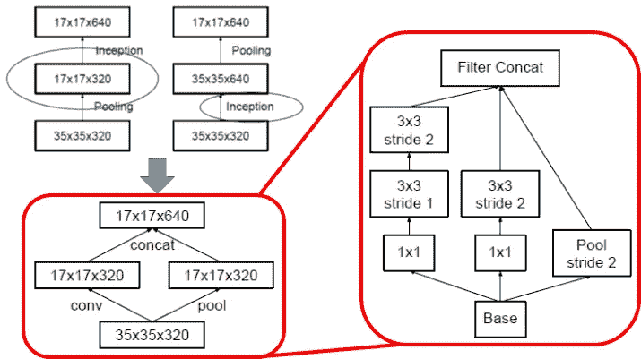

**Conventional downsizing (Top Left), Efficient Grid Size Reduction (Bottom Left), Detailed Architecture of Efficient Grid Size Reduction (Right)**

并且还引入了高效的**网格尺寸缩减模块**，其**更便宜并且仍然是高效的网络**。通过有效的网格尺寸缩减，例如图中所示， **320 个特征图**由 **conv 以步长 2** 完成。**通过**最大汇集**得到 320 张特征地图**。并且这 2 组特征图被**连接成 640 个特征图**并且进入下一级的初始模块。

([我对 Inception-v3 的详细回顾](https://medium.com/@sh.tsang/review-inception-v3-1st-runner-up-image-classification-in-ilsvrc-2015-17915421f77c))

# 2.盗梦空间-第 4 版

比 inception-v3 更统一的简化架构和更多的 Inception 模块，介绍如下:

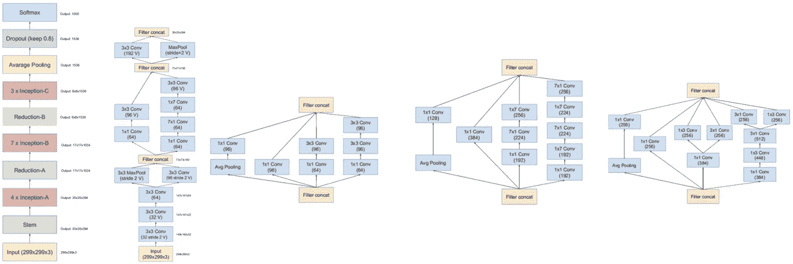

**Inception-v4: Whole Network Schema (Leftmost), Stem (2nd Left), Inception-A (Middle), Inception-B (2nd Right), Inception-C (Rightmost)**

这是一个没有任何剩余连接的**纯初始变体**。它可以在不分割副本的情况下进行训练，使用**内存优化来反向传播**。

我们可以看到**使用了从 Inception-v1 到 Inception-v3 的技术**。(也使用了批量标准化，但未在图中显示。)

# **3。盗梦空间-ResNet-v1**

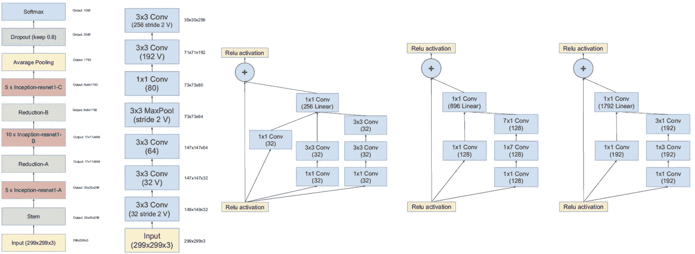

**Inception-ResNet-v1: Whole Network Schema (Leftmost), Stem (2nd Left), Inception-A (Middle), Inception-B (2nd Right), Inception-C (Rightmost)**

通过使用上述版本的 Inception-A、Inception-B 和 Inception-C，我们可以拥有 Inception-ResNet-v1。我们可以看到每个模块的左侧都有一个**快捷连接。这种快捷的连接已经被一种证明，它可以帮助在 ResNet [5]中走得更深。**

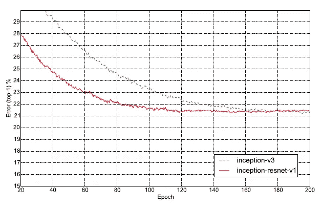

**Inception-Resnet-v1 and Inception-v3**

它的**大约相当于《盗梦空间-v3》的计算成本。Inception-Resnet-v1 的训练速度要快得多**，但最终精度比 Inception-v3 稍差。

然而，加在一起后使用的 ReLU 使得 Inception network 无法进一步深入。**在论文中，作者还提到，如果过滤器的数量超过 1000，残差变体开始表现出不稳定性，并且网络在训练期间早期就“死亡”。**

**为了稳定训练**，在将残差添加到先前的层激活之前缩小残差。一般来说，**在添加**到累积层激活之前，在 0.1 和 0.3 之间选择一些缩放因子来缩放残差

**(也许，如果 ReLU 被用作预激活单元，就像在使用身份映射的改进 ResNet 中提到的[6]，它可能会更深入。)**(如有兴趣，请访问[我对预激活 ResNet 的评论。](/resnet-with-identity-mapping-over-1000-layers-reached-image-classification-bb50a42af03e))

# 4.盗梦空间-ResNet-v2

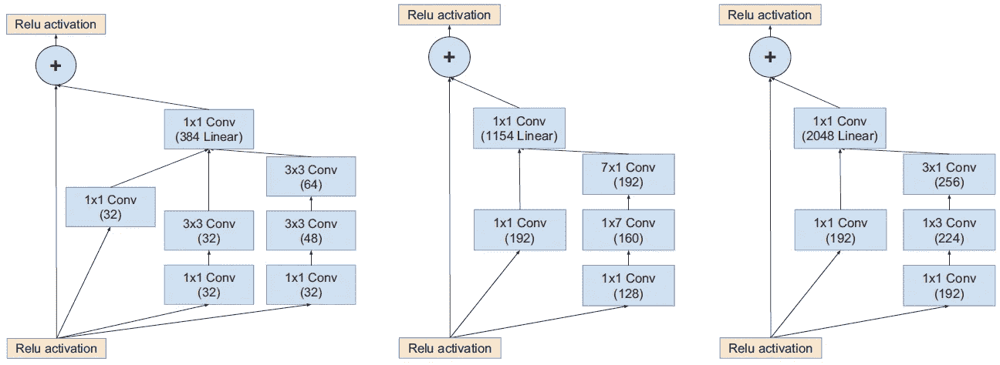

**Inception-ResNet-v2: Inception-A (Leftmost), Inception-B (Middle), Inception-C (Rightmost)**

有了**全网模式使用 Inception-ResNet-v1 中的那个，Stem 使用 Inception-v4** 中的那个，以及以上版本的 Inception-A、Inception-B、Inception-C，我们就可以有 Inception-ResNet-v2 了。同样，在每个模块的左侧有一个**快捷连接。**

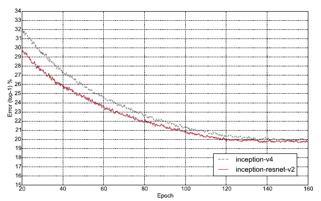

**Inception-Resnet-v2 and Inception-v4**

它的计算成本大约相当于《盗梦空间 4》的计算成本。与 Inception-v4 相比，Inception-ResNet-v2 的训练速度要快得多，并且达到了略好的最终精度。

然而，同样地，如果 ReLU 被用作预激活单位，它可能会更深入。(如果感兴趣，请访问[我对改进的 ResNet 的评论。](/resnet-with-identity-mapping-over-1000-layers-reached-image-classification-bb50a42af03e))

# 5.**与最先进方法的比较**

**多裁剪:**是将输入图像裁剪成多个子图像，输入网络进行分类，以提高精度。从 AlexNet，VGGNet 等开始使用。

具体来说，AlexNet 使用了 10 种作物，GoogLeNet 使用了 144 种作物。

**多模型**:就是将多个训练好的模型集成在一起，得到更准确的预测，就像 boosting 一样。从 LeNet，AlexNet 等开始使用。

(如果有兴趣，请访问我的 [AlexNet](https://medium.com/coinmonks/paper-review-of-alexnet-caffenet-winner-in-ilsvrc-2012-image-classification-b93598314160) 和 [GoogLeNet](https://medium.com/coinmonks/paper-review-of-googlenet-inception-v1-winner-of-ilsvlc-2014-image-classification-c2b3565a64e7) 评论。)

**Single-Crop Single-Model Results**

在**单作物单模型的情况下，Inception-v4 和 Inception-ResNet-v2 的性能最好**，结果相似。

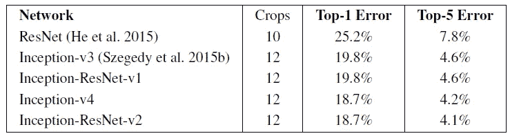

**10/12-Crop Single-Model Results**

使用 **10/12-Crop 单模型，Inception-v4 和 Inception-ResNet-v2 同样具有最佳性能**，结果相似。

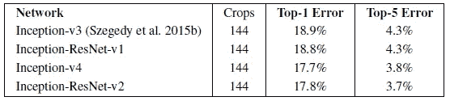

**144-Crop Single-Model Results**

使用 **144-Crop 单模型，Inception-v4 和 Inception-ResNet-v2 同样具有最佳性能**，结果相似。

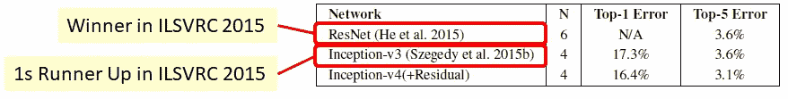

**144-Crop N-Model Results**

用 **144-Crop N-Model，Inception-v4(+Residual)，即 1 个纯 Inception-v4 和 3 个 Inception-ResNet-v2 模型(N=4)，性能最好。**

**获得 3.1%的前 5 名错误率**。与 ResNet (3.57%的错误率，2015 年 ILSVRC 的冠军)**和 Inception-v3** (3.58%的错误率，2015 年 ILSVRC 的亚军)相比，这已经是一个**很大的相对进步。**

# 参考

1.  【2017 AAAI】【Inception-v4】
    [Inception-v4、Inception-ResNet 以及剩余连接对学习的影响](https://www.aaai.org/ocs/index.php/AAAI/AAAI17/paper/download/14806/14311)
2.  【2015 CVPR】【谷歌网/盗梦空间-v1】
    [随着回旋越走越深](https://www.cs.unc.edu/~wliu/papers/GoogLeNet.pdf)
3.  【2015 ICML】【BN-Inception/Inception-v2】
    [批量归一化:通过减少内部协变量移位加速深度网络训练](http://proceedings.mlr.press/v37/ioffe15.pdf)
4.  【2016 CVPR】【盗梦空间-v3】
    [重新思考计算机视觉的盗梦空间架构](https://www.cv-foundation.org/openaccess/content_cvpr_2016/papers/Szegedy_Rethinking_the_Inception_CVPR_2016_paper.pdf)
5.  【2016 CVPR】【ResNet】
    [用于图像识别的深度残差学习](https://www.cv-foundation.org/openaccess/content_cvpr_2016/papers/He_Deep_Residual_Learning_CVPR_2016_paper.pdf)
6.  【2016 ECCV】【带有身份映射的 ResNet】
    [深度剩余网络中的身份映射](https://arxiv.org/abs/1603.05027)

# 我的评论

1.  [回顾:Inception-v3–ILSVRC 2015 亚军(图像分类)](https://medium.com/@sh.tsang/review-inception-v3-1st-runner-up-image-classification-in-ilsvrc-2015-17915421f77c)
2.  [回顾:批量归一化(Inception-v2/BN-Inception)——ILSVRC 2015 中第二个超越人类水平的性能(图像分类)](https://medium.com/@sh.tsang/review-batch-normalization-inception-v2-bn-inception-the-2nd-to-surpass-human-level-18e2d0f56651)
3.  [回顾:Google net(Inception v1)——ILSVRC 2014(图像分类)获奖者](https://medium.com/coinmonks/paper-review-of-googlenet-inception-v1-winner-of-ilsvlc-2014-image-classification-c2b3565a64e7)
4.  [回顾:ResNet—ils vrc 2015(图像分类、定位、检测)获奖者](/review-resnet-winner-of-ilsvrc-2015-image-classification-localization-detection-e39402bfa5d8)
5.  [回顾:带有身份映射的 ResNet 已达到 1000 多个图层(图像分类)](/resnet-with-identity-mapping-over-1000-layers-reached-image-classification-bb50a42af03e)