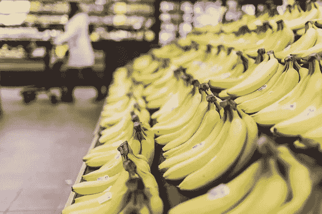
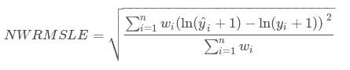
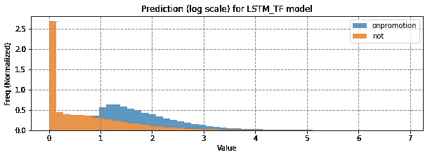
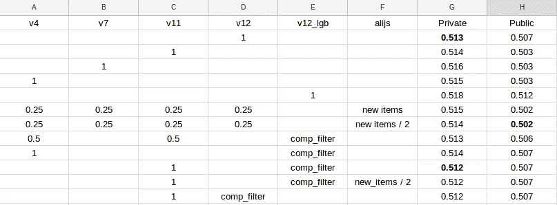
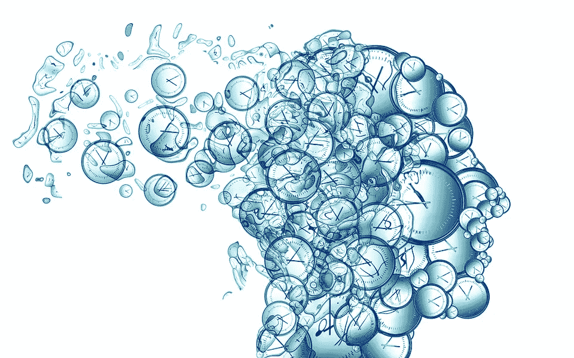

# [点评] Kaggle Corporación Favorita 杂货销售预测—第 1 部分

> 原文：<https://towardsdatascience.com/review-kaggle-corporaci%C3%B3n-favorita-grocery-sales-forecasting-part-i-9330b7350713?source=collection_archive---------4----------------------->

## 回顾和事后分析

[Source](https://pixabay.com/en/bananas-fruits-food-grocery-store-698608/)

 [## Favorita 杂货销售预测公司

### 你能准确预测一家大型食品连锁店的销售额吗？

www.kaggle.com](https://www.kaggle.com/c/favorita-grocery-sales-forecasting) 

## 动机和反思

自从去年 7 月将我的设备从 GTX960 4GB 升级到 GTX1070 (8GB)以来，我一直热衷于提高我的一般深度学习技能集。我在之前的两次 Kaggle 比赛中使用了 PyTorch， [Instacart 购物篮分析](https://www.kaggle.com/c/instacart-market-basket-analysis)和 [Web 流量时间序列预测](https://www.kaggle.com/c/web-traffic-time-series-forecasting#timeline)。我参加 Instacart 比赛的 DNN 模型注定要失败，因为我没有掌握如何加载大于内存大小(16GB)的数据集，而 DNN 模型拥有足够的训练数据真的很重要。不过，网络流量预测比赛更有趣。第一个位置的解决方案与我的想法非常相似。然而，我没能按时完成我的模型，最终提交的作品有严重的缺陷。我很幸运它仍然进入了前 50 名。当 Corporación Favorita 竞赛开始时，我发现数据集的大小对于 DNN 来说已经足够大了，并且很快就开始将它视为一个机会来完成我在网络流量预测竞赛中开始的工作。

 [## Web 流量时间序列预测

### 预测维基百科页面的未来流量

www.kaggle.com](https://www.kaggle.com/c/web-traffic-time-series-forecasting#timeline) 

尽管由于一次糟糕的押注，最终排名(相对)令人失望(第 20 名)，但我仍然对结果感到相当满意。如果去掉不好的赌注，我的 DNN 模特会从纯银上升到第 2-5 名，这取决于我如何选择最后的组合。虽然如果我把更多的时间放在改进 GBM 模型上，我的排名可能会更好，但我已经达到了我报名参加的目的(建立我心目中的网络流量竞赛，甚至更多)。

这也是我第一次以团队形式参赛(*我曾和我的学员一起工作过一次，但我没能给他腾出空间*)。我们进行了许多发人深省的讨论，总的来说这是一次非常好的经历。我真的认为我们作为一个团队会取得非常好的成绩。我还没有机会重新运行我的队友的模型，去掉了不好的赌注，但根据过去的经验，他的模型应该能够推动我们进入前 3 名(我的 GBM 模型真的很烂)。

抱歉，我的介绍太长了…当谈到我喜欢的东西时，我有喋喋不休的问题。在这个*第一部分*中，我计划给出一个问题的概述，并在比赛结束前用我训练过的模型做一个事后分析。在下一篇文章中，我将展示一个我认为最理想的场景，但是没有足够的时间将它加入到最终提交的作品中，因为直到比赛的最后一周，我才看到这个场景。

## 问题描述

比赛的挑战是预测 2017/08/16 至 2017/08/31 期间每家商店每天每件商品的单位销售额。在厄瓜多尔 16 个州的 22 个不同城市有 54 家商店。有来自 33 个家族和 337 个班级的 4400 个独特的项目。评价指标为*归一化加权均方根对数误差(NWRMSLE)* :

决定评估标准实际上是真实场景中最重要的部分。你需要确保它符合你的业务目标。不幸的是，Kaggle 通常不会分享太多关于如何做出决定的信息，可能是因为涉及到商业秘密。这确实是一个非常复杂的问题，需要做出许多权衡，我们可以就此写一篇完整的独立文章。关于这个指标是否合适，本次比赛的讨论论坛有许多很好的见解。有兴趣就去那里。

## 这个数据集的问题

有两个主要问题:

1.  **没有库存信息**。数据可能是从只记录实际销售额的 POS 系统中收集的。我们不知道某个商店某件商品零销售的原因是因为缺货还是商店一开始就不打算出售该商品。因此，我们被要求预测测试期间每种可能的(商店、商品、日期)组合的单位销售额，甚至不知道某个商品是否在展示。更糟糕的是，这 60 件全新的商品在火车时期从未在任何商店出售过。我们不知道新的商品是一次在所有商店推出，还是有更复杂的策略。基本上，它诱使人们去调查公共排行榜，并面临严重的过度拟合风险。
2.  **零销售额**的(商店、商品、日期)组合缺少*促销*信息。这确实是一个可以解决的问题，我不明白为什么没有解决。我们在测试阶段有完整的*推广*信息，为什么不在培训阶段也提供呢？即使培训期间的 *onpromotion* 信息丢失，如果他们在测试期间将所有 *onpromotion* 设置为零(虽然不现实，但在数据科学中使验证集尽可能接近测试集是非常重要的)，或者干脆不提供 *onpromotion* ，这仍然会更加公平。如果我是 Corporación Favorita 的数据科学家，我会坚持推迟建模，等待更多数据的到来，直到我们至少可以创建一个包含完整 *onpromotion* 信息*的验证集。*

当然，该数据集的其他方面也可以改进，例如提供促销的类型和力度、商店中商品的货架位置，但它们大多是锦上添花。上述两个问题实际上阻碍了该数据集的实际应用。

## 错误的赌注(哪里出错了)

正如我们在比赛结束后了解到的那样，很多人试图恢复宣传信息。我的队友也想出了一个聪明的方法来恢复信息，基于对商店经常对某些商品有非常相似的促销时间表的理解。因此，他开发了一种算法，如果我们忽略促销未知*的条目，找到(1)总是或(2)大部分具有相同促销时间表的商店和*日期*的子组，并根据该模式猜测未知。它不涉及任何排行榜调查，但除了使用公共排行榜，没有其他方法来验证其效果。*

我感到不舒服的是，预测的分布从原始模型变化到用来自模式(1)和(2)的恢复的 *onpromotion* 训练的模型是如此的戏剧性，所以我决定为 2017 年和 2016 年的数据训练仅来自模式(1)的恢复的 *onpromotion* 的模型。我保留了 2015 年和 2014 年的数据，因为它们在*促销*中包含了更多的 NA。而且我把用恢复的 *onpromotion* 训练的模型和用全未知的 *onpromotion* 训练的用 0 (50/50 的比例)混合。(这就是为什么我在比赛结束后很快就发现了问题所在。我只是去掉了整体中有问题的 50%,瞧，个人得分提高了。)

An example distribution of predicted unit_sales

这个最终的 50/50 设置给了我 0.001~0.002 的公开分数提升，但 0.002+的私下分数下降。我的队友全押了，看起来跌幅更大。这就是使用公开分数进行验证的危险。我们对这个高风险的赌注感到放心，但没有做足够的对冲。甚至 50/50 的比例也是以完全任意和主观的方式设定的，因为除了公开的分数之外，我们没有办法验证它。

我们还利用所有空闲的提交时间来探索排行榜上的新项目。我们想从公开得分中了解哪些商店在接下来的 5 天里有这些新商品的非零销售额(公开拆分)。我的队友建立了预测这些新项目的模型。不幸的是，最终我们最好预测所有新项目都为零。我不确定移除已恢复的 *onpromotion* 是否有帮助，但无论如何，分数差异小于 0.001。

## 数据集公式

从 2014 年到 2017 年的数据用于训练我的模型。我只包括了每年选定的月份，这样我可以避免对 2016 年地震的影响建模，也避免太多的磁盘序列化。如果我的电脑有 32gb 以上的内存，我会使用更多的数据。

我在这次比赛中主要使用了三个不同的验证阶段:

1.  *2017/07/26–2017/08/10*:这个应该是最准确的。所有的训练数据都是在这些日期之前收集的，就像测试周期一样。当验证期和测试期非常接近时(假设年度模式不是很强)，序列的内部动态应该更相似。我大量使用这个验证阶段来调整超参数和集合权重。在我发布的公共内核中，训练和验证数据之间有一点重叠。消除这种重叠似乎使其更加稳健。
2.  2016/08/17–2016/09/01:这与 2016 年的考期大致相同(工作日分布相同)。这是为了近似盲训练，所以我可以在训练中使用 2017/07/26–2017/08/10。我使用 [ReduceLROnPlateau](http://pytorch.org/docs/master/_modules/torch/optim/lr_scheduler.html#ReduceLROnPlateau) 来安排学习速度，所以验证集是必不可少的。当然，我可以找到一个预定义的学习时间表，并进行实际的盲人训练，但我发现这太费时间了。
3.  2016/09/07–2016/09/22:和第二个原因一样，但是有了这个我就不用把 2016 年的同期考期扔掉了。我发现这个不够稳定，在比赛中就停止使用了。

对于所有的 DNN 模型，我使用(1) *过去的 56 天* (2) *大致相同的前一年的 56 天*和(3) *前一年的 56 天之后的 16 天*来预测接下来的 16 天。为了节省时间，我使用了各种过滤器来减小数据集的大小:

1.  保持(商店、物品)在过去 14 天内的销售额，或在与上一年测试期大致相同的 16 天内有销售额。
2.  保持(商店，项目)在过去 28 天内的销售额。
3.  保持(商店，项目)在过去 56 天内的销售额。

我预测所有丢弃的(商店，商品)组合为零。我曾计划探索移除这些过滤器，但一直推迟。我的队友在比赛的最后一周提醒了我这一点，我检查了验证预测，看看这些模型是否能比预测那些最近没有销售的(商店，商品)的零做得更好。**模特们实际上表现明显更好**！我本打算把这些简单的分数收益留在桌面上！

当时我没有太多时间，所以我很快使用 2017/07/26 验证训练了一组模型，并移除了过滤器，还使用 2016/09/07 和 56 天过滤器选取了之前训练的模型，因为这是当时唯一使用 56 天过滤器训练的设置。被一些模型丢弃的(商店、物品)将仅由在最终集合中没有被丢弃的模型来预测。这解释了我们将在下一节看到的奇怪的模型设置。

## 最终模型设置

我不会进入模型的细节。它们将在后面的部分中介绍。我在最后的合奏中使用了 4 个版本的设置:

1.  v4: 2017/07/26 + (14 天非零|去年非零)
2.  v7: 2016/09/06 + 56 天非零值
3.  v11: 2016/08/17 + 28 天非零
4.  版本 12: 2017/07/26(无过滤器)

DNN 模型和 GBM 模型使用 13:3 的重量比在对数尺度上平均。(从交叉验证中获得的比率。)

## 如果…会怎样

以下是我的组合在没有恢复的*宣传*的情况下的表现:

[Google Spreadsheet Link](https://docs.google.com/spreadsheets/d/1lUdflmNPLa5tXTXKTzT7RCtRJ5_sUwzizU9Jm-I9gvs/edit?usp=sharing)

`comp_filter`表示该设置的预测仅用于那些被所有其他设置丢弃的(商店、商品)组合。请注意，所有模型都是在比赛结束前训练的，内部集合权重保持不变，除了使用恢复的 *onpromotion* 训练的所有模型的权重(它们被设置为零)。我只是改变了不同场景的模型混合在一起的方式。

一些分析:

1.  如上所述，对新项目的预测不起作用。
2.  单独 v12 设置的车型可以达到 0.513 的私分。然而，我认为我没有必要用 v12 设置训练 DNN 模型，因为预测所有零序列的销售不是序列模型的强项。在这种情况下，表格特性应该工作得很好。所以我从 v12 中提取了 LGBM 模型，并用它们来补偿滤波器。
3.  对于 14、28 和 56 个连续的零，预测零在公开拆分中比在私有拆分中效果更好。但是我已经从交叉验证中知道了，所以这对我来说并不奇怪。注意 v11 车型是如何从 *(0.514 私，0.503 公)*到 *(0.512 私，0.507 公)*28 天滤镜被 v12_lgb 车型补偿的。这说明了为什么**我们不能相信分时比赛中的公共排行榜**。
4.  在意识到我应该抛弃非零过滤器之前，我正计划提交 v4 和 v11 合奏。我选择了 v7，因为我只有时间重新训练一个验证设置，当我担心时，v7 在我面前爆炸了。幸运的是，我们有一个 v7 车型的较低重量的最终提交，否则我们会比第 20 名更糟。坚持使用 v4 和 v11 就可以了。

## 理想的环境

如果我有时间，我会使用这些理想的设置:

1.  *v12_lgb* : 2017/07/26。仅用于预测在过去 56 天内没有任何销售的(商店，商品)。
2.  *v13* : 2017/07/26 + 56 天滤镜。用于超参数调谐。
3.  *v14* : 2016/08/17+ 56 天滤镜。我预计它会比 v13 做得好一点。

我们可以通过取出 *v13* 和 *v14* 中的 56 天过滤器来移除 *v12_lgb* 。它实际上可能会做得更好一点。但是我认为不值得增加训练时间。

我正在根据这些设置训练一些模型，我们将在下一篇文章中看到它们的表现。

[Source](https://pixabay.com/en/time-clock-head-face-view-outlook-3098699/)

## 分时竞赛中的一个大问题

值得一提的是，私人排行榜中的分数分布比我预想的还要密集。我预计会有更多的变化，因为在以后的日子里不确定性会更高。一个可能的解释是，我们在后来的日子里都没有很好地预测销售，所以我们最终的结果是一样的。

这就是这种分时段比赛的问题。在现实世界中，我们可能更关心前 5 天的预测，而不是后 11 天的预测，因为我们可以在 5 天后再次调整我们的预测。这个竞争是如何设置的意味着我们只关心后面的 11 天，这只有在销售数据需要 5 天才能使用的情况下才是合理的。我认为更好的方法是像[网络流量时间序列预测](https://www.kaggle.com/c/web-traffic-time-series-forecasting)和 [Zillow 的家庭价值预测](https://www.kaggle.com/c/zillow-prize-1)这样的两阶段设置。发布一个专用于私人排行榜的训练数据集。

## 未完待续…

这个第一部分没有涵盖大多数人关心的内容——模型结构、特征、超参数、集成技术等。相反，它侧重于我发现在数据科学过程中更重要的东西——分析和制定数据集，并描述了导致我最终到达那里的我的思维过程。

事实上，你可以用 LGBM 型号通过一些功能工程达到[第一的位置。如果你只是想看一个顶级解决方案，你可以看看内核。就我个人而言，我对一个可以在以后的项目中使用并且几乎不需要特性工程的工作 DNN 框架感到满意，尽管它可能会被精心制作的 GBM 模型超越。](https://www.kaggle.com/shixw125/1st-place-lgb-model-public-0-506-private-0-511)

我将分享用理想设置训练的模型的分数，也许在下一部分描述一下我的模型。最终我希望我能找到时间来提取我的代码的一个更干净更简单的版本，并在 Github 上开源。

 [## [点评] Kaggle Corporación Favorita 杂货销售预测—第二部分

### 赛后模型和模型描述

medium.com](https://medium.com/@ceshine/review-kaggle-corporaci%C3%B3n-favorita-grocery-sales-forecasting-part-ii-680cca7f9bc5)