# 复习:MobileNetV1 —深度方向可分离卷积(轻型模型)

> 原文：<https://towardsdatascience.com/review-mobilenetv1-depthwise-separable-convolution-light-weight-model-a382df364b69?source=collection_archive---------1----------------------->

在这个故事中，回顾了来自谷歌的 **MobileNetV1** 。**深度方向可分离卷积**用于降低模型大小和复杂度。它对移动和嵌入式视觉应用特别有用。

*   **更小的模型尺寸**:参数数量更少
*   **更小的复杂度**:更少的乘法和加法(多重加法)

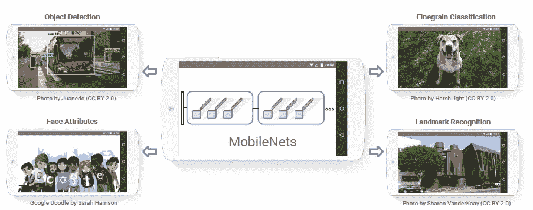

**When MobileNets Applied to Real Life**

引入两个参数使得 MobileNet 可以很容易地调整:**宽度乘数α** 和**分辨率乘数ρ** 。而这是我写这篇论文的时候发表在**arXiv 2017**【1】的论文，引用**600 多篇**。([曾植和](https://medium.com/u/aff72a0c1243?source=post_page-----a382df364b69--------------------------------) @中)

上面的对象检测示例是 MobileNet，它实际上是令人惊讶的，因为它可以在同时检测到如此大量的对象时达到大约 25 fps。

# 涵盖哪些内容

1.  **深度方向可分离卷积**
2.  **全网架构**
3.  **较薄型号的宽度乘数α**
4.  **简化表示的分辨率乘数ρ**
5.  **与最先进方法的比较**

# **1。深度方向可分离卷积**

深度方向可分离卷积是**一个深度方向卷积，后面跟着一个点方向卷积**，如下所示:

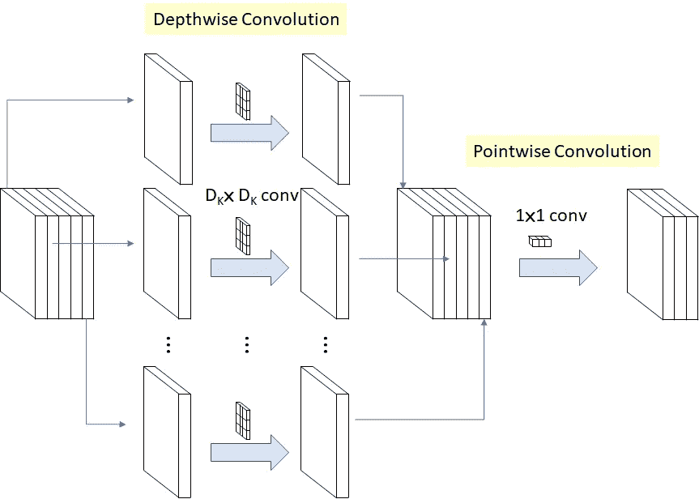

1.  **深度方向卷积**是**通道方向 DK×DK 空间卷积**。假设在上图中，我们有 5 个通道，那么我们将有 5 个 DK×DK 空间卷积。
2.  **逐点卷积**实际上是改变尺寸的 **1×1 卷积**。

通过以上操作，操作成本为:

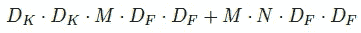

**Depthwise Separable Convolution Cost: Depthwise Convolution Cost (Left), Pointwise Convolution Cost (Right)**

其中 M:输入通道数，N:输出通道数，DK:内核大小，DF:特征映射大小。

对于标准卷积，它是:

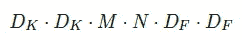

**Standard Convolution Cost**

因此，计算量减少为:

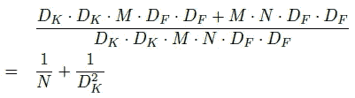

**Depthwise Separable Convolution Cost / Standard Convolution Cost**

**当 DK×DK 为 3×3 时，计算量可减少 8 至 9 倍，但精度仅略有降低。**

# **2。全网架构**

以下是 MobileNet 架构:

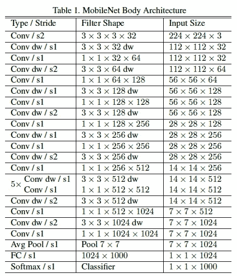

**Whole Network Architecture for MobileNet**

请注意，批次归一化(BN)和 ReLU 在每次卷积后应用:

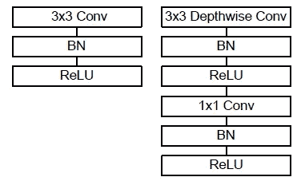

**Standard Convolution (Left), Depthwise separable convolution (Right) With BN and ReLU**

对于 ImageNet 数据集，If 标准卷积与深度方向可分离卷积:

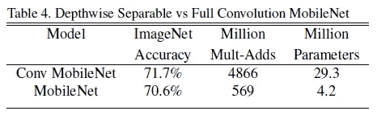

**Standard Convolution vs Depthwise Separable Convolution (ImageNet dataset)**

**MobileNet 只损失了 1%的精度，但乘法和参数却大大减少了。**

# **3。更薄型号的宽度乘数α**

引入宽度乘数α**控制通道数或通道深度**，使 M 变为αM，深度方向可分卷积代价变为:

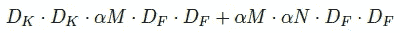

**Depthwise Separable Convolution Cost with Width Multiplier α**

其中α在 0 到 1 之间，典型设置为 1、0.75、0.5 和 0.25。当α=1 时，它是基线 MobileNet。并且计算成本和参数数量可以减少大约α倍。

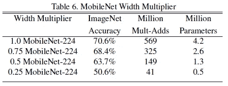

**Different Values of Width Multiplier α**

精度从α=1 平滑下降到 0.5，直到α=0.25，这太小。

# **4。简化表示的分辨率乘数ρ**

引入分辨率乘数ρ以**控制网络的输入图像分辨率**，用分辨率乘数ρ，成本变成:

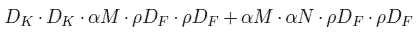

**Depthwise Separable Convolution Cost with Both Width Multiplier α and Resolution Multiplier ρ**

其中ρ在 0 到 1 之间。输入分辨率为 224、192、160 和 128。当ρ=1 时，为基线 MobileNet。

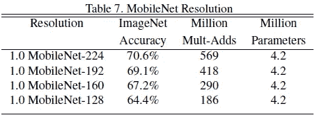

**Different Values of Resolution Multiplier ρ**

分辨率从 224 到 128 时，精确度会平稳下降。

# **5。与最先进方法的比较**

**当使用 1.0 MobileNet-224 时，它的性能优于 GoogLeNet(ils vrc 2014 的冠军)和 VGGNet(ils vrc 2014 的亚军)**而 multi-adds 和参数却少得多:

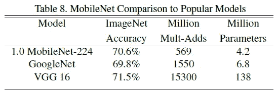

**ImageNet Dataset**

**当使用更小的网络(0.50 MobileNet-160)时，它的性能优于 Squeezenet 和 Alex net(2012 年 ILSVRC 的获奖者)**而 multi-adds 和参数则少得多:

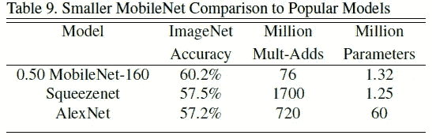

**ImageNet Dataset**

它与 Inception-v3(ils vrc 2015 的亚军)也有竞争力，而 multi-adds 和参数要少得多:

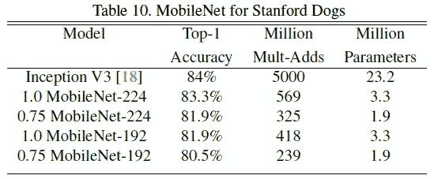

**Stanford Dogs Dataset**

**许多其他数据集也被尝试**来证明 MobileNet 的有效性:

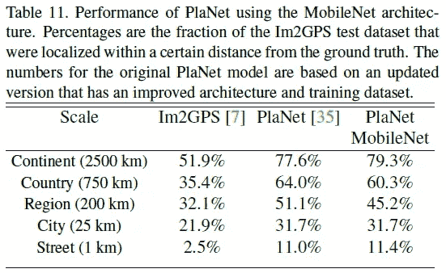

**GPS Localization Via Photos**

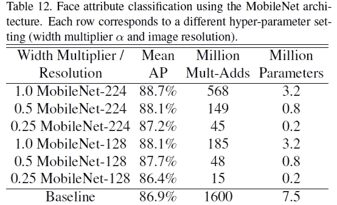

**Face Attribute Classification**

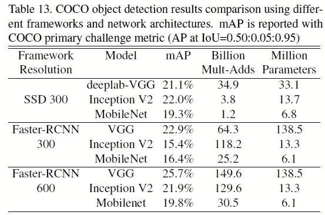

**Microsoft COCO Object Detection Dataset**

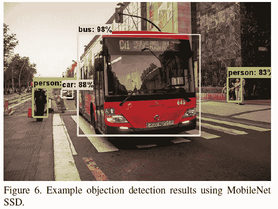

**MobileNet SSD**

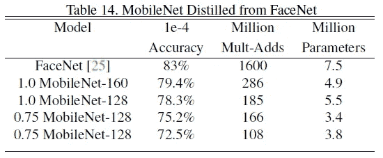

**Face Recognition**

总之，利用深度方向可分离卷积，使用 MobileNet 可以获得与最先进方法类似的性能，但网络要小得多。

的确，还有很多我上面没有提到的应用，比如通过照片进行 GPS 定位，人脸属性分类和人脸识别。希望我能在未来的日子里报道它们。:)

# 参考

1.  【2017 arXiv】【MobileNetV1】
    [MobileNets:面向移动视觉应用的高效卷积神经网络](https://arxiv.org/abs/1704.04861)

# 我的评论

[Inception-v3](https://medium.com/@sh.tsang/review-inception-v3-1st-runner-up-image-classification-in-ilsvrc-2015-17915421f77c) [BatchNorm](https://medium.com/@sh.tsang/review-batch-normalization-inception-v2-bn-inception-the-2nd-to-surpass-human-level-18e2d0f56651) [GoogLeNet](https://medium.com/coinmonks/paper-review-of-googlenet-inception-v1-winner-of-ilsvlc-2014-image-classification-c2b3565a64e7) [VGGNet](https://medium.com/coinmonks/paper-review-of-vggnet-1st-runner-up-of-ilsvlc-2014-image-classification-d02355543a11) [AlexNet](https://medium.com/coinmonks/paper-review-of-alexnet-caffenet-winner-in-ilsvrc-2012-image-classification-b93598314160)