# 点评:PolyNet——ILSVRC 2016 亚军(图像分类)

> 原文：<https://towardsdatascience.com/review-polynet-2nd-runner-up-in-ilsvrc-2016-image-classification-8a1a941ce9ea?source=collection_archive---------10----------------------->

## 通过使用多感知模块，优于 Inception-ResNet-v2

在这个故事里， **CUHK** 和 **SenseTime** 的**波利尼特**进行了回顾。介绍了一种称为**多增强模块**的构建模块。基于该模块组成一个**极深多边形**。与[**Inception-ResNet-v2**](/review-inception-v4-evolved-from-googlenet-merged-with-resnet-idea-image-classification-5e8c339d18bc)相比，PolyNet 将单一作物的前 5 名验证误差从 4.9%降低到 4.25%，将多作物的前 5 名验证误差从 3.7%降低到 3.45%。

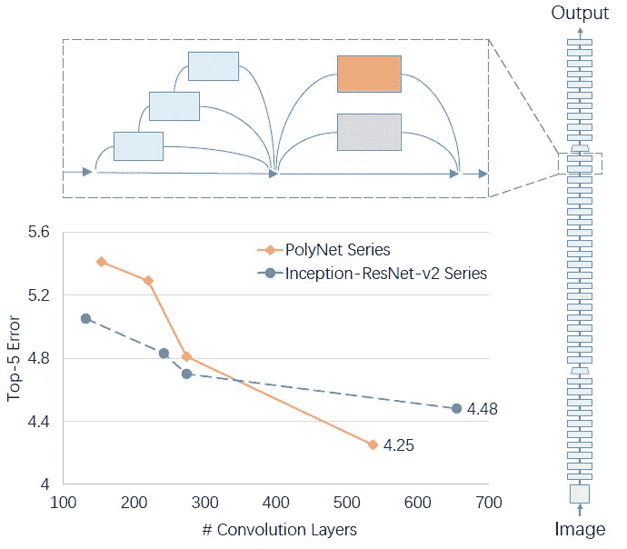

**PolyNet, By using PolyInception module, better than Inception-ResNet-v2**

结果，PolyNet(团队名称为 CU-DeepLink)在 ILSVRC 2016 分类任务中获得**亚军，如下。并以 **2017 CVPR** 论文发表。([曾植和](https://medium.com/u/aff72a0c1243?source=post_page-----8a1a941ce9ea--------------------------------) @中)**

与[ResNet](/review-resnet-winner-of-ilsvrc-2015-image-classification-localization-detection-e39402bfa5d8)(2015 年 ILSVRC 的获胜者)的 3.57%相比，PolyNet 的得票率为 3.04%，具体如下:

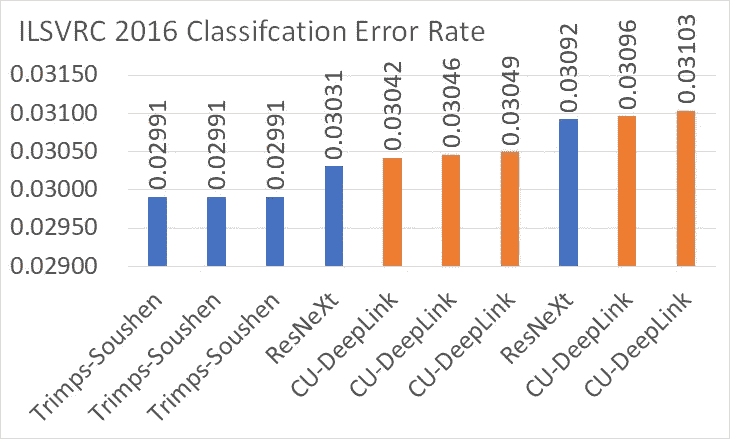

**ILSVRC 2016 Classification Ranking (Team Name: CU-DeepLink, Model Name: PolyNet)** [http://image-net.org/challenges/LSVRC/2016/results#loc](http://image-net.org/challenges/LSVRC/2016/results#loc)

这个相对提升大概是 14%左右，这可不是小事！！！

# 涵盖哪些内容

1.  **对 Inception-ResNet-v2 (IR-v2)的简要回顾**
2.  **多感知模块**
3.  **消融研究**
4.  **结果**

# **1。对 Inception-ResNet-v2 (IR-v2)的简要回顾**

随着 [ResNet](/review-resnet-winner-of-ilsvrc-2015-image-classification-localization-detection-e39402bfa5d8) 和[Google net(Inception-v1)](https://medium.com/coinmonks/paper-review-of-googlenet-inception-v1-winner-of-ilsvlc-2014-image-classification-c2b3565a64e7)的成功，引入了[Inception-ResNet-v2(IR-v2)](/review-inception-v4-evolved-from-googlenet-merged-with-resnet-idea-image-classification-5e8c339d18bc)来结合两者:

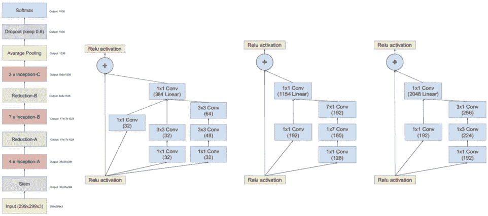

**Inception-ResNet-v2: Stem (Leftmost), Inception-A (2nd Left), Inception-B (2nd Right), Inception-C (Rightmost)**

如上图，有一个跳过连接。还有几个平行的卷积路径，这是由 [GoogLeNet](https://medium.com/coinmonks/paper-review-of-googlenet-inception-v1-winner-of-ilsvlc-2014-image-classification-c2b3565a64e7) 发起的。并且多个 Inception-A、Inception-B 和 Inception-C 在不同的级别级联。最后，[Inception-ResNet-v2(IR-v2)](/review-inception-v4-evolved-from-googlenet-merged-with-resnet-idea-image-classification-5e8c339d18bc)获得了较高的分类准确率。

初始模块可以表述为一个抽象的剩余单元，如下所示:

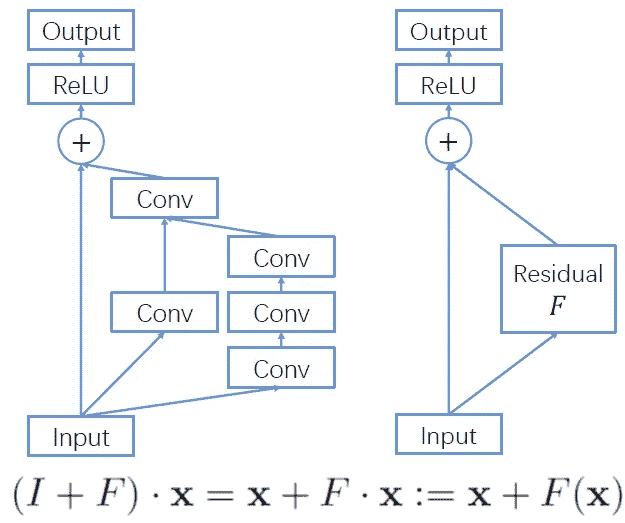

**Inception Module (Left), Abstract Residual Unit Denoted by F (Right)**

输出变成 x + F(x ),类似于残差块。

# **2。多感知模块**

为了提高精度，只需添加一个二阶项，便可增加一个多项式组合:

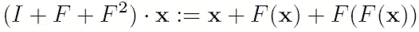

与**二阶项**组成**多感知模块**。

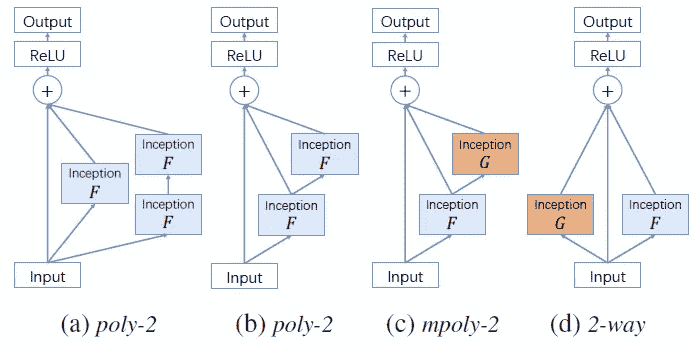

**Different Types of PolyInception Module ((a) and (b) are the same)**

提出了不同类型的多感知模块:

*   **(a) poly-2** :第一条路径是跳过连接或身份路径。第二条路径是一阶先启块。第三条路径是二阶项，由两个初始块组成。
*   **(b) poly-2** :由于第一个 Inception F 用于一阶路径和二阶路径，**第一个 Inception F 可以共享**。同样通过共享参数，**第二次启始 F 与第一次相同。**这可以在不引入额外参数的情况下**增加表示能力。
    我们也可以想象它是**(RNN)的一种递归神经网络。在二阶路径上，来自 Inception F 的输出再次回到 Inception F 的输入。**这就变成了 **1+F+F** 。**
*   **(c) mpoly-2** :如果第二个 Inception G 不与 F 共享参数，我们得到 mpoly-2。这就变成了 **1+F+GF** 。
*   **(d) 2 通**:这是一个**一阶多叠加**， **I+F+G** 。

这个概念可以扩展到**高阶多感知模块**。我们可以有 **poly-3 (1+F+F +F )** ， **mpoly-3 (1+F+GF+HGF)** ， **3 向(I+F+G+H)** 。

# 3.**消融研究**

现在我们手里有这么多选择。但是哪些组合是最好的呢？作者尝试了许多组合来寻找最佳组合。

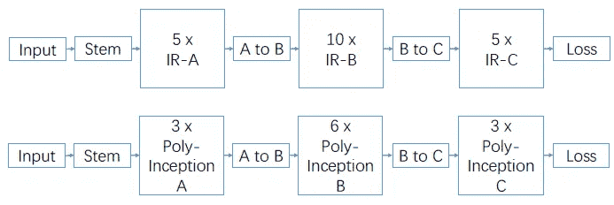

**Inception-ResNet-v2 (IR-v2, IR 5–10–5) (Top), PolyNet (Bottom)**

[Inception-ResNet-v2(IR-v2)](/review-inception-v4-evolved-from-googlenet-merged-with-resnet-idea-image-classification-5e8c339d18bc)表示为**IR 5–10–5**，这意味着它在 A 阶段有 5 个 Inception-A 模块(IR-A)，在 B 阶段有 10 个 Inception-B 模块(IR-B)，在 C 阶段有 5 个 Inception-C 模块(IR-C)

## 3.1.单一类型替换

为了加快实验速度，一个缩小版的**ir3–6–3 被用作基线**。对于每一次，六个多感知模块中的一个被 Inception-A、Inception-B 或 Inception-C 模块所取代，如下所示。

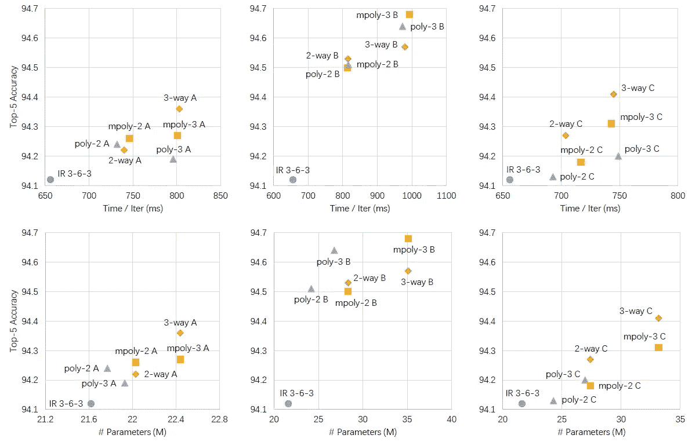

**Top-5 Accuracy vs Time (Top), Top-5 Accuracy vs #Params (Bottom), with replacement at Inception-A (Left), Inception-B (Middle), and Inception-C (Right)**

从上面的数字中，我们可以发现:

*   任何二阶多感知模块都比初始模块好。
*   增强 Inception-B 会带来最大的收益。而 mpoly-3 似乎是最好的一个。但是 poly-3 具有竞争性的结果，而只有 mpoly-3 的 1/3 参数大小。
*   对于其他阶段，A 和 C，3 路性能略好于 mpoly 和 poly。

## 3.2.混合类型替换

IR 6–12–6 用作基线。而这 12 个 Inception-B 是关注点，因为它在之前的研究中得到了最大的改进。并且只测试一种混合多输入多输出(mixed B)，即 **(3 路> mpoly-3 > poly-3) × 4** 。

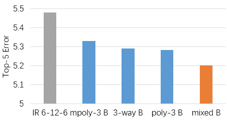

**Top-5 Error with different Inception module at Stage B**

混合 B 的 Top-5 误差最低。

## 3.3.最终模型

*   阶段 A: 10 个双向多输入模块
*   B 阶段:10 份聚-3 和 2-way 的混合物(总共 20 份)
*   阶段 C: 5 种聚-3 和 2-way 的混合物(总共 10 种)

进行了一些修改以适应 GPU 内存，在保持深度的同时降低了成本。

# 4.结果

## 4.1.一些训练细节

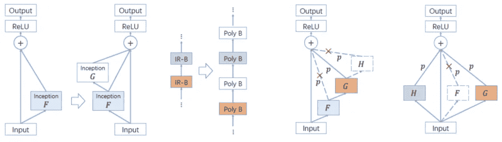

**Initialization by Insertion (Left), Path Dropped by Stochastic Depth (Right)**

**插入初始化**:为了加快收敛，如上图所示，先去掉二阶初始模块，先训练交错模块。因此，在开始时训练一个较小的网络。

[**随机深度**](/review-stochastic-depth-image-classification-a4e225807f4a) :通过随机丢弃网络的某些部分，可以减少过拟合。它可以被视为一种特殊的丢失情况，即丢失一条路径上的所有神经元。

## 4.2.ImageNet

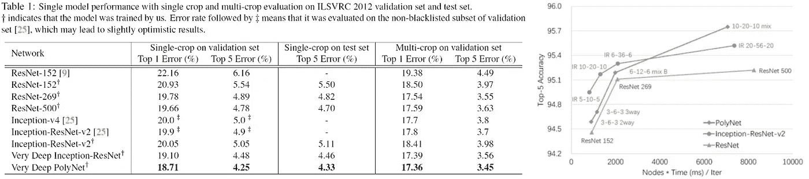

**Single Model Results on 1000-Class ImageNet Dataset (Left) Top-5 Accuracy (Right)**

*   **非常深的 Inception-ResNet**:[Inception-ResNet-v2](/review-inception-v4-evolved-from-googlenet-merged-with-resnet-idea-image-classification-5e8c339d18bc)IR 20–56–20。得到 19.10%的前 1 名误差和 4.48%的前 5 名误差。
*   **Verp Deep PolyNet(10–20–10 mix)**:**得到 18.71% Top-1 误差和 4.25% Top-5 误差**。
*   在多作物的情况下，非常深的 PolyNet 得到了 **17.36%的 Top-1 误差和 3.45%的 Top-5 误差**，这一直优于非常深的 [Inception-ResNet-v2](/review-inception-v4-evolved-from-googlenet-merged-with-resnet-idea-image-classification-5e8c339d18bc) 。
*   因此，二阶多感知模块确实有助于提高精度。

通过使用多模型和多尺度输入图像进行组合，PolyNet 最终获得了 3.04%的 Top-5 错误率，并在 ILSVRC 2016 分类任务上获得亚军。

由于图像分类只有一个目标，即识别图像中的单个对象，因此用于图像分类的好模型通常成为对象检测、语义分割等网络的骨干。因此，研究图像分类模型是很有价值的。我也会学习 ResNeXt。

## 参考

【2017 CVPR】【波利尼特】
[波利尼特:在非常深的网络中对结构多样性的追求](https://arxiv.org/abs/1611.05725)

## 我对图像分类的相关综述

[[LeNet](https://medium.com/@sh.tsang/paper-brief-review-of-lenet-1-lenet-4-lenet-5-boosted-lenet-4-image-classification-1f5f809dbf17)][[AlexNet](https://medium.com/coinmonks/paper-review-of-alexnet-caffenet-winner-in-ilsvrc-2012-image-classification-b93598314160)][[ZFNet](https://medium.com/coinmonks/paper-review-of-zfnet-the-winner-of-ilsvlc-2013-image-classification-d1a5a0c45103)][[VGGNet](https://medium.com/coinmonks/paper-review-of-vggnet-1st-runner-up-of-ilsvlc-2014-image-classification-d02355543a11)][[SPPNet](https://medium.com/coinmonks/review-sppnet-1st-runner-up-object-detection-2nd-runner-up-image-classification-in-ilsvrc-906da3753679)][[PReLU-Net](https://medium.com/coinmonks/review-prelu-net-the-first-to-surpass-human-level-performance-in-ilsvrc-2015-image-f619dddd5617)][[Google Net/Inception-v1](https://medium.com/coinmonks/paper-review-of-googlenet-inception-v1-winner-of-ilsvlc-2014-image-classification-c2b3565a64e7)][[BN-Inception/Inception-v2](https://medium.com/@sh.tsang/review-batch-normalization-inception-v2-bn-inception-the-2nd-to-surpass-human-level-18e2d0f56651)][[Inception-v3](https://medium.com/@sh.tsang/review-inception-v3-1st-runner-up-image-classification-in-ilsvrc-2015-17915421f77c)][[Inception-v4](/review-inception-v4-evolved-from-googlenet-merged-with-resnet-idea-image-classification-5e8c339d18bc) [ [RoR](/review-ror-resnet-of-resnet-multilevel-resnet-image-classification-cd3b0fcc19bb) ] [ [随机深度](/review-stochastic-depth-image-classification-a4e225807f4a)][[WRN](/review-wrns-wide-residual-networks-image-classification-d3feb3fb2004)][[dense net](/review-densenet-image-classification-b6631a8ef803)]