# 点评:PSP net——ils vrc 2016(语义分割/场景解析)获奖者

> 原文：<https://towardsdatascience.com/review-pspnet-winner-in-ilsvrc-2016-semantic-segmentation-scene-parsing-e089e5df177d?source=collection_archive---------3----------------------->

## 金字塔场景解析网络:金字塔池模块

T 他的时代， **PSPNet(金字塔场景解析网)**，由 **CUHK** 和 **SenseTime** 点评。

*   **语义分割**是为了**只知道已知物体的每个像素的类别标签**。
*   **基于语义分割的场景解析**，就是**知道图像**内所有像素的类别标签。

**Scene Parsing**

通过使用金字塔池模块，结合基于不同区域的上下文聚合，PSPNet 超越了最先进的方法，如 [FCN](/review-fcn-semantic-segmentation-eb8c9b50d2d1) 、 [DeepLab](/review-deeplabv1-deeplabv2-atrous-convolution-semantic-segmentation-b51c5fbde92d) 和 [DilatedNet](/review-dilated-convolution-semantic-segmentation-9d5a5bd768f5) 。最后，PSPNet:

*   **获得 2016 年 ImageNet 场景解析挑战赛冠军**
*   **当时在 PASCAL VOC 2012 &城市景观数据集**上获得第一名

并发表在 **2017 CVPR** 上，引用 **600 余次**。( [Sik-Ho Tsang](https://medium.com/u/aff72a0c1243?source=post_page-----e089e5df177d--------------------------------) @中)

# 涵盖哪些内容

1.  **全球信息的需求**
2.  **金字塔池模块**
3.  **一些细节**
4.  **消融研究**
5.  **与最先进方法的比较**

# 1.**全球信息的需要**

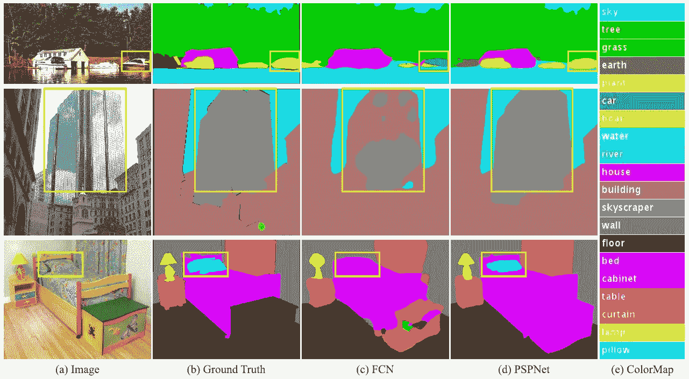

**(c) Original FCN without Context Aggregation, (d) PSPNet with Context Aggregation**

*   **不匹配关系** : [FCN](/review-fcn-semantic-segmentation-eb8c9b50d2d1) 根据外观预测黄色盒子里的船是“汽车”。但常识是，车很少过江。
*   **混淆类别** : [FCN](/review-fcn-semantic-segmentation-eb8c9b50d2d1) 预测盒子里的物体是摩天大楼的一部分，也是建筑物的一部分。应该排除这些结果，这样整个对象要么是摩天大楼，要么是建筑物，但不能两者都是。
*   **不显眼类**:枕头与床单外观相似。忽略全局场景类别可能无法解析枕头。

因此，我们需要图像的一些全局信息。

# 2.金字塔池模块

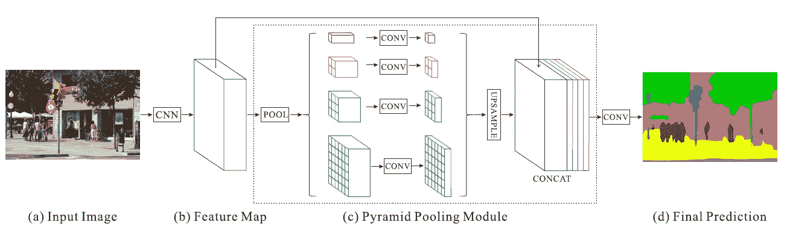

**Pyramid Pooling Module After Feature Extraction (Colors are important in this figure!!!)**

## (a)和(b)

在(a)处，我们有一个输入图像。在(b)处， [ResNet](/review-resnet-winner-of-ilsvrc-2015-image-classification-localization-detection-e39402bfa5d8) 使用扩张网络策略([deep lab](/review-deeplabv1-deeplabv2-atrous-convolution-semantic-segmentation-b51c5fbde92d)/[dilated net](/review-dilated-convolution-semantic-segmentation-9d5a5bd768f5))进行特征提取。扩张的卷积跟随 [DeepLab](/review-deeplabv1-deeplabv2-atrous-convolution-semantic-segmentation-b51c5fbde92d) 。这里的特征图大小是输入图像的 1/8。

## (c).1。**分地区平均统筹**

在(c)，**对每个特征图执行子区域平均汇集。**

*   **红色**:这是对每个特征图执行**全局平均汇集**的最粗级别，以生成单个面元输出。
*   **橙色**:这是第二层，将特征图分成 **2×2** 子区域，然后对每个子区域进行平均池化。
*   **蓝色**:这是第三层，将特征图分成 **3×3** 个子区域，然后对每个子区域进行平均合并。
*   **绿色**:这是将特征图划分为 **6×6** 子区域，然后对每个子区域进行合并的最细级别。

## (c).2。 **1×1 卷积降维**

然后对每个汇集的特征图执行 **1×1 卷积**以**将上下文表示减少到原始**的 1/ *N* (黑色)如果金字塔的级别大小是 *N* 。

*   在本例中， *N* =4，因为总共有 4 个级别(红、橙、蓝、绿)。
*   如果输入特征图的数量是 2048，那么输出特征图将是(1/4)×2048 = 512，即 512 个输出特征图。

## (c).3。用于上采样的双线性插值

执行双线性插值以对每个低维特征图进行上采样，使其具有与原始特征图(黑色)相同的大小。

## (c).4。用于上下文聚合的串联

所有不同级别的上采样特征图都与原始特征图(黑色)连接在一起。这些特征图被融合为全局先验。这是(c)处的金字塔池模块的结尾。

## (四)

最后，随后是卷积层，以在(d)生成最终预测图。

子区域平均池的思想实际上非常类似于 [SPPNet](https://medium.com/coinmonks/review-sppnet-1st-runner-up-object-detection-2nd-runner-up-image-classification-in-ilsvrc-906da3753679) 中的空间金字塔池。1×1 卷积然后串联与[exception](/review-xception-with-depthwise-separable-convolution-better-than-inception-v3-image-dc967dd42568)或 [MobileNetV1](/review-mobilenetv1-depthwise-separable-convolution-light-weight-model-a382df364b69) 使用的深度方向可分离卷积中的深度方向卷积非常相似，除了双线性插值用于使所有特征图的大小相等。

# **3。关于训练的一些细节**

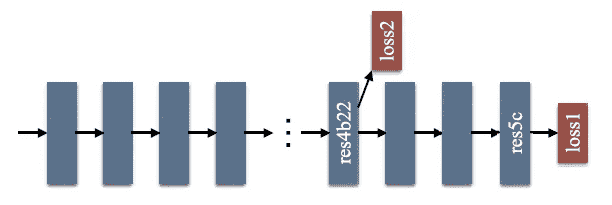

**Auxiliary Loss at the Middle**

*   辅助损耗在训练时使用。将权重α0.4 添加到辅助损失中，以平衡最终损失和辅助损失。在测试过程中，辅助损耗被放弃。这是一种用于训练非常深的网络的深度监督训练策略。这个思路类似于 [GoogLeNet / Inception-v1](https://medium.com/coinmonks/paper-review-of-googlenet-inception-v1-winner-of-ilsvlc-2014-image-classification-c2b3565a64e7) 中的辅助分类器。
*   使用“Poly”学习代替基本学习。

# 4.消融研究

**ADE2K** 数据集是 **ImageNet 场景解析挑战赛 2016** 中的数据集。这是一个更具挑战性的数据集，有多达 150 个类，1，038 个图像级标签。并且有 20K/2K/3K 图像用于训练/验证/测试。

验证集用于消融研究。

## 4.1.最大(Max)与平均(AVE)池化和降维(DR)

**Different Approaches on ADE2K Validation Set Results**

*   **ResNet50-Baseline** :基于 ResNet50 的 FCN，网络扩大。
*   **B1**’和’**b 1236**’:分别为面元尺寸{1×1}和{1×1，2×2，3×3，6×6}的汇集特征图。
*   **最大**、**平均**:分别为最大汇集和平均汇集操作。
*   **DR**’:降维。

平均池一直有更好的结果。而且用 DR 比不用 DR 好。

## 4.2.辅助损耗

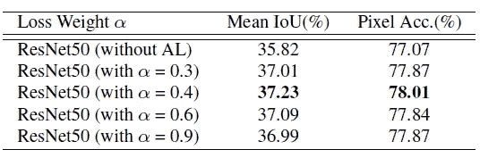

**Different Weights for Auxiliary Loss on ADE2K Validation Set Results**

α=0.4 时，性能最佳。因此，使用α=0.4。

## 4.3.不同深度数和多尺度(MS)测试

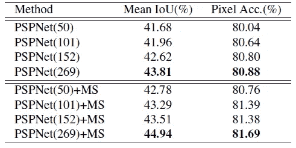

**Different Depth Numbers and Multi-Scale Testing on ADE2K Validation Set Results**

正如我们所知，更深的模型有更好的结果。多尺度测试有助于改善结果。

## 4.4.数据扩充(DA)及其与其他技术的比较

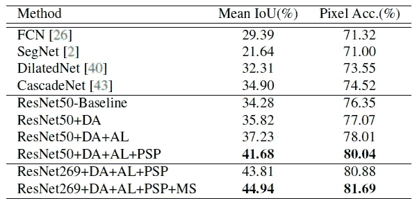

**Comparison with State-of-the-art Approaches on ADE2K Validation Set Results (All are Single Scale Except the Last Row.)**

*   ResNet269+DA+AL+PSP :对于单一尺度的测试，把所有的东西结合在一起，它比最先进的方法要好得多。
*   ResNet269+DA+AL+PSP+MS :同样通过多尺度测试，获得更好的效果。
*   下面是一些例子:

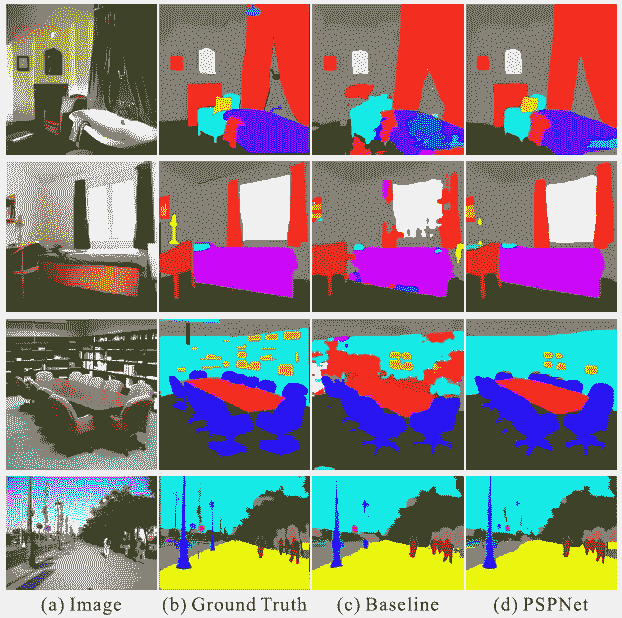

**ADE2K Examples**

# **5。与最先进方法的比较**

## 5.1.ADE2K—2016 年 ImageNet 场景解析挑战赛

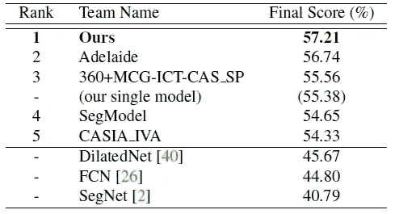

**ADE2K Test Set**

*   PSPNet 赢得了 2016 年 ImageNet 场景解析挑战赛。

## 5.2.帕斯卡 VOC 2012

对于 DA，有 10582/1449/1456 个图像用于训练/验证/测试。

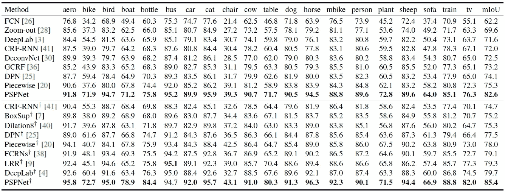

**PASCAL VOC 2012 Test Set**

*   +'表示也由 MS COCO 数据集预先训练。
*   PSPNet 再次胜过所有最先进的方法，如 FCN、DeconvNet、DeepLab 和 Dilation8。
*   下面是一些例子:

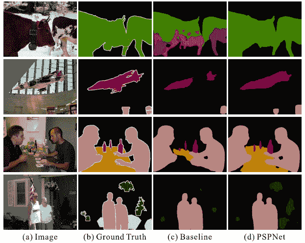

**PASCAL VOC 2012 Examples**

## 5.3.城市景观

它包含从 50 个城市不同季节收集的 5000 幅高质量像素级精细注释图像。有 2975/500/1525 用于培训/验证/测试。它定义了包含东西和对象的 19 个类别。此外，在比较中，为两种设置提供 20000 个粗略注释的图像，即，仅用精细数据或用精细和粗略数据两者进行训练。两者的训练都用“++”标记。

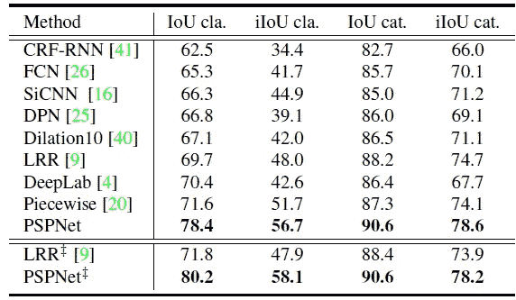

**Cityscapes Test Set**

*   仅用精细数据训练，或者同时用精细和粗糙数据训练，PSPNet 也得到了最好的结果。
*   下面是一些例子:

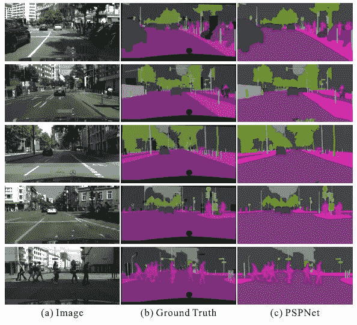

**Cityscapes Examples**

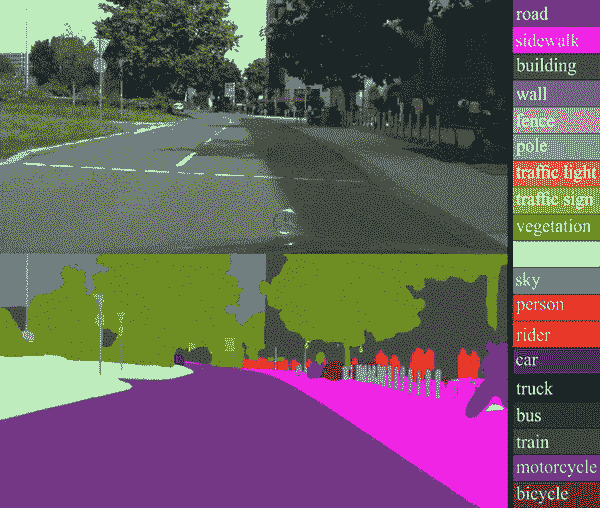

**Cityscapes Examples**

*   作者还上传了 Cityscapes 数据集的视频，令人印象深刻:

*   另外两个视频例子:

https://www.youtube.com/watch?v=gdAVqJn_J2M

【https://www.youtube.com/watch?v=HYghTzmbv6Q 

利用金字塔池模块，获取图像的全局信息，改善结果。

## 参考

【2017 CVPR】【PSPNet】
[金字塔场景解析网](https://arxiv.org/abs/1612.01105)

## 我对图像分类的相关综述

)(我)(们)(都)(不)(想)(要)(让)(这)(些)(人)(都)(有)(这)(些)(的)(情)(况)(,)(我)(们)(都)(不)(想)(会)(有)(什)(么)(情)(况)(,)(我)(们)(都)(不)(想)(会)(有)(什)(么)(情)(况)(,)(我)(们)(还)(没)(有)(什)(么)(情)(况)(,)(我)(们)(还)(有)(什)(么)(情)(况)(,)(我)(们)(还)(没)(有)(什)(么)(好)(的)(情)(感)(。 )(我)(们)(都)(不)(知)(道)(,)(我)(们)(都)(是)(很)(好)(的)(,)(我)(们)(都)(是)(很)(好)(的)(。

## 我对语义分割的相关评论

[[FCN](/review-fcn-semantic-segmentation-eb8c9b50d2d1)][[de convnet](/review-deconvnet-unpooling-layer-semantic-segmentation-55cf8a6e380e)][[deep lab v1&deep lab v2](/review-deeplabv1-deeplabv2-atrous-convolution-semantic-segmentation-b51c5fbde92d)][[parse net](https://medium.com/datadriveninvestor/review-parsenet-looking-wider-to-see-better-semantic-segmentation-aa6b6a380990)][[dilated net](/review-dilated-convolution-semantic-segmentation-9d5a5bd768f5)]

## 我对生物医学图像分割的相关综述

[ [累计视频 1](https://medium.com/datadriveninvestor/review-cumedvision1-fully-convolutional-network-biomedical-image-segmentation-5434280d6e6) ] [ [累计视频 2 / DCAN](https://medium.com/datadriveninvestor/review-cumedvision2-dcan-winner-of-2015-miccai-gland-segmentation-challenge-contest-biomedical-878b5a443560) ] [ [优网](/review-u-net-biomedical-image-segmentation-d02bf06ca760) ] [ [CFS-FCN](https://medium.com/datadriveninvestor/review-cfs-fcn-biomedical-image-segmentation-ae4c9c75bea6) ]