# 综述:R-FCN-阳性敏感得分图(物体检测)

> 原文：<https://towardsdatascience.com/review-r-fcn-positive-sensitive-score-maps-object-detection-91cd2389345c?source=collection_archive---------4----------------------->

在这个故事中，简要回顾了微软和清华大学的 R-FCN(基于区域的完全卷积网络)。**通过正敏感得分图，推理时间比更快的 R-CNN 快得多，同时仍然保持竞争的准确性。**

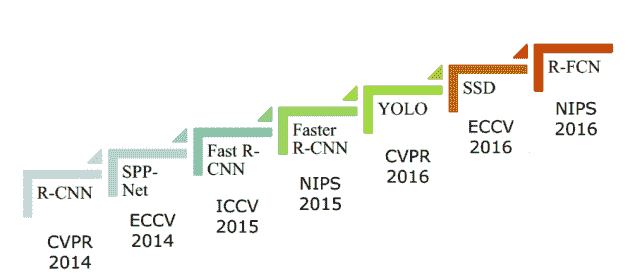

**From R-CNN to R-FCN**

这是一篇在我写这篇论文的时候，在 **2016 NIPS** 上有超过 **700 次引用**的论文。由于了解对象检测方法的发展可以更多地了解创新背后的原因，我希望我可以在未来的未来包括更多的对象检测方法。( [Sik-Ho Tsang](https://medium.com/u/aff72a0c1243?source=post_page-----91cd2389345c--------------------------------) @中)

**R-FCN Demonstration**

# 涵盖哪些内容

1.  **R-FCN 相对于 R-CNN 的优势**
2.  **阳性敏感得分图& ROI 汇集**
3.  **其他详情**
4.  **结果**

# 1.**R-FCN 相对 R-CNN 的优势**

**R-CNN series**

对于传统的区域提议网络(RPN)方法，例如 R-CNN、快速 R-CNN 和更快 R-CNN，区域提议首先由 RPN 生成。然后完成 ROI 合并，并通过全连接(FC)层进行分类和边界框回归。

ROI 合并后的流程(FC 层)不会在 ROI 之间共享，并且需要时间，这使得 RPN 方法很慢。FC 层增加了连接(参数)的数量，这也增加了复杂性。

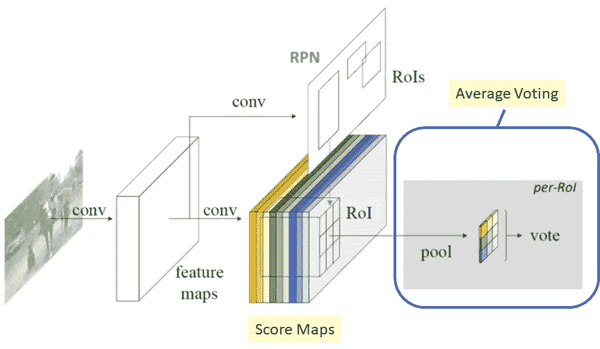

**R-FCN**

在 R-FCN，我们仍有 RPN 来获取区域提案，但与 R-CNN 系列不同的是，ROI 汇集后的 **FC 层被移除**。相反，**所有主要的复杂性都在 ROI 汇集之前移动，以生成评分图**。所有区域提案，在 ROI 汇集后，将使用同一组得分图来执行**平均投票**，这是一个**简单计算。** **因此，在 ROI 层之后没有可学习的层，这几乎是免费的。**结果，R-FCN 甚至比具有竞争地图的更快的 R-CNN 还要快。

# 2.**阳性敏感得分图& ROI 合并**

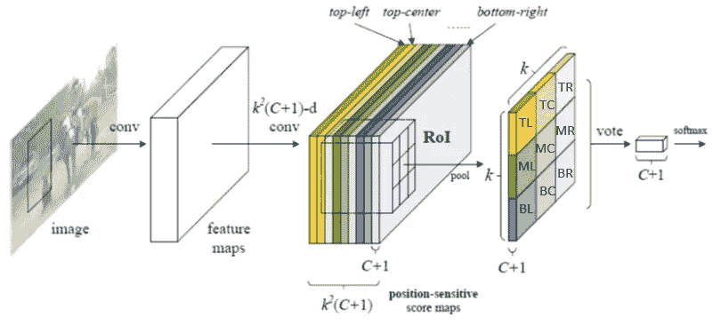

**Positive-Sensitive Score Maps & Positive-Sensitive ROI Pooling (k=3 in this figure) (Colors are important in this diagram)**

## 2.1 阳性敏感得分图

为了简单起见，让我们去掉 RPN。

我们有 C 类需要检测。(C+1)表示 C 个对象类加上背景类。

在正敏感分数图之前的开始处的许多卷积之后，我们执行 **k (C+1)-d 卷积**。对于每个类，将有 k 个特征图。这些 **k 特征图代表了{左上(TL)，中上(TC)、..，右下(BR)}** 我们要检测的对象。

## 2.2 积极敏感的投资回报池

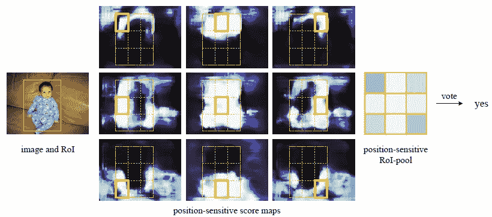

**An Example of Positive-Sensitive ROI Pooling**

当 ROI 合并时，产生大小为 k 的(C+1)个特征图，即 k (C+1)。在图中，它们以相同的面积和相同的颜色汇集在一起。执行平均投票以生成(C+1)个一维向量。最后对矢量进行 softmax。

当区域提案与以下目标不重叠时，我们将投反对票:

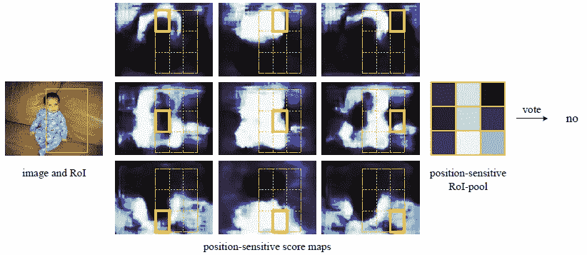

**When the region proposal does not overlap the object so much.**

## 2.3 边界框回归

执行与类别无关的包围盒回归，这意味着回归在类别之间共享。

在 k (C+1)-d 卷积层，附加一个兄弟 4k -d 卷积层。在这个 4k 地图库上执行位置敏感 RoI 汇集，为每个 RoI 产生 4k -d 向量。然后通过平均投票聚合成一个 4-d 向量，表示包围盒的 **{tx，ty，tw，th}** (位置和大小)，和 Fast R-CNN 中的一样。

# **3。其他细节**

## 3.1 主干架构

从 ImageNet 预训练的 ResNet-101 的前 100 个 conv 被用于在阳性敏感分数图之前计算特征图。

## 3.2 培训

**损失紧随快速 R-CNN** :

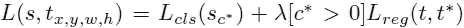

Lcls 是分类损失，Lreg 是边界框回归损失。

**在线硬例挖掘(OHEM)** 用于训练。在 N 个建议中，只有具有最高损失的顶部 B 个 ROI 被用于反向传播。

**4 步交替训练**在更快的 R-CNN 中同样完成，以训练 RPN 和 R-FCN。

## 3.3 推理

**非最大抑制(NMS)** 在 0.3 IoU 时执行后处理

# 4.结果

## 4.1 VOC 2007 **数据集**

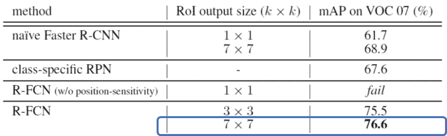

**Study of k values**

7×7 ROI 大小的 R-FCN 获得了 76.6%的 mAP，优于更快的 R-CNN。

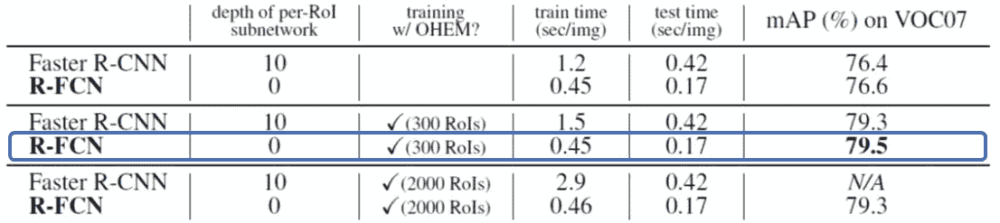

**The use of OHEM**

使用 OHEM，获得了 79.5%的 mAP。

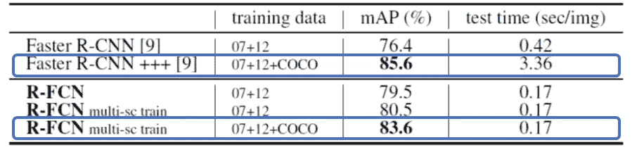

**Multi-Scale Training**

使用不同比例的图像进行训练，R-FCN 具有 83.6%的 mAP，这比更快的 R-CNN++的 85.6%的 mAP 稍差。但是 R-FCN 的测试时间是每张图片 0.17 秒，比更快的 R-CNN++的测试时间(3.36 秒/张图片)快多了。这是因为 ROI 合并后没有 FC 层。

而且我们可以看到**训练的细节也是至关重要的，这使得 mAP 增加了这么多，从 76.6%到 83.6%的 mAP。**

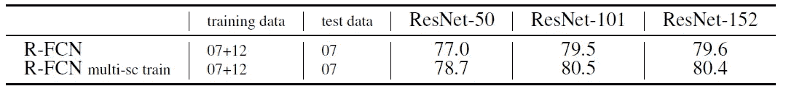

**Different Backbones on VOC 2007**

使用 ResNet-152 与使用 ResNet-101 具有相似的映射。这是由于 ResNet 网络问题。**如果在 ResNet 中使用身份映射，可以超过 1000 层**，不会在 152 层饱和。(如果感兴趣，也请阅读我在 [ResNet 上关于身份映射](/resnet-with-identity-mapping-over-1000-layers-reached-image-classification-bb50a42af03e)的评论。)

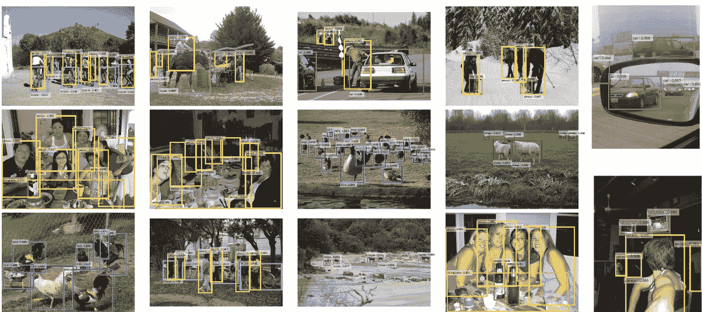

**Some Amazing Results on VOC 2007 Dataset**

## 4.2 VOC 2012 和 MS COCO **数据集**

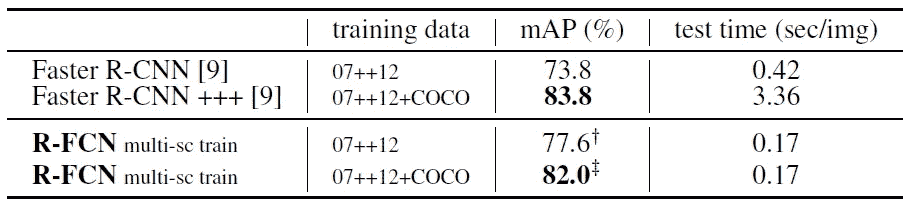

**VOC 2012 Dataset**

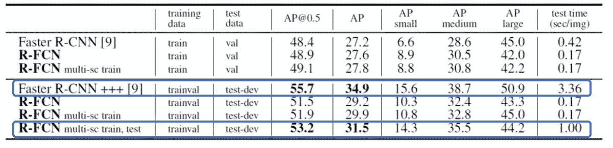

**MS COCO Dataset**

类似于 VOC 2007 数据集的结果， **R-FCN 比更快的 R-CNN++具有竞争力但 mAP 更低。**但是**R-FCN 的测试时间要快得多。**

对象检测方法可以分为两阶段(R-CNN 系列与 RPN)和一阶段(YOLO，SSD)方法。R-FCN 可以看作是两阶段方法中的一种快速方法。

由于了解对象检测方法的发展可以更多地了解创新背后的原因，我希望我可以在未来的未来包括更多的对象检测方法。

# 参考

【2016 NIPS】【R-FCN】
[R-FCN:经由基于区域的完全卷积网络的物体检测](https://papers.nips.cc/paper/6465-r-fcn-object-detection-via-region-based-fully-convolutional-networks)

# 我的评论

[[R-CNN](https://medium.com/coinmonks/review-r-cnn-object-detection-b476aba290d1)][[Fast R-CNN](https://medium.com/coinmonks/review-fast-r-cnn-object-detection-a82e172e87ba)][[Fast R-CNN](/review-faster-r-cnn-object-detection-f5685cb30202)][[SPPNet](https://medium.com/coinmonks/review-sppnet-1st-runner-up-object-detection-2nd-runner-up-image-classification-in-ilsvrc-906da3753679)][[yolov 1](/yolov1-you-only-look-once-object-detection-e1f3ffec8a89)][[VGGNet](https://medium.com/coinmonks/paper-review-of-vggnet-1st-runner-up-of-ilsvlc-2014-image-classification-d02355543a11)][[ResNet](/review-resnet-winner-of-ilsvrc-2015-image-classification-localization-detection-e39402bfa5d8)][[ResNet with Identity Mapping](/resnet-with-identity-mapping-over-1000-layers-reached-image-classification-bb50a42af03e)]