# 点评:ResNet——2015 年国际影像分类、定位、检测奖得主

> 原文：<https://towardsdatascience.com/review-resnet-winner-of-ilsvrc-2015-image-classification-localization-detection-e39402bfa5d8?source=collection_archive---------4----------------------->

本故事中， **ResNet** [1]回顾。ResNet 可以通过**学习残差表示函数**而不是直接学习信号表示，拥有一个**的**非常深**的网络达到 152 层**。

**ResNet 引入了跳过连接**(或**快捷连接**)来将来自上一层的输入适配到下一层，而不对输入进行任何修改。跳过连接使得能够有更深的网络，最终 ResNet 成为 ILSVRC 2015 在图像分类、检测和定位方面的**赢家，以及 MS COCO 2015 检测和分割的赢家。**这是一篇 **2016 CVPR** 论文，引用**超过 19000 次。** ( [曾锡豪](https://medium.com/u/aff72a0c1243?source=post_page-----e39402bfa5d8--------------------------------) @中)

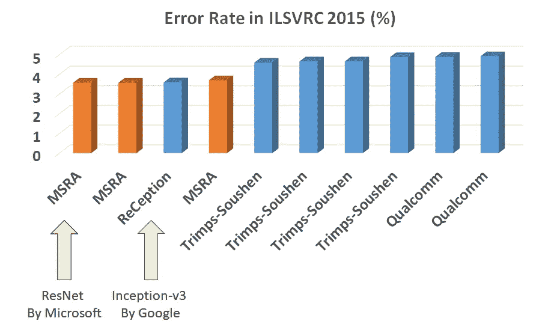

**ILSVRC 2015 Image Classification Ranking**

ImageNet 是一个数据集，包含超过 1500 万张带有标签的高分辨率图像，大约有 22，000 个类别。ILSVRC 在 1000 个类别中的每个类别中使用大约 1000 个图像的 ImageNet 子集。总的来说，大约有 120 万幅训练图像、50，000 幅验证图像和 100，000 幅测试图像。

# 涵盖哪些内容

1.  **平面网络问题(消失/爆炸梯度)**
2.  **剩余网络中的跳过/快捷连接(ResNet)**
3.  **ResNet 架构**
4.  **瓶颈设计**
5.  **消融研究**
6.  **与最先进方法的比较(图像分类)**
7.  **与最先进方法的比较(物体检测)**

# **1。普通网络的问题**

**对于传统的深度学习网络**，它们通常有 conv 层，然后是用于分类任务的全连接(FC)层，如 AlexNet、ZFNet 和 VGGNet，没有任何跳过/快捷连接，我们在这里将它们称为**平面网络**。**当平面网络较深时(层数增加)，会出现消失/爆炸渐变的问题。**

## 消失/爆炸渐变

在反向传播期间，当误差函数相对于训练的每次迭代中的当前权重的偏导数时，这具有将这些小/大数的 *n* 乘以 *n* 层网络中的“前”层的梯度的效果

当网络很深的时候，这些小数字的乘积 *n* 就会变成零(消失)。

当网络很深，并且这些大数相乘 *n* 就会变得过大(爆炸)。

我们期望更深的网络会有更准确的预测。然而，下面显示了一个例子， **20 层平面网络比 56 层平面网络**具有更低的训练误差和测试误差，由于梯度消失，出现了退化问题。

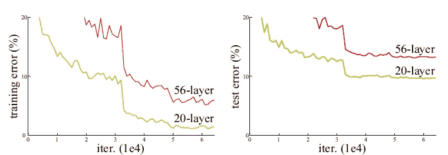

**Plain Networks for CIFAR-10 Dataset**

# 2.**剩余网络中的跳过/快捷连接(ResNet)**

为了解决消失/爆炸渐变的问题，添加了一个跳过/快捷连接，以在几个权重层后将输入 *x* 添加到输出，如下所示:

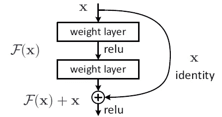

**A Building Block of Residual Network**

因此，输出 *H(x)=* *F(x) + x* 。**权重层其实就是学习一种残差映射: *F(x)=H(x)-x*** 。

**即使权重层存在消失梯度，我们仍然始终有身份 *x* 转移回更早的层。**

# 3.ResNet 架构

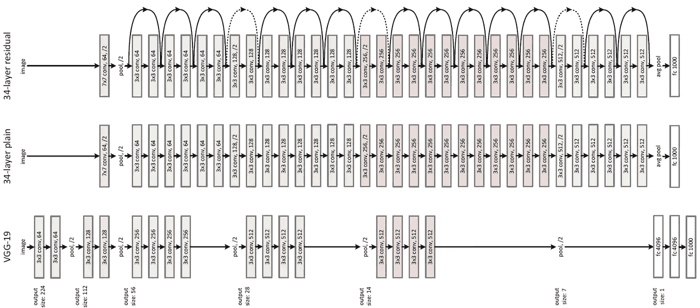

**34-layer ResNet with Skip / Shortcut Connection (Top), 34-layer Plain Network (Middle), 19-layer VGG-19 (Bottom)**

上图显示了 ResNet 架构。

1.  VGG-19 [2](下图)是 2014 年 ILSVRC 中最先进的方法。
2.  **34 层平面网(中间)作为 VGG-19** 的深层网，即更多的 conv 层。
3.  **34 层残差网络(ResNet)(上)是普通网络，增加了 skip / shortcut 连接。**

对于 ResNet，当输入尺寸小于输出尺寸时，有 **3 种类型的跳过/快捷连接。**

(A)快捷方式执行标识映射，并额外填充零以增加维度。因此，没有额外的参数。

(B)投影快捷方式仅用于增加维度，其他快捷方式是恒等式。需要额外的参数。

(C)所有快捷方式都是投影。额外的参数比(B)的多。

# **4。瓶颈设计**

由于现在网络很深，时间复杂度很高。瓶颈设计用于降低复杂性，如下所示:

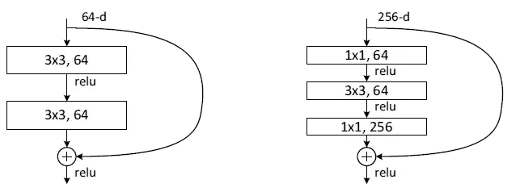

**The Basic Block (Left) and The Proposed Bottleneck Design (Right)**

如图(右)所示， **1×1 conv 层被添加到网络**的起点和终点。这是网络中的网络和 GoogLeNet (Inception-v1)中建议的技术。事实证明， **1×1 conv 可以减少连接(参数)的数量，同时不会使网络性能下降太多。**(有兴趣请访问我的评论。)

**通过瓶颈设计，34 层 ResNet 变成了 50 层 ResNet。**还有**有瓶颈设计的更深网络:** **ResNet-101 和 ResNet-152。**全网整体架构如下:

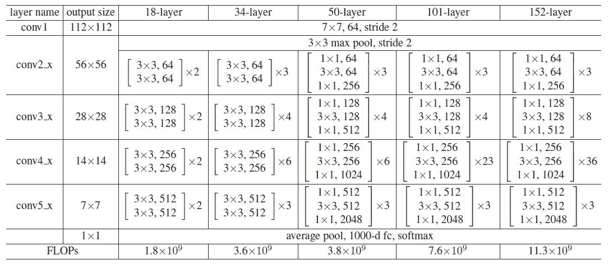

**The overall architecture for all network**

注意到 **VGG-16/19 有 15.3/19.6 亿次 FLOPS。ResNet-152 的复杂度仍然低于 VGG-16/19！！！！**

# 5.消融研究

## 5.1 普通网络与 ResNet

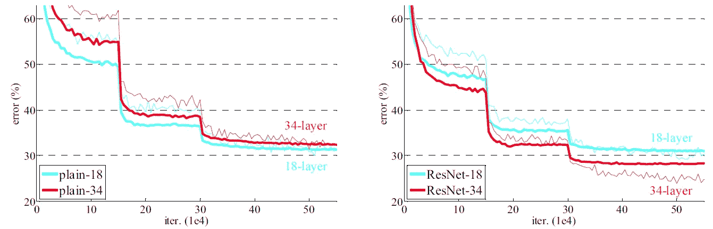

**Validation Error: 18-Layer and 34-Layer Plain Network (Left), 18-Layer and 34-Layer ResNet (right)**

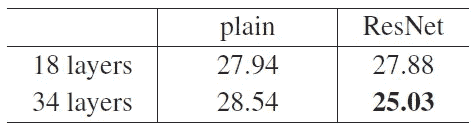

**Top-1 Error Using 10-Crop Testing**

当使用平面网络时，由于消失梯度问题，18 层比 34 层好。

使用 ResNet 时，34 层优于 18 层，通过跳过连接解决了消失梯度问题。

如果对比 18 层的素网和 18 层的 ResNet，没有太大区别。这是因为对于浅层网络不存在消失梯度问题。

## **5.2 其他设置**

**批量归一化**(从 Inception-v2) 用在每次 conv 之后。**使用 10-作物测试**。采用多尺度平均分数的**全卷积形式** **{224，256，384，480，640}** 。 **6 个模型用于集成增强。**以上是之前深度学习框架中使用的一些技术。如果感兴趣，也请随时阅读我的评论。

# **6。与最先进方法的比较(图像分类)**

## **6.1 ILSVRC**

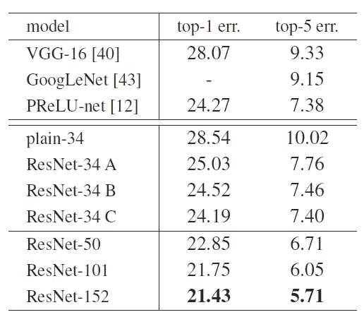

**10-Crop Testing Results**

通过比较 ResNet-34 A、B 和 C， **B 略好于 A，C 略好于 B，因为引入了额外的参数，所有参数的误差率都在 7%左右。**

**通过将网络深度增加到 152 层，获得了 5.71%的 top-5 错误率**，这比 VGG-16、GoogLeNet (Inception-v1)和 PReLU-Net 好得多。

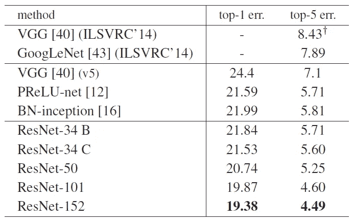

**10-Crop Testing + Fully Conv with Multiple Scale Results**

**ResNet-152 通过 10 次作物测试+多次完全 Conv，可以获得 4.49%的错误率。**

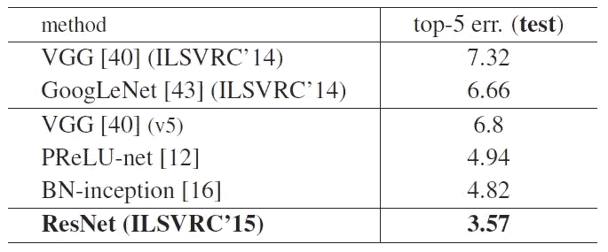

**10-Crop Testing + Fully Conv with Multiple Scale + 6-Model Ensemble Results**

加入 6 模型集成技术，**错误率为 3.57%。**

## 6.2 CIFAR-10

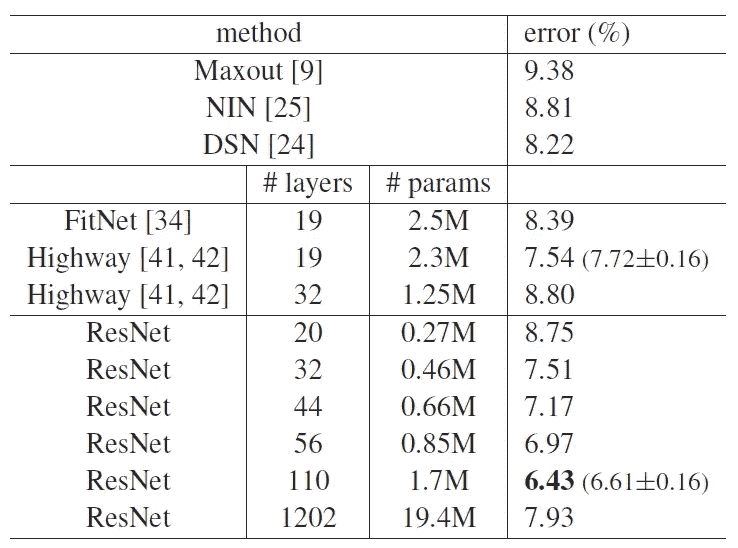

**CIFAR-10 Results**

有了 skip 连接，我们可以更深入。然而，当层数从 110 层增加到 1202 层时，误差率从 6.43%增加到 7.93%，这是一个有待解决的问题。尽管如此，ResNet-1202 不存在优化困难，即它仍然可以收敛。

# **7。与最先进方法的比较(物体检测)**

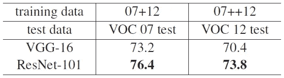

**PASCAL VOC 2007/2012 mAP (%)**

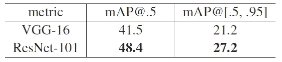

**MS COCO mAP (%)**

**通过在更快的 R-CNN 中采用 ResNet-101，ResNet 获得了比 VGG-16 更好的性能。**

ResNet 最终获得了 ImageNet 检测、定位、COCO 检测和 COCO 分割的第一名！！！

# 参考

1.  【2016 CVPR】【ResNet】
    [用于图像识别的深度残差学习](https://www.cv-foundation.org/openaccess/content_cvpr_2016/papers/He_Deep_Residual_Learning_CVPR_2016_paper.pdf)
2.  【2015 ICLR】【VGGNet】
    [用于大规模图像识别的极深度卷积网络](https://arxiv.org/pdf/1409.1556)
3.  [2015 NIPS][更快的 R-CNN]
    [更快的 R-CNN:通过区域提议网络实现实时目标检测](https://papers.nips.cc/paper/5638-faster-r-cnn-towards-real-time-object-detection-with-region-proposal-networks.pdf)
4.  【2017 TPAMI】【更快的 R-CNN】
    [更快的 R-CNN:利用区域提议网络实现实时对象检测](https://ieeexplore.ieee.org/document/7485869/)

# 我的评论

1.  [回顾:更快的 R-CNN(物体检测)](https://medium.com/@sh.tsang/review-faster-r-cnn-object-detection-f5685cb30202)
2.  [回顾:批量归一化(Inception-v2/BN-Inception)——ILSVRC 2015 中第二个超越人类水平的性能(图像分类)](https://medium.com/@sh.tsang/review-batch-normalization-inception-v2-bn-inception-the-2nd-to-surpass-human-level-18e2d0f56651)
3.  [回顾:在 ILSVRC 2015(图像分类)中第一个超越人类水平性能的 PReLU-Net](https://medium.com/coinmonks/review-prelu-net-the-first-to-surpass-human-level-performance-in-ilsvrc-2015-image-f619dddd5617)
4.  [回顾:Google net(Inception v1)——ILSVRC 2014(图像分类)获奖者](https://medium.com/coinmonks/paper-review-of-googlenet-inception-v1-winner-of-ilsvlc-2014-image-classification-c2b3565a64e7)
5.  [点评:VGGNet—ils vrc 2014 亚军(图像分类)、冠军(本地化)](https://medium.com/coinmonks/paper-review-of-vggnet-1st-runner-up-of-ilsvlc-2014-image-classification-d02355543a11)