# 点评:RES next——ils vrc 2016(图像分类)亚军

> 原文：<https://towardsdatascience.com/review-resnext-1st-runner-up-of-ilsvrc-2016-image-classification-15d7f17b42ac?source=collection_archive---------2----------------------->

## 神经元网络，一种新的维度:基数

在这个故事里， **ResNeXt，**由**加州大学圣地亚哥分校**和**脸书艾研究(FAIR)**进行回顾。模型名称 ResNeXt 包含 NeXt。这意味着*下一个*尺寸，在 [ResNet](/review-resnet-winner-of-ilsvrc-2015-image-classification-localization-detection-e39402bfa5d8) 之上。下一个维度称为“ ***基数***”**维度**。而 ResNeXt 成为 ILSVRC 分类任务的**亚军。**

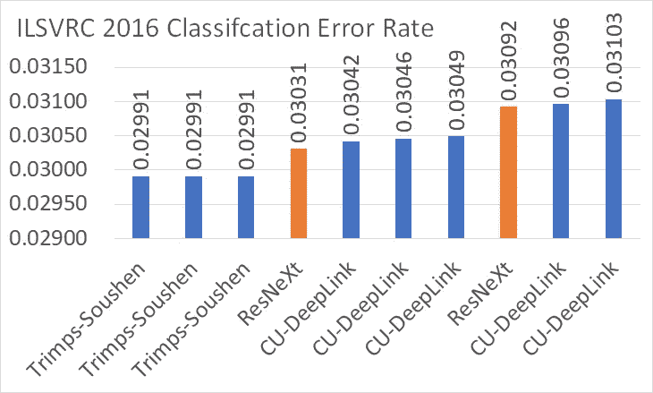

**ILSVRC 2016 Classification Ranking** [http://image-net.org/challenges/LSVRC/2016/results#loc](http://image-net.org/challenges/LSVRC/2016/results#loc)

**Residual Block in ResNet (Left), A Block of ResNeXt with Cardinality = 32 (Right)**

与[ResNet](/review-resnet-winner-of-ilsvrc-2015-image-classification-localization-detection-e39402bfa5d8)(ils vrc 2015 中的冠军，3.57%)和 [PolyNet](/review-polynet-2nd-runner-up-in-ilsvrc-2016-image-classification-8a1a941ce9ea) (亚军，3.04%，队名 CU-DeepLink)相比，ResNeXt 得到了 3.03%的 Top-5 错误率，相对提高了 15%左右的较大幅度！！

这篇文章发表在 **2017 CVPR** 上，在我写这篇文章的时候已经被引用了 **500 次**。( [Sik-Ho Tsang](https://medium.com/u/aff72a0c1243?source=post_page-----15d7f17b42ac--------------------------------) @中)

# 涵盖哪些内容

1.  **聚合转换**
2.  **与** [**的关系 Inception-ResNet**](/review-inception-v4-evolved-from-googlenet-merged-with-resnet-idea-image-classification-5e8c339d18bc) **，以及** [**中的分组卷积 AlexNet**](https://medium.com/coinmonks/paper-review-of-alexnet-caffenet-winner-in-ilsvrc-2012-image-classification-b93598314160)
3.  **完整的架构和消融研究**
4.  **结果**

# 1.聚集变换

## 1.1.重温简单神经元

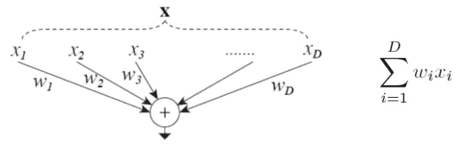

**A Simple Neuron (Left), and the corresponding equation (Right)**

我们应该知道，**一个简单的神经元**如上，其输出是 wi 乘以 xi 的总和。上面的操作可以被改写为**拆分、转换和聚合的组合。**

*   **分裂**:向量 x 被切片为低维嵌入，在上图中，它是一个一维子空间 xi。
*   **变换**:对低维表示进行变换，在上面，简单缩放:wixi。
*   **聚合**:所有嵌入中的变换通过求和来聚合。

## 1.2.聚合转换

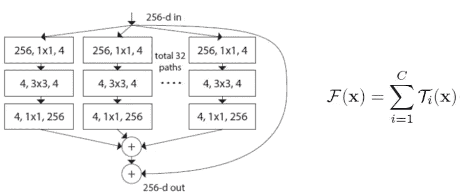

**A Block of ResNeXt with Cardinality = 32 (Left), and Its Generic Equation (Right)**

与“网络中的网络”形成对比的是，“**神经元中的网络**”沿着一个新的维度展开。代替在每个路径中乘以 xi 的简单神经元中的线性函数，**为每个路径执行非线性函数**。

引入了一个新的维度 ***C*** ，称为“**基数**”。基数的维度**控制着更复杂转换的数量**。

# **2。** [**与【Inception-ResNet】**](/review-inception-v4-evolved-from-googlenet-merged-with-resnet-idea-image-classification-5e8c339d18bc)**的关系以及** [**与【AlexNet】**](https://medium.com/coinmonks/paper-review-of-alexnet-caffenet-winner-in-ilsvrc-2012-image-classification-b93598314160)

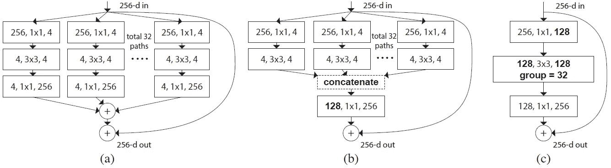

**(a) ResNeXt Block, (b) Inception-ResNet Block, (c) Grouped Convolution**

为了比较，**上述 3 个块在每个块内具有相同的内部尺寸。**

**(a) ResNeXt 块(左)**

*   对于每个路径，**con v1×1–con v3×3–con v1×1**在每个卷积路径上完成。这是 [ResNet](/review-resnet-winner-of-ilsvrc-2015-image-classification-localization-detection-e39402bfa5d8) 块中的瓶颈设计。每个路径的内部尺寸表示为***d*(*d*= 4)**。路径数是**基数 *C* ( *C* =32)** 。如果我们把每个 Conv3×3 的尺寸加起来(即 *d* × *C* =4×32)，也是 128 的尺寸。
*   维度直接从 4 增加到 256，然后加在一起，还加了跳过连接路径。
*   与 [Inception-ResNet](/review-inception-v4-evolved-from-googlenet-merged-with-resnet-idea-image-classification-5e8c339d18bc) 需要将维度从 4 增加到 128 再增加到 256 相比， **ResNeXt 需要最小的额外工作来设计每条路径。**
*   与 [ResNet](/review-resnet-winner-of-ilsvrc-2015-image-classification-localization-detection-e39402bfa5d8) 不同，在 ResNeXt 中，一条路径上的神经元不会连接到其他路径上的神经元。

**(b)** [**【盗梦空间】**](/review-inception-v4-evolved-from-googlenet-merged-with-resnet-idea-image-classification-5e8c339d18bc) **街区(中间)**

*   这在 [Inception-v4](/review-inception-v4-evolved-from-googlenet-merged-with-resnet-idea-image-classification-5e8c339d18bc) 中建议将 [Inception](https://medium.com/coinmonks/paper-review-of-googlenet-inception-v1-winner-of-ilsvlc-2014-image-classification-c2b3565a64e7) 模块和 [ResNet](/review-resnet-winner-of-ilsvrc-2015-image-classification-localization-detection-e39402bfa5d8) 模块合并。由于遗留问题，对于每个卷积路径，首先执行**con v1×1–con v3×3**。当加在一起时(即 4×32)，Conv3×3 的尺寸为 128。
*   然后输出以 128 的维数连接在一起。 **Conv1×1** 用于将尺寸从 128 恢复到 256。
*   最后，使用跳过连接路径添加输出。
*   主要区别在于它们有一个**早期连接**。

**(c)分组卷积**[**AlexNet**](https://medium.com/coinmonks/paper-review-of-alexnet-caffenet-winner-in-ilsvrc-2012-image-classification-b93598314160)**(右)**

*   **con v1×1–con v3×3–con v1×1**在卷积路径上完成，实际上是 [ResNet](/review-resnet-winner-of-ilsvrc-2015-image-classification-localization-detection-e39402bfa5d8) 中提出的一个**瓶颈设计**。Conv3×3 的尺寸为 128。
*   然而，这里使用了 [AlexNet](https://medium.com/coinmonks/paper-review-of-alexnet-caffenet-winner-in-ilsvrc-2012-image-classification-b93598314160) 中建议的**分组卷积**。因此，Conv3×3 是**更宽但连接稀疏的模块。**(因为一条路径上的神经元不会连接到其他路径上的神经元，所以连接稀疏。)
*   因此**有 32 组回旋**。(仅在 [AlexNet](https://medium.com/coinmonks/paper-review-of-alexnet-caffenet-winner-in-ilsvrc-2012-image-classification-b93598314160) 中有 2 组)
*   则跳过连接是并行的，并添加了卷积路径。因此，卷积路径正在学习残差表示。

尽管(b)和(c)中的结构并不总是与 1.2 中所示方程的一般形式相同，实际上作者已经尝试了上述三种结构，他们发现结果是相同的。

最后，作者选择实现(c)中的结构，因为它比其他两种形式更简洁和更快。

# 3.**完整的架构和消融研究**

## 3.1.相似复杂度下 *C* 和 *d* 的烧蚀研究

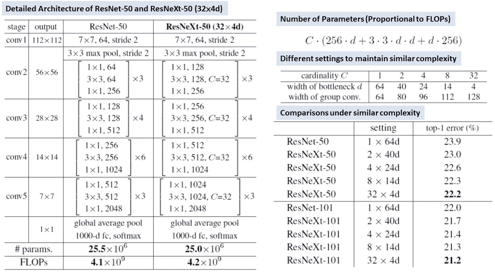

**Detailed Architecture (Left), Number of Parameters for Each Block (Top Right), Different Settings to Maintain Similar Complexity (Middle Right), Ablation Study for Different Settings Under Similar Complexity (Bottom Right)**

*   [ResNet-50](/review-resnet-winner-of-ilsvrc-2015-image-classification-localization-detection-e39402bfa5d8) 是 ResNeXt-50 的特例，其中 *C* =1， *d* =64。
*   为了公平比较，尝试了具有不同 *C* 的不同 ResNeXt 和具有与 [ResNet](/review-resnet-winner-of-ilsvrc-2015-image-classification-localization-detection-e39402bfa5d8) 相似复杂度的 *d* 。这在上图的右中部显示。
*   发现 ResNeXt-50 (32×4d)对 ImageNet-1K (1K 表示 1K 类)数据集获得 22.2%的 top-1 错误，而 [ResNet-50](/review-resnet-winner-of-ilsvrc-2015-image-classification-localization-detection-e39402bfa5d8) 仅获得 23.9%的 top-1 错误。
*   ResNeXt-101 (32×4d)对 ImageNet 数据集获得 21.2%的 top-1 误差，而 [ResNet-101](/review-resnet-winner-of-ilsvrc-2015-image-classification-localization-detection-e39402bfa5d8) 仅获得 22.0%的 top-1 误差。

## 3.2.基数的重要性

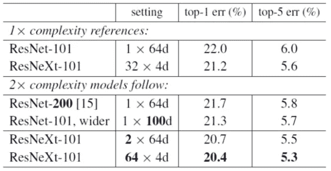

**Ablation Study for Different Settings of 2× Complexity Models**

*   [**ResNet-200**](/review-resnet-winner-of-ilsvrc-2015-image-classification-localization-detection-e39402bfa5d8):21.7%的前 1 名和 5.8%的前 5 名错误率。
*   [**ResNet-101，更宽**](/review-resnet-winner-of-ilsvrc-2015-image-classification-localization-detection-e39402bfa5d8) :仅获得 21.3%的 top-1 和 5.7%的 top-5 错误率，也就是说**只做得更宽并没有太大帮助**。
*   **ResNeXt-101 (2×64d)** :仅通过使***= 2****(即 ResNeXt 块内的两条卷积路径)**已经获得了明显的改善**，top-1 错误率为 20.7%，top-5 错误率为 5.5%。*
*   ***ResNeXt-101 (64×4d)** :通过使***= 64****(即 ResNeXt 块内的 64 个卷积路径)**已经获得了更好的改进**，具有 20.4%的 top-1 和 5.3%的 top-5 错误率。这意味着**基数对于提高分类精度**至关重要。**

## **3.2.剩余连接的重要性**

**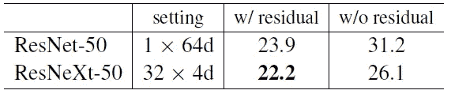**

****Importance of Residual Connections****

**如果没有剩余连接，ResNet-50 和 ResNeXt-50 的错误率都会大大增加。残留连接很重要。**

# **4.结果**

## **4.1.ImageNet-1K**

**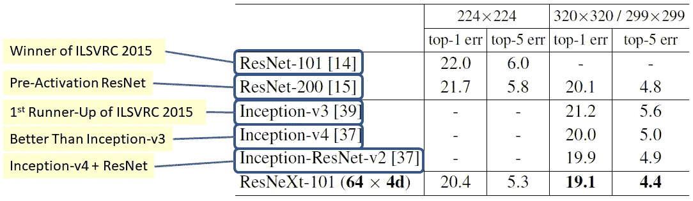**

****Single Crop Testing: ResNet/ResNeXt is 224×224 and 320×320, Inception models: 299×299****

**ImageNet-1K 是 22K 类 ImageNet 数据集的子集，包含 1000 个类。它也是 ILSVRC 分类任务的数据集。**

*   **使用标准尺寸图像进行单作物测试，ResNeXt-101 获得 20.4%前 1 名和 5.3%前 5 名错误率，**
*   **由于使用更大尺寸的图像进行单作物测试，ResNeXt-101 获得了 19.1%的前 1 名和 4.4%的前 5 名错误率，这比所有最先进的方法、 [ResNet](/review-resnet-winner-of-ilsvrc-2015-image-classification-localization-detection-e39402bfa5d8) 、[预激活 ResNet](/resnet-with-identity-mapping-over-1000-layers-reached-image-classification-bb50a42af03e) 、 [Inception-v3](https://medium.com/@sh.tsang/review-inception-v3-1st-runner-up-image-classification-in-ilsvrc-2015-17915421f77c) 、 [Inception-v4](/review-inception-v4-evolved-from-googlenet-merged-with-resnet-idea-image-classification-5e8c339d18bc) 和 [Inception-ResNet-v2](/review-inception-v4-evolved-from-googlenet-merged-with-resnet-idea-image-classification-5e8c339d18bc) 都有更好的结果。**

## **4.2.ImageNet-5K**

**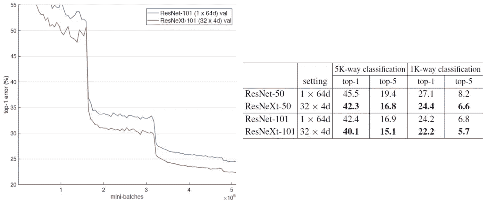**

****ImageNet-5K Results (All trained from scratch)****

**ImageNet-1K 经过这么多年的发展，已经有些饱和了。**

**ImageNet-5K 是 22K 类 ImageNet 数据集的子集，包含 5000 个类，其中也包含 ImageNet-1K 类。**

*   **680 万张图片，是 ImageNet-1K 数据集的 5 倍。**
*   **由于没有正式的训练/验证集，因此使用原始的 ImageNet-1K 验证集进行评估。**
*   ****5K 级别**是超过 5K 级别的**soft max**。因此，当网络在 ImageNet-1K 验证数据集上预测其他 4K 类的标签时，将会出现自动错误。**
*   ****1K 路分类**就是超过 1K 级的**soft max**。**

**ResNeXt 当然得到了比上面显示的 [ResNet](/review-resnet-winner-of-ilsvrc-2015-image-classification-localization-detection-e39402bfa5d8) 更好的结果。**

## **4.3.西法尔-10 和西法尔-100**

**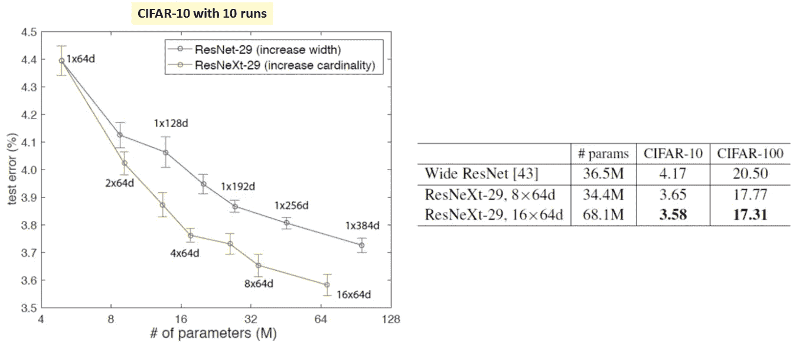**

****CIFAR-10 and CIFAR-100 Results****

**CIFAR-10 & CIFAR-100，两个非常著名的 10 类和 100 类数据集。**

*   **左图:与 [ResNet](/review-resnet-winner-of-ilsvrc-2015-image-classification-localization-detection-e39402bfa5d8) 相比，ResNeXt 在 CIFAR-10 中总是获得更好的成绩。**
*   **右图:与[宽 ResNet (WRN)](/review-wrns-wide-residual-networks-image-classification-d3feb3fb2004) 相比，ResNeXt-29 (16×64d)对于 CIFAR-10 和 CIFAR-100 分别获得 3.58%和 17.31%的误差。这些是当时所有最先进方法中最好的结果。**

## **4.4.MS COCO 对象检测**

**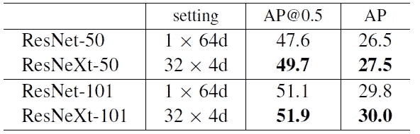**

****MS COCO Objection Detection Results****

*   **通过将 [ResNet](/review-resnet-winner-of-ilsvrc-2015-image-classification-localization-detection-e39402bfa5d8) /ResNeXt 插入[更快的 R-CNN](/review-faster-r-cnn-object-detection-f5685cb30202) ，在相似的模型复杂度下，ResNeXt 在所有 IoU 级别的 AP@0.5 (IoU > 0.5)和 mean AP(平均预测)方面始终优于 [ResNet](/review-resnet-winner-of-ilsvrc-2015-image-classification-localization-detection-e39402bfa5d8) 。**

**随着 ResNeXt 的成功，它也被 Mask R-CNN 用于实例分割。希望我以后也能报道面具 R-CNN。**

## **参考**

**【2017 CVPR】【ResNeXt】
[深度神经网络的聚合残差变换](https://arxiv.org/abs/1611.05431)**

## **我对图像分类的相关综述**

**[[LeNet](https://medium.com/@sh.tsang/paper-brief-review-of-lenet-1-lenet-4-lenet-5-boosted-lenet-4-image-classification-1f5f809dbf17)][[AlexNet](https://medium.com/coinmonks/paper-review-of-alexnet-caffenet-winner-in-ilsvrc-2012-image-classification-b93598314160)][[ZFNet](https://medium.com/coinmonks/paper-review-of-zfnet-the-winner-of-ilsvlc-2013-image-classification-d1a5a0c45103)][[VGGNet](https://medium.com/coinmonks/paper-review-of-vggnet-1st-runner-up-of-ilsvlc-2014-image-classification-d02355543a11)][[SPPNet](https://medium.com/coinmonks/review-sppnet-1st-runner-up-object-detection-2nd-runner-up-image-classification-in-ilsvrc-906da3753679)][[PReLU-Net](https://medium.com/coinmonks/review-prelu-net-the-first-to-surpass-human-level-performance-in-ilsvrc-2015-image-f619dddd5617)][[Google Net/Inception-v1](https://medium.com/coinmonks/paper-review-of-googlenet-inception-v1-winner-of-ilsvlc-2014-image-classification-c2b3565a64e7)][[BN-Inception/Inception-v2](https://medium.com/@sh.tsang/review-batch-normalization-inception-v2-bn-inception-the-2nd-to-surpass-human-level-18e2d0f56651)][[Inception-v3](https://medium.com/@sh.tsang/review-inception-v3-1st-runner-up-image-classification-in-ilsvrc-2015-17915421f77c)][[Inception-v4](/review-inception-v4-evolved-from-googlenet-merged-with-resnet-idea-image-classification-5e8c339d18bc) [ [RoR](/review-ror-resnet-of-resnet-multilevel-resnet-image-classification-cd3b0fcc19bb) ] [ [随机深度](/review-stochastic-depth-image-classification-a4e225807f4a)][[WRN](/review-wrns-wide-residual-networks-image-classification-d3feb3fb2004)][[PolyNet](/review-polynet-2nd-runner-up-in-ilsvrc-2016-image-classification-8a1a941ce9ea)][[dense net](/review-densenet-image-classification-b6631a8ef803)]**

## **我对物体检测的相关评论**

**[ [更快的 R-CNN](/review-faster-r-cnn-object-detection-f5685cb30202)**