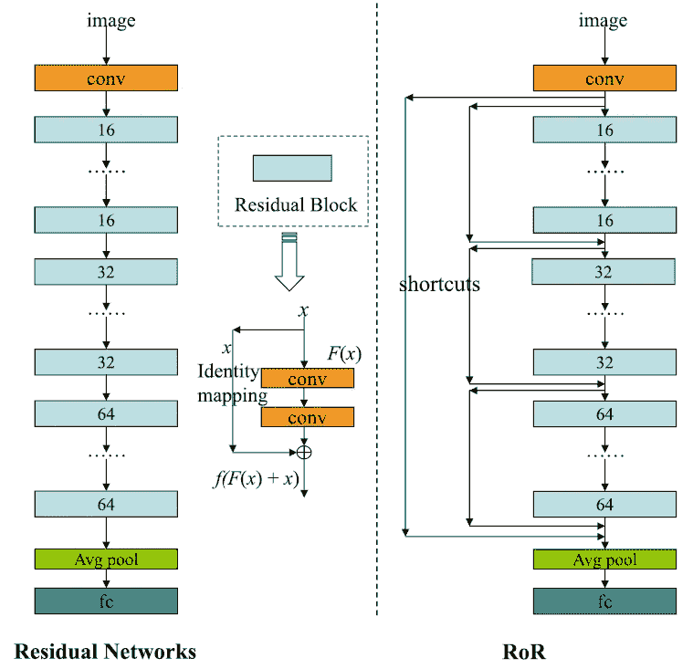
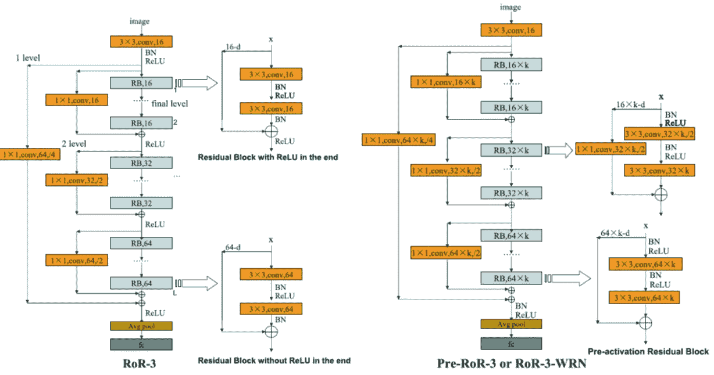
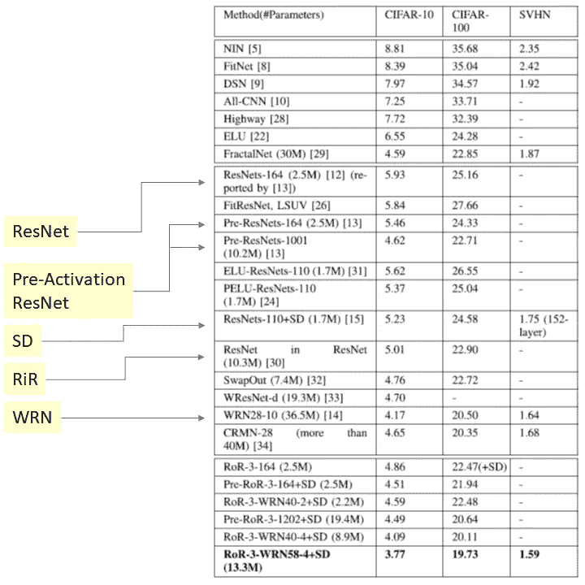
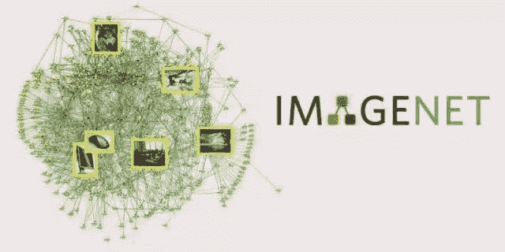
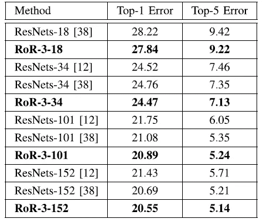

# 回顾:RoR—ResNet/多级 ResNet(图像分类)

> 原文：<https://towardsdatascience.com/review-ror-resnet-of-resnet-multilevel-resnet-image-classification-cd3b0fcc19bb?source=collection_archive---------15----------------------->

## 残差网络的一种改进形式

在这个故事里，**【残网】**是短暂的回顾。ResNet 作为一种先进的深度学习方法获得成功并赢得众多的识别竞赛后，有许多研究致力于如何推广或改进 [ResNet](/review-resnet-winner-of-ilsvrc-2015-image-classification-localization-detection-e39402bfa5d8) ，如[预激活 ResNet](/resnet-with-identity-mapping-over-1000-layers-reached-image-classification-bb50a42af03e) 、ResNet (RiR)中的[ResNet](https://medium.com/@sh.tsang/review-rir-resnet-in-resnet-image-classification-be4c79fde8ba)、具有随机深度(SD)的[ResNet](/review-stochastic-depth-image-classification-a4e225807f4a)、[宽残差网络(WRN)](/review-wrns-wide-residual-networks-image-classification-d3feb3fb2004) 。RoR 是另一篇改进 ResNet 的论文，他们引入了一个概念，即一组 ResNet 块也可以有一个快捷连接。这使得一个网络成为**多级分层 ResNet** 。这是一篇 2016 年在 ResNet 之后首次出现，2017 年被接受，最近终于发表在 **2018 TCSVT** 上的论文，已经被引用了几十次。( [Sik-Ho Tsang](https://medium.com/u/aff72a0c1243?source=post_page-----cd3b0fcc19bb--------------------------------) @中)

# 涵盖哪些内容

1.  **RoR 概念(残差网络中的残差网络)**
2.  **RoR- *m* :级别编号*m***
3.  **不同版本的 RoR**
4.  **结果**

# **1。RoR 概念(残差网络的残差网络)**

**Original ResNet (Left), RoR (Right)**

[**原 ResNet**](/review-resnet-winner-of-ilsvrc-2015-image-classification-localization-detection-e39402bfa5d8) 如左上所示，无数的残差块级联在一起，形成了一个非常深的网络。

在残差块中，有两条路径:

*   **卷积路径**执行卷积以提取特征
*   **快捷连接路径**将输入信号直接传输到下一层。

利用捷径连接路径，可以减少梯度消失问题，因为误差信号可以在反向传播期间更容易地传播到早期层。

**RoR** 如右上方所示，提出我们也可以有跨越一组剩余区块的捷径连接。在此之上，我们还可以有跨越一组“剩余块组”的另一个级别的快捷连接。

作者认为:

*   RoR 把学习问题转移到**学习剩余映射**的剩余映射，比[原 ResNet](/review-resnet-winner-of-ilsvrc-2015-image-classification-localization-detection-e39402bfa5d8) 的**简单易学。**
*   并且上部块中的**层也可以将信息传播到下部块中的层**。

# 2.RoR- *m* :级别号 *m*

**级别编号*m*介绍:**

*   当 ***m* = 1** 时，RoR 只有**末级**快捷方式，即原剩余网络。
*   当 ***m* = 2** 时，RoR 只有**根级**(最外层)，以及**末级**快捷方式。
*   当 ***m* = 3** 时，RoR 有**根级**、**中层**、**末级**快捷方式。

对于中层快捷方式，每个快捷方式将跨越具有相同大小的特征图的剩余块。

并且也测试了 m = 4 和 5，但是在论文中没有关于它的任何细节。尽管如此，与 m*m*= 3 相比，结果还是不够好。

# 3.不同版本的 RoR

**RoR-3 Using Original ResNet (Left), RoR-3 Using Pre-Activation ResNet or WRN (Right)**

如上所示，RoR 适用于 ResNet 的不同版本。

*   **RoR-3** : RoR 使用[原装 ResNet](/review-resnet-winner-of-ilsvrc-2015-image-classification-localization-detection-e39402bfa5d8) 带 *m* =3
*   **预 RoR-3** : RoR 使用[预激活 ResNet](/resnet-with-identity-mapping-over-1000-layers-reached-image-classification-bb50a42af03e) ，其中 *m* =3
*   **RoR-3-WRN** : RoR 用 [WRN 用](/review-wrns-wide-residual-networks-image-classification-d3feb3fb2004)m= 3

简单来说，RoR-3 使用 Conv-BN-ReLU。前 RoR-3 使用 BN-ReLU-Conv，而 [WRN](/review-wrns-wide-residual-networks-image-classification-d3feb3fb2004) 是前 RoR-3 的更宽更浅的版本。(如果有兴趣，请阅读我对[原创 ResNet](/review-resnet-winner-of-ilsvrc-2015-image-classification-localization-detection-e39402bfa5d8) 、[预激活 ResNet](/resnet-with-identity-mapping-over-1000-layers-reached-image-classification-bb50a42af03e) 、 [WRN](/review-wrns-wide-residual-networks-image-classification-d3feb3fb2004) 的评论。)

# 4.结果

## **4.1。CIFAR-10、CIFAR-100、SVHN**

*   **CIFAR-10** : 10 级数据集
*   **CIFAR-100** : 100 级数据集
*   **SVHN** :街景门牌号数据集

**Test Error (%) on CIFAR-10, CIFAR-100, SVHN Dataset**

*   **RoR-3-164** :通过**将 RoR 应用于 164 层** [**原始 ResNet**](/review-resnet-winner-of-ilsvrc-2015-image-classification-localization-detection-e39402bfa5d8) ， **4.86%** ， **22.47%** (+SD 表示使用[随机深度](/review-stochastic-depth-image-classification-a4e225807f4a)，以减少过拟合)分别得到 CIFAR-10 和 CIFAR-100 数据集的测试误差。(164 是模型深度。)
*   **Pre-RoR-3-164+SD** :通过**将 RoR 替换为** [**预激活 ResNet**](/resnet-with-identity-mapping-over-1000-layers-reached-image-classification-bb50a42af03e) ， **4.51%** 和 **21.94%** 分别得到 CIFAR-10 和 CIFAR–100 数据集的测试误差。
*   **RoR-3–wrn 40–4+SD**:通过**将** [**预激活 ResNet**](/resnet-with-identity-mapping-over-1000-layers-reached-image-classification-bb50a42af03e) **替换为更宽的 40 层**[**wrn 40–4**](http://WRN)**4.09%**和 **20.11%** 得到 CIFAR-10 和 CIFAR–100 数据集的测试误差
*   **RoR-3–wrn 58–4+SD**:用**更深的 58 层**[**【WRN-58–4**](http://WRN)**3.77%****19.73%**分别得到了 CIFAR-10 和 CIFAR–100 数据集的测试误差。

## 4.2.ImageNet

ImageNet:ils vrc 中的 1000 级大规模数据集。

**10-Crop Testing of Validation Error (%) on ImageNet Dataset**

RoR-3 的不同层版本始终优于 ResNet 的不同层版本。

文中有详细的烧蚀实验。如果有兴趣，请访问该文件。

使用长短跳跃连接的类似方法也已经应用于生物医学图像分割。希望我也能报道它。

## 参考

【2018 TCSVT】【RoR】
[残差网络残差网络:多级残差网络](https://arxiv.org/abs/1608.02908)

## 我对图像分类的相关综述

[[LeNet](https://medium.com/@sh.tsang/paper-brief-review-of-lenet-1-lenet-4-lenet-5-boosted-lenet-4-image-classification-1f5f809dbf17)][[AlexNet](https://medium.com/coinmonks/paper-review-of-alexnet-caffenet-winner-in-ilsvrc-2012-image-classification-b93598314160)][[ZFNet](https://medium.com/coinmonks/paper-review-of-zfnet-the-winner-of-ilsvlc-2013-image-classification-d1a5a0c45103)][[VGGNet](https://medium.com/coinmonks/paper-review-of-vggnet-1st-runner-up-of-ilsvlc-2014-image-classification-d02355543a11)][[SPPNet](https://medium.com/coinmonks/review-sppnet-1st-runner-up-object-detection-2nd-runner-up-image-classification-in-ilsvrc-906da3753679)][[PReLU-Net](https://medium.com/coinmonks/review-prelu-net-the-first-to-surpass-human-level-performance-in-ilsvrc-2015-image-f619dddd5617)][[Google Net/Inception-v1](https://medium.com/coinmonks/paper-review-of-googlenet-inception-v1-winner-of-ilsvlc-2014-image-classification-c2b3565a64e7)][[BN-Inception/Inception-v2](https://medium.com/@sh.tsang/review-batch-normalization-inception-v2-bn-inception-the-2nd-to-surpass-human-level-18e2d0f56651)][[Inception-v3](https://medium.com/@sh.tsang/review-inception-v3-1st-runner-up-image-classification-in-ilsvrc-2015-17915421f77c)][[Inception-v4](/review-inception-v4-evolved-from-googlenet-merged-with-resnet-idea-image-classification-5e8c339d18bc)