# 点评:sharp mask—2015 年 COCO 细分(实例细分)亚军

> 原文：<https://towardsdatascience.com/review-sharpmask-instance-segmentation-6509f7401a61?source=collection_archive---------12----------------------->

## **一个细化模块，一个编码器解码器架构**由**脸书 AI Research (FAIR)**

在这个故事里， **SharpMask** ，由**脸书 AI Research (FAIR)** 进行点评。**编码器解码器架构**从 2016 年开始普及。通过将自顶向下传递的特征映射连接到自底向上传递的特征映射，可以进一步提高性能。

*   **对象检测**:识别对象类别，并使用图像中每个已知对象的边界框定位位置。
*   **语义分割**:为图像中每个已知的物体识别每个像素的物体类别。**标签是类感知的。**
*   **实例分割**:识别图像中每个已知对象的每个像素的每个对象实例。标签是实例感知的。

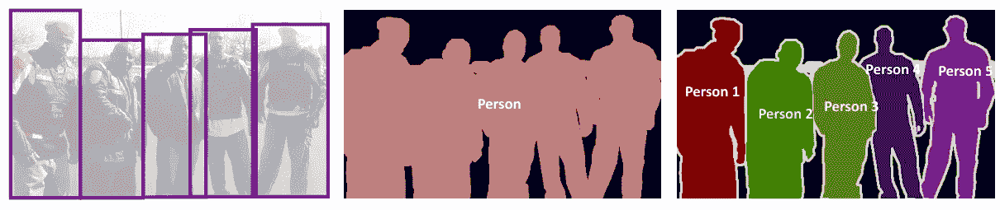

**Object Detection (Left), Semantic Segmentation (Middle), Instance Segmentation**

SharpMask 在 MS COCO 分段挑战中获得**第二名，在 MS COCO 检测挑战**中获得**第二名。已在 **2016 ECCV** 发表，引用 **200 余次**。( [Sik-Ho Tsang](https://medium.com/u/aff72a0c1243?source=post_page-----6509f7401a61--------------------------------) @中)**

*   MS COCO 的平均召回率提高了 10–20%。
*   通过优化架构，速度比 [DeepMask](/review-deepmask-instance-segmentation-30327a072339) 提升 50%。
*   通过使用额外的图像比例，小物体召回率提高了约 2 倍。
*   通过将 SharpMask 应用到[快速 R-CNN](https://medium.com/coinmonks/review-fast-r-cnn-object-detection-a82e172e87ba) 上，对象检测结果也得到改善。

# 涵盖哪些内容

1.  **编码器解码器架构**
2.  **一些细节**
3.  **架构优化**
4.  **结果**

# **1。编码器解码器架构**

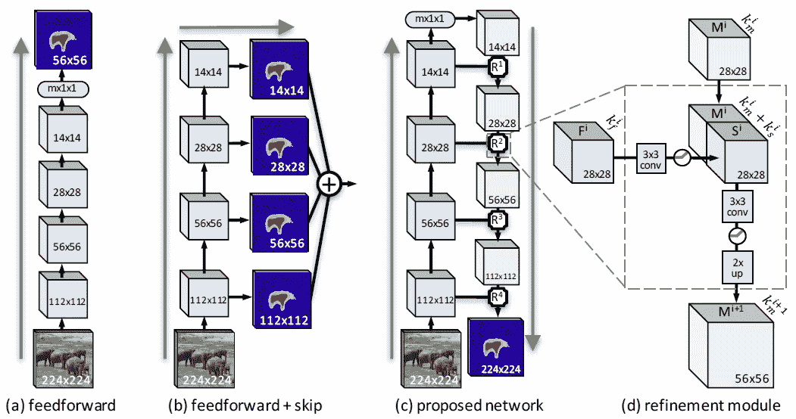

**Architectures for Instance Segmentation**

## (一)传统的前馈网络

*   该网络包含**一系列卷积层**与**汇集阶段交错，减少了特征图的空间维度**，随后是一个全连接层以生成对象遮罩。因此，每个像素预测都基于对象的完整视图，然而，由于多个池阶段，其**输入特征分辨率较低。**
*   这种网络架构类似于[深度屏蔽](/review-deepmask-instance-segmentation-30327a072339)方法。

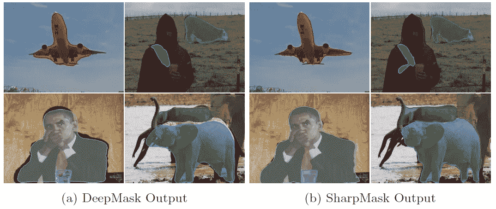

*   [深度蒙版](/review-deepmask-instance-segmentation-30327a072339)仅粗略对齐对象边界。
*   **锐化掩模产生更清晰、像素精确的对象掩模。**

## (b)多尺度网络

*   这种架构相当于从每个网络层进行独立预测，并对结果进行上采样和平均。
*   这种网络架构类似于 [FCN](/review-fcn-semantic-segmentation-eb8c9b50d2d1) 和[累积视觉 1](https://medium.com/datadriveninvestor/review-cumedvision1-fully-convolutional-network-biomedical-image-segmentation-5434280d6e6) 方法(注意:它们不是用于实例分割)。

## (c)编码器解码器网络和(d)细化模块

*   在自底向上通过(网络左侧)的一系列**卷积之后，特征图非常小。**
*   这些特征图在自上而下的通道(网络的右侧)**使用 2 倍双线性插值进行 **3×3 卷积和逐渐上采样** **。****
*   除此之外，在上采样之前，在自下而上的过程中的对应的相同大小的特征图 ***F*** 被**连接**到自上而下的过程中的掩模编码特征图 ***M*** 。
*   **在每次拼接之前，还要对 *F* 进行 3×3 卷积**，以**减少特征图**的数量，因为直接拼接计算量很大。
*   串联也被用于许多深度学习方法，如著名的 [U-Net](/review-u-net-biomedical-image-segmentation-d02bf06ca760) 。
*   并且作者重构了精化模块，这导致了更有效的实现，如下所示:

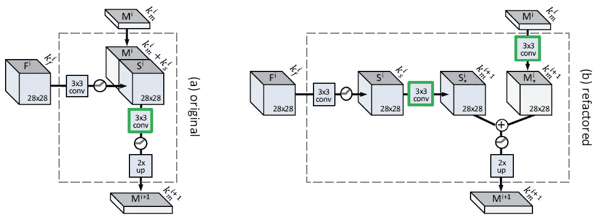

**(a) Original (b) Refactored but equivalent model that leads to a more effcient implementation**

# **2。一些细节**

使用 ImageNet-预训练的 50 层 [ResNet](/review-resnet-winner-of-ilsvrc-2015-image-classification-localization-detection-e39402bfa5d8) 。

## 两阶段训练

首先，模型被训练以使用前馈路径联合推断粗略的逐像素分割掩模和对象分数。第二，前馈路径被“冻结”并且精化模块被训练。

*   可以获得更快的收敛。
*   我们可以仅使用前向路径得到粗略的掩码，或者使用自下而上和自上而下的路径得到清晰的掩码。
*   一旦前向分支已经收敛，整个网络的微调增益是最小的。

## 在全图推理过程中

*   只有最有希望的位置被细化。优化了前 N 个评分建议窗口。

# 3.**架构优化**

要求降低网络的复杂性。并且发现[deep mask](/review-deepmask-instance-segmentation-30327a072339)40%的时间用于特征提取，40%用于掩膜预测，20%用于评分预测。

## 3.1.主干架构

*   **输入尺寸 *W*** :减小 W 会降低步幅密度 S，从而进一步损害准确性。
*   **汇集层 *P*** :更多的汇集层 P 导致更快的计算，但也导致特征分辨率的损失。
*   **步幅密度 *S*** :在保持 W 不变的情况下使步幅加倍会大大降低性能
*   **深度 *D***
*   **特征通道 *F***

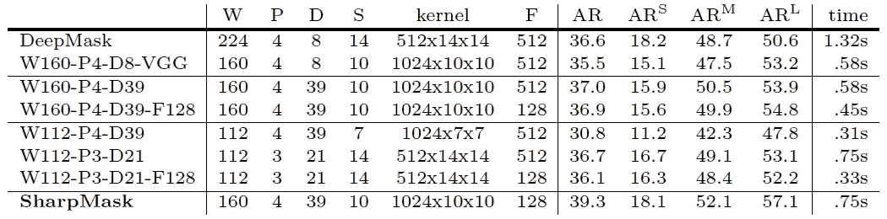

**Results for Various W, P, D, S, F**

*   **W160-P4-D39-F128:** 获得速度和精度的权衡。
*   最上面一行和最后一行分别是使用不包括时间分数预测时间的多尺度推理的[深度掩码](/review-deepmask-instance-segmentation-30327a072339)和夏普掩码(即 W160-P4-D39-F128)的定时。
*   [深度蒙版](/review-deepmask-instance-segmentation-30327a072339)和锐度蒙版的总时间分别为每张图像 1.59 秒和 0.76 秒。这意味着[深度遮罩](/review-deepmask-instance-segmentation-30327a072339)和锐度遮罩的 FPS 分别约为 0.63 FPS 和 1.32 FPS。

## 3.2.头部结构

头部架构也消耗了模型的一定复杂度。

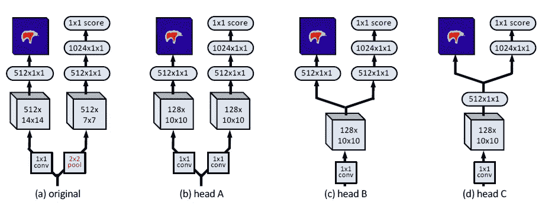

**Various Head Architecture**

*   (a):原始[深度遮罩](/review-deepmask-instance-segmentation-30327a072339)头部架构获取遮罩并评分。
*   (b)到(d):各种公共共享 conv 和全连接层，以获得遮罩和分数。

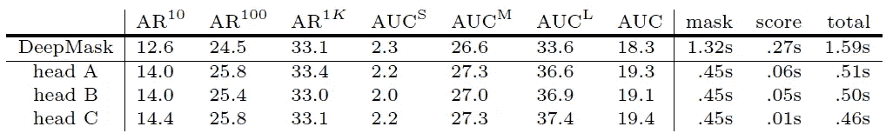

**Results for Various Head ARchitectures**

*   选择磁头 C 是因为其简单性和时间性。

## 3.3.不同 Conv 的特征地图数量

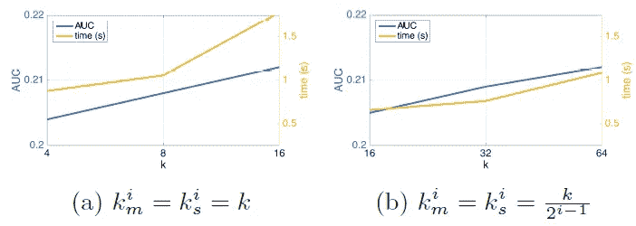

*   (a)对于所有卷积，特征图的数量是相同的。
*   (b)特征图的数量沿自下而上的路径减少，沿自上而下的路径增加。
*   和(b)具有更短的推断时间和相似的 AUC(在 10，100，1000 个建议时 ar 的平均值)。

# 4.结果

## 4.1.COCO 女士细分

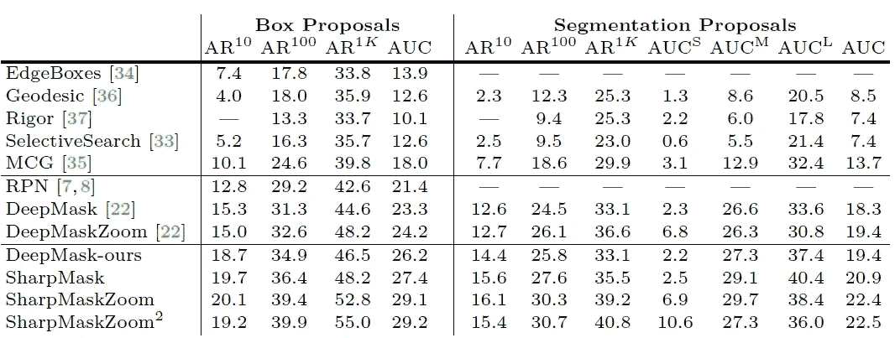

**Results on MS COCO Segmentation**

*   **深面具-我们的** : [深面具](/review-deepmask-instance-segmentation-30327a072339)躯干和头部优化，比[深面具](/review-deepmask-instance-segmentation-30327a072339)好。
*   比以前最先进的方法更好
*   **SharpMaskZoom&SharpMaskZoom**:带有一个或两个额外的更小的缩放比例，并实现了对小对象的 AR 的大幅提升。

## 4.2.2015 年可可小姐挑战赛中的物体检测和结果

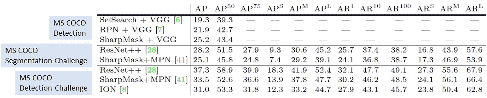

**Results on MS COCO**

## 顶端

*   通过对以 [VGGNet](https://medium.com/coinmonks/paper-review-of-vggnet-1st-runner-up-of-ilsvlc-2014-image-classification-d02355543a11) 为特征提取主干的[快速 R-CNN](https://medium.com/coinmonks/review-fast-r-cnn-object-detection-a82e172e87ba) 应用 SharpMask，即第三行 SharpMask+VGG，比选择性搜索(即原来的 [**快速 R-CNN**](https://medium.com/coinmonks/review-fast-r-cnn-object-detection-a82e172e87ba) **)和 RPN(区域建议网络，即** [**更快 R-CNN**](/review-faster-r-cnn-object-detection-f5685cb30202)

## 中间

*   SharpMask+MPN(另一个主干称为 MultiPathNet)，它在 COCO 女士分割挑战中获得**第二名。**

## 底部

*   夏普面具+MPN，在可可小姐探测挑战中获得**第二名，比[离子](/review-ion-inside-outside-net-2nd-runner-up-in-2015-coco-detection-object-detection-da19993f4766)强。**

但那一刻 SharpMask 只用 [VGGNet](https://medium.com/coinmonks/paper-review-of-vggnet-1st-runner-up-of-ilsvlc-2014-image-classification-d02355543a11) 做骨干。因此，结果是低劣的。

## 4.3.定性结果

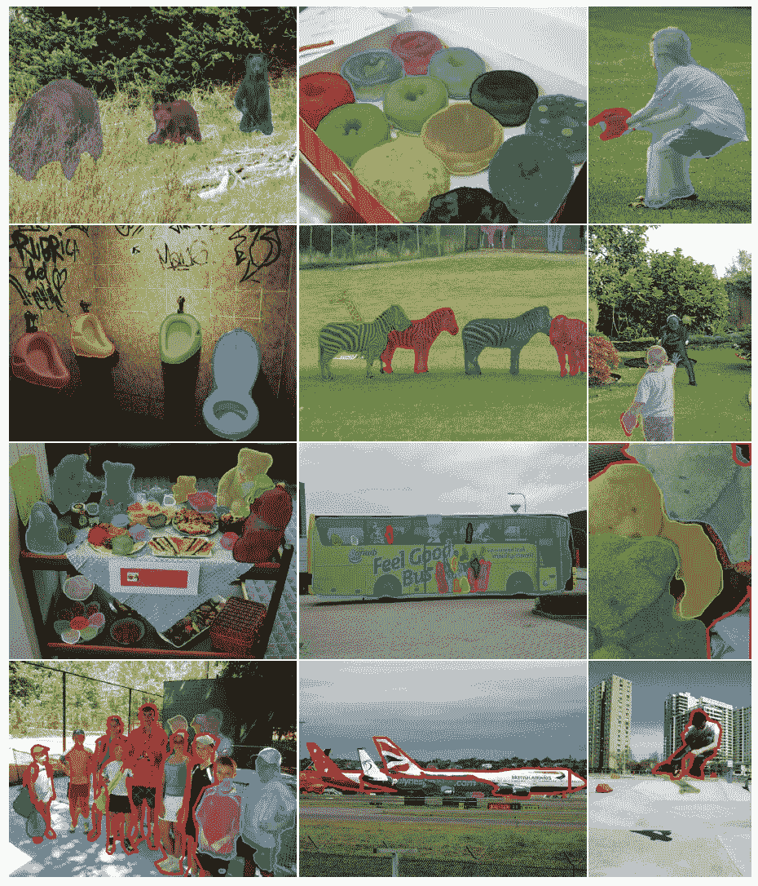

**SharpMask proposals with highest IoU to the ground truth on selected COCO images. Missed objects (no matching proposals with IoU > 0:5) are marked in red. The last row shows a number of failure cases.**

通过逐渐上采样，早期特征图与后期特征图连接，SharpMask 优于 [DeepMask](/review-deepmask-instance-segmentation-30327a072339) 。

## 参考

【2016 ECCV】【sharp mask】
[学习提炼对象片段](https://arxiv.org/abs/1603.08695)

## 我的相关评论

)(我)(们)(都)(不)(想)(到)(这)(些)(人)(,)(我)(们)(都)(不)(想)(要)(到)(这)(些)(人)(,)(但)(是)(这)(些)(人)(还)(不)(想)(到)(这)(些)(人)(,)(我)(们)(还)(没)(想)(到)(这)(些)(事)(,)(我)(们)(就)(想)(到)(了)(这)(些)(人)(们)(,)(我)(们)(们)(都)(不)(想)(要)(到)(这)(些)(人)(,)(但)(我)(们)(还)(没)(想)(到)(这)(些)(事)(,)(我)(们)(还)(没)(想)(到)(这)(里)(来)(。 )(我)(们)(都)(不)(知)(道)(,)(我)(们)(还)(是)(不)(知)(道)(,)(我)(们)(还)(是)(不)(知)(道)(,)(我)(们)(还)(是)(不)(知)(道)(,)(我)(们)(还)(是)(不)(知)(道)(,)(我)(们)(还)(是)(不)(知)(道)(,)(我)(们)(还)(是)(不)(知)(道)(,)(我)(们)(还)(是)(不)(知)(道)(。

**物体检测** [过食](https://medium.com/coinmonks/review-of-overfeat-winner-of-ilsvrc-2013-localization-task-object-detection-a6f8b9044754)[R-CNN](https://medium.com/coinmonks/review-r-cnn-object-detection-b476aba290d1)[快 R-CNN](https://medium.com/coinmonks/review-fast-r-cnn-object-detection-a82e172e87ba)[快 R-CNN](/review-faster-r-cnn-object-detection-f5685cb30202)[DeepID-Net](/review-deepid-net-def-pooling-layer-object-detection-f72486f1a0f6)】[R-FCN](/review-r-fcn-positive-sensitive-score-maps-object-detection-91cd2389345c)】[yolo v1](/yolov1-you-only-look-once-object-detection-e1f3ffec8a89)[SSD](/review-ssd-single-shot-detector-object-detection-851a94607d11)[yolo v2/yolo 9000](/review-yolov2-yolo9000-you-only-look-once-object-detection-7883d2b02a65)

**语义切分
[[FCN](/review-fcn-semantic-segmentation-eb8c9b50d2d1)][[de convnet](/review-deconvnet-unpooling-layer-semantic-segmentation-55cf8a6e380e)][[deeplabv 1&deeplabv 2](/review-deeplabv1-deeplabv2-atrous-convolution-semantic-segmentation-b51c5fbde92d)][[parse net](https://medium.com/datadriveninvestor/review-parsenet-looking-wider-to-see-better-semantic-segmentation-aa6b6a380990)][[dilated net](/review-dilated-convolution-semantic-segmentation-9d5a5bd768f5)][[PSPNet](/review-pspnet-winner-in-ilsvrc-2016-semantic-segmentation-scene-parsing-e089e5df177d)]**

**生物医学图像分割** [cumed vision 1](https://medium.com/datadriveninvestor/review-cumedvision1-fully-convolutional-network-biomedical-image-segmentation-5434280d6e6)[cumed vision 2/DCAN](https://medium.com/datadriveninvestor/review-cumedvision2-dcan-winner-of-2015-miccai-gland-segmentation-challenge-contest-biomedical-878b5a443560)[U-Net](/review-u-net-biomedical-image-segmentation-d02bf06ca760)[CFS-FCN](https://medium.com/datadriveninvestor/review-cfs-fcn-biomedical-image-segmentation-ae4c9c75bea6)

**实例分割** [深度遮罩](/review-deepmask-instance-segmentation-30327a072339)