# 回顾:固态硬盘—单次检测器(物体检测)

> 原文：<https://towardsdatascience.com/review-ssd-single-shot-detector-object-detection-851a94607d11?source=collection_archive---------2----------------------->

T his time， **SSD(单发探测器)**回顾。通过使用 SSD，我们只需要**拍摄一张照片来检测图像内的多个对象**，而基于区域提议网络(RPN)的方法，如 [R-CNN](https://medium.com/coinmonks/review-r-cnn-object-detection-b476aba290d1) 系列，需要拍摄两张照片，一张用于生成区域提议，一张用于检测每个提议的对象。因此，与基于双镜头 RPN 的方法相比，SSD 要快得多。

**SSD300 在 59 FPS 时实现了 74.3%的 mAP**，而 **SSD500 在 22 FPS 时实现了 76.9%的 mAP**，其性能优于[更快的 R-CNN(7 FPS 时 73.2%的 mAP)](/review-faster-r-cnn-object-detection-f5685cb30202)和[yolov 1(45 FPS 时 63.4%的 mAP)](/yolov1-you-only-look-once-object-detection-e1f3ffec8a89)。下面是一个使用 MobileNet 进行特征提取的 SSD 示例:

**SSD**

从上面我们可以看到惊人的**实时性能**。而 SSD 是我写这个故事的时候 **2016 ECCV** 一篇超过 **2000 引用**的论文。( [Sik-Ho Tsang](https://medium.com/u/aff72a0c1243?source=post_page-----851a94607d11--------------------------------) @中)

# 涵盖哪些内容

1.  **多箱探测器**
2.  **SSD 网络架构**
3.  **损失函数**
4.  **默认框的比例和长宽比**
5.  **培训的一些细节**
6.  **结果**

# 1.**多箱探测器**

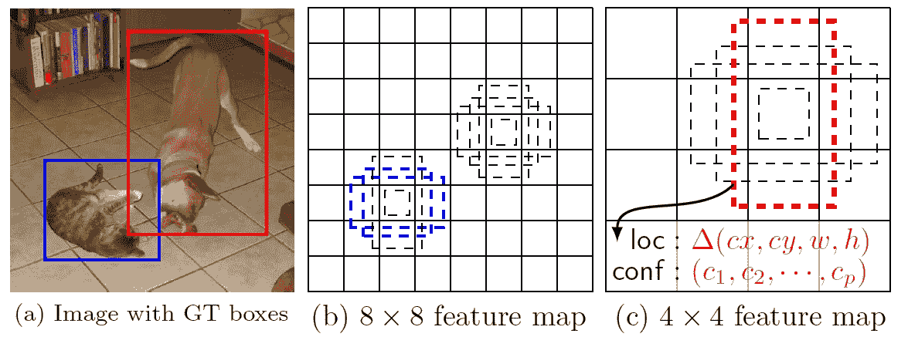

**SSD: Multiple Bounding Boxes for Localization (loc) and Confidence (conf)**

*   经过一定的卷积进行特征提取后，我们得到**一个尺寸为 *m* × *n* (位置数)的特征层，具有 *p* 通道**，如上面的 8×8 或 4×4。并且在这个*m*×*n*×*p*特征层上应用 3×3 conv。
*   对于每个位置，我们得到了 k 个包围盒。这些 k 个边界框具有不同的大小和纵横比。这个概念是，也许一个垂直的长方形更适合人类，一个水平的长方形更适合汽车。
*   **对于每个边界框，我们将计算 *c* 类分数和相对于原始默认边界框形状的 4 个偏移量。**
*   因此，我们得到了**(*c*+4)*kmn*输出。**

这也是论文被称为“SSD:单拍**多盒**探测器”的原因。但以上只是 SSD 的一部分。

# 2. **SSD 网络架构**

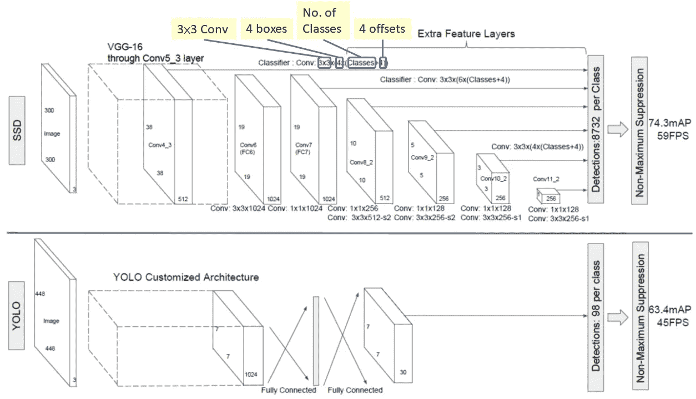

**SSD (Top) vs YOLO (Bottom)**

为了有更精确的检测，不同层的特征图也通过一个小的 3×3 卷积来进行对象检测，如上所示。

*   比如说**在 Conv4_3，尺寸是 38×38×512** 。**采用 3×3 conv。**并且有 **4 个边界框**和**每个边界框将有(类+ 4)个输出**。因此，在 Conv4_3，输出为 38×38×4×( *c* +4)。假设有 20 个对象类加上一个背景类，输出为 38×38×4×(21+4)= 144400。**就包围盒的数量而言，有 38×38×4 = 5776 个包围盒。**
*   类似地，对于其他 conv 层:
*   Conv7: 19×19×6 = 2166 盒(每个位置 6 盒)
*   Conv8_2: 10×10×6 = 600 盒(每个位置 6 盒)
*   Conv9_2: 5×5×6 = 150 盒(每个位置 6 盒)
*   Conv10_2: 3×3×4 = 36 盒(每个位置 4 盒)
*   Conv11_2: 1×1×4 = 4 盒(每个位置 4 盒)

如果把它们加起来，我们总共得到了 5776+2166+600+150+36+4 =**8732 箱**。如果我们记得 YOLO，最后有 7×7 个位置，每个位置有 2 个边界框。YOLO 只有 7×7×2 = 98 盒。因此 **SSD 有 8732 个包围盒，比 YOLO** 多。

# 3.损失函数

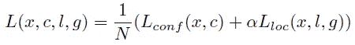

损失函数包括两项:Lconf 和 Lloc，其中 N 是匹配的默认框。匹配的默认框

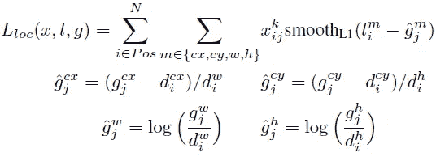

**Localization Loss**

Lloc 是定位损失，它是预测框(l)和地面实况框(g)参数之间的平滑 L1 损失。这些参数包括边界框的中心点(cx，cy)、宽度(w)和高度(h)的偏移量。这种损失与更快的 R-CNN 中的损失类似。

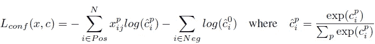

**Confidence Loss**

Lconf 是置信度损失，它是多个类别置信度(c)的软最大损失。(通过交叉验证将α设置为 1。) *xij^p* = {1，0}，是将类别 *p* 的第 *i* 个默认框匹配到第 *j* 个真实框的指示器。

# **4。**默认框的比例和长宽比

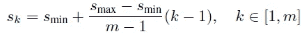

**Scale of Default Boxes**

假设我们有 *m* 个特征图用于预测，我们可以计算第 *k* 个特征图的 *Sk* 。Smin 是 0.2，Smax 是 0.9。这意味着最低层的比例为 0.2，最高层的比例为 0.9。中间的所有层都是规则间隔的。

对于每个比例 sk，我们有 5 个非方形纵横比:

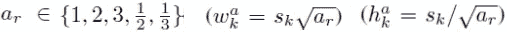

**5 Non-Square Bounding Boxes**

对于 1:1 的纵横比，我们得到 sk ':

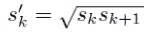

**1 Square Bounding Box**

因此，我们总共最多可以有 6 个不同纵横比的边界框。对于只有 4 个边界框的层，ar = 1/3，省略 3。

# 5.训练的一些细节

## 5.1 硬负开采

我们没有使用所有的负面例子，而是使用每个默认框的最高置信损失对它们进行排序，并挑选出顶部的例子，这样负面和正面之间的比率最多为 3:1。

这可以导致**更快的优化**和**更稳定的训练**。

## 5.2 数据扩充

每个训练图像通过以下方式随机采样:

*   整个原始输入图像
*   对面片进行采样，使其与对象的重叠为 0.1、0.3、0.5、0.7 或 0.9。
*   随机抽取补丁样本

每个采样面片的**大小为【0.1，1】**或原始图像大小，**纵横比从 1/2 到 2** 。在上述步骤之后，每个采样的小块将被**调整到固定的大小**，并且除了一些**光度量失真**【14】之外，还可能以 0.5 的概率**水平翻转。**

## 5.3 阿特鲁卷积(空洞算法/扩张卷积)

基本网络是 [VGG16](https://medium.com/coinmonks/paper-review-of-vggnet-1st-runner-up-of-ilsvlc-2014-image-classification-d02355543a11) ，并使用 ILSVRC 分类数据集进行预训练。 **FC6 和 FC7 变为卷积层，分别为 Conv6 和 Conv7** ，如上图所示。

此外， **FC6 和 FC7 使用阿特鲁卷积**(又名空洞算法或扩张卷积)代替常规卷积。 **pool5 由 2×2-s2 改为 3×3-s1** 。

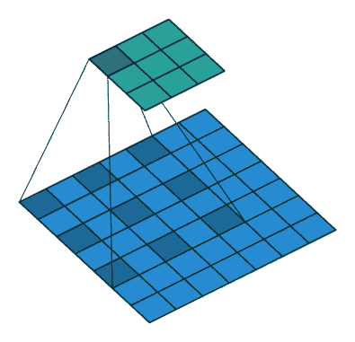

**Atrous convolution / Hole algorithm / Dilated convolution**

正如我们所见，特征图在 Conv6 和 Conv7 处较大，使用如上所示的阿特鲁卷积可以**增加感受野，同时保持参数数量相对较少**。(我希望在未来的日子里，我可以回顾一下 DeepLab，以更详细地介绍这一点。)

# 6.结果

有两种型号:SSD300 和 SSD512。
SSD300: 300×300 输入图像，分辨率更低，速度更快。
SSD512: 512×512 输入图像，分辨率更高，更精确。让我们看看结果。

## 6.1 模型分析

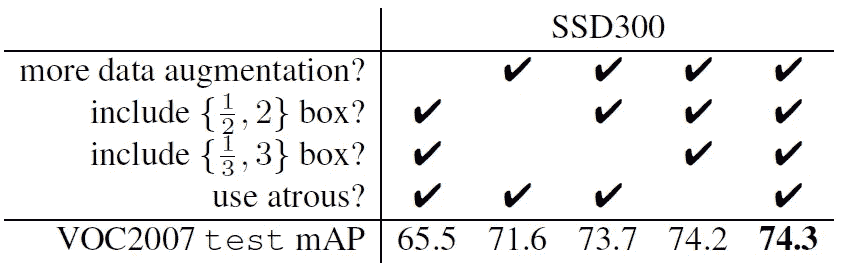

**Model Analysis**

*   数据扩充至关重要，它将 mAP 从 65.5%提高到 74.3%。
*   随着更多的默认框形状，它从 71.6%提高到 74.3%的地图。
*   阿特鲁的情况也差不多。但是没有 atrous 的要慢 20%左右。

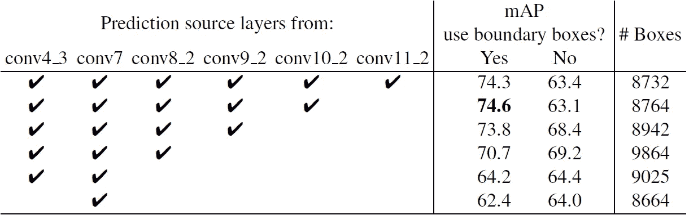

**Multiple Output Layers at Different Resolutions**

随着 conv 图层的输出越来越多，包含的边界框也越来越多。正常情况下，准确率从 62.4%提高到 74.6%。然而，**conv 11 _ 2 的加入使结果变得更糟。作者认为盒子不够大，无法覆盖大型物体。**

## 6.2 帕斯卡 VOC 2007

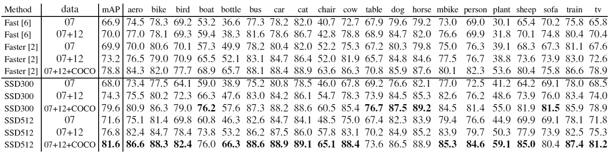

**Pascal VOC 2007 Dataset**

如上图，SSD512 有 81.6%的 mAP。SSD300 具有 79.6%的 mAP，这已经优于 78.8%的更快的 R-CNN。

## 6.3 帕斯卡 VOC 2012

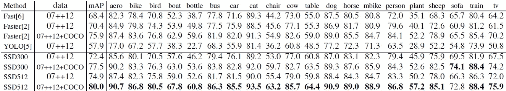

**Pascal VOC 2012 Dataset**

SSD512 (80.0%)比更快的 R-CNN (75.9%)准确率高 4.1%。

## 6.4 可可女士

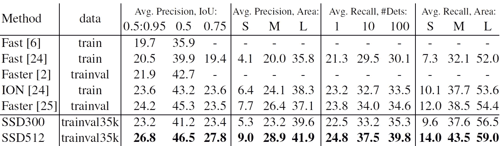

**MS COCO Dataset**

SSD512 在 mAP@0.5 中只比更快的 R-CNN 好 1.2%。这是因为对于较大的对象，它具有好得多的 AP (4.8%)和 AR (4.6%)，但是对于小对象，它在 AP (1.3%)和 AR (2.0%)方面的改善相对较小。

更快的 R-CNN 在使用 SSD 的较小对象上更具竞争力。作者认为，这是由于基于 RPN 的方法，其中包括两个镜头。

## 6.5 ILSVRC DET

在 SSD300 上获得初步结果:在 val2 集合上获得 43.4%的 mAP。

## 6.6 小物体精度的数据扩充

为了克服第 6.4 节中提到的对小目标漏检的弱点，进行了**“缩小”操作以创建更多的小训练样本。**跨多个数据集实现了 2%-3%的 mAP 增长，如下所示:

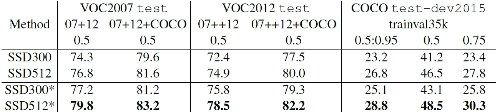

**Data Augmentation for Small Object Accuracy**

## 6.7 推理时间

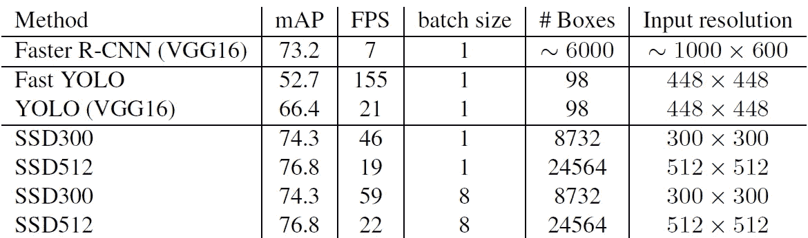

**Inference Time**

*   批量大小为 1 时，SSD300 和 SSD512 分别可以获得 46 和 19 FPS。
*   在批量大小为 8 的情况下，SSD300 和 SSD512 分别可以获得 59 和 22 FPS。

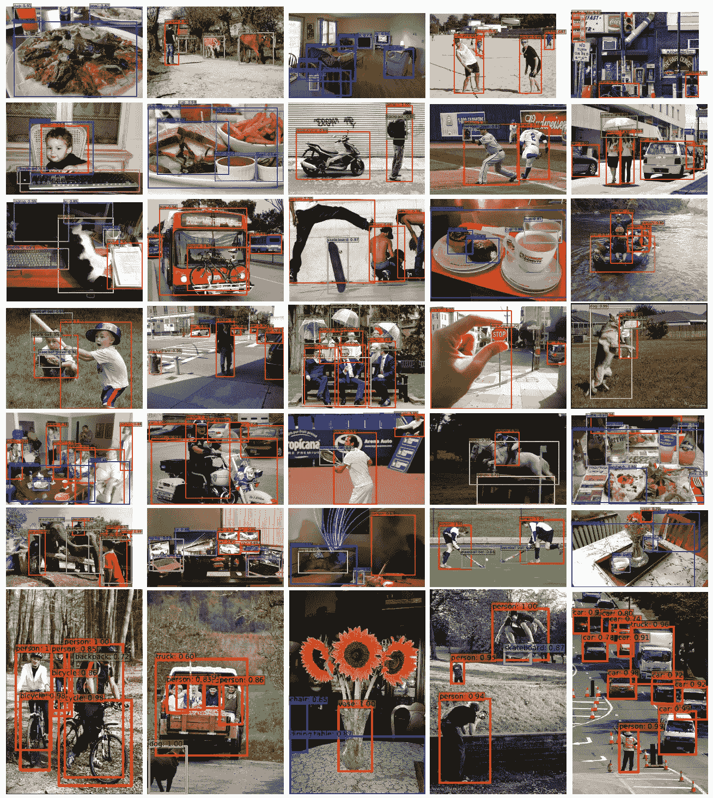

**Some “Crazy” Detection Results on MS COCO Dataset**

SSD300 和 SSD512 都有较高的 mAP 和较高的 FPS。因此，SSD 是需要研究的目标检测方法之一。顺便说一下，我希望将来能报道 DSSD。

# 参考

【2016 ECCV】【SSD】
[SSD:单发多盒探测器](https://arxiv.org/abs/1512.02325)

# 我的相关评论

[ [R-CNN](https://medium.com/coinmonks/review-r-cnn-object-detection-b476aba290d1) ] [ [快速 R-CNN](https://medium.com/coinmonks/review-fast-r-cnn-object-detection-a82e172e87ba) ] [ [更快 R-CNN](/review-faster-r-cnn-object-detection-f5685cb30202)][[yolov 1](/yolov1-you-only-look-once-object-detection-e1f3ffec8a89)][[VGGNet](https://medium.com/coinmonks/paper-review-of-vggnet-1st-runner-up-of-ilsvlc-2014-image-classification-d02355543a11)]