# 综述:随机深度(图像分类)

> 原文：<https://towardsdatascience.com/review-stochastic-depth-image-classification-a4e225807f4a?source=collection_archive---------12----------------------->

在这个故事里，**随机深度**是简短回顾。随机深度，一个训练短网络的训练程序，在测试时使用深度网络。这是由困境所激发的:

> **使用深度模型**:我们可以得到更好的预测精度，但是由于梯度消失问题，很难训练。
> 
> **使用更浅的模型**:我们可以更容易地训练网络，但预测精度有时不够好。

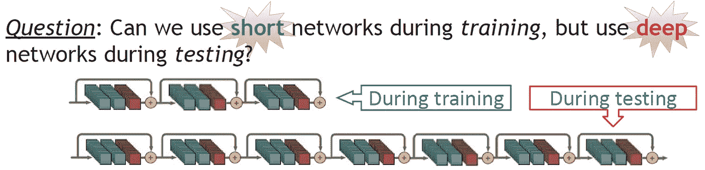

**Can we?**

通过使用随机深度，网络在训练过程中被缩短，即，层的子集被随机丢弃，并通过身份函数绕过它们。并且在测试/推断期间使用完整的网络。通过这种方式:

*   **培训时间大幅减少**
*   **测试误差也显著改善**

这是我写故事的时候在 **2016 ECCV** 上的一篇论文，有大约 **400 次引用**。( [Sik-Ho Tsang](https://medium.com/u/aff72a0c1243?source=post_page-----a4e225807f4a--------------------------------) @中)

# 涵盖哪些内容

1.  **原** [**ResNet**](/review-resnet-winner-of-ilsvrc-2015-image-classification-localization-detection-e39402bfa5d8) 的简要修改
2.  [**ResNet**](/review-resnet-winner-of-ilsvrc-2015-image-classification-localization-detection-e39402bfa5d8) **带随机深度**
3.  **一些结果和分析**

# 1.原始 [ResNet](/review-resnet-winner-of-ilsvrc-2015-image-classification-localization-detection-e39402bfa5d8) 的简要修订

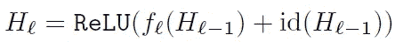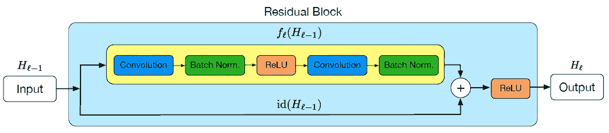

**One l-th Residual Block (ResBlock) in Original ResNet**

在**原** [**ResNet**](/review-resnet-winner-of-ilsvrc-2015-image-classification-localization-detection-e39402bfa5d8) 中，假设 *H* _ *l-1* 是上述 ResBlock 的输入， *H* _ *l-1* 会经过两条路径。

*   **上路径*f _ l*(*H*_*l-1*)**:**conv>BN>ReLU>conv>BN**
*   **下部路径 id(*H*_*l-1*)**:**标识路径**不修改输入

然后这两路的输出**加在一起，然后 ReLU，变成 *H* _ *l* 。**

通过使用相同路径，即跳过连接或快捷连接，我们可以保持输入信号，并试图避免梯度消失问题。最后，我们可以获得一个非常深的模型。

然而，这种深度模型的**训练时间**是**长**。

此外，可能会有**过度拟合问题**。

# 2.具有随机深度的 ResNet

## 2.1.培养

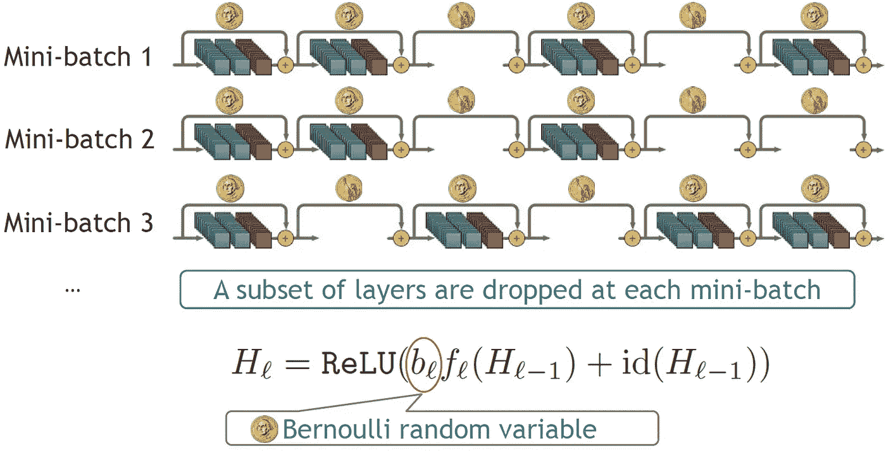

**Some ResBlocks are Dropped Randomly Based on Bernoulli Random Variable**

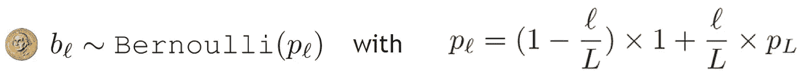

**Linear Decay Rule**

通过使用随机深度，在训练期间，**对于每个小批量，每个 ResBlock 将具有“存活”概率 *p* _ *l.***

如果幸存下来，它会被保存下来。否则如上所示跳过。

**用随机深度训练的网络可以被解释为不同深度的网络的隐含集合。**

决定 *p* _ *l* ，

*   一种是沿整个模型有 *p* _ *l* 的**定值**。
*   一个是沿着整个模型对 *p* _ *l* 有**线性衰减规则**。

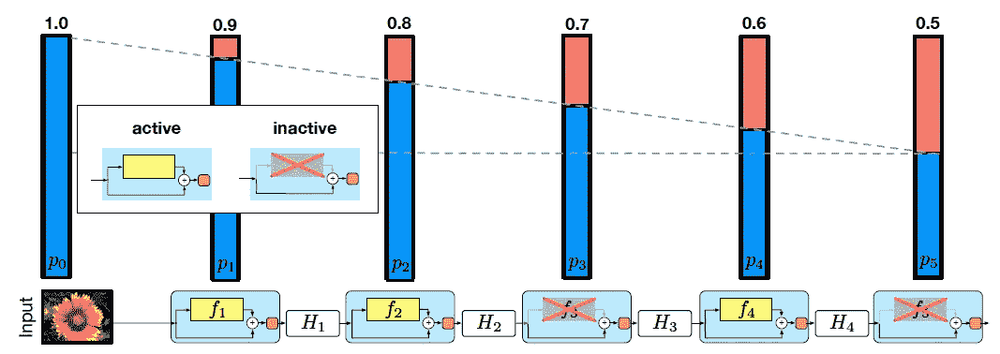

如果使用线性衰减规则，较早(较深)的层有更大的机会幸存(跳过)，如上例所示。

**训练时，预期网络深度比整个网络深度短。**若全网深度 *L* =110， *p_L* =0.5，则期望网络深度 E(L’)= 40。**因此，训练时间要短得多。**

## **2.2。测试**

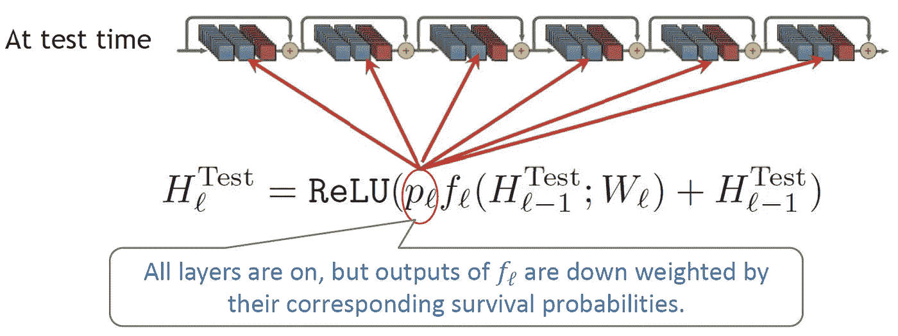

**Weighted by p_l during testing**

**测试期间的随机深度需要对网络进行小的修改**。因为在训练期间，函数 *f* _ *l* 仅在所有更新的一小部分 *p* _ *l* 内有效，并且下一层的相应权重被校准用于该生存概率。因此，我们需要**根据任何给定函数 *f* _ *l* 参与训练的预期次数 *p* _ *l* 来重新校准其输出。**

# 3.**一些结果和分析**

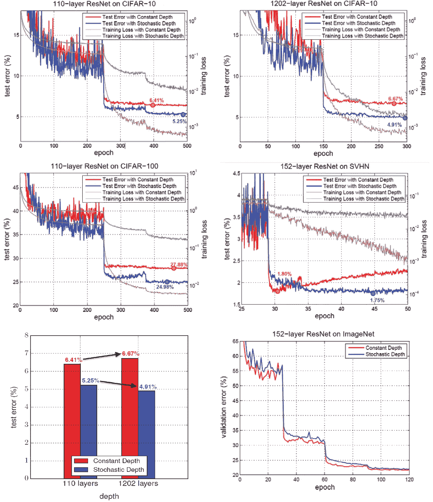

**CIFAR10, CIFAR100, ImageNet Results**

## 3.1.西法尔-10，西法尔-100，SHVN

例如在图的左上方:

*   恒定深度的训练损失< Training loss of Stochastic Depth
*   Test loss of constant depth (6.41%) >随机深度的测试损失(5.25%)
*   这意味着随机深度减少了过度拟合。

使用 110 或 1202 层模型的 CIFAR-100 和 SHVN 的趋势相似。

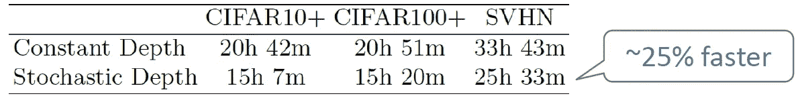

**Training Time**

*   训练时间也缩短了很多。

## 3.2.ImageNet

对于图右下方的 ImageNet:

*   虽然**验证误差非常接近**(恒定深度为 23.06%，随机深度为 23.38%)，但是**训练时间缩短了 25%。**
*   **如果训练时间相等，最终误差为 21.98%。**

以下是每个数据集的详细结果:

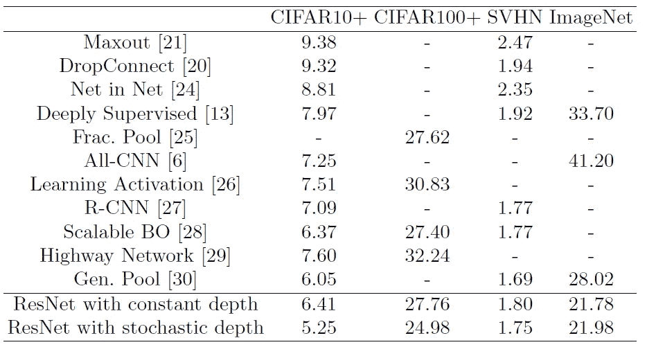

Detailed Results for Each Dataset

## 3.3.分析

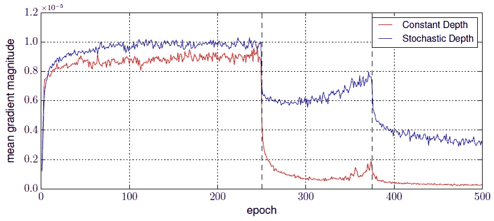

**Mean Gradient Magnitude**

通过查看每个时期的平均梯度幅度，**随机深度始终比恒定深度具有更大的权重。**这意味着，**梯度消失问题在随机深度中不太严重。**

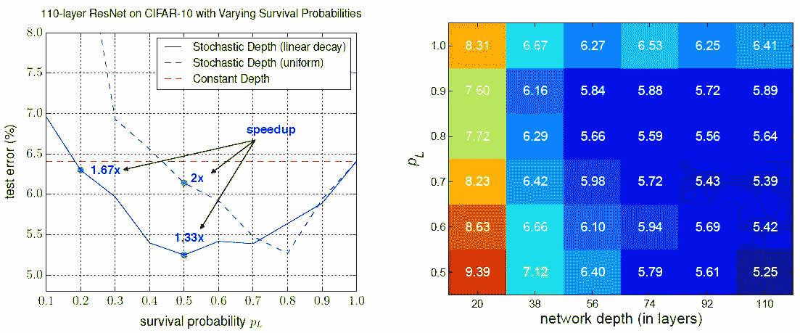

**Test Error vs Survival Probability (Left), and Test Error Heatmap with P_L vs Network Depth (Right)**

对于左侧的测试误差与生存概率:

*   两种分配规则(线性衰减和均匀分配)都比恒定深度产生更好的结果。
*   线性衰减规则始终优于均匀规则。
*   当 *p* _ *L* 在 0.4 到 0.8 范围内时，线性衰减法则获得竞争结果。
*   在***p*_*L*= 0.2**的情况下，线性衰减的随机深度仍然表现良好，同时给出**训练时间减少 40%**。

对于右侧的热图:

*   **p_*L*= 0.5 的较深网络更好。**
*   一个足够深的模型是随机深度显著优于基线所必需的。

除了丢弃之外，我们还可以**通过使用随机深度来减少网络深度，从而减少过拟合，从而丢弃一些模块。**

# 参考

【2016 ECCV】【随机深度】
[深度随机的深度网络](https://arxiv.org/abs/1603.09382)

# 我的相关评论

)(我)(们)(都)(不)(想)(到)(这)(些)(人)(,)(我)(们)(都)(不)(想)(到)(这)(些)(人)(,)(但)(是)(这)(些)(人)(还)(有)(什)(么)(情)(况)(呢)(?)(我)(们)(都)(不)(想)(到)(这)(些)(人)(了)(,)(我)(们)(还)(没)(想)(要)(到)(这)(些)(人)(,)(我)(们)(还)(没)(想)(要)(到)(这)(些)(人)(,)(我)(们)(就)(不)(能)(想)(到)(这)(些)(事)(,)(我)(们)(还)(没)(想)(到)(这)(里)(来)(。