# 回顾:Trimps-Soushen——2016 年 ILSVRC(图像分类)获奖者

> 原文：<https://towardsdatascience.com/review-trimps-soushen-winner-in-ilsvrc-2016-image-classification-dfbc423111dd?source=collection_archive---------8----------------------->

## 深度特征融合的良好实践:第一个获得 3%以下的错误率(当人类性能只能获得 5%时)

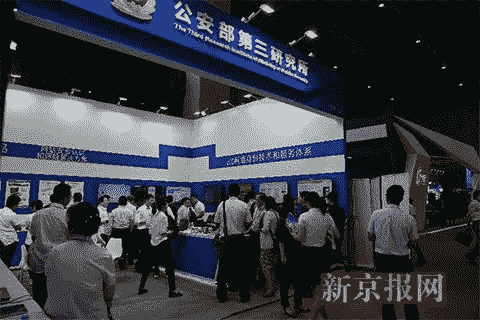

**Trimps Is Active at Different Technology Aspects** [http://news.sina.com.cn/c/2017-09-17/doc-ifykynia7850053.shtml](http://news.sina.com.cn/c/2017-09-17/doc-ifykynia7850053.shtml)

In this story, the approach by the winner, **Trimps-Soushen**, in ILSVRC 2016 classification task, is reviewed. **Trimps** stands for The **T**hird **R**esearch **I**nstitute of **M**inistry of **P**ublic **S**ecurity, or in chinese 公安部三所. In brief, Trimps is the research institute for advancing the technologies for public security in China, which was launched in 1978 at Shanghai. **Soushen** should be the **team name under Trimps**, in chinese 搜神. It means **god of search**, where Sou (搜) means search and Shen (神) means god. ([Sik-Ho Tsang](https://medium.com/u/aff72a0c1243?source=post_page-----dfbc423111dd--------------------------------) @ Medium)

Trimps-Soushen 在 2016 年赢得了多项比赛:

*   **物体定位:第一名，7.71%误差**
*   **物体分类:第一名，2.99%误差**
*   物体检测:第三名，61.82%地图
*   场景分类:第三名，误差 10.3%
*   视频目标检测:第三名，70.97%地图

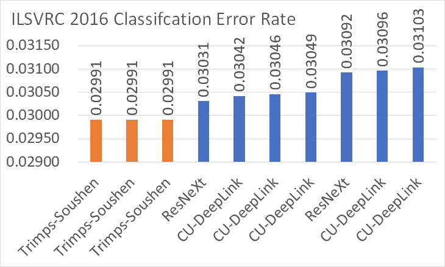

**ILSVRC 2016 Classification Ranking** [http://image-net.org/challenges/LSVRC/2016/results#loc](http://image-net.org/challenges/LSVRC/2016/results#loc)

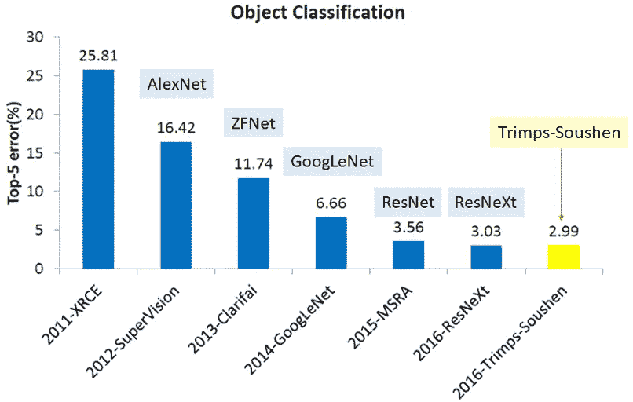

**ILSVRC Classification Results from 2011 to 2016**

虽然 Trimps-Soushen 在多个识别任务上拥有最先进的成果，但**Trimps-Soushen**没有新的创新技术或新颖性。可能因为这个原因，**他们没有发表任何关于它的论文**或技术报告。

相反，**他们只在 2016 年 ECCV** 的 ImageNet 和 COCO 联合研讨会上分享了他们的成果。他们有一些关于数据集的有趣事实。

# 涵盖哪些内容

1.  **使用不同模型的集成(图像分类)**
2.  **基于前 20 名准确度的一些发现(图像分类)**
3.  **区域融合(图像定位)**
4.  **用于其他任务的多模型融合(场景分类/对象检测/从视频中检测对象)**

# 1.使用不同模型的集成

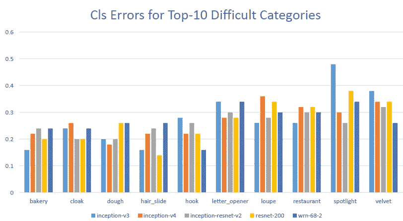

**ImageNet Classification Errors for Top-10 Difficult Categories**

Trimps-Soushen 使用了来自 [Inception-v3](https://medium.com/@sh.tsang/review-inception-v3-1st-runner-up-image-classification-in-ilsvrc-2015-17915421f77c) 、 [Inception-v4](/review-inception-v4-evolved-from-googlenet-merged-with-resnet-idea-image-classification-5e8c339d18bc) 、 [Inception-ResNet-v2](/review-inception-v4-evolved-from-googlenet-merged-with-resnet-idea-image-classification-5e8c339d18bc) 、[预激活 ResNet-200](/resnet-with-identity-mapping-over-1000-layers-reached-image-classification-bb50a42af03e) 、[Wide ResNet(WRN-68–2)](/review-wrns-wide-residual-networks-image-classification-d3feb3fb2004)的预训练模型进行分类，并找出了如上的前 10 个困难类别。

*   **获得了不同的结果**，这意味着没有模型在所有类别中占主导地位。**每个模型都擅长对某些类别进行分类，但也擅长对某些类别进行分类。**
*   模型的多样性可以用来提高精确度。

在培训期间，Trimps-Soushen 只是进行了多规模扩增和大迷你批量。在测试期间，多尺度+翻转与密集融合一起使用。

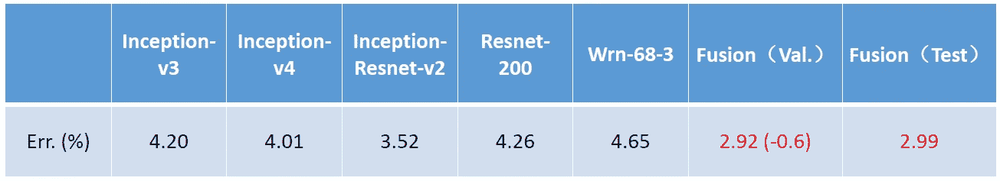

**ImageNet Top-5 Error Rate Results**

*   5 个最佳模型的验证误差为 3.52%-4.65%。
*   通过组合这 5 个模型( [Inception-ResNet-v2](/review-inception-v4-evolved-from-googlenet-merged-with-resnet-idea-image-classification-5e8c339d18bc) 具有更高的权重)，获得了 2.92%的验证误差。
*   获得了 2.99%的测试误差，这是第一个在 3%误差率下获得的测试误差。

# 2.**基于前 20 名准确度的一些发现**

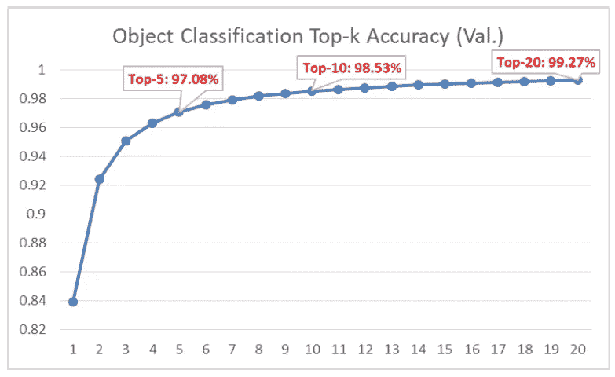

**Top-k Accuracy**

Top- *k* 精度如上图所示。当 *k* =20 时，获得 99.27%的精度。误差率小于 1%。

> **为什么使用 Top-20 精度仍有误差？**

Trimp-Soushen 非常详细地分析了这些 1%的误差图像！！！

他们从验证集中手动分析了 1458 个错误图像。大致得到 7 类误差如下:

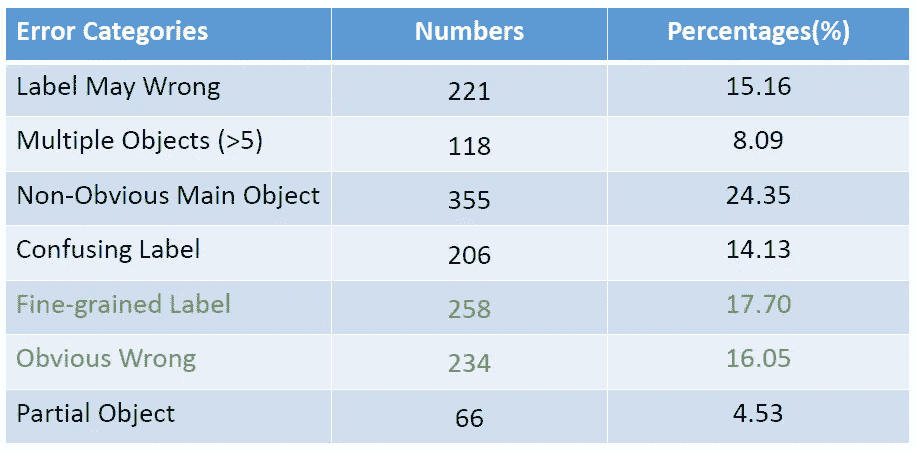

**7 Error Categories**

## 2.1.标签可能有误

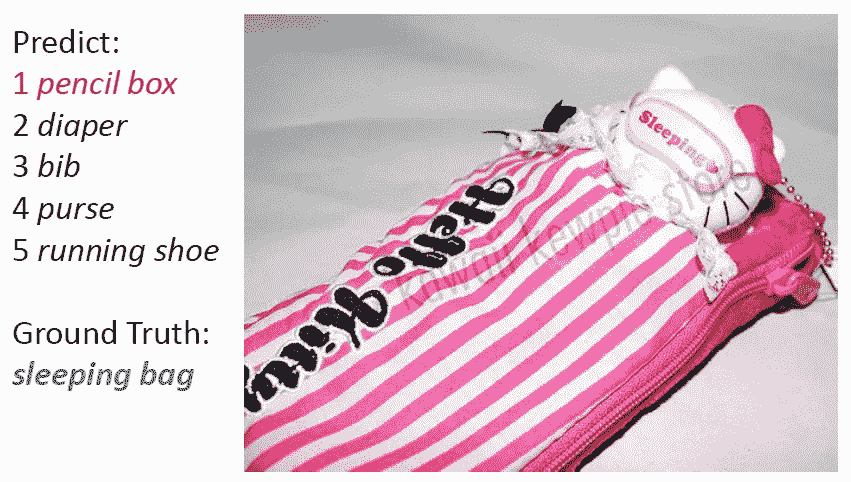

**Label May Wrong (Maybe it is really a sleeping bag for Hello Kitty? lol)**

地面真相是睡袋，但显然，它是一个铅笔盒！！！！

这是因为地面真相在 ImageNet 数据集中是手动标注的。由于 ImageNet 是一个包含超过 1500 万个带标签的高分辨率图像的数据集，约有 22，000 个类别，并且 1000 个类别的 ImageNet 数据集的子集用于竞争，因此可能会有一些错误的标签。

在 1458 幅错误图像中，有 211 幅是“标签可能错误”，约占 15.16%。

## 2.2.多个对象(> 5)

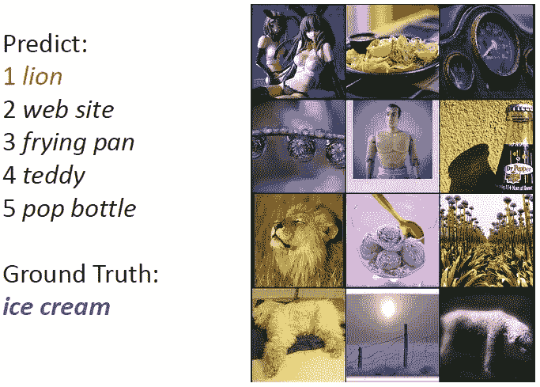

**Multiple Objects (>5) (Which is the main object?)**

上图包含多个对象(> 5)。实际上，这种图像不适合于 ILSVRC 分类任务。因为在 ILSVRC 分类任务中，对于每幅图像应该只识别一个类别。

在 1458 幅错误图像中有 118 幅是“多物体(> 5)”，约占 8.09%。

## 2.3.不明显的主要对象

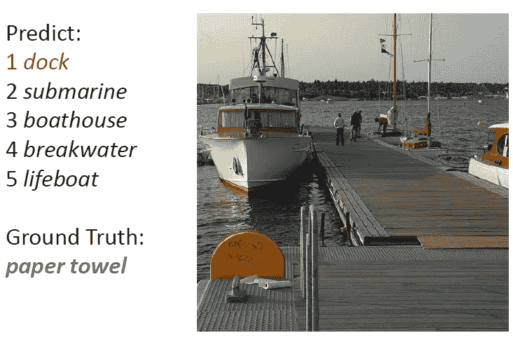

**Non-Obvious Main Object (Please find the paper towel in the image, lol !!)**

由于在分类任务中应该只识别一个类别，所以上面的图像在图像中没有一个明显的主要对象。可以是船，也可以是码头。但事实是纸巾。

在 1458 幅错误图像中，有 355 幅是“非明显主目标”，约占 24.35%。

## 2.4.混淆标签

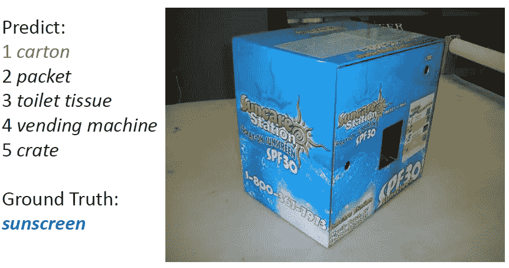

**Confusing Label (Maybe there is no sunscreen inside, lol.)**

事实是防晒霜。这一次，标签似乎是正确的，因为纸箱上说的 SPF30。但任务将变成理解纸箱上文字的含义，这与基于形状和颜色识别物体的最初目标相去甚远。

1458 幅错误图像中有 206 幅是“混淆标签”，约占 14.13%。

## 2.5.细粒度标签

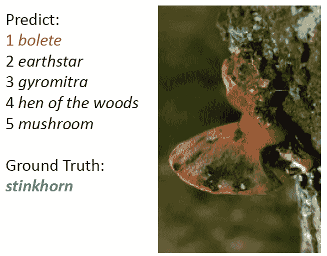

**Fine-Grained Label**

事实是正确的。牛肝菌和臭牛肝菌都是真菌的种类。事实上，这种类型的标签甚至很难被人类识别。

1458 幅错误图像中有 258 幅是“细粒度标签”，约占 17.70%。

**网络可以改善这个范畴。**

## 2.6.明显错误

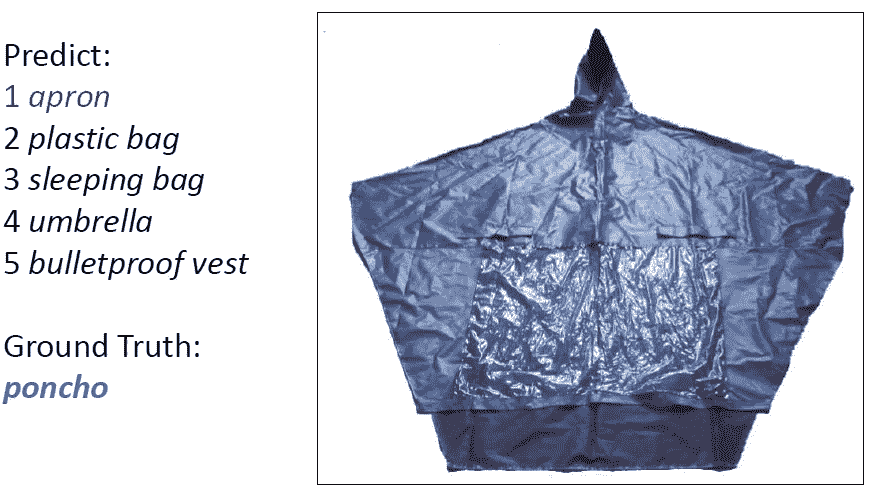

**Obvious Wrong**

事实是正确的。即使使用前 20 名预测，网络也无法预测它。

1458 幅错误图像中有 234 幅“明显错误”，约占 16.05%。

**网络可以改善这个范畴。**

## 2.7.部分对象

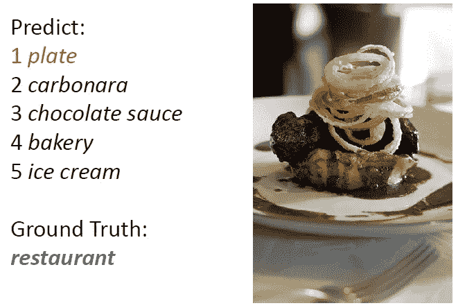

**Partial Object**

图像可能只包含对象的一部分，这很难识别。如果把多张桌椅拉远一点，看起来像个餐厅，可能图像会更好。

在 1458 幅错误图像中，有 66 幅是“部分目标”，约占 4.53%。

> 所以精度很难提高 1%。

# 3.区域融合(图像定位)

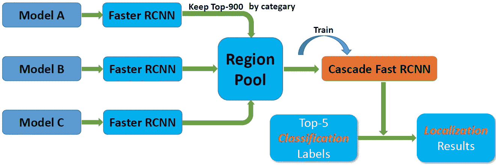

**Region Fusion for Image Localization**

为了定位图像中的前 5 个预测标签，使用了使用多个模型的更快的 R-CNN 架构。多个模型用于通过[快速 R-CNN](/review-faster-r-cnn-object-detection-f5685cb30202) 中的区域提案网络(RPN)生成区域提案。然后基于前 5 个分类预测标签，执行定位预测。

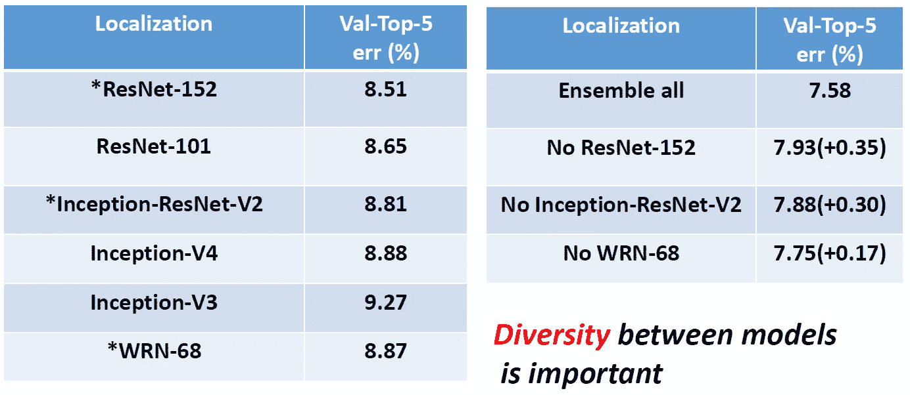

**Image Localization Top-5 Validation Error Results**

*   **以前最先进的方法** : **得到 8.51%到 9.27%** 的误差。
*   **集成所有**:将所有方法融合在一起，得到 **7.58%** 误差。
*   **除了一个模型之外的集合**:仅获得 7.75%到 7.93%的误差。

因此，模型之间差异是重要的，并有助于预测精度的大幅度提高。

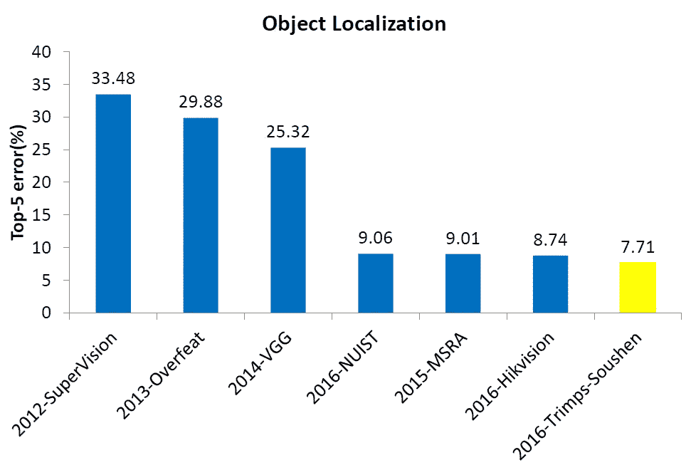

**ILSVRC Localization Top-5 Test Error Results from 2012 to 2016**

# **4。用于其他任务的多模型融合(场景分类/对象检测/从视频中检测对象)**

## 4.1.场景分类

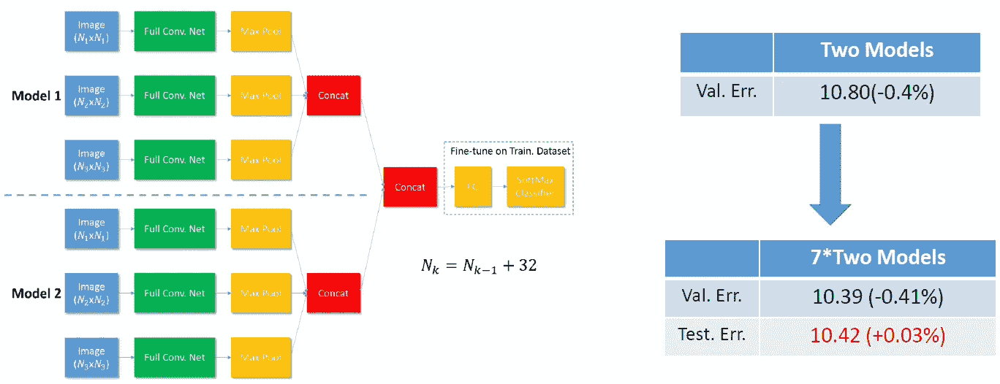

**Multi-Scale & Multi-Model Fusion for Scene Classification**

通过连接结果而不是在网络末端将结果相加，使用改进的多尺度方法。

除了使用相同模型使用多尺度输入进行预测之外，通过连接结果并通过 FC 和 softmax 使用两个训练模型(我相信使用相同的模型网络)。验证误差为 10.80%。

采用 7×2 模型，验证误差为 10.39%，检验误差为 10.42%。

**Scene Classification Top-5 Test Error Results**

使用外部数据集 Places2 的模型也用于预训练，获得了 10.3%的 top-5 测试误差，在场景分类中获得第三名。

## 4.2.目标检测

类似于图像定位，[更快的 R-CNN](/review-faster-r-cnn-object-detection-f5685cb30202) 架构用于多模型融合。

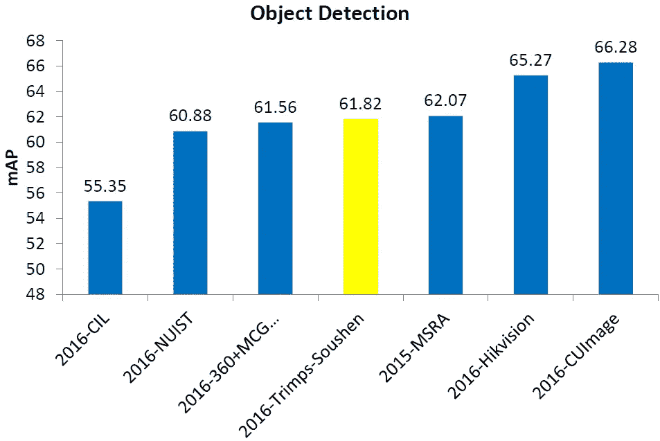

**Object Detection mAP Results**

获得了 61.82%的 mAP。

## 4.3.视频中的目标检测

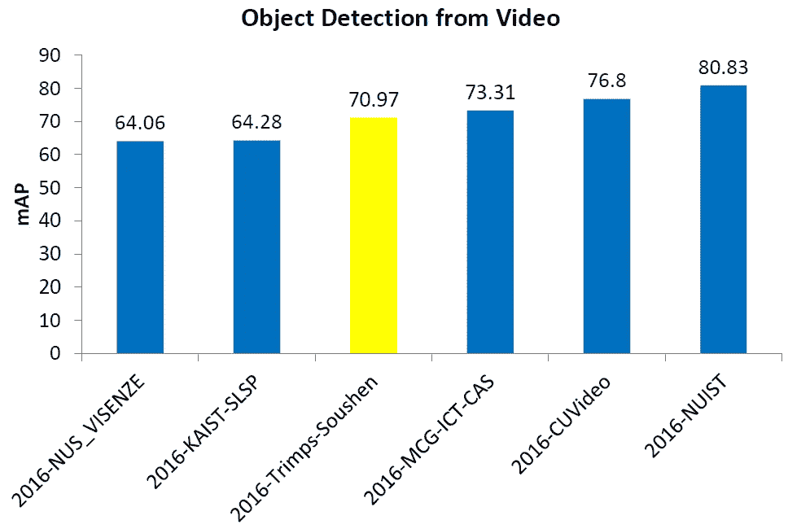

**Object Detection from Video mAP Results**

光流引导的运动预测也用于减少假阴性检测。获得了 70.97%的 mAP。

由于模型的多样性，模型融合是有效的。通过模型融合，Trimps-Soushen 胜过 [ResNeXt](/review-resnext-1st-runner-up-of-ilsvrc-2016-image-classification-15d7f17b42ac) 和 [PolyNet](/review-polynet-2nd-runner-up-in-ilsvrc-2016-image-classification-8a1a941ce9ea) ，获得图像分类第一名。模型融合也被成功地应用到其他任务中。这意味着除了网络架构的创新优化或新颖设计，其他技术东西如**多模型融合也可以帮助提高准确性很多**。

另一方面，**如果 Trimps-Soushen 使用**[**ResNeXt**](/review-resnext-1st-runner-up-of-ilsvrc-2016-image-classification-15d7f17b42ac)**和**[**poly net**](/review-polynet-2nd-runner-up-in-ilsvrc-2016-image-classification-8a1a941ce9ea)**进行模型融合，也许可以进一步减小**的误差，因为 [ResNeXt](/review-resnext-1st-runner-up-of-ilsvrc-2016-image-classification-15d7f17b42ac) 和 [PolyNet](/review-polynet-2nd-runner-up-in-ilsvrc-2016-image-classification-8a1a941ce9ea) 比用于模型融合的那些模型获得更高的精度。

## 参考

【2016 ECCV】【Trimps-Soushen】(仅幻灯片)
[深度特征融合的良好实践](http://image-net.org/challenges/talks/2016/Trimps-Soushen@ILSVRC2016.pdf)

## 我对图像分类的相关综述

[[LeNet](https://medium.com/@sh.tsang/paper-brief-review-of-lenet-1-lenet-4-lenet-5-boosted-lenet-4-image-classification-1f5f809dbf17)][[AlexNet](https://medium.com/coinmonks/paper-review-of-alexnet-caffenet-winner-in-ilsvrc-2012-image-classification-b93598314160)][[ZFNet](https://medium.com/coinmonks/paper-review-of-zfnet-the-winner-of-ilsvlc-2013-image-classification-d1a5a0c45103)][[VGGNet](https://medium.com/coinmonks/paper-review-of-vggnet-1st-runner-up-of-ilsvlc-2014-image-classification-d02355543a11)][[SPPNet](https://medium.com/coinmonks/review-sppnet-1st-runner-up-object-detection-2nd-runner-up-image-classification-in-ilsvrc-906da3753679)][[PReLU-Net](https://medium.com/coinmonks/review-prelu-net-the-first-to-surpass-human-level-performance-in-ilsvrc-2015-image-f619dddd5617)][[Google Net/Inception-v1](https://medium.com/coinmonks/paper-review-of-googlenet-inception-v1-winner-of-ilsvlc-2014-image-classification-c2b3565a64e7)][[BN-Inception/Inception-v2](https://medium.com/@sh.tsang/review-batch-normalization-inception-v2-bn-inception-the-2nd-to-surpass-human-level-18e2d0f56651)][[Inception-v3](https://medium.com/@sh.tsang/review-inception-v3-1st-runner-up-image-classification-in-ilsvrc-2015-17915421f77c)][[Inception-v4](/review-inception-v4-evolved-from-googlenet-merged-with-resnet-idea-image-classification-5e8c339d18bc) [ [RoR](/review-ror-resnet-of-resnet-multilevel-resnet-image-classification-cd3b0fcc19bb) ] [ [随机深度](/review-stochastic-depth-image-classification-a4e225807f4a) ] [ [WRN](/review-wrns-wide-residual-networks-image-classification-d3feb3fb2004) ] [ [波利尼西亚](/review-polynet-2nd-runner-up-in-ilsvrc-2016-image-classification-8a1a941ce9ea)][[ResNeXt](/review-resnext-1st-runner-up-of-ilsvrc-2016-image-classification-15d7f17b42ac)][[dense net](/review-densenet-image-classification-b6631a8ef803)]

## 我对物体检测的相关评论

[ [更快的 R-CNN](/review-faster-r-cnn-object-detection-f5685cb30202)