# 综述:U-Net(生物医学图像分割)

> 原文：<https://towardsdatascience.com/review-u-net-biomedical-image-segmentation-d02bf06ca760?source=collection_archive---------4----------------------->

在这个故事中， **U-Net** 进行了回顾。U-Net 是生物医学图像分割中著名的全卷积网络(FCN)之一，在我写这个故事的时候已经发表在 **2015 MICCAI** 上，引用超过 **3000 次**。( [Sik-Ho Tsang](https://medium.com/u/aff72a0c1243?source=post_page-----d02bf06ca760--------------------------------) @中)

在生物医学图像注释领域，我们总是需要获得相关知识的专家来注释每幅图像。而且他们也**消耗大量的时间来注释**。**如果注释过程变得自动化，可以减少人力和降低成本**。或者可以作为辅助角色**减少人为错误**。

> 你可能会问:“读生物医学图像分割是不是太狭隘了？”
> 
> 然而，我们可以学习它的技术，并将其应用于不同的行业。比方说，**质量控制/自动检测/施工/制造过程中的自动机器人**，或者我们可能想到的任何其他东西。这些活动包括定量诊断。如果我们能使它自动化，就能以更高的精度节省成本。

在这篇论文中，他们**分割/注释了电子显微镜(EM)图像**。他们还对网络进行了一点点修改，以**分割/注释 2015 年 ISBI** 的牙齿 x 光图像。

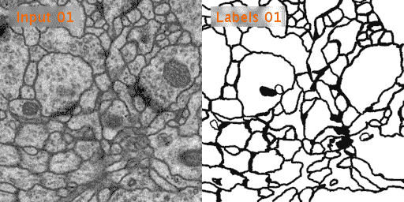

**EM Images**

# 涵盖哪些内容

## A.EM 图像分割

1.  U-Net 网络体系结构
2.  重叠平铺策略
3.  用于数据扩充的弹性变形
4.  触摸物体的分离
5.  结果

## B.牙科 X 射线图像分割

1.  对 U-Net 的一些修改
2.  结果

# A.1\. U-Net 网络架构

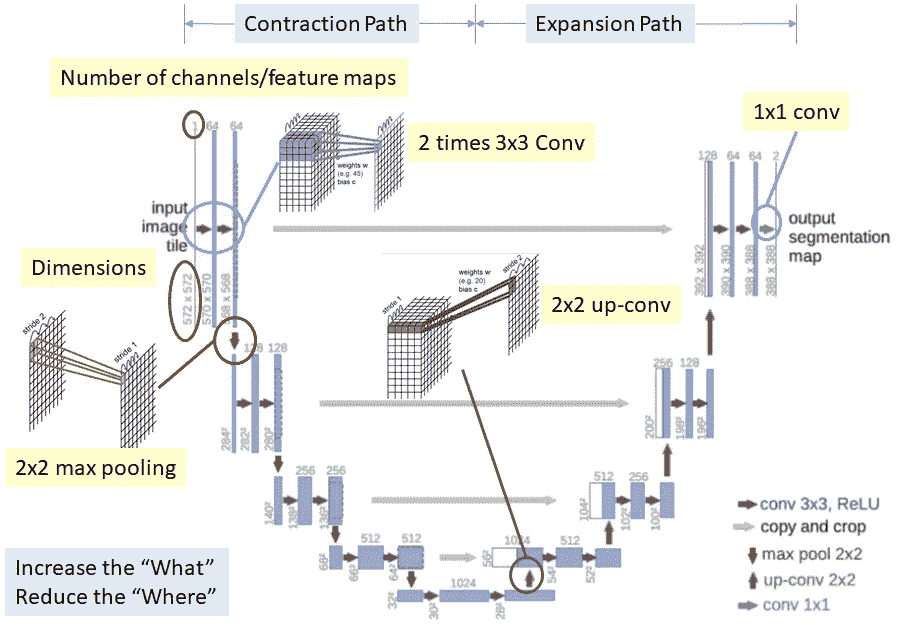

**U-Net**

U-net 架构如上图。它由收缩路径和膨胀路径组成。

**收缩路径**

*   连续完成**两次 3×3 Conv** 和 **2×2 最大汇集**。这有助于提取更高级的要素，但也会减小要素地图的大小。

**扩展路径**

*   连续进行 **2×2 上 conv** 和**两次 3×3 Conv** 来恢复分割图的大小。然而，上述过程**减少了“哪里”**，尽管它**增加了“什么”**。这意味着，我们可以获得高级功能，但我们也失去了本地化信息。
*   因此，在每个上 conv 之后，我们还有具有相同级别的特征图(灰色箭头)的**串联。这有助于**给出从收缩路径到膨胀路径**的定位信息。**
*   最后， **1×1 conv** 将特征图大小从 64 映射到 2，因为输出的特征图只有 2 类，细胞和膜。

# A.2 .重叠平铺策略

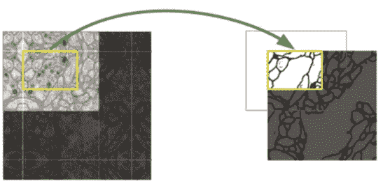

**Overlap Tile Strategy**

由于使用了无填充卷积，输出大小小于输入大小。使用重叠瓦片策略，而不是在网络之前缩小尺寸和在网络之后上采样。由此，**整个图像被逐部分预测**，如上图所示。使用蓝色区域预测图像中的黄色区域。**在图像边界，通过镜像**外推图像。

# A.3 .用于数据扩充的弹性变形

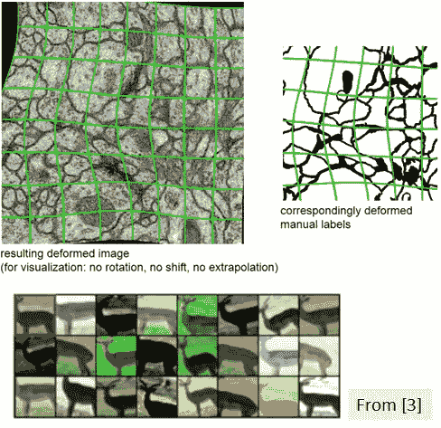

**Elastic Deformation**

由于训练集只能由专家进行注释，因此训练集很小。为了增加训练集的大小，通过随机变形输入图像和输出分割图来进行数据扩充。

# A.4 .触摸物体的分离

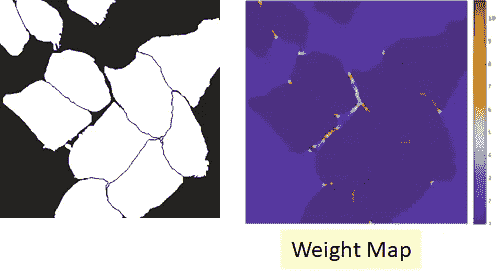

**Segmentation Map (Left) and Weight Map (Right)**

由于接触物体彼此靠近放置，它们很容易被网络合并，为了分离它们，对网络的输出应用权重图。

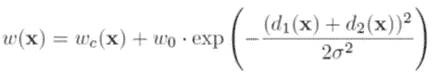

为了如上计算权重图，d1(x)是到位置 x 处最近的单元边界的距离，d2(x)是到第二最近的单元边界的距离。因此，在边界处，重量比图中高得多。

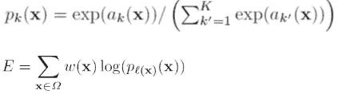

因此，交叉熵函数在每个位置被权重图惩罚。这有助于**迫使网络学习接触细胞之间的小分离边界。**

# A.5 .结果

## A.5.1\. ISBI 2012 年奥运会

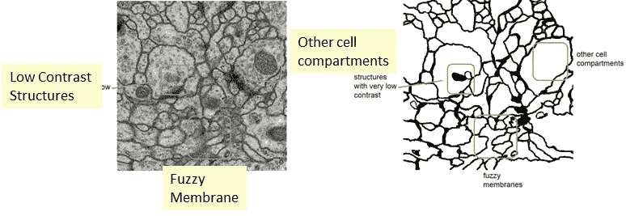

**Some Difficult Parts in EM Images**

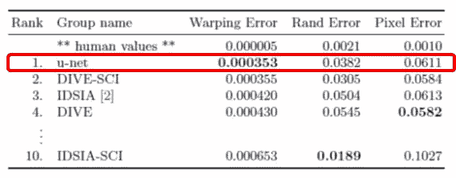

**U-Net has the Rank 1 Result at that moment**

*   **扭曲错误**:惩罚拓扑不一致的分段度量。
*   **Rand Error** :两个聚类或分割之间相似性的度量。
*   **像素误差**:标准像素误差。
*   培训时间:10 小时
*   测试速度:每张图片大约 1 秒

## **A.5.2\. PhC-U373 和 DIC-HeLa 数据集**

**PhC-U373 and DIC-HeLa Datasets**

U-Net 获得了这两个数据集的最高 IoU。

# b . 1 . U-Net 的一些修改

**Dental X-Ray Image with 7 classes**

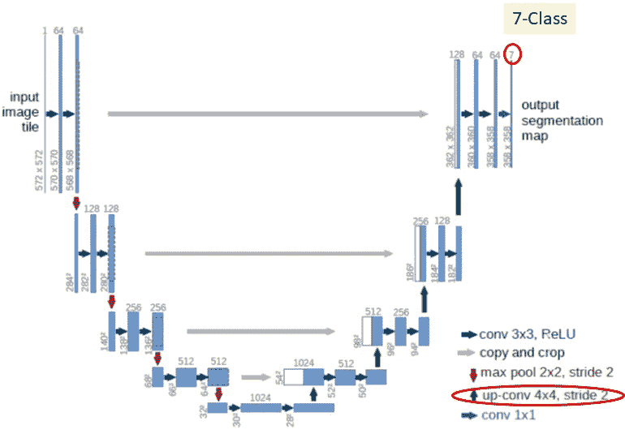

**U-Net for Dental X-Ray Images**

这次使用 **4×4 上 conv** 和 **1×1 Conv** 来绘制 64 到 7 的特征图，因为每个位置的输出有 7 个等级。

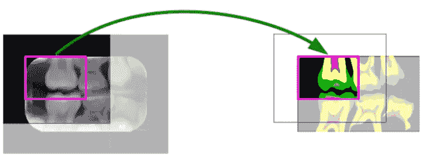

**Zero padding instead of mirroring at the image boundary**

在重叠平铺策略中，使用**零填充**代替图像边界处的镜像。因为镜像对牙齿没有任何意义。

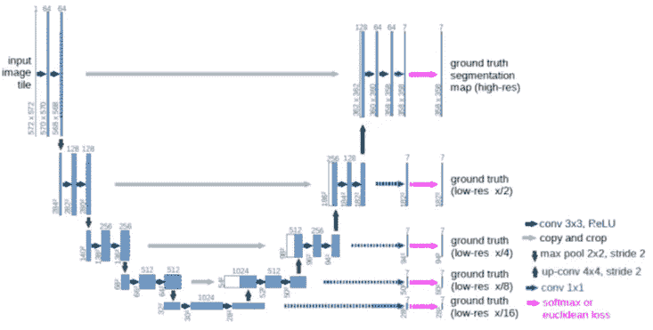

**Loss function at multiple levels**

使用 softmax loss 的低分辨率特征图有**附加损失层**，以引导深层直接学习分割类。

# B.2 .结果

**Some Visualization Results**

我也复习过 [**累计视野 1**](https://medium.com/datadriveninvestor/review-cumedvision1-fully-convolutional-network-biomedical-image-segmentation-5434280d6e6) 和 [**累计视野 2**](https://medium.com/datadriveninvestor/review-cumedvision2-dcan-winner-of-2015-miccai-gland-segmentation-challenge-contest-biomedical-878b5a443560) 。如果感兴趣，请随时访问。

# 参考

*   【2015】【MICCAI】
    [U-Net:用于生物医学图像分割的卷积网络](https://arxiv.org/abs/1505.04597)
*   【2015】【ISBI】
    [使用 U 形深度卷积网络的牙齿 x 光图像分割](http://www-o.ntust.edu.tw/~cweiwang/ISBI2015/challenge2/isbi2015_Ronneberger.pdf)

# 我的相关评论

[ [累积视频 1](https://medium.com/datadriveninvestor/review-cumedvision1-fully-convolutional-network-biomedical-image-segmentation-5434280d6e6) ] [ [累积视频 2](https://medium.com/datadriveninvestor/review-cumedvision2-dcan-winner-of-2015-miccai-gland-segmentation-challenge-contest-biomedical-878b5a443560) ] [ [FCN](/review-fcn-semantic-segmentation-eb8c9b50d2d1) ] [ [解除网络](/review-deconvnet-unpooling-layer-semantic-segmentation-55cf8a6e380e)