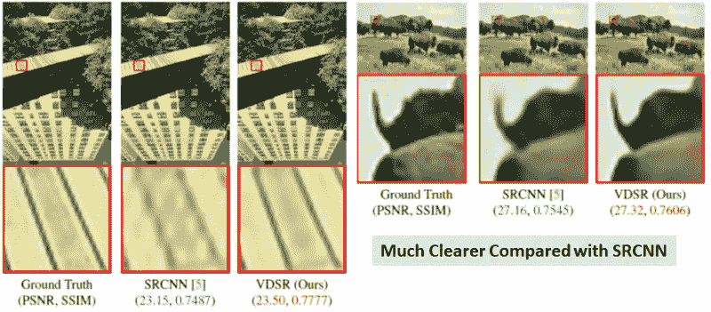
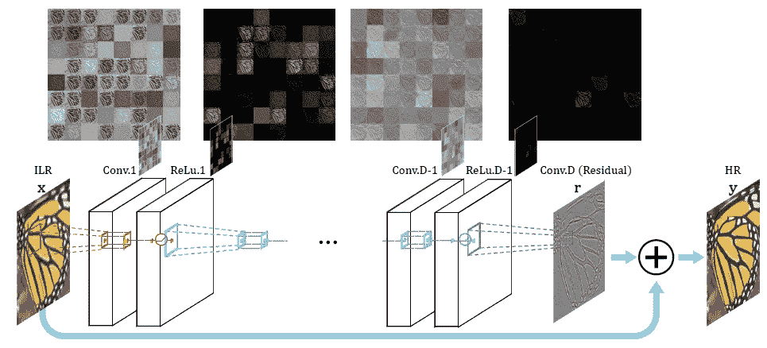
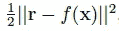
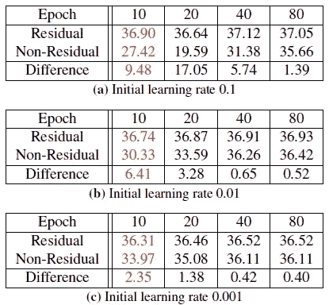
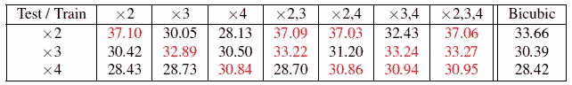
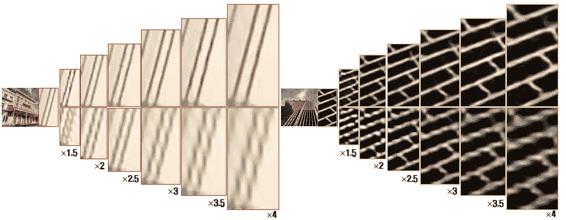
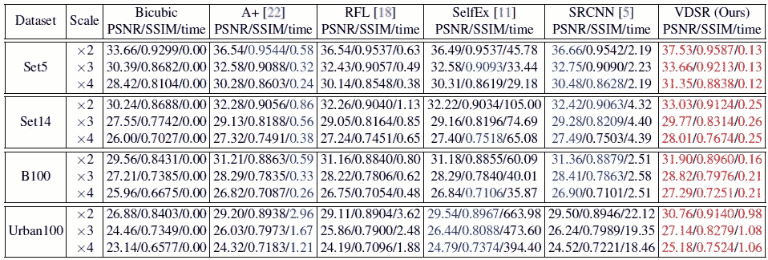
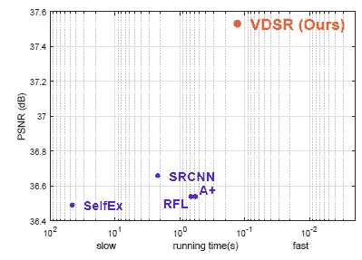

# 回顾:VDSR(超分辨率)

> 原文：<https://towardsdatascience.com/review-vdsr-super-resolution-f8050d49362f?source=collection_archive---------6----------------------->

T 他的时代， **VDSR** **(极深超分辨率)**回顾。VDSR 是一种用于放大图像的深度学习方法。它有 **20 个权重层**，比只有 3 层的 SRCNN 要深得多。

> 有时，我们只得到一个很差的图像，我们想进行数字放大(放大)，但当放大时图像变得模糊。这是因为常规的插值或放大把一幅小图像变成一幅大图像，会得到很差的图像质量。使用 VDSR，我们可以从低分辨率(LR)图像获得高质量的高分辨率(HR)图像。

下面是两个例子。

VDSR 是经典的最先进的 SR 方法之一，在我撰写本文时，发表在 **2016 CVPR** 上，被引用约 **800 次**。( [Sik-Ho Tsang](https://medium.com/u/aff72a0c1243?source=post_page-----f8050d49362f--------------------------------) @中)

**Much Clear Image after Enlargement Using VDSR (Edges are much clearer)**

**Some More Amazing Results**

结果很惊人！！那么，让我们来看看它是如何工作的。

# 涵盖哪些内容

1.  **VDSR 网络架构**
2.  **关于培训的一些细节**
3.  **结果**

# **1。VDSR 网络架构**

**VDSR Network Architecture**

VDSR 架构如上图所示:

1.  将 **LR 图像插值为 ILR 图像**并输入到网络。
2.  ILR 图像经过 **(D-1)次 Conv 和 ReLU 层**。
3.  然后后面跟着一个 **D-th Conv** (Conv。图中的 d(残差)。
4.  最后，**输出与 ILR 图像相加，得到 HR 图像**。

这些是 **64 个大小为 3×3 的过滤器，用于每个 conv 层**。(VGGNet 已经解决了连续的3×3 滤波器的问题，这有助于获得更大的感受野，因此我们不需要任何大的滤波器，例如 5×5 和 7×7。[如果有兴趣，请阅读我的 VGGNet 评论。](https://medium.com/coinmonks/paper-review-of-vggnet-1st-runner-up-of-ilsvlc-2014-image-classification-d02355543a11))

如我们所见，ILR 被添加到网络的输出中，以恢复 HR 图像，损失函数变为:

其中 **r=y-x** 。因此，**网络正在学习输出和输入之间的残差**，而不是像 SRCNN 一样直接学习 HR 输出。

**Residual vs Non-Residual with Different Learning Rate**

**有了残差学习，收敛比无残差学习快得多**。在第 10 时段，残差已经达到 36 dB 以上，而非残差仍然只有 27-34 dB。

# **2。关于培训的一些细节**

## 2.1 可调渐变剪辑

**梯度被剪裁到[-θ/γ；θ/γ ]** ，其中γ表示当前的学习速率。并且 **θ被调整得很小，以避免在高学习率状态下爆发梯度**。

当 D= 20 时，20 层网络训练在 4 小时内完成，而 3 层 SRCNN 需要几天来训练。

## 2.2 多尺度训练

**Mutli-Scale Training Results**

当使用单尺度图像时，网络只能在测试期间对相同尺度工作良好，对于其他尺度的测试，PSNR 甚至比传统的双三次插值更差。

**通过使用×2、×3、×4 尺度的图像进行训练，在测试过程中所有尺度都获得了最高的峰值信噪比。**

**Multi-Scale VDSR (Top), Single-Scale Dong’s [5] (Bottom)**

单尺度 Dong 的[5]获得模糊的图像，而 VDSR 具有更清晰的边缘。

# 3.结果

**Comparison with State-of-the-art Results (Red: The best, Blue: 2nd Best)**

**VDSR is much faster than SRCNN**

上表显示 **t VDSR 用最少的测试时间**获得了最好的结果。

随着人工智能芯片组在未来变得流行，VDSR 或其他最先进的方法可以实时应用于图像放大，甚至应用于视频。

# 参考

1.  【2016 CVPR】【VDSR】
    [使用极深度卷积网络的精确图像超分辨率](https://www.cv-foundation.org/openaccess/content_cvpr_2016/papers/Kim_Accurate_Image_Super-Resolution_CVPR_2016_paper.pdf)

# 我的相关评论

[[Sr CNN](https://medium.com/coinmonks/review-srcnn-super-resolution-3cb3a4f67a7c)][[fsr CNN](/review-fsrcnn-super-resolution-80ca2ee14da4)][[VGGNet](https://medium.com/coinmonks/paper-review-of-vggnet-1st-runner-up-of-ilsvlc-2014-image-classification-d02355543a11)]