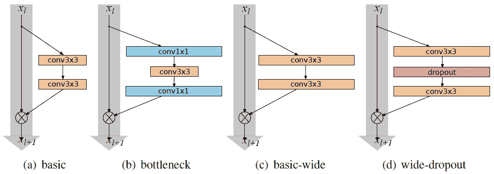
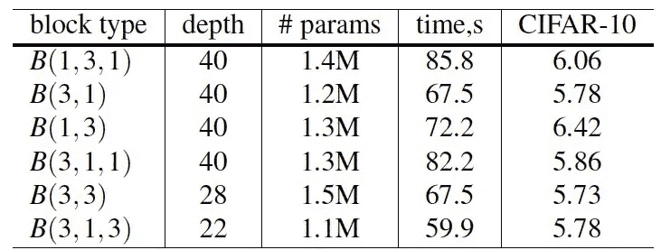
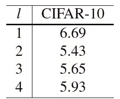
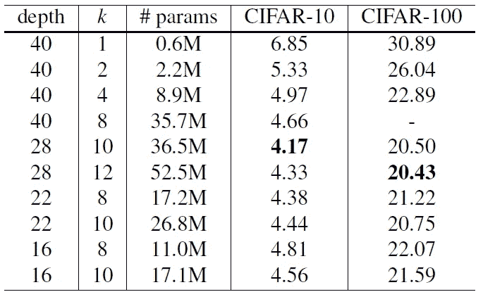
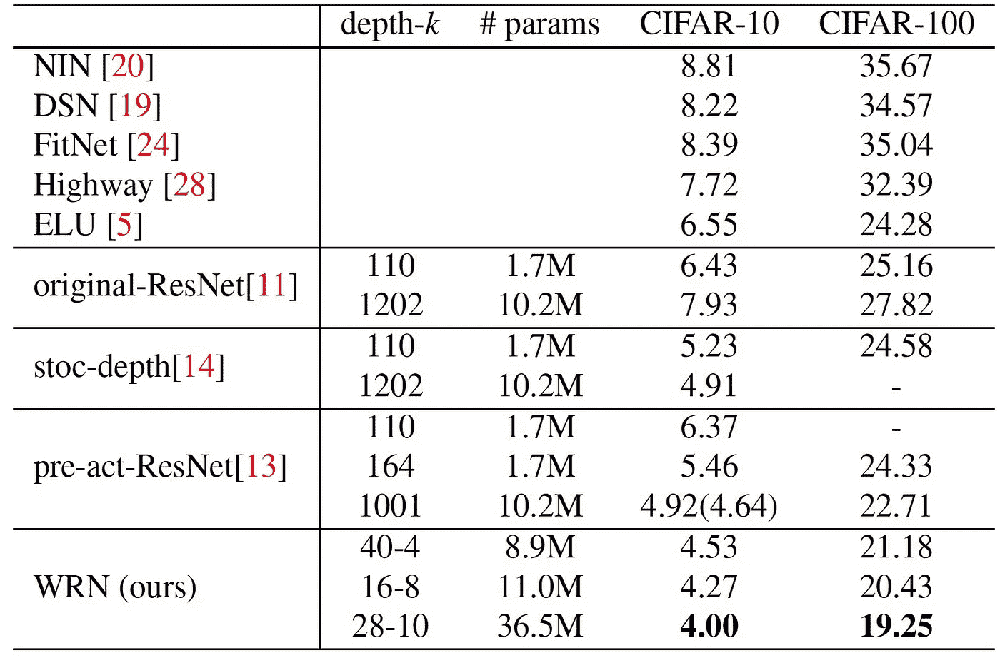
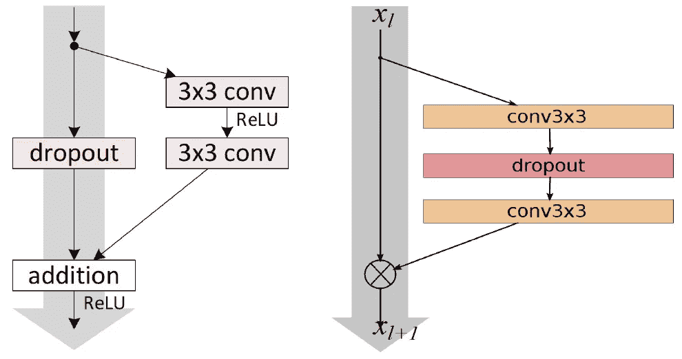
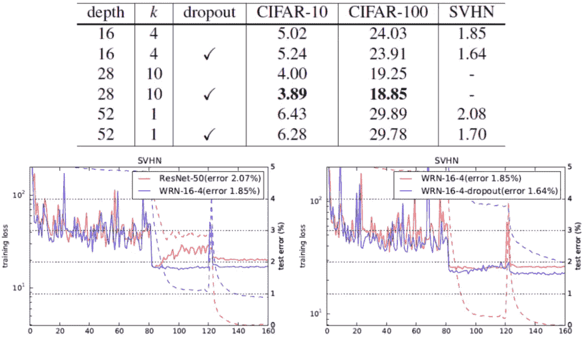
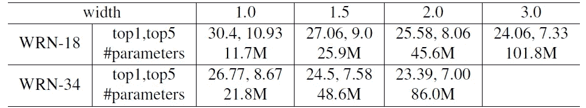
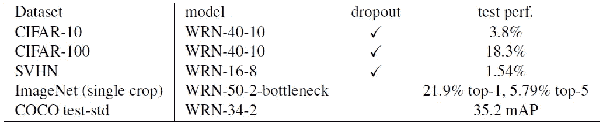
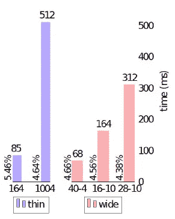

# 综述:WRNs —宽残差网络(图像分类)

> 原文：<https://towardsdatascience.com/review-wrns-wide-residual-networks-image-classification-d3feb3fb2004?source=collection_archive---------4----------------------->

T 他的时代， **WRNs(广残网)**呈现出来。通过**加宽残差网络(**[**【ResNet】**](/review-resnet-winner-of-ilsvrc-2015-image-classification-localization-detection-e39402bfa5d8)**)**，在精度相同或精度提高的情况下，网络可以更浅。**较浅的网络**表示:

*   **层数可以减少。**
*   **培训时间也可以缩短。**

一个更好的辍学也进行了调查。这是一篇 **2016 BMVC** 论文，引用 **700 余次**。虽然这是一篇 2016 年的论文，但他们仍然在 2017 年 6 月继续更新这篇论文。( [Sik-Ho Tsang](https://medium.com/u/aff72a0c1243?source=post_page-----d3feb3fb2004--------------------------------) @中)

**Various ResNet Blocks**

# 涵盖哪些内容

1.  **残网上的问题(**[**ResNet**](/review-resnet-winner-of-ilsvrc-2015-image-classification-localization-detection-e39402bfa5d8)**)**
2.  **宽残差网络**
3.  **结果**

# 1.关于剩余网络的问题( [ResNet](/review-resnet-winner-of-ilsvrc-2015-image-classification-localization-detection-e39402bfa5d8)

## 1.1.**电路复杂性理论**

**电路复杂性理论**文献表明:

> 浅电路比深电路需要更多的元件。

残差网络的作者试图使它们**尽可能薄，以利于增加它们的深度并具有更少的参数**，甚至引入了一个瓶颈块，使 ResNet 块更薄。

## 1.2.**减少特征重用**

然而，当梯度流过网络时，没有任何东西迫使它通过剩余块权重，并且它可以避免在训练期间学习任何东西，因此有可能**只有几个块学习有用的表示**，或者**许多块共享非常少的信息，对最终目标贡献很小**。这个问题被表述为**减少特征重用**。

# 2.宽剩余网络

在 WRNs 中，测试了大量参数，如 ResNet 块的设计、ResNet 块内的深度(加深系数 *l* 和宽度(加宽系数 *k* )等。

当 *k* =1 时，与 [*ResNet*](/review-resnet-winner-of-ilsvrc-2015-image-classification-localization-detection-e39402bfa5d8) 宽度相同。而*k*1，比 [*ResNet*](/review-resnet-winner-of-ilsvrc-2015-image-classification-localization-detection-e39402bfa5d8) 宽 *k* 倍。

**WRN- *d* - *k***

*   [*预激活 ResNet*](/resnet-with-identity-mapping-over-1000-layers-reached-image-classification-bb50a42af03e) 用于 CIFAR-10、CIFAR-100 和 SVHN 数据集。ImageNet 数据集中使用了原始的[*ResNet*](/review-resnet-winner-of-ilsvrc-2015-image-classification-localization-detection-e39402bfa5d8)*。*
*   *主要区别在于 [*预激活 ResNet*](/resnet-with-identity-mapping-over-1000-layers-reached-image-classification-bb50a42af03e) 具有在卷积之前执行批范数和 ReLU 的结构(即 BN-ReLU-Conv)，而原始[*ResNet*](/review-resnet-winner-of-ilsvrc-2015-image-classification-localization-detection-e39402bfa5d8)*具有 Conv-BN-ReLU 的结构。而 [*预激活 ResNet*](/resnet-with-identity-mapping-over-1000-layers-reached-image-classification-bb50a42af03e) 一般比原版好，但在 ImageNet 只有 100 层左右的情况下没有明显提升。**

## **2.1.ResNet 块的设计**

****

****WRN-d-2 (k=2), Error Rate (%) in CIFAR-10 Dataset****

*   ****B(3；3)** :原始基本块，在第一个图(a)中**
*   ****B(3；1;3)** :在两个 3×3 层之间增加一个 1×1 层**
*   ****B(1；3;1)** :所有卷积维数相同，拉直**瓶颈****
*   ****B(1；3)** :网络具有交替的 1×1，3×3 卷积**
*   ****B(3；1)** :网络具有交替的 3×3，1×1 卷积**
*   ****B(3；1;1)** :网络中网络样式块**

****B(3；3)错误率最小(5.73%)。****

**注意:深度(层)的数量不同是为了保持参数的数量彼此接近。**

## **2.2.ResNet 块内的卷积层数**

****

****WRN-40–2 with different l, Error Rate (%) in CIFAR-10 Dataset****

**并且两个 3×3 卷积，即 B(3，3)具有最小的错误率。因为所有网络都需要保持接近相同的参数， **B(3，3，3)和 B(3，3，3，3)** 的**更少，这使得精度下降。并且 **B(3)** 只有一个 3×3 卷积，这**使得特征提取在 ResNet 块内的这种浅网络内无效**。****

**因此， **B(3，3)是最优的**，并将在接下来的实验中使用。**

## **2.3.ResNet 块的宽度**

****

****Different Width (k) and Depth on CIFAR-10 and CIFAR-100****

*   **当宽度增加 1 到 12 倍时，所有具有 40、22 和 16 层的网络看到一致的增益。**
*   **另一方面，当保持相同的固定加宽因子 k = 8 或 k = 10 并且将深度从 16 改变到 28 时，有一致的改进，然而当我们进一步将深度增加到 40 时，精度降低。**
*   **基于上述结果，选择了三组 wrn 与最先进的方法进行比较。**

# **3.结果**

## **3.1.西法尔-10 和西法尔-100**

****

****CIFAR-10 & CIFAR-100****

*   ****WRN-40–4**:参数(8.9M)比 1001 层 [*预激活 ResNet*](/resnet-with-identity-mapping-over-1000-layers-reached-image-classification-bb50a42af03e) (10.2M)少。但是它也降低了错误率。(在 CIFAR-10 上为 4.52%，在 CIFAR-100 上为 21.18%)**
*   ****WRN-16-8 & WRN-28-10** :比 WRN-40–4 更浅更宽，错误率更低。使用较浅的网络，训练时间可以更短，因为无论多宽，并行计算都是在 GPU 上执行的。**
*   **并且它是第一篇在没有任何强大数据增强的情况下获得低于 20%的 CIFAR-100 的论文！！！**

## **3.2.拒绝传统社会的人**

****

****Dropout in Original ResNet (Left) and Dropout in WRNs (Right)****

****

****Dropout Is Better****

*   **上图:使用 dropout，可以获得不同深度、k 和数据集的一致增益。**
*   **右下:对于辍学，训练损失较高，但测试误差较低，这意味着辍学成功地减少了过拟合。**

## **3.3.ImageNet & COCO**

****

****Single Crop Single Model Validation Error, ImageNet****

*   **上述网络获得了与原始网络相似的精度，但层数减少了 2 倍。**

****

*   ****WRN-50–2-瓶颈**:性能优于[雷斯网-152](http://ResNet) ，层数少 3 倍，这意味着训练时间明显更快。**
*   ****WRN-34–2**:优于基于[雷斯内特-152](http://ResNet) 和[盗梦空间-v4](/review-inception-v4-evolved-from-googlenet-merged-with-resnet-idea-image-classification-5e8c339d18bc) 的模型**

## **3.4.训练时间**

****

****Training Time for Each Batch with Batch Size of 32, CIFAR-10****

*   ****WRN-16–10 和 WRN-28–10**:训练时间远低于 1004 层 [*预激活 ResNet*](/resnet-with-identity-mapping-over-1000-layers-reached-image-classification-bb50a42af03e) ，错误率更低。**
*   ****WRN-40–4**:训练时间比 164 层 [*预激活 ResNet*](/resnet-with-identity-mapping-over-1000-layers-reached-image-classification-bb50a42af03e) 短，错误率更低。**

**因为训练需要很多时间，所以可能需要几天甚至几周。当训练集越来越大时，需要一种更好的训练方法。事实上，在最近的研究中，许多研究人员仍然专注于如何减少训练时间或训练次数。**

**在 WRNs 中，它减少了训练时间，但代价是由于网络的扩大而增加了参数的数量。**

## **参考**

**【2016 BMVC】【WRNs】
[广残网](https://arxiv.org/abs/1605.07146)**

## **我对图像分类的相关综述**

**[[LeNet](https://medium.com/@sh.tsang/paper-brief-review-of-lenet-1-lenet-4-lenet-5-boosted-lenet-4-image-classification-1f5f809dbf17)][[AlexNet](https://medium.com/coinmonks/paper-review-of-alexnet-caffenet-winner-in-ilsvrc-2012-image-classification-b93598314160)][[ZFNet](https://medium.com/coinmonks/paper-review-of-zfnet-the-winner-of-ilsvlc-2013-image-classification-d1a5a0c45103)][[VGGNet](https://medium.com/coinmonks/paper-review-of-vggnet-1st-runner-up-of-ilsvlc-2014-image-classification-d02355543a11)][[SPPNet](https://medium.com/coinmonks/review-sppnet-1st-runner-up-object-detection-2nd-runner-up-image-classification-in-ilsvrc-906da3753679)][[PReLU-Net](https://medium.com/coinmonks/review-prelu-net-the-first-to-surpass-human-level-performance-in-ilsvrc-2015-image-f619dddd5617)][[Google Net/Inception-v1](https://medium.com/coinmonks/paper-review-of-googlenet-inception-v1-winner-of-ilsvlc-2014-image-classification-c2b3565a64e7)][[BN-Inception/Inception-v2](https://medium.com/@sh.tsang/review-batch-normalization-inception-v2-bn-inception-the-2nd-to-surpass-human-level-18e2d0f56651)][[Inception-v3](https://medium.com/@sh.tsang/review-inception-v3-1st-runner-up-image-classification-in-ilsvrc-2015-17915421f77c)][[Inception-v4](/review-inception-v4-evolved-from-googlenet-merged-with-resnet-idea-image-classification-5e8c339d18bc)**