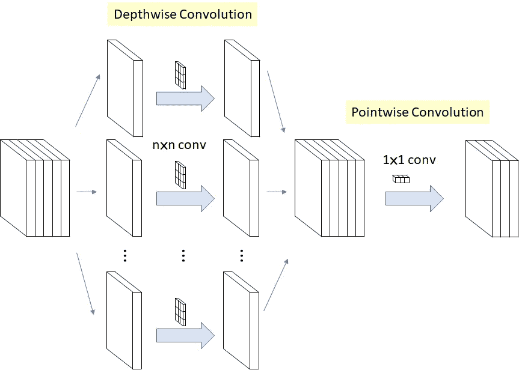
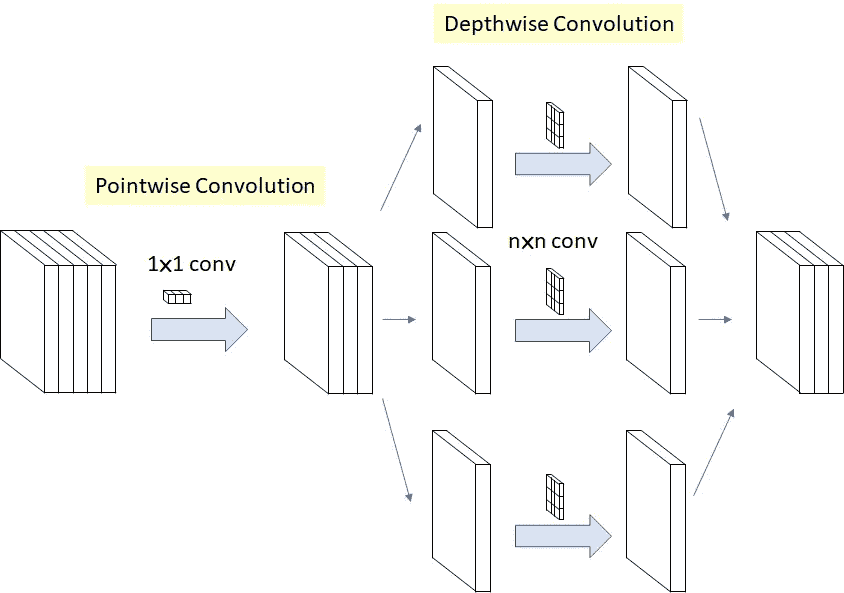
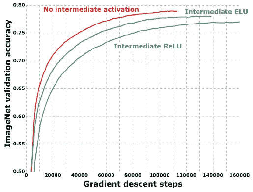
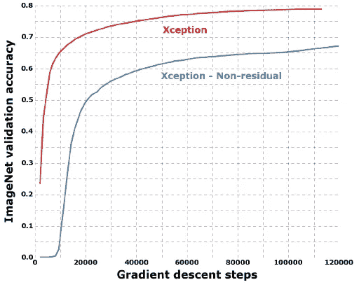
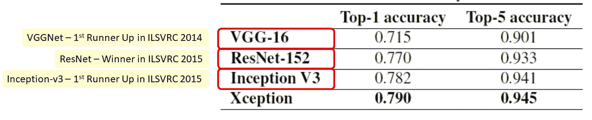
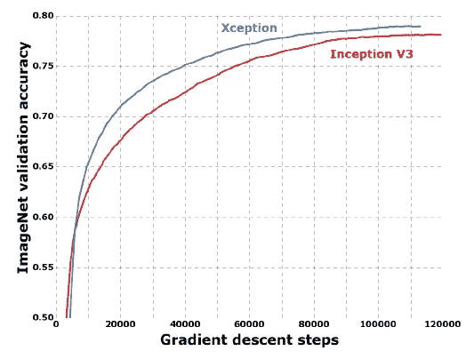
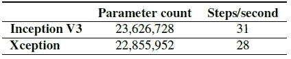
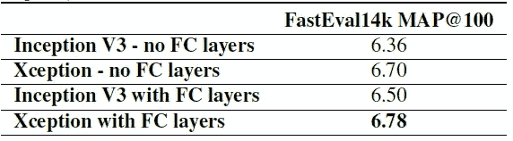
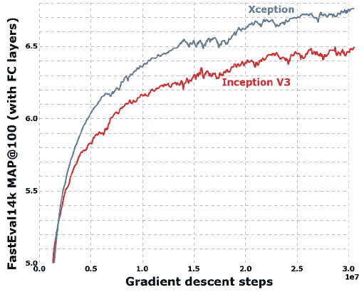

# 综述:例外—深度方向可分离卷积，优于 Inception-v3(图像分类)

> 原文：<https://towardsdatascience.com/review-xception-with-depthwise-separable-convolution-better-than-inception-v3-image-dc967dd42568?source=collection_archive---------3----------------------->

在这个故事中，谷歌的**exception【1】，代表《盗梦空间》的极致版，进行了回顾。通过修改的**深度方向可分离卷积**，它在 ImageNet ILSVRC 和 JFT 数据集上都比 Inception-v3**【2】(也是由谷歌在 ILSVRC 2015 中获得亚军)更好。虽然这是一篇去年刚刚发表的 **2017 CVPR** 论文，但在我写这篇文章的时候，它已经被引用了 **300 多次**。( [Sik-Ho Tsang](https://medium.com/u/aff72a0c1243?source=post_page-----dc967dd42568--------------------------------) @中)

# 涵盖哪些内容

1.  **原始深度方向可分离卷积**
2.  **除**外的改进深度方向可分离卷积
3.  **整体架构**
4.  **与最先进结果的比较**

# **1。原始深度方向可分离卷积**

**Original Depthwise Separable Convolution**

原始深度方向可分离卷积是**深度方向卷积后跟一个点方向卷积**。

1.  **深度方向卷积**是**通道方向 n×n 空间卷积**。假设在上图中，我们有 5 个通道，那么我们将有 5 个 n×n 空间卷积。
2.  **逐点卷积**实际上是改变尺寸的 **1×1 卷积**。

与常规卷积相比，我们不需要在所有通道上执行卷积。这意味着**连接数量更少，型号更轻。**

# **2。除**外的改进深度可分卷积

**The Modified Depthwise Separable Convolution used as an Inception Module in Xception, so called “extreme” version of Inception module (n=3 here)**

修改的深度方向可分离卷积是**点方向卷积，后面是深度方向卷积**。这种修改是由 inception-v3 中的 Inception 模块引起的，即在任何 n×n 空间卷积之前首先进行 1×1 卷积。因此，它与原来的有点不同。(**这里 n=3** 因为在 Inception-v3 中使用了 3×3 空间卷积。)

**两个小区别:**

1.  **操作顺序**:如上所述，通常实现的原始深度方向可分离卷积(例如在 TensorFlow 中)首先执行通道方向空间卷积，然后执行 1×1 卷积，而修改的深度方向可分离卷积**首先执行 1×1 卷积，然后执行通道方向空间卷积**。这被认为是不重要的，因为当它被用在堆叠设置中时，在所有链接的初始模块的开始和结束处只有很小的差别。
2.  **存在/不存在非线性**:在初始模块中，第一次操作后存在非线性。**除了**修改的深度方向可分离卷积**之外，没有中间 ReLU 非线性**。

**The modified depthwise separable convolution with different activation units**

测试了具有不同激活单元的改进深度可分卷积。如上图所示，**与使用 ELU 或 r ELU 的情况相比，没有任何中间激活的例外具有最高的准确性**。

# **3。整体架构**

**Overall Architecture of Xception (Entry Flow > Middle Flow > Exit Flow)**

如上图所示， **SeparableConv** 是修正的深度方向可分离卷积。我们可以看到，SeparableConvs 被**视为初始模块**，并被放置在整个深度学习架构中。

还有最初由 ResNet [3]提出的针对所有流的**剩余(或快捷方式/跳过)连接**。

**ImageNet: Validation Accuracy Against Gradient Descent Steps**

正如在架构中看到的，存在剩余连接。这里，它使用非剩余版本测试异常。从上图可以看出，使用残差连接时，精度要高得多。**由此可见，剩余连接极其重要！！！**

# **4。与最先进结果的比较**

测试了 2 个数据集。一个是 ILSVRC。一个是 JFT。

## 4.1.ImageNet — ILSVRC

ImageNet 是一个数据集，包含超过 1500 万张带有标签的高分辨率图像，大约有 22，000 个类别。

ILSVRC 在 1000 个类别中的每个类别中使用大约 1000 个图像的 ImageNet 子集。总的来说，大约有 130 万幅训练图像、50，000 幅验证图像和 100，000 幅测试图像。

**ImageNet: Xception has the highest accuracy**

Xception 优于 VGGNet [4]、ResNet [3]和 Inception-v3 [2]。(如果感兴趣，也请访问我关于他们的评论，广告了，lol)

需要注意的是，在错误率方面，而不是准确率方面，相对提升不小！！！

**ImageNet: Validation Accuracy Against Gradient Descent Steps**

当然，从上图来看，沿着梯度下降的台阶，Xception 比 Inception-v3 有更好的准确率。

但如果用非残差版本和 Inception-v3 对比，Xception 表现不如 Inception-v3。为了公平比较，是不是应该有一个残版的 Inception-v3 比较好？无论如何，Xception 告诉我们，利用深度方向可分离卷积和残差连接，确实有助于提高精度。

**Model Size/Complexity**

据称，Xception 与 Inception-v3 的模型大小相似。

## 4.2.JFT—fast val 14k

JFT 是一个用于大规模图像分类数据集的内部谷歌数据集，由 Hinton *教授等人*首先介绍，它包括超过 3.5 亿张高分辨率图像，标注有来自 17，000 个类别的标签。

使用辅助数据集 FastEval14k。FastEval14k 是一个包含 14，000 幅图像的数据集，具有来自大约 6，000 个类的密集注释(平均每幅图像 36.5 个标签)。

由于多个目标密集地出现在一幅图像中，因此使用平均精度预测(mAP)进行测量。

**FastEval14k: Xception has highest mAP@100**

**FastEval14k: Validation Accuracy Against Gradient Descent Steps**

同样，与 Inception-v3 相比，Xception 的 mAP 更高。

# 参考

1.  【2017 CVPR】【例外】
    [例外:深度可分卷积深度学习](http://openaccess.thecvf.com/content_cvpr_2017/papers/Chollet_Xception_Deep_Learning_CVPR_2017_paper.pdf)
2.  【2016 CVPR】【盗梦空间-v3】
    [重新思考计算机视觉的盗梦空间架构](https://www.cv-foundation.org/openaccess/content_cvpr_2016/papers/Szegedy_Rethinking_the_Inception_CVPR_2016_paper.pdf)
3.  【2016 CVPR】【ResNet】
    [用于图像识别的深度残差学习](https://www.cv-foundation.org/openaccess/content_cvpr_2016/papers/He_Deep_Residual_Learning_CVPR_2016_paper.pdf)
4.  【2015 ICLR】【VGGNet】
    [用于大规模图像识别的极深度卷积网络](https://arxiv.org/pdf/1409.1556)

# 我的评论

1.  [回顾:Inception-v3–ILSVRC 2015 亚军(图像分类)](https://medium.com/@sh.tsang/review-inception-v3-1st-runner-up-image-classification-in-ilsvrc-2015-17915421f77c)
2.  [回顾:ResNet—ils vrc 2015(图像分类、定位、检测)获奖者](/review-resnet-winner-of-ilsvrc-2015-image-classification-localization-detection-e39402bfa5d8)
3.  [点评:VGGNet—ils vrc 2014 亚军(图像分类)、冠军(本地化)](https://medium.com/coinmonks/paper-review-of-vggnet-1st-runner-up-of-ilsvlc-2014-image-classification-d02355543a11)