# 复习:YOLOv2 & YOLO9000 —你只看一次(物体检测)

> 原文：<https://towardsdatascience.com/review-yolov2-yolo9000-you-only-look-once-object-detection-7883d2b02a65?source=collection_archive---------4----------------------->

在这个故事里， **YOLOv2，你只看一次版本 2，**是评论。YOLOv2 比 YOLOv1 有**多项改进。YOLO9000 还被提议使用单词树**检测超过 9000 个对象类别。

下面(我相信)是作者非常著名的 YOLOv2 视频:

**YOLOv2**

**在 67 FPS 时，YOLOv2 在 PASCAL VOC 2007 上获得了 76.8%的 mAP**。**40 FPS，YOLOv2 获得 78.6% mAP** 比 [*更快 R-CNN*](/review-faster-r-cnn-object-detection-f5685cb30202) 使用[*ResNet*](/review-resnet-winner-of-ilsvrc-2015-image-classification-localization-detection-e39402bfa5d8)*和 SSD。取得如此好的成绩，YOLOv2 发表在 **2017 CVPR** 上，并获得超过 **1000 次引用**。( [Sik-Ho Tsang](https://medium.com/u/aff72a0c1243?source=post_page-----7883d2b02a65--------------------------------) @中)*

*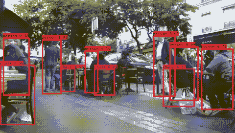*

***YOLOv2***

*论文题目是“ **YOLO9000:更好更快更强**”。
那么，让我们看看怎样才能**更好**，**更快**，**更强**！！！*

# *涵盖哪些内容*

1.  ***YOLOv2 比**[***yolo v1***](/yolov1-you-only-look-once-object-detection-e1f3ffec8a89)**(更好)***
2.  ***YOLOv2 使用 Darknet-19(更快)***
3.  ***YOLO9000 by WordTree(更强)***

# ***1。YOLOv2 的改进超过了**[***yolo v1***](/yolov1-you-only-look-once-object-detection-e1f3ffec8a89)**(更好)***

## *1.1.[批量归一化(BN)](https://medium.com/@sh.tsang/review-batch-normalization-inception-v2-bn-inception-the-2nd-to-surpass-human-level-18e2d0f56651)*

*   *[*BN*](https://medium.com/@sh.tsang/review-batch-normalization-inception-v2-bn-inception-the-2nd-to-surpass-human-level-18e2d0f56651) 用于 YOLOv2 中的所有卷积层。*
*   *地图提高 2%。*

## *1.2.高分辨率分类器*

*   *经过 224×224 图像训练后，YOLOv2 还使用 448×448 图像在 ImageNet 上对分类网络进行 10 个时期的微调。*
*   *地图增加 4%。*

## *1.3.带有锚盒的回旋*

*   *YOLOv2 移除所有完全连接的层，并使用锚定框来预测边界框。*
*   *移除一个池层以提高输出的分辨率。*
*   *现在使用 416×416 的图像来训练检测网络。*
*   *并且获得 13×13 的特征图输出，即 32×下采样。*
*   *在没有锚盒的情况下，中间模型获得了 69.5%的 mAP 和 81%的召回率。*
*   *使用锚盒，获得了 69.2%的 mAP 和 88%的召回率。虽然地图略有下降，但召回率大幅上升。*

## *1.4.维度群*

*   *锚定框的大小和比例是预先定义的，没有获得任何事先信息，就像《更快的 R-CNN 中的 [*一样。*](/review-faster-r-cnn-object-detection-f5685cb30202)*
*   *使用基于标准欧几里德距离的 k-means 聚类不够好，因为较大的盒子比较小的盒子产生更多的误差*
*   *YOLOv2 使用 k-means 聚类，可获得良好的 IOU 分数:*

*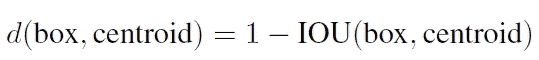*

***Cluster IOU***

*   *k = 5 是在模型复杂性和高召回率之间取得良好平衡的最佳值。*

*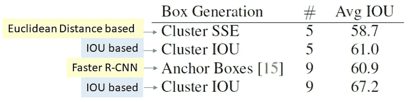*

***Different IOU Clustering Approaches with DIfferent Number of Anchor Boxes***

*   *具有 5 个锚框的基于 IOU 的聚类(61.0%)具有与具有 9 个锚框的 [*更快 R-CNN*](/review-faster-r-cnn-object-detection-f5685cb30202) 中的相似的结果(60.9%)。*
*   *基于 IOU 的 9 锚盒聚类得到 67.2%。*

## *1.5.直接位置预测*

*   *[*YOLOv1*](/yolov1-you-only-look-once-object-detection-e1f3ffec8a89) 对位置预测没有约束，这使得模型在早期迭代时不稳定。预测的边界框可能远离原始网格位置。*
*   *YOLOv2 使用逻辑激活σ来限定位置，这使得值落在 0 到 1 之间:*

*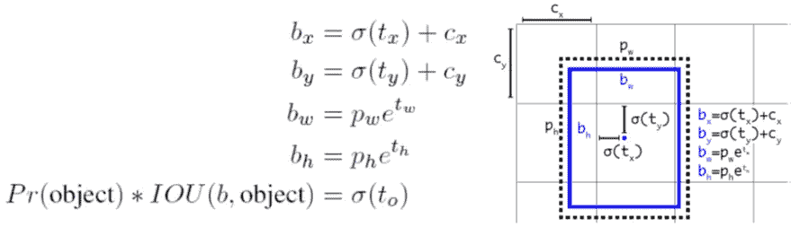*

***Constrained Bounding Box Prediction***

*   *(cx，cy)是网格的位置。*
*   *(bx，by)是包围盒的位置:(cx，cy) +由σ(tx)和σ(ty)包围的 delta。*
*   *(pw，ph)是从聚类中得到的锚盒先验。*
*   *(bw，bh)是边界框尺寸:(pw，ph)乘以(tw，th)。*
*   *地图比锚盒版本增加了 5%。*

## *1.6.精细特征*

*   *13×13 特征图输出足以检测大物体。*
*   *为了更好地检测小目标，将前一层的 26×26×512 特征图映射为 13×13×2048 特征图，然后与原始的 13×13 特征图连接进行检测。*
*   *mAP 增加了 1%。*

## *1.7.多尺度训练*

*   *对于每 10 个批次，随机选择新的图像尺寸。*
*   *图像尺寸为{320，352，…，608}。*
*   *调整网络大小并继续训练。*

## *1.8.增量改进总结*

**

***Incremental Improvements***

*   *较小尺寸的图像网络运行速度更快。*
*   *对于低分辨率的 YOLOv2，在 90 FPS 的情况下，mAP 和 [*快速 R-CNN*](https://medium.com/coinmonks/review-fast-r-cnn-object-detection-a82e172e87ba) 一样好，非常适合更小的 GPU。*
*   *对于高分辨率 YOLOv2，以实时速度获得 76.8%的 mAP。*

*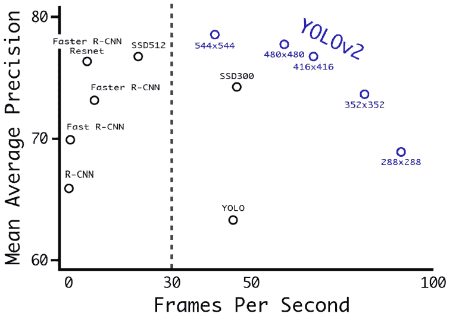*

***PASCAL VOC 2007 Dataset***

*对于 MS COCO 数据集，以下方法中只有 YOLOv2 可以获得实时性能:*

*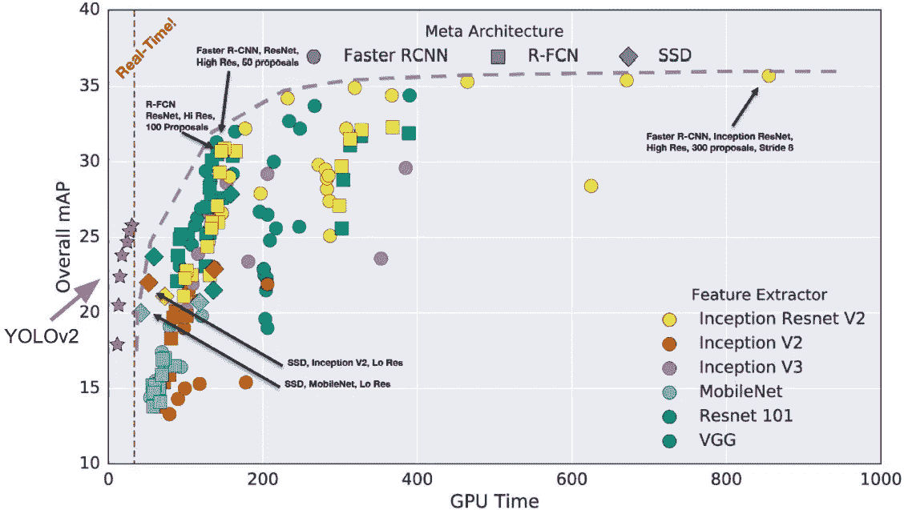*

***Microsoft COCO Dataset***

# ***2。YOLOv2 使用 Darknet-19(更快)***

*除了以上修改，网络架构也是影响 mAP 的一个因素。*

*在 YOLOv2 中使用 Darknet-19 分类网络进行特征提取:*

*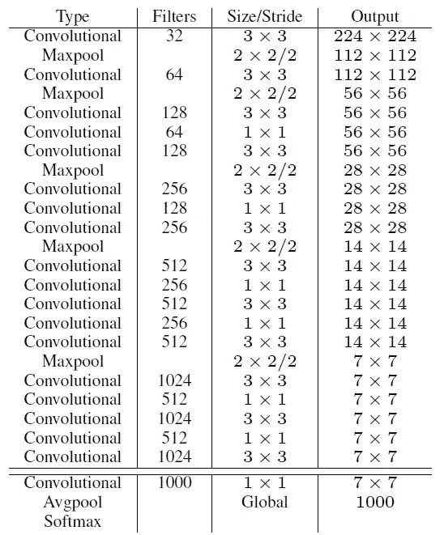*

***Darknet-19 Classification Network***

*我们可以看到，Darknet-19 有许多 1×1 卷积来减少参数的数量。(如果对原因感兴趣，请访问我在 [*GoogLeNet*](https://medium.com/coinmonks/paper-review-of-googlenet-inception-v1-winner-of-ilsvlc-2014-image-classification-c2b3565a64e7) 上的评论。)*

*Darknet-19 可以在准确性和模型复杂性之间获得良好的平衡:*

*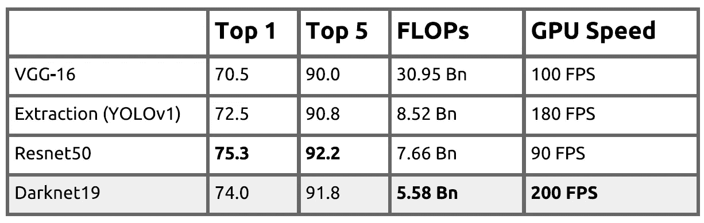*

***1000-Class ImageNet Classification Results***

*由于 Top-1 和 Top-5 错误接近于 [*ResNet-50*](/review-resnet-winner-of-ilsvrc-2015-image-classification-localization-detection-e39402bfa5d8) ，Darknet-19 具有更低的模型复杂度(FLOP)，因此具有更快的检测速度(FPS)。*

# *3. **YOLO9000 by WordTree(更强)***

*有多个数据集用于分类和检测。作者有一个想法，“他们能结合在一起吗？”*

## ***3.1。联合收割机***

*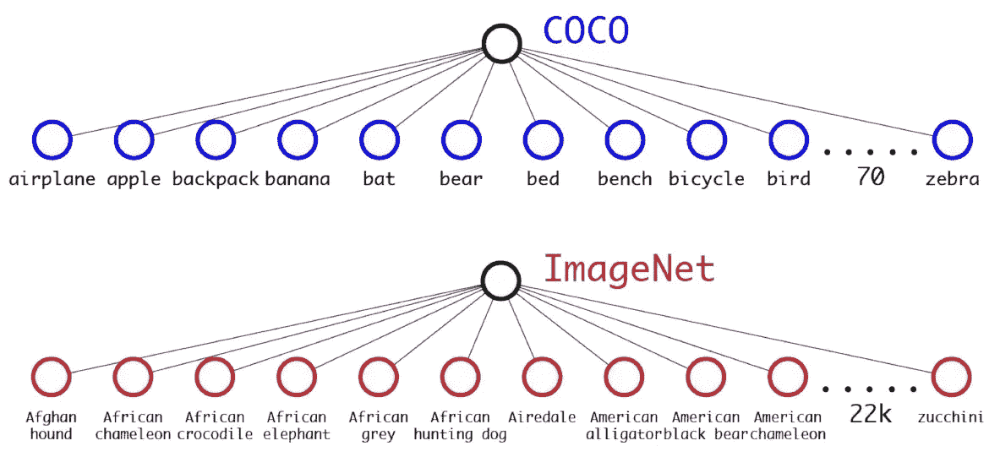*

***COCO and ImageNet***

*   ***微软 COCO** : 100k 图片，80 个类，检测标签，类比较笼统像“狗”或者“船”。*
*   *ImageNet:1300 万张图片，22k 个类别，分类标签，类别更具体，如“诺福克梗”，“约克夏梗”，或“贝德灵顿梗”。*
*   *像“狗”和“诺福克梗”这样的类别并不互相排斥。*

*我们不能通过添加更多的类来直接组合它们，如下所示:*

*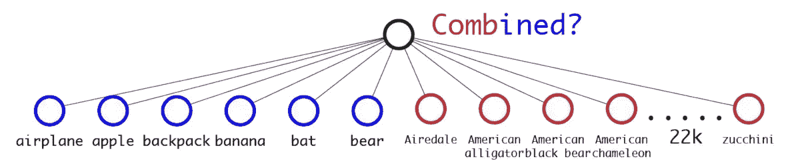*

***We CANNOT combine like this***

*为了合并，使用了单词树:*

*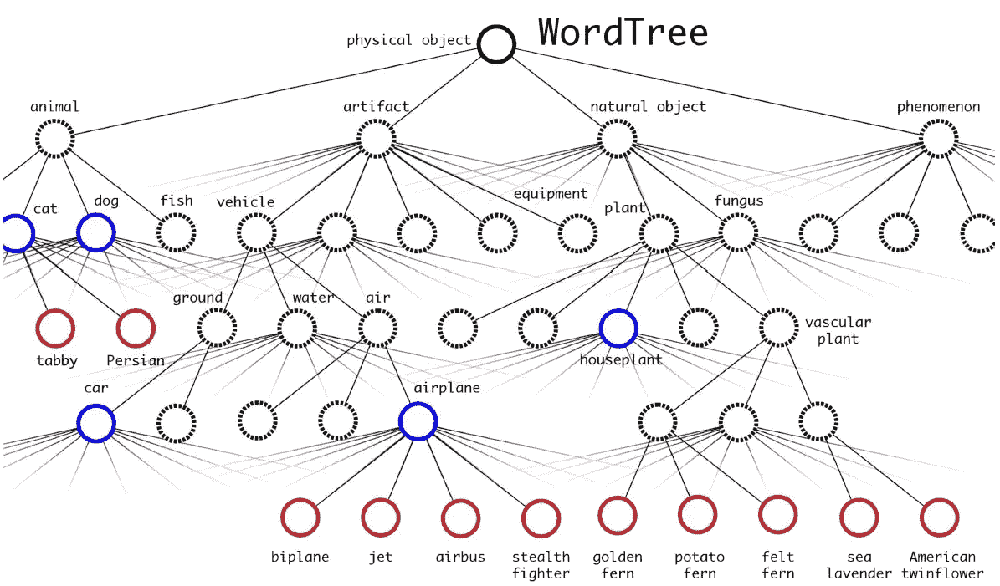*

***WordTree***

*如上所示，WordTree 有一个层次结构树，将类和子类联系在一起。简而言之，基于树的单词树是在基于图的单词网的基础上，通过将 ImageNet 中的名词可视化，并在单词网中选择较短的路径来构建的。*

*例如:“诺福克梗”也有“狗”和“哺乳动物”的标签。*

*如果网络看到“狗”的图像，但不确定它是哪种类型，它仍然会基于条件概率以高置信度预测为“狗”。*

*最后有 9418 个班。*

## *3.2.YOLO9000 培训*

*   *使用 3 个先验而不是 5 个先验来限制输出大小。*
*   *对于检测图像，损失通常反向传播。*
*   *对于分类图像，只有分类损失在标签的相应级别或以上被反向传播。*

## *3.3.YOLO9000 结果*

*   *获得了 19.7%的 mAP。*

*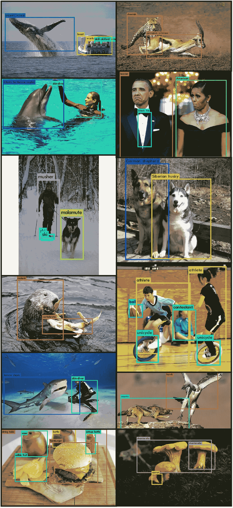*

***YOLO9000 Results***

*最初，COCO 女士没有这么多的基本事实类，而 ImageNet 有类，但没有基本事实边界框。*

*现在 YOLO9000 提供了一种将它们结合在一起的方法。*

# *参考*

*【2017 CVPR】【yolov 2 & yolo 9000】
[yolo 9000:更好更快更强](https://arxiv.org/abs/1612.08242)*

# *我的相关评论*

*[ [R-CNN](https://medium.com/coinmonks/review-r-cnn-object-detection-b476aba290d1) ] [ [快速 R-CNN](https://medium.com/coinmonks/review-fast-r-cnn-object-detection-a82e172e87ba) ] [ [更快 R-CNN](/review-faster-r-cnn-object-detection-f5685cb30202)][[SSD](/review-ssd-single-shot-detector-object-detection-851a94607d11)][[yolov 1](/yolov1-you-only-look-once-object-detection-e1f3ffec8a89)][[VGGNet](https://medium.com/coinmonks/paper-review-of-vggnet-1st-runner-up-of-ilsvlc-2014-image-classification-d02355543a11)][[ResNet](/review-resnet-winner-of-ilsvrc-2015-image-classification-localization-detection-e39402bfa5d8)][[Google net/Inception-v1](https://medium.com/coinmonks/paper-review-of-googlenet-inception-v1-winner-of-ilsvlc-2014-image-classification-c2b3565a64e7)][[Inception-v2/BN-Inception](https://medium.com/@sh.tsang/review-batch-normalization-inception-v2-bn-inception-the-2nd-to-surpass-human-level-18e2d0f56651)]*