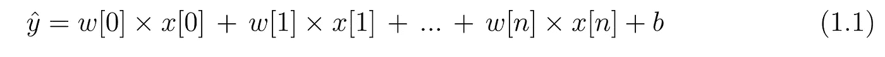
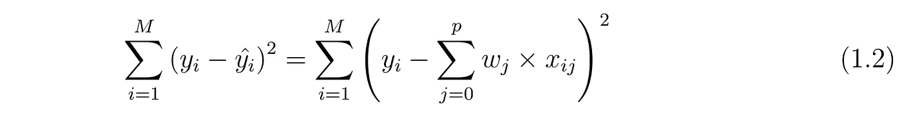
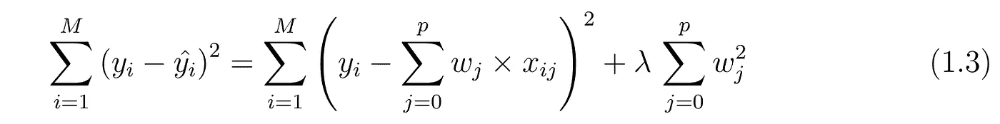
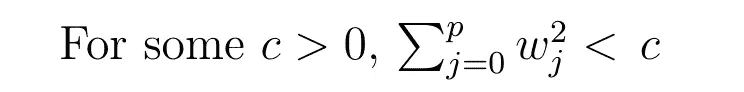
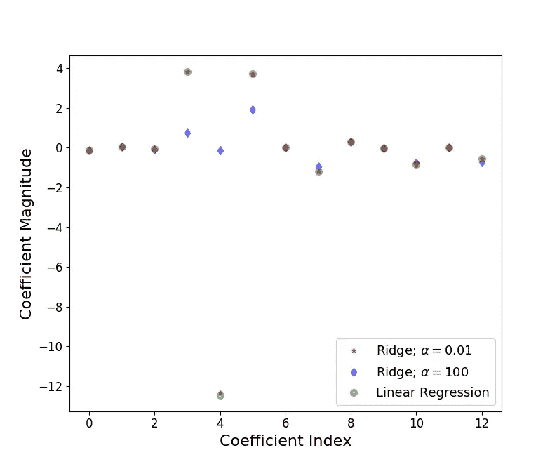
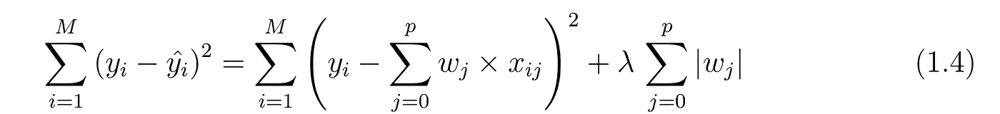
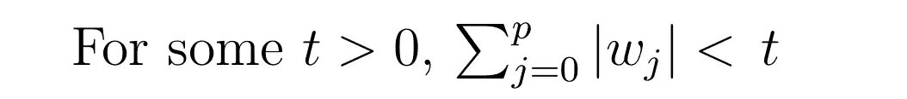
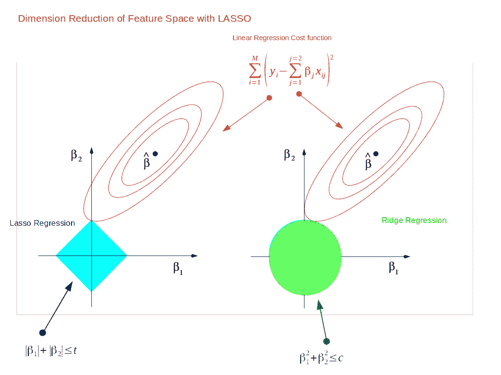

# 岭和套索回归:L1 和 L2 正则化

> 原文：<https://towardsdatascience.com/ridge-and-lasso-regression-a-complete-guide-with-python-scikit-learn-e20e34bcbf0b?source=collection_archive---------0----------------------->

## 使用 Scikit 的完整指南-学习

从我上周讨论的非常重要的非监督学习技术[，](/dive-into-pca-principal-component-analysis-with-python-43ded13ead21)继续，今天我们将通过线性回归深入探讨监督学习，特别是两个特殊的线性回归模型——Lasso 和 Ridge regression。

由于我使用了术语“线性”,首先让我们澄清一下，线性模型是使用输入要素的线性函数来预测输出的最简单方法之一。



Linear model with n features for output prediction

在上面的等式(1.1)中，我们已经示出了基于 n 个特征的线性模型。只考虑单一特征，因为你可能已经知道 *w[0]* 将是斜率，而 *b* 将代表截距。线性回归寻找优化 *w* 和 *b* ，使得它最小化成本函数。成本函数可以写成



Cost function for simple linear model

在上面的等式中，我假设数据集有 M 个实例和 p 个特征。一旦我们对分成训练集和测试集的数据集使用线性回归，计算训练集和测试集的分数可以给我们一个粗略的概念，即模型是过拟合还是欠拟合。如果你足够幸运的话，选择的线性模型也可以是恰到好处的！如果数据集上的特征很少，训练集和测试集的得分都很低，那么这就是拟合不足的问题。另一方面，如果我们有大量的特征，并且测试分数比训练分数相对较差，那么这就是过度概括或过度拟合的问题。**岭和套索回归是降低模型复杂性和防止简单线性回归可能导致的过度拟合的一些简单技术**。

***岭回归:*** 在岭回归中，通过增加一个等价于系数大小平方的惩罚来改变成本函数。



Cost function for ridge regression

这相当于在如下条件下最小化等式 1.2 中的成本函数



Supplement 1: Constrain on Ridge regression coefficients

因此岭回归对系数 *(w)施加了约束。*罚项(λ)正则化系数，使得如果系数取大值，优化函数被罚。因此**，岭回归缩小了系数，有助于降低模型复杂性和多重共线性。**回归情商。1.3 可以看出，当λ → 0 时，成本函数变得类似于线性回归成本函数(等式。1.2).因此*降低对特征的约束(低λ),模型将类似于线性回归模型。*让我们看一个使用波士顿数据的例子，下面是我用来描述线性回归作为岭回归的极限情况的代码

```
import matplotlib.pyplot as plt
import numpy as np 
import pandas as pd
import matplotlib
matplotlib.rcParams.update({'font.size': 12})from sklearn.datasets import load_boston
from sklearn.cross_validation import train_test_split
from sklearn.linear_model import LinearRegression
from sklearn.linear_model import Ridgeboston=load_boston()
boston_df=pd.DataFrame(boston.data,columns=boston.feature_names)
#print boston_df.info()# add another column that contains the house prices which in scikit learn datasets are considered as target
boston_df['Price']=boston.target
#print boston_df.head(3)newX=boston_df.drop('Price',axis=1)
print newX[0:3] # check 
newY=boston_df['Price']#print type(newY)# pandas core frameX_train,X_test,y_train,y_test=train_test_split(newX,newY,test_size=0.3,random_state=3)
print len(X_test), len(y_test)lr = LinearRegression()
lr.fit(X_train, y_train)rr = Ridge(alpha=0.01) # higher the alpha value, more restriction on the coefficients; low alpha > more generalization,
# in this case linear and ridge regression resemblesrr.fit(X_train, y_train)rr100 = Ridge(alpha=100) #  comparison with alpha value
rr100.fit(X_train, y_train)train_score=lr.score(X_train, y_train)
test_score=lr.score(X_test, y_test)Ridge_train_score = rr.score(X_train,y_train)
Ridge_test_score = rr.score(X_test, y_test)Ridge_train_score100 = rr100.score(X_train,y_train)
Ridge_test_score100 = rr100.score(X_test, y_test)plt.plot(rr.coef_,alpha=0.7,linestyle='none',marker='*',markersize=5,color='red',label=r'Ridge; $\alpha = 0.01$',zorder=7) plt.plot(rr100.coef_,alpha=0.5,linestyle='none',marker='d',markersize=6,color='blue',label=r'Ridge; $\alpha = 100$') plt.plot(lr.coef_,alpha=0.4,linestyle='none',marker='o',markersize=7,color='green',label='Linear Regression')plt.xlabel('Coefficient Index',fontsize=16)
plt.ylabel('Coefficient Magnitude',fontsize=16)
plt.legend(fontsize=13,loc=4)
plt.show()
```



Figure 1: Ridge regression for different values of alpha is plotted to show linear regression as limiting case of ridge regression. Source: Author.

让我们来理解上图。在 X 轴上，我们绘制了系数索引，对于波士顿数据，有 13 个特征(对于 Python，第 0 个索引是指第 1 个特征)。对于较低的α值(0.01)，当系数限制较少时，系数的大小几乎与线性回归相同。对于较高的α (100)值，我们看到，与线性回归情况相比，系数指数 3、4、5 的幅度要小得多。这是一个使用岭回归*缩小*系数大小的例子。

**Lasso 回归:**Lasso(最小绝对收缩和选择算子)回归的成本函数可以写成



Cost function for Lasso regression



Supplement 2: Lasso regression coefficients; subject to similar constrain as Ridge, shown before.

就像岭回归成本函数一样，对于λ= 0，上面的等式简化为等式 1.2。*唯一的区别是，不考虑系数的平方，而是考虑幅度。*这种类型的正则化(L1)可导致零系数，即某些特征在输出评估中被完全忽略。**因此，Lasso 回归不仅有助于减少过度拟合，还能帮助我们进行特征选择。**正如岭回归一样，可以控制正则化参数(λ),我们将使用`sklearn`中的癌症数据集看到以下效果。我使用癌症数据而不是我以前使用的波士顿房屋数据的原因是，癌症数据集有 30 个特征，而波士顿房屋数据只有 13 个特征。因此，通过改变正则化参数可以很好地描述 Lasso 回归的特征选择。


Figure 2: Lasso regression and feature selection dependence on the regularization parameter value. Source: Author.

我用来绘制这些图的代码如下

```
import math 
import matplotlib.pyplot as plt 
import pandas as pd
import numpy as np# difference of lasso and ridge regression is that some of the coefficients can be zero i.e. some of the features are 
# completely neglectedfrom sklearn.linear_model import Lasso
from sklearn.linear_model import LinearRegression
from sklearn.datasets import load_breast_cancer
from sklearn.cross_validation import train_test_splitcancer = load_breast_cancer()
#print cancer.keys()cancer_df = pd.DataFrame(cancer.data, columns=cancer.feature_names)#print cancer_df.head(3)X = cancer.data
Y = cancer.targetX_train,X_test,y_train,y_test=train_test_split(X,Y, test_size=0.3, random_state=31)lasso = Lasso()
lasso.fit(X_train,y_train)
train_score=lasso.score(X_train,y_train)
test_score=lasso.score(X_test,y_test)
coeff_used = np.sum(lasso.coef_!=0)print "training score:", train_score 
print "test score: ", test_score
print "number of features used: ", coeff_usedlasso001 = Lasso(alpha=0.01, max_iter=10e5)
lasso001.fit(X_train,y_train)train_score001=lasso001.score(X_train,y_train)
test_score001=lasso001.score(X_test,y_test)
coeff_used001 = np.sum(lasso001.coef_!=0)print "training score for alpha=0.01:", train_score001 
print "test score for alpha =0.01: ", test_score001
print "number of features used: for alpha =0.01:", coeff_used001lasso00001 = Lasso(alpha=0.0001, max_iter=10e5)
lasso00001.fit(X_train,y_train)train_score00001=lasso00001.score(X_train,y_train)
test_score00001=lasso00001.score(X_test,y_test)
coeff_used00001 = np.sum(lasso00001.coef_!=0)print "training score for alpha=0.0001:", train_score00001 
print "test score for alpha =0.0001: ", test_score00001
print "number of features used: for alpha =0.0001:", coeff_used00001lr = LinearRegression()
lr.fit(X_train,y_train)
lr_train_score=lr.score(X_train,y_train)
lr_test_score=lr.score(X_test,y_test)print "LR training score:", lr_train_score 
print "LR test score: ", lr_test_scoreplt.subplot(1,2,1)
plt.plot(lasso.coef_,alpha=0.7,linestyle='none',marker='*',markersize=5,color='red',label=r'Lasso; $\alpha = 1$',zorder=7) # alpha here is for transparency
plt.plot(lasso001.coef_,alpha=0.5,linestyle='none',marker='d',markersize=6,color='blue',label=r'Lasso; $\alpha = 0.01$') # alpha here is for transparency

plt.xlabel('Coefficient Index',fontsize=16)
plt.ylabel('Coefficient Magnitude',fontsize=16)
plt.legend(fontsize=13,loc=4)plt.subplot(1,2,2)plt.plot(lasso.coef_,alpha=0.7,linestyle='none',marker='*',markersize=5,color='red',label=r'Lasso; $\alpha = 1$',zorder=7) # alpha here is for transparency
plt.plot(lasso001.coef_,alpha=0.5,linestyle='none',marker='d',markersize=6,color='blue',label=r'Lasso; $\alpha = 0.01$') # alpha here is for transparency
plt.plot(lasso00001.coef_,alpha=0.8,linestyle='none',marker='v',markersize=6,color='black',label=r'Lasso; $\alpha = 0.00001$') # alpha here is for transparency
plt.plot(lr.coef_,alpha=0.7,linestyle='none',marker='o',markersize=5,color='green',label='Linear Regression',zorder=2)plt.xlabel('Coefficient Index',fontsize=16)
plt.ylabel('Coefficient Magnitude',fontsize=16)
plt.legend(fontsize=13,loc=4)
plt.tight_layout()
plt.show() #output training score: 0.5600974529893081
test score:  0.5832244618818156
number of features used:  4training score for alpha=0.01: 0.7037865778498829
test score for alpha =0.01:  0.664183157772623
number of features used: for alpha =0.01: 10training score for alpha=0.0001: 0.7754092006936697
test score for alpha =0.0001:  0.7318608210757904
number of features used: for alpha =0.0001: 22LR training score: 0.7842206194055068
LR test score:  0.7329325010888681
```

让我们用简短的总结来理解剧情和代码。

*   Lasso 回归中正则化参数的默认值(由α给出)为 1。
*   由此，在癌症数据集中的 30 个特征中，仅使用了 4 个特征(系数的非零值)。
*   训练和测试分数(只有 4 个特征)都很低；得出结论，该模型不符合癌症数据集。
*   通过减少 alpha 和增加迭代次数来减少这种欠拟合。现在α = 0.01，非零特征=10，训练和测试分数增加。
*   图 2 的左图显示了两个不同α值的系数大小的比较。对于α= 1，我们可以看到大部分系数为零或接近零，而α= 0.01 则不是这样。
*   进一步减少α =0.0001，非零特征= 22。训练和测试分数类似于基本线性回归情况。
*   在右图中，当α = 0.0001 时，套索回归和线性回归的系数非常相似。

## 套索正则化如何导致特征选择？

到目前为止，我们已经学习了岭和套索回归的基础知识，并看到了一些理解应用的例子。现在，我将尝试解释为什么套索回归可以导致特征选择，而岭回归只减少接近零的系数，而不是零。下面的插图将帮助我们更好地理解，我们将假设一个只有两个特征的假设数据集。使用脊和套索回归系数的约束(如以上补充 1 和 2 所示)，我们可以绘制下图



Figure 3: Why LASSO can reduce dimension of feature space? Example on 2D feature space. Modified from the plot used in ‘The Elements of Statistical Learning’ by Author.

对于二维特征空间，用青色和绿色绘制套索和脊回归的约束区域(见附录 1 和 2)。椭圆轮廓是线性回归的成本函数(等式)。1.2).现在，如果我们放宽了系数的条件，那么约束区域会变得更大，最终它们会到达椭圆的中心。当岭和套索回归类似于线性回归结果时就是这种情况。否则，**两种方法都通过找到椭圆轮廓碰到约束区域的第一个点来确定系数。菱形(套索)在轴上有角，不像圆盘，每当椭圆区域碰到这样的点，其中一个特征完全消失！**对于更高维度的特征空间，使用 Lasso 回归可以在轴上有许多解决方案，因此我们只选择重要的特征。

最后，为了结束这次冥想，让我们总结一下到目前为止我们学到了什么

1.  脊套回归的代价函数和正则项的重要性。
2.  通过一些使用简单数据集的例子来理解线性回归作为套索和岭回归的极限情况。
3.  理解了为什么 Lasso 回归可以导致特征选择，而 Ridge 只能将系数缩小到接近于零。

对于进一步的阅读，我建议“统计学习的元素”；J. Friedman 等人，Springer，第 79-91 页，2008 年。这里展示的使用 L1 和 L2 来演示正则化的例子受到了 Andreas Muller 的《使用 Python 进行机器学习》一书的影响。

希望你喜欢这篇文章，并保持快乐！干杯！

页（page 的缩写）请参阅阿坎沙·拉瓦特的评论，他对在应用岭回归算法之前标准化变量提出了批评意见。

***如果你对更深入的基础机器学习概念感兴趣，可以考虑加盟 Medium 使用*** [***我的链接***](https://saptashwa.medium.com/membership) ***。你不用额外付钱，但我会得到一点佣金。感谢大家！！***

[](https://medium.com/@saptashwa/membership?source=publishing_settings-------------------------------------) [## 通过我的推荐链接加入媒体

### 更多来自 Saptashwa(以及媒体上的所有其他作者)。你的会员费直接支持 Saptashwa 和其他作家…

medium.com](https://medium.com/@saptashwa/membership?source=publishing_settings-------------------------------------)