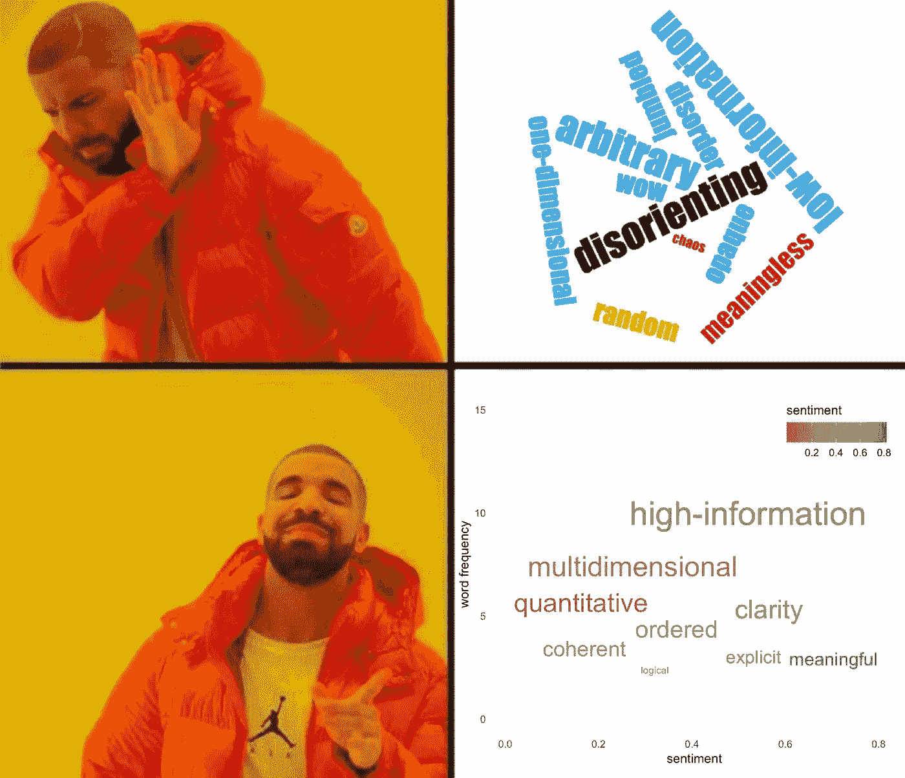
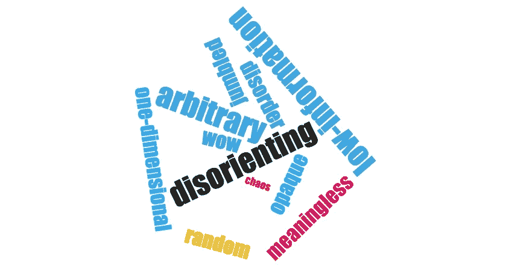
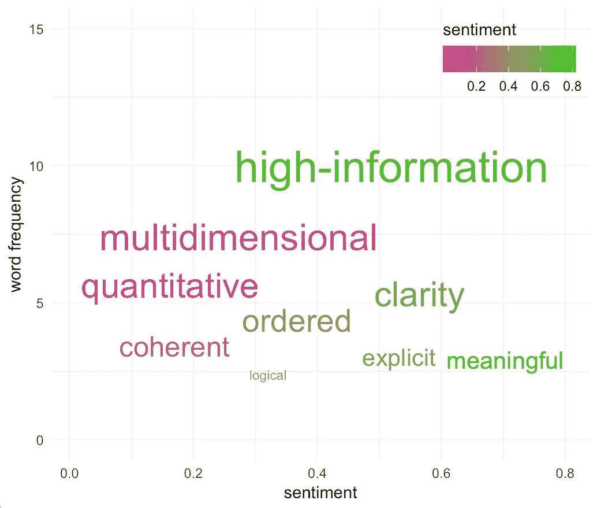
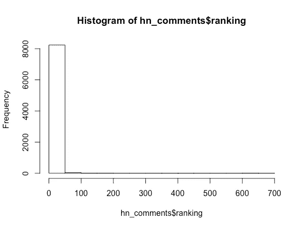
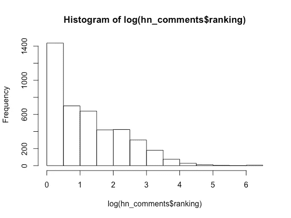
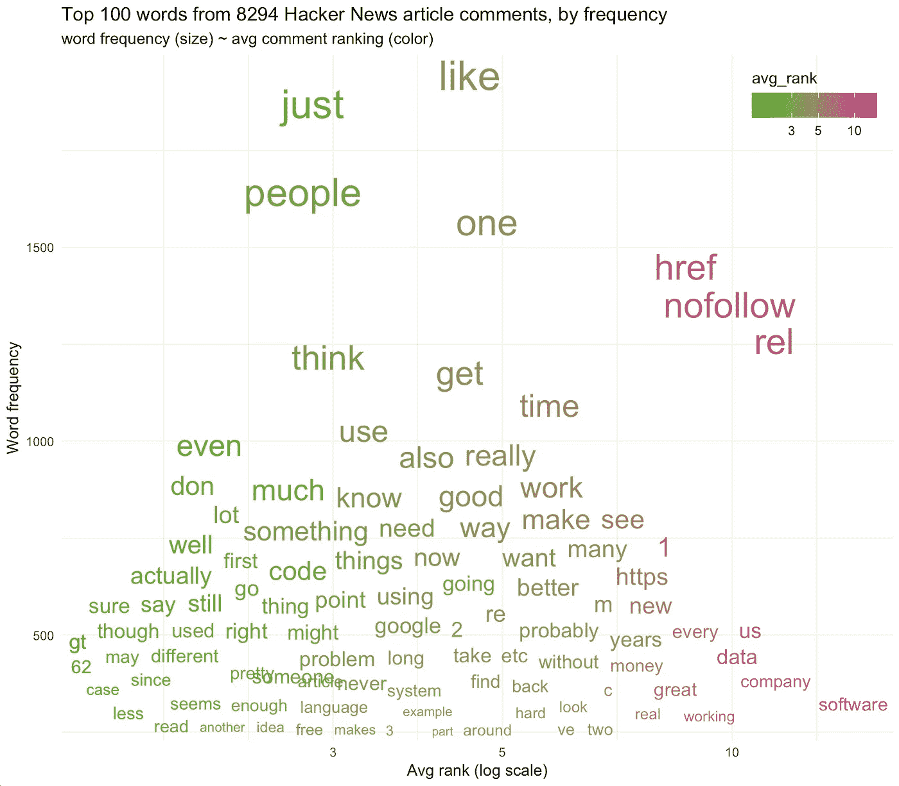
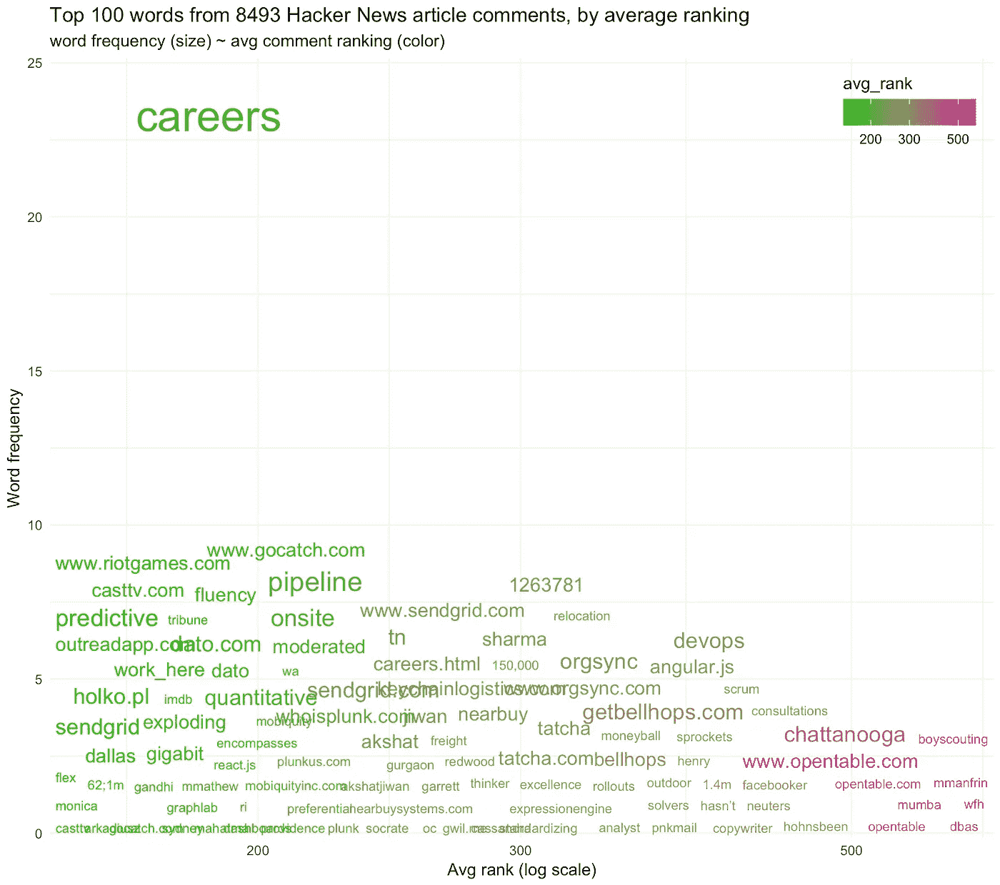

# 撕掉文字云，聊天情节万岁

> 原文：<https://towardsdatascience.com/rip-wordclouds-long-live-chatterplots-e76a76896098?source=collection_archive---------13----------------------->

## 在 R 中用一种整洁的方法代替“文本数据的饼图”

在这篇简短的帖子中，我提出了一个信息更加丰富的替代方案，以 R 代码为例，使用了一个[*tidy text*](https://github.com/juliasilge/tidytext)*&*[*gg plot 2*](https://ggplot2.tidyverse.org/)*框架。*



# **前言**

数据即字云的[缺陷](https://getthematic.com/insights/word-clouds-harm-insights/)已经[很好的覆盖了](http://dataskeptic.com/blog/episodes/2016/kill-the-word-cloud)，随着[替代](/visualizing-customer-feedback-three-alternatives-to-word-clouds-defc73e8e503) [接近](https://dataskeptic.com/blog/meta/alternatives-to-word-clouds)，我在此不再赘述。

尽管如此，单词云仍然是常见的，因为它们令人困惑。在许多方面，它们仍然是文本数据可视化的事实上的标准，至少在技术含量较低的分析中是这样(这一点很明显，并且可能因为大量易于使用的在线工具而变得更加糟糕)。这才真正使它们成为*[***饼状图***](https://qz.com/1259746/when-should-you-use-a-pie-chart-according-to-experts-almost-never/) ***的自然语言*** 。(因此，两者仍然有它们的位置，[尽管几乎总是不如其他选项](http://daily.captaindash.com/blog/2012/08/07/fathers-of-datavisualization-john-tukey-1915-2000/))。*

# ***总结我个人对 wordclouds 的不满:***

**

*   ***无序&迷失方向:**一个单词在视觉平面上的位置(或者它面对的方向)没有逻辑，所以我永远不知道从哪里开始，下一步看哪里，或者我已经看了哪里。我总是在几句话后就迷失了方向，然后我放弃了。*
*   *一维低信息:它们通常只传达一个维度:词频，尽管有时会故意使用颜色编码。这限制了上下文传达的信息量。*
*   ***没有尺度:**通常捕捉到的单一维度(词频)甚至没有很好的表现，因为几乎从来没有任何尺度感。例如，即使按比例调整了大小，也没有指示最大或最小的单词在文档中出现的频率。最重要的词可能出现在 90%或 9%的回答中，彻底改变了对数据的任何合理解释。*
*   ***任意性&不透明:**以上几点都导致了文字云压倒性的任意性&不透明性，导致了糟糕的信噪比，这使得文字云往往更令人困惑，而不是更有启发性。*

*我认为，文字云的一些可取之处:*

*   *[**直接绘制数据**](http://www.sealthreinhold.com/school/tuftes-rules/rule_one.php) (而不是数据的几何抽象)*
*   *能够让自己获得**身临其境、探索性的用户体验***

# *那么什么是更好的方法呢？*

*几乎任何事情。*

**

*除了上面链接的[备选方案](/visualizing-customer-feedback-three-alternatives-to-word-clouds-defc73e8e503) [方法](https://dataskeptic.com/blog/meta/alternatives-to-word-clouds)之外，茱莉亚·西尔格&大卫·罗宾逊的[用 R](https://www.tidytextmining.com/) 整理文本挖掘包含了许多例子，从简单的条形图到更复杂的网络图(&是的，向文字云致敬)，并附有 R 代码。*

*我在与《每日新闻》Philly.com 的[问询者&的&洞察团队一起为内部](http://www.philly.com) [NLP](https://en.wikipedia.org/wiki/Natural_language_processing) 框架构建方法原型时，大量借鉴了他们的工作。我们最初的任务是总结对 NPS 调查的自由形式的回复，但是应该推广到各种自然语言:用户评论、客户服务反馈、实际文章内容等等。*

# *介绍聊天情节*

**

*在总结 NPS 响应的情况下，我们有关于*多尺度&维度*的信息:*

*   ***词频** : *一个离散的数值变量**
*   *每位用户自我报告的**推广者得分**(“您推荐我们产品的可能性有多大，从 1 到 10 分？”):*一个离散的数值/序数变量**
*   *每个用户的 NPS [**发起者/诋毁者/被动者**](https://en.wikipedia.org/wiki/Net_Promoter#How_it_works) **类别**，基于他们的发起者分数:*分类/顺序变量**
*   ***用户群** /每个用户的调查版本(例如 7 天印刷订户、仅周日印刷、仅数字等):*分类变量**
*   ***复合指标**，如按词、NPS 类别或用户群的净或平均推广者分数:*连续数字变量**
*   *派生的 **NLP 度量**如[情感得分](https://en.wikipedia.org/wiki/Sentiment_analysis) & [tf-idf](https://en.wikipedia.org/wiki/Tf%E2%80%93idf) :典型的*连续数值变量**

*有这么多的信息要传达，一个词云感觉远远不够。*

*除了用[多面条形图](https://www.tidytextmining.com/tfidf.html)通过分类变量简单表示单词或 *n-* gram 频率之外，我还想利用一个完整的 x，y 笛卡尔平面&将 wordclouds 的直接数据绘制、探索性质映射到更定量的声音、信息丰富的可视化方法。*

*我的第一个想法是尝试一个带标签的散点图，y 轴是词频，x 轴是每个词的平均推广分数。但是散点图的点很快变得多余&有噪声，那么为什么不直接绘制标签呢？*

***ggplot** 的`[geom_text()](https://ggplot2.tidyverse.org/reference/geom_text.html)`实现了这一点，而[**gg replay**](https://cran.r-project.org/web/packages/ggrepel/vignettes/ggrepel.html)扩展包通过`geom_text_repel().`提供了更好的易读性的自动间距*

*我绝对没有发明最终的情节，因为它只是一个用文字而不是点组成的散点图，但我相信我是第一个用聪明/愚蠢的名字'***chatter plot****'*命名它的人，不管那值不值得…*

*为了演示，我们将通过 Google BigQuery 的[公共数据集](https://bigquery.cloud.google.com/dataset/bigquery-public-data:hacker_news?pli=1)调出[黑客新闻](https://news.ycombinator.com/)评论&他们的排名:*

****

*因此，我们有 8000 多条评论和它们的排名(越低=越好)，我们将使用它们作为原始 NPS 调查数据的推广者分数的某种代理。*

*可以看到，排名有很大的偏差(可能的排名取决于评论的总数:如果至少有 10 条评论，一个人只能排在第 10 位)，所以为了可视化的目的，我们希望用对数表示它们。*

*但是首先，我们需要预处理自然语言文本数据，如[整齐文本挖掘](https://www.tidytextmining.com/)中所述:*

*看起来前 8 个左右的单词是文本编码工件，所以我们将在绘图前过滤掉所有大于 2000 的内容。*

*我们还需要计算每个单词的平均排名，以在我们的图中加入一个额外的维度，然后将其加入到单词计数数据中:*

```
*# compute avg comment ranking of each word
hn_word_avg_rank <- hn_word_tokens_no_stop %>%
  group_by(word) %>%
  summarize(avg_rank = mean(ranking))# filter word counts & join to average ranks
hn_counts_and_ranks <- hn_word_counts %>% filter(n < 2000 ) %>% 
  left_join(hn_word_avg_rank, by = "word")*
```

*现在我们准备好选择前 100 个单词&构建我们的聊天情节！*

**输出:**

**

*它就像是一个单词云，除了有顺序的实际数量逻辑，元素的布局美学方面，以及每一个的显式比例参考。这使我们能够在情节中表现更多的多维信息，为观众提供一个连贯的视觉逻辑。*

*在这个特定的情节中可能有几个有趣的点，但这些都是常见的词(事实上是 8000 条评论中最常见的)，所以尽管删除了停用词，但往往不是很有实质性。排名也没有太大变化，因为大多数单词来自前 10 名评论。*

*让我们尝试另一个对话图，这次按照最低排名(意味着最高排名)选择前 100 个单词:*

**

***Careers** 是一个明显的离群值，而其余的词则拥挤在低频范围内，最右边、排名最低的评论中有很多网址(可能表明是垃圾邮件？).*

*我们可以通过添加对 ggplot 的`ylim(0,6)`调用来放大这些:*

**

*这样更好看。*

*不爱 **opentable** ，但**send grid**&**riot games**的境遇更好。**预测型** ' & ' **定量型**'也有像样的看点，恰如其分的适合黑客新闻。但是我们应该注意，这些词的频率为 0-6，无论如何都不能被认为代表了它们所来自的 8493 条评论。但是 chatterplot 使这一点完全清楚，而这样的细节几乎被所有的文字云所掩盖。*

*显然，这只是出于演示目的的 toy *ish* 数据的一个起点。 ***chatterplot*** 框架是灵活的&可以以多种方式扩展。我将把这样的进一步探索留给读者作为练习。*

***几句临别赠言:***

*   *在上面的例子中，我们有二维的冗余表示:*字数* & *平均评论排名*。*字数*由 **y 轴**以及**文字大小**表示，而*排名*由 **x 轴** & **颜色渐变**表示。显然，我们可以通过交换这些冗余的表示，在这样的图中编码更多的维度，从而获得更高的信息密度。*
*   *由于 ggrepel 尽最大努力避免重叠元素，我们失去了一些精度，因为它们被“推到”平面中更开放的空间，所以坐标有些近似。*
*   *这是在 R 中完成的，但应该可以移植到大多数绘图库或软件中。*

***【编辑:**感谢[詹姆斯·斯科特-布朗在推特上](https://twitter.com/jamesscottbrown/status/1064844370929692672)指出[杰森凯斯勒](https://twitter.com/jasonkessler)的类似(但要深得多)[散射文本](https://github.com/JasonKessler/scattertext) python 包，快来看看！*

# ***概述***

***imo 的 ***chatterplot*** 通过将 **order** 、 **coherence** 、**quantitative rightness**、&、**多维信息容量**引入众所周知的探索性、直接数据 plot，对 wordcloud 进行了改进。***

***尝试一下&让我知道你提出的任何反馈、例子或改进！***

***另外[关注我&查看我的其他帖子](https://medium.com/@dnlmc):)***

***—
在推特上关注:[@ dnlmc](https://www.twitter.com/dnlmc)LinkedIn:【linkedin.com/in/dnlmc】T4Github:[https://github.com/dnlmc](https://github.com/dnlmc)***