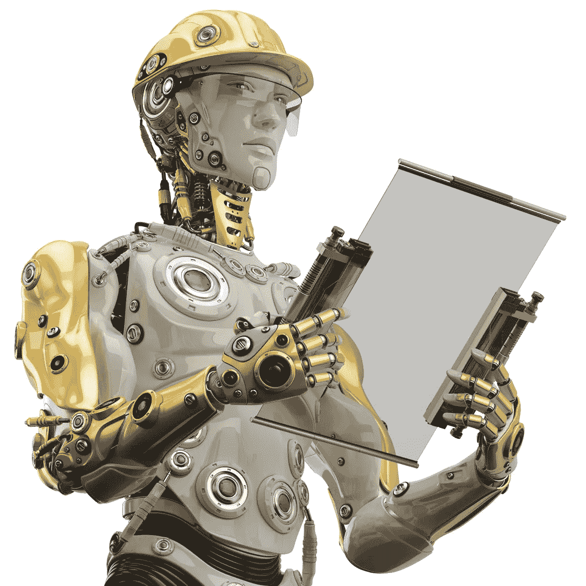
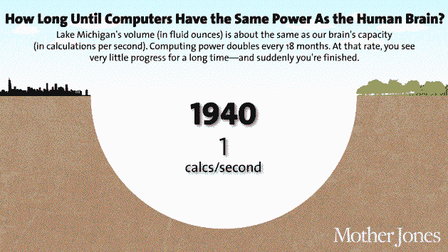
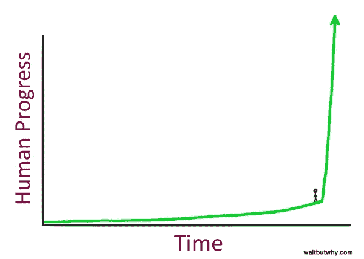

# 机器的崛起

> 原文：<https://towardsdatascience.com/rise-of-the-machines-a68a011eb6fc?source=collection_archive---------2----------------------->

Homer Simpson of the 22nd Century?

大多数看情景喜剧的人都不可避免地会遇到《辛普森一家》，这是一个关于美国工人阶级和社会的典型故事。辛普森一家的父亲荷马·辛普森开车去附近的一家发电厂工作，他是那里的一名核安全检查员。他的大部分工作是检查关键的操作参数是否有异常。如果荷马这样的人生在 150 年前，他会做什么工作？如果他 50 年后出生呢？让我们做一些猜测——

1850 年——普通人荷马可能会在煤矿工作。他会走路去上班，挖煤(或者如果他幸运的话，监督那些工作的人)，拿现金，大概还会去户外或者玩棋盘游戏取乐。他吃从家里带来的食物，或者食堂工作人员提供的食物。家里的扫帚有助于清洁灰尘。

1925 年——本世纪初，标准的美国工作是工厂工作。现在，他可能有某种交通工具去那里。休闲发展引入了现代游戏，如篮球和棒球。书籍和游乐园也在增加。他仍然通常吃从家里带来的食物，或者食堂工作人员提供的食物，但有时也会吃包装好的食物。强大的扫帚继续统治。

2000 年——今天，荷马开车去上班。他坐在办公室里，观察机器输出的数字。他通过电子方式向自己的银行账户付款，并让电视在家陪伴他。他还有视频游戏和社交媒体等选择。当家里没人做饭时，他就把一包现成的放进微波炉里吃。现在他的房子变大了，他使用真空吸尘器，因为这比找人替他打扫要便宜。

2050 年——荷马驾驶自动驾驶汽车去他的工作场所，在那里，所有的机器都在内部自我照顾。对于娱乐，有无数的设备。有一台机器可以准备任何你想要的食物。这房子是自动清洁的。等等，为什么他又要去工作了？

‘I’m bored.’

尽管纯属假设，但这确实让我们了解了我们的工作进展情况。他从*更多*劳动密集型工作到*更少*劳动密集型工作。从采煤到在工厂使用机器，它们正越来越多地渗透到我们的生活中。在我们过去依赖他人的地方，我们不再依赖科技。无论是社交媒体取代邮递员，还是谷歌地图取代我们在路上询问的人，技术似乎正在为我们做大量的工作。但是他们能做我们所有的工作，让我们无事可做吗？

**比较优势**

几位经济学家说不会——人类永远都有工作要做。他们认为，李嘉图在 19 世纪倡导的比较优势理论适用于所有情况。即使机器在我们做的每件事情上都做得更好，我们仍然有理由做我们最擅长的事情。这本质上就是比较优势——如果 A 国比 B 国生产更多的小麦和钢铁，他们之间的贸易还是有意义的。尽管这似乎有悖常理，但它已被广泛接受，并成为国际贸易的全部基础。[经济学家大卫·H·奥特尔](http://economics.mit.edu/files/11563)说，虽然机器的工作越来越好，但我们所做工作的价值是对它的补充。引用他的话，“通常情况下，这些输入都扮演着重要的角色；也就是说，一个方面的改进并不排除对另一方面的需要。如果是这样，一组任务的生产率提高几乎必然会增加其余任务的经济价值。既然我们只坚持是否所有人类工作都可以被取代的理论问题，我们现在可以忽略社会因素。但我仍然认为，当我们把机器和技术带入画面时，奥托尔的比较优势假设就失效了。

让我们假设一个由两个成员组成的社会——一个人类和一个机器人。假设人类一天能砌 1000 块砖，或者一天能做 20 公斤意大利面(为了便于讨论)。一个机器人可以砌 10000 块砖或者煮 100 公斤意大利面。很明显，机器人有绝对的优势，无论它做什么工作。比较优势理论告诉我们，每个国家进行专业化分工然后进行贸易仍然是有意义的。(如果你不能理解这一点，[这里有一个很棒的链接](http://www.globalization101.org/comparative-advantage-versus-absolute-advantage/))。但是如果另一个机器人能在短时间内制造出来呢？那么，人类的产出将比两者都少得多，人类再做任何一项任务都没有意义了！显然，机器人(以及总体技术)在短时间内以低成本复制的能力，是我认为比较优势可能不成立的关键。

**互补性**

随着汽车的出现，出现了加油站工人、机械师、挡风玻璃清洁工等工作。这些是随着汽车的发展而出现的意想不到的工作。它是否重新创造了所有被拿走的工作是一个次要问题；事实是机器不能做所有的工作。奥特尔沿着这些思路论证道:随着技术的进步，将会创造出我们无法想象的工作岗位。这些是进步带来的互补性。他提出了这样一个观点，即当一项活动变得更有成效时，流程中的所有其他活动都具有更大的价值。因此，人类将永远在填补这些空白方面发挥作用。但是，随着技术发展的步伐，它们所需要的互补性也变得更加技术性。机器现在需要更多的机器才能更好地工作。然而，人类仍然需要建造那些‘其他’机器。这一点让我对机器人是否能完全取代我们深感矛盾。每 1000 个无所事事的家庭中，就有 1 个人在制造那辆自动驾驶汽车。然而，人工智能可能会改变这一点。

**人工智能的到来**

在此之前，让我们退一步考虑什么是智能。你怎么知道什么是笔记本？有些大，有些小。有些是螺旋装订的，有些是精装的。但是当我们看到一个笔记本时，我们只是*知道*它是一个笔记本。但是想象一下，向一个没有智力的人描述一个笔记本。笔记本有各种各样的形状、大小、封面和颜色。需要智慧才能*知道*什么是笔记本。这就是波兰尼悖论——我们知道的比我们能说的多。这在传统上被视为计算机无法取代人类的原因。然而，这种情况正在迅速改变。这方面的一些证据

[谷歌 DeepMind 开发的程序 AlphaGo 在 2016 年 3 月击败了世界最佳围棋选手 Lee Sedol](http://www.theatlantic.com/technology/archive/2016/03/the-invisible-opponent/475611/)。围棋是一种抽象的战略棋类游戏，被认为比国际象棋更难，而 wand 则需要很强的直觉和智力。

[每次你在谷歌上使用图片搜索，你实际上是在使用谷歌 DeepMind](http://www.techworld.com/personal-tech/google-deepmind-what-is-it-how-it-works-should-you-be-scared-3615354/) 的技术，今天的错误率为 5.5%。如果这听起来很多，考虑一下这个——人为错误率大致相同。

人工智能的一个标准是图灵测试。英国著名数学家艾伦·图灵(更著名的是*，模仿游戏*就是基于他)提出，如果一台机器能够在一次对话中成功地愚弄人类，让对方相信它是人类，那么这台机器将显示出真正的人工智能。这是 75 年前的事了。有几个系统已经接近甚至击败了它(尽管这是有争议的)。不管怎样，[我们已经非常接近了](http://bigthink.com/humanizing-technology/how-close-is-the-turing-test-to-being-beaten)。

为什么这日益成为一个大话题？我们每天产生的数据量是巨大的；世界数据每两年翻一番*。据预测，到 2025 年，人类大脑将拥有和人类大脑一样的能力。随着计算能力的进步，机器学习算法可以处理的大量数据是海量的，可以用来建立更好的人工智能。*

[Source](http://www.motherjones.com/media/2013/05/robots-artificial-intelligence-jobs-automation)

用外行人的话来说，凭借我们所拥有的数据量和计算能力，我们可以使用蛮力——向计算机展示一百万张岩石照片，它将能够正确识别接下来的一千张照片——来开发计算机的智能。这意味着波兰尼悖论将被规避。计算机现在将和我们知道的一样多。而且没有任何人类的缺点，比如需要休息、食物或熟悉感——不难想象这些机器人会夺走我们目前做的所有工作。当埃隆·马斯克说[我们应该担心人工智能](http://mashable.com/2014/08/03/elon-musk-artificial-intelligence/#jsJTwfXSGgqy)时，我们可能应该保持警惕。

Source: WaitbutWhy.com

总而言之，我们目前所做的所有工作，将来都有可能被机器人接管。这是否一定意味着世界末日即将来临，更多的是一个社会问题——这取决于人类社会适应变化的速度，同时让每个人都参与进来。因为有一件事是清楚的——转变将是困难的。70 年代和 80 年代创造的工作岗位已经被人工智能夺走了。人类文明从未处于如此快速的变化之中。查尔斯·斯特罗斯(Charles Stross)的《土星的孩子》(Saturn's Children)中说，一旦人类社会有机器人做所有的工作，我们就会退缩到“内部快乐”中，对外部世界失去兴趣，最终导致我们的灭绝。希望我们能证明他是错的。

如果你想深入探讨这个话题，这里有一些很棒的链接-

 [## 人工智能革命:第 1 部分-等待，但为什么

### PDF:我们为这篇文章制作了一个精美的 PDF，用于打印和离线浏览。在这里买。(或者看个预览。)注意:…

waitbutwhy.com](http://waitbutwhy.com/2015/01/artificial-intelligence-revolution-1.html)  [## 健谈的经济学家

### 自动化和机器人技术的貌似合理的进步会导致大规模失业吗？如果…

conversable economist . blogspot . in](http://conversableeconomist.blogspot.in/2015/08/how-automation-affect-labor-markets.html)