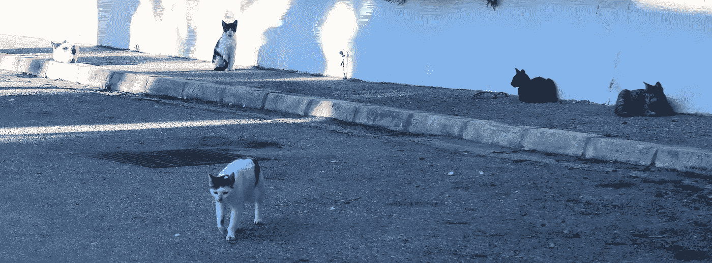
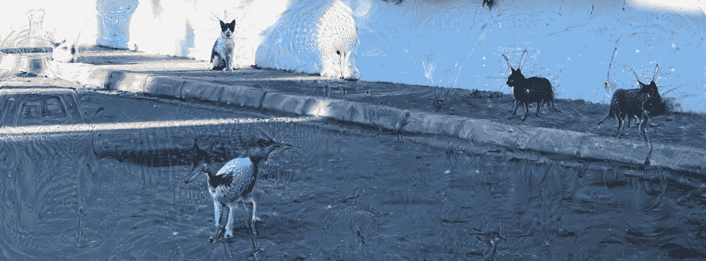

# 无脑机器的崛起

> 原文：<https://towardsdatascience.com/rise-of-the-mindless-machines-c0e578061e65?source=collection_archive---------9----------------------->

当人们讨论人工智能的未来时，一个普遍表达的担忧是对抗性超级智能的出现，这可能意味着我们所知的人类的终结。事实上，我们应该已经考虑好预防措施，以便在人工智能达到人类水平甚至更高时，与它安全共存。

然而，一个更直接的威胁没有得到应有的关注:不是说我们的生活将被超级智能的人工通用智能控制，而是被只会模仿智能的无脑代理人控制，这些代理人执行他们没有充分准备好的任务。

对于一些用例来说，不充分的人工智能可能会令人讨厌，但它的失败通常不会产生严重的影响。例如，我最近给一群流浪猫拍了一张假期快照。云存储服务的图像分类器判定这些动物是狗。

A bunch of “dogs”

在其他情况下，对人工智能不足的担忧更为严重。例如，每个人都希望自动驾驶汽车尽可能安全。所有道路使用者的生活关键取决于控制车辆做出正确决策的算法。

对于上面的示例应用程序，我们很好地理解了问题的机制，以及机器无法做出正确决策的后果。此外，我们可以通过客观的衡量标准(例如，自动驾驶汽车是否能够在路上行驶)或非常直观的标准(例如，那不是一只狗，咄)来评估机器的性能。因此，这些问题非常适合依靠最先进的统计机器学习做出的决策来解决。

H 然而，在一些问题上，我们并没有很好地理解形势的内在机制，也没有明显的有效性标准。最重要的是，如果我们实施不充分的人工智能来大规模地为我们做出这些决定，我们并不容易掌握对人类社会的长期后果。

这种决定的例子有:

*   招聘:哪个申请人[最适合工作](https://www.reuters.com/article/us-amazon-com-jobs-automation-insight/amazon-scraps-secret-ai-recruiting-tool-that-showed-bias-against-women-idUSKCN1MK08G)？
*   约会:那个会让我开心的特别的人是谁？
*   犯罪:未来[谁有可能犯罪](https://www.propublica.org/article/machine-bias-risk-assessments-in-criminal-sentencing)？
*   银行业:哪些客户[将获得贷款](https://www.marketwatch.com/story/ai-based-credit-scores-will-soon-give-one-billion-people-access-to-banking-services-2018-10-09)？

在每个例子中，算法可能会引入对某些特征的偏见，这些特征在伦理上是有问题的，例如种族、年龄或性别。可怕的是，这些都是对许多个人的命运和未来有重大影响的决定，我们做出这些决定的方式将塑造整个社会。

一些机器学习专家会告诉你，为了让机器的决策可靠而没有过度的偏见，你只需要调整你的统计模型，在正确的数据上运行它，并可能实施额外的规则来帮助防止歧视性决策:换句话说，这些任务可以由最先进的机器学习来充分执行。

然而，我认为目前的算法甚至无法模拟人类推理的关键特征，这一事实本身就必须让我们在让这些无脑机器做出不仅仅需要数据处理的决定之前非常谨慎。

# 无脑机器如何无法推理

假设你在远足时被一场雷雨惊到了。你会躲在树下等暴风雨过去吗？你可能不会，因为你知道站在树旁边更容易被闪电击中。你的生命取决于这个信息。

一个基于贝叶斯范式的机器学习算法会同意你的评估:远离树木，因为站在一棵 10 米高的树旁边，被闪电击中的可能性会比不站在树旁边的情况高出 3 倍多。

现在假设你漫步在德国柏林这样的大城市的某个地方。警告你在雷雨时站在树旁的同一算法也将告诉你避开任何有许多外国血统的人居住的地区。毕竟，[你遇到的这些人中，有 3 倍的可能性是惯犯](https://www.morgenpost.de/berlin/article102879314/500-junge-Intensivtaeter-sind-in-Berlin-unterwegs.html)。

虽然最终取决于你的政治观点，但是这个被无脑机器使用的“推理路线”可能会引起一种不安的感觉。

最后，如果你比普通人多吃 50%的奶酪，你被床单缠住致死的可能性是普通人的 3 倍:

[http://tylervigen.com/spurious-correlations](http://tylervigen.com/spurious-correlations)

出于这个原因，无脑机器会强烈建议你少吃美味的切达干酪——这当然是个可笑的建议。

上面的例子都只使用了一个解释变量，所以它们必须被认为是坏特征工程的例子。尽管如此，似乎人类的大脑能够捕捉到增加简单概率推理的方面——无脑机器完全忽视的方面。

在下文中，我将确定其中的三个方面:对因果关系的认识，对这些因果关系的良好解释，以及利用前者来实现积极目标的能力。

**因果关系。**统计学的一个众所周知的口头禅是“相关性并不意味着因果关系”。事实证明，虽然有明确定义的相关性统计方法，但众所周知，因果关系很难定义、形式化或量化。

因果推理的一个方面是反事实思维:如果一棵非常高的树被闪电击中，我们相信如果它不那么高，这一事件就不会发生。另一方面，我们确信，如果我们用邪恶博士的闪电枪射击这棵大树，它将不会发生有效收缩的直接后果(除了被烧伤之外)。因此，树被闪电击中是因为它高，而不是相反。

此外，我们无法想象吃大量奶酪会导致床单成为死亡陷阱的世界。

**很好的解释。**我们是如何如此确信这些反事实的陈述的？毕竟，我们还没有进行任何(随机)实验，包括给整天躺在床上的人喂食奶酪。答案是因果关系是通过我们可以很好解释的机制来传达的:树木中的水分使其成为比空气好得多的导体，树木越高，它就越能为闪电提供阻力最小的路径。

好的解释也是我们如此确信这个推理可以被广泛推广的原因:你知道你不想在雷雨时躲在树下。但是你也知道，无论你在地球上的什么地方，你都应该遵守这条规则，它不仅适用于树木，也适用于其他高大的导电结构。

最后，将这些对世界的解释汇集在一起，让我们对吃太多奶酪会对你产生什么影响以及不会产生什么影响有了很好的直觉。

**目标&行动。**一旦人类明白了因果，他们就可以付诸行动:用一根棍子摩擦另一根棍子会产生火，在寒冷的夜晚和冬天，家人会保持温暖。再加上一个好的解释的力量，他们明白热和火可以通过其他方式产生。这些解释越深入、越普遍，人类与环境的互动就越深远，实现目标的工具就越强大。例如，他们认识到热能是一种能量形式，可以转化为驱动机械工具，比如说蒸汽机。

简而言之，人类的推理和决策不仅基于观察到的数据，还基于对我们的行为将如何影响产生数据的环境和过程的预测。这也是任何道德行为的基础。为了有助于改善社会，代理人需要意识到这样一个事实，即她或他的行动可能有助于改变。

C 当前最先进的机器学习实际上执行或至少模拟了理性推理和决策的上述方面？毕竟，因果推理是机器学习中的一个[活跃研究课题。然而，因果推断绝不是战壕中数据科学家的标准工具箱的一部分。](http://webdav.tuebingen.mpg.de/causality/)

当谈到道德时，无脑机器不会表现出任何良心，目前确保算法不会产生不想要的结果的唯一可靠方法可能是良好的老式监管和审计。

最后，所有这些关键的方面都是相互依赖的:如果不观察和把握因果关系，你就无法给出一个好的解释，如果没有这样的理解，你的行动将是徒劳的。但更重要的是，人类思维过程的其他方面也是必不可少的:反事实思维需要想象力，解释需要抽象(如数学建模)，通过明智的行动追求目标甚至需要更多。

# 无脑机器将如何控制

到目前为止，et 的总结是:虽然人工智能仍然缺乏理性、道德和上下文推理的必要和基本方面，但已经有人努力实现该技术来完成各种道德敏感和上下文敏感的任务，如招聘或浪漫的配对。

一般来说，只有当技术足够成熟时，你才会期待它的广泛实现。

然而，一个常见的认知偏见可能会导致在适当的成熟之前被广泛采用:人工智能的拟人化。请注意，虽然当前围绕人工智能的炒作可能会减弱，但拟人化的趋势已经根深蒂固地融入了人类的大脑，因此将会持续下去。

此外，拟人化习惯性地通过营销行话延续下去。例如，DeepDream 为其用户提供“[从人工智能的意识](https://deepdreamgenerator.com/)中发现惊人的新维度和视觉文物”当输入一幅图像时，软件可能会产生这样的结果:

Cats, dogs, hellspawn?

所以我们被告知的是:机器有意识，它可以做梦。暗示机器“思考”和“感觉”非常像人。即使你没有从表面上理解这种暗示，你仍然会因为经常接触这种语言的使用而受到影响。

现在考虑由计算机产生的这件“艺术品”或“梦”:

Ceci ne pas un mouton électrique

这是部分[曼德尔布洛特场景](https://en.wikipedia.org/wiki/Mandelbrot_set)的可视化。虽然美丽、复杂和微妙，但图像生成的过程基本上只涉及复数的重复平方:这是一个非常简单的数学规则，任何具有第一学期数学知识的人都可以完全理解和应用。

没有人会把更高的认知功能归因于如此简单和任意的计算结构。当然，当前最先进的机器学习也不会产生更高的认知功能:

*   虽然“神经网络”指的是许多复杂的机器学习算法，但它们都与传统的数学工具有着更密切的联系[，而不是实际的生物大脑](https://www.scientificamerican.com/article/experts-neural-networks-like-brain/)。
*   即使是最大的神经网络(数十亿个权重)的复杂性也远远低于人脑的复杂性(数万亿个神经连接)。

粗略地说，Siri 或 Alexa 将被赋予比 80 年代的袖珍计算器更多的人性，这种想法近乎疯狂。但这是市场行话、公开文章和文章所隐含的想法——包括这篇关于“无脑”机器的文章。

这一发展并非巧合。人们表现出与计算机互动的需求，就像他们与其他人互动一样:几十年的互动设计以相当直接的方式从命令行界面到语音识别和对人形机器人和情感计算的研究。

这意味着人们投入了大量的努力来使机器看起来像人，因此比它们实际上更聪明。因此，对人工智能软件的信任比实际保证的要多。最终，这项技术的采用可能会比合理证明的更快、更广泛。

此外，在我们将无脑机器拟人化的同时，一些人可能会认为世界上的大部分地区已经进入了一个非人化、反科学和反智主义的新时代。如果这些担忧成为现实，前景实际上是相当暗淡的。

*   人工智能将用于任何任务，它将优化仅由经济可行性定义的效用指标。如果[相信主要人工智能玩家声称的改善问题的良好意图](https://undark.org/2018/11/01/the-debate-over-ai-ethics/)，那将是非常天真的。
*   科学探究，被理解为解释和知识的积累和更新，[将成为优先次序改变的牺牲品，并被无脑的预测机器所取代](https://singularityhub.com/2018/08/10/could-machine-learning-mean-the-end-of-understanding-in-science/)。
*   公众并不总是知道有多少无脑机器在使用，因为企业可能不希望自由地宣传它们在敏感任务中的用途，例如人力资源管理。
*   算法不仅会学习产生不充分的响应[，因为人类输入](https://www.telegraph.co.uk/technology/2016/03/25/we-must-teach-ai-machines-to-play-nice-and-police-themselves/)，而且它还会从其他算法产生的[有偏差的数据中学习越来越多的信息，这些数据已经在辨别](https://www.technologyreview.com/s/610275/meet-the-woman-who-searches-out-search-engines-bias-against-women-and-minorities/)。

# 我们如何安全使用无脑机器

总之，我们可能不得不应对一个不同的反乌托邦，远早于一个将人类变成一大滩计算机的流氓人工超级智能:一群没有大脑的机器将通过决定谁将找到工作、配偶或朋友，或者谁将获得贷款，或者谁将入狱，来控制数十亿个人的社会地位和福祉。当然，[也将控制我们投票给哪个政府](https://papers.ssrn.com/sol3/papers.cfm?abstract_id=2982233)，而[将决定世界各地战场上的生死](http://time.com/5230567/killer-robots/)。

他们会这样做，没有审查或任何后果感，因为他们每个人的认知能力都不如果蝇。他们将无处不在，他们将忙于彼此交流，没有学到任何新的东西，但在许多反馈循环中延续旧的偏见和错误。他们缺乏任何内在动机，无法真正理解或解释他们的环境或行为。一些机器会假装它们不是哲学僵尸，但它们实际上是，而是伪装成你的“[老师](https://www.businessinsider.com/a-professor-built-an-ai-teaching-assistant-for-his-courses-and-it-could-shape-the-future-of-education-2017-3?IR=T)”、“[朋友](https://www.forbes.com/sites/parmyolson/2018/03/08/replika-chatbot-google-machine-learning/#67ae9d444ffa)”、“[同事](https://www.cmswire.com/digital-workplace/the-enterprise-chatbot-your-future-coworker/)”或“[伴侣](https://www.thecut.com/2018/05/sex-robots-realbotix.html)”。其他机器会对你隐藏起来，我们甚至不知道它们在那里，从无处不在的计算基础设施的一些黑暗的、被遗忘的角落拉你的弦。

我们能做些什么来阻止这样一个暗淡的未来呢？当然，每个人都要尽自己的一份力量，我最后提出一些建议:

*   在我看来，因果推理和强化学习将是机器学习研究前进的关键概念。理解因果关系和与环境的相互作用是发展人类智能的先决条件。
*   与此同时，我们不能将智能算法的监管和审计工作留给各大人工智能公司。数据保护法需要在全球范围内实施防止算法偏差的政策。
*   数据科学家和机器学习工程师需要就构建敏感的人工智能应用程序的道德准则和最佳实践达成一致。

最后，随着人工智能越来越成为日常生活的一部分，该技术的安全、好处和风险需要像道路交通安全一样自然地成为日常政治和公共话语的一部分。

# 进一步阅读/观看

大卫·多伊奇:我们离创造人工智能还有多远？

[大卫·多伊奇:解释的新方法](https://www.youtube.com/watch?v=folTvNDL08A)

[山姆·哈里斯:我们能在不失去控制的情况下制造人工智能吗？](https://www.ted.com/talks/sam_harris_can_we_build_ai_without_losing_control_over_it)

约翰·塞尔:人工智能中的意识

弗朗西斯科·梅希亚·乌里韦:没有证据就相信在道德上是错误的

## 更多技术说明

[比尔·希巴德:道德人工智能](https://arxiv.org/abs/1411.1373)

[乔纳斯·彼得斯:因果关系讲座](https://www.youtube.com/watch?v=zvrcyqcN9Wo)