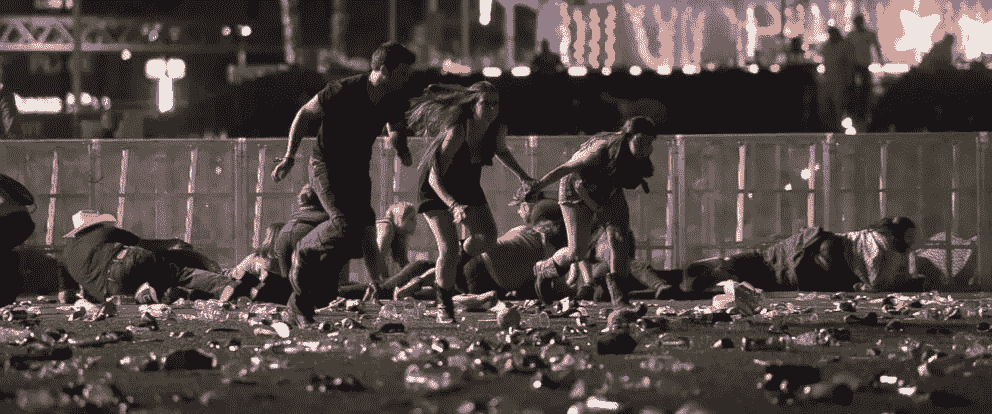
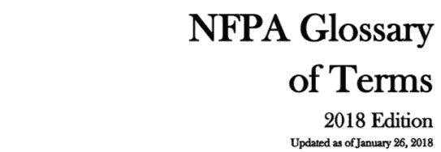
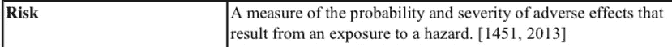
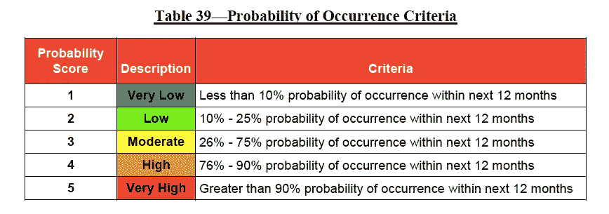
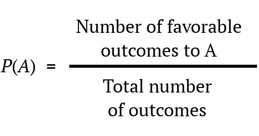
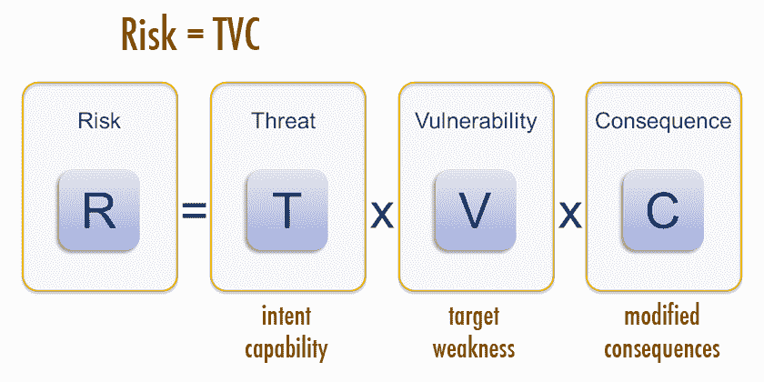
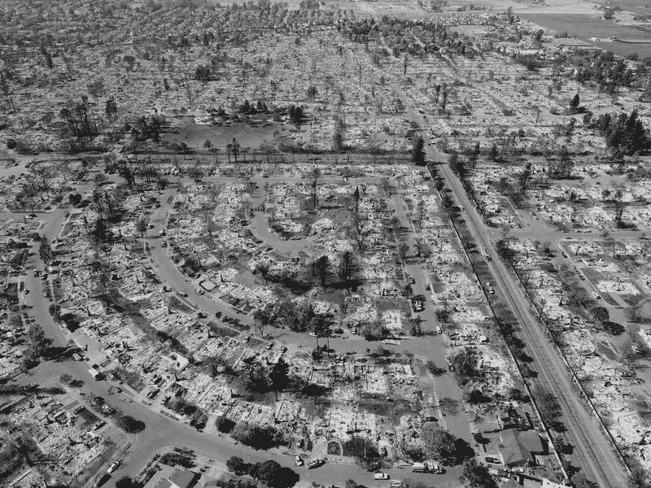

# 对消防工作中“风险”的思考

> 原文：<https://towardsdatascience.com/risk-in-the-fire-service-5812cfdbac9e?source=collection_archive---------4----------------------->

The 2017 Las Vagas Shooting produced more than 800 victims in less than 10 minutes

## 这个比喻

想象一下，你和世界闻名的叔叔丹一起去露营，他是经济学教授，在“风险”方面的专业知识得到了广泛认可。午饭后，你看到丹把手伸进大岩石下寻找响尾蛇。惊恐之余，你坚持丹立即停止他的“野生王国”探险。丹毫不惊慌，平静地解释说，他是“风险”方面的专家，并根据他的“统计历史”得出结论，响尾蛇咬他的可能性几乎为零。你突然意识到经济学中的“风险”肯定不同于现实世界中的“风险”，也许丹叔叔应该呆在安全的大学校园里。

理解“风险”有不同的框架。在股票市场上赔钱的风险和从着火的屋顶上掉下来的风险是不同的。因此，不同的领域有不同的理解风险的方法。偶尔，一个领域借用另一个领域的风险模型，导致有缺陷的思维方式。不幸的是，这正是消防部门所做的，他们采用了经济学中的风险模型，即“经济效用理论(EUT)”

## 经济学中的风险史

Exposition of a New Theory on The Measurement of Risk

1738 年，丹尼尔·伯努利发表了《关于风险度量的新理论的阐述》，这为度量风险奠定了基础，被称为经济效用理论，或简称为“EUT”伯努利的 EUT 认为，“风险”是概率和后果的产物，是衡量投资的有用工具。EUT 最终成为经济、金融、商业以及消防服务领域风险度量的基础。

美国国家消防协会(NFPA)对“风险”的定义之一是“不利影响的可能性和严重性的度量”这是伯努利的 EUT 的另一种说法。需要澄清的是，我并不是批评 NFPA 对“风险”的定义，而是批评好心的用户对这一特定定义的不当应用。在不考虑不利后果的情况下，NFPA 对风险的定义进入了消防部门的覆盖标准、社区风险降低计划和公共安全卓越中心。

A Screen shot from NFPA’s 2018 Glossary of Terms

尽管 NFPA 对风险的定义在技术上没有错，但如果用在错误的上下文中，它可能会产生误导。由于缺乏 EUT 模型所要求的“概率度量”，消防部门经常用统计数据来代替。这种对概率的历史统计的不正确使用是常见的和欺骗性的，经常导致图表通过基于**出现频率的分数将两个对立的概念联系在一起。**

Screen shot for Sacramento Fire Departments 2017 Standards of Coverage Report

**概率**和**出现频率**的换位使用有很大缺陷。例如，仅仅因为某人在六面骰子上掷出十次“一”，并不意味着掷出额外一个“一”的**概率**增加了。掷出“1”的**概率**仍然是六分之一或 16%，即使最近掷出“1”的**频率**非常高。

统计历史和概率之间的巨大差异是 EUT 从未被用于消防服务等领域的原因。用统计学代替概率会导致危险的结论。更糟糕的是，概率测量在消防服务中是不可计算的。

> 赌场是我所知道的唯一一个概率是已知的、高斯的(即，钟形曲线)，并且几乎是可计算的人类冒险。
> 
> ——纳西姆·塔勒布，被随机性愚弄

## 为什么消防服务中没有“概率”

概率是一个等式；基于 ***随机*** 、 ***不相关*** 事件产生一个介于 0 和 1 之间的数的计算。例如，使用“先验概率”，在一轮俄罗斯轮盘赌中幸存的概率是 6 分之 5 或 83%。为了计算概率，我们将有利结果的数量除以可能结果的总数。在俄罗斯轮盘赌的例子中，我们用空室的数量 5 除以空室的总数 6。换句话说，要诚实地计算概率，你需要知道**所有** **可能的** **结果**！

Probability (PA) is equal to the number of favorable outcomes divided by the total possible outcomes

现在挑剔的读者可能会立即看到问题；如何才能知道**现实世界中所有** **可能的** **结果**？批判思想家突然认同纳西姆·塔勒布、爱德华·索普、巴西尔·帕斯卡(概率的创始人)等学者和数学家；他们都认为概率只在游戏中起作用。

因此，如果消防部门使用 EUT，我们如何在不知道所有可能结果的情况下计算概率呢？如前所述，消防部门经常混淆概率和统计趋势，或者说是错误的假设，即一个人的历史是一个人未来的预测。这类似于假设既然一条蛇从未咬过你，那么你未来的“概率”很低。幸运的是，美国国土安全部(DHS)已经着手解决这个问题，并为理解风险提供了一个替代框架。

## 联邦政府对风险的了解。

> “我们必须在所有国土安全工作中应用基于风险的框架。”
> ——国土安全部——风险指导社区，2008 年

衡量风险的方法有很多。使用不合适的风险模型可能比什么都不做更糟糕；制造虚假的安全感，让社区面临更多风险。联邦政府在 911 之后吸取了这个教训。所有基于历史事件的风险客观衡量标准都对 2001 年 9 月 11 日的事件视而不见。自那以后，DHS 采用了一种主观风险框架，定义为“根据威胁、脆弱性和后果评估的负面结果”，简称“TVC”

Risk model from Center from Homeland Security and Defense

> “所有的模型都是错的；有些是有用的”——乔治·博克斯博士*。*

TVC 等主观风险框架是一种混乱的做法。与 EUT 不同，TVC 没有一个清晰、客观的数据。相反，TVC 用**的客观性**换取了**的灵活性**。TVC 更像是一个组织思想的框架，而不是产生数字计算，它允许用户利用直觉和新信息。借用统计学家乔治·博克斯的话来说，TVC 是错误的，但却非常有用。

## 没有证据并不是不存在的证据。

> "最大的失败是想象力的失败。"-911 委员会报告

TVC 防止我们陷入“缺少证据就是缺少证据”的谬论或者说，只是因为我们以前没有见过它，并不意味着它不存在。“911 委员会”称这是“想象力的失败”。“想象力的失败”在阿波罗 1 号事故、珍珠港事件和泰坦尼克号沉没中被提及。因此，联邦政府大多放弃了 EUT 等定量风险指标，转而采用 TVC 等主观框架。

## 想象力的丧失

就像 DHS 一样，消防部门面临着不寻常事件的可能性，这些事件源于复杂系统的相互作用，如天气、人类行为和相互交织的基础设施；想想圣布鲁诺管道破裂[或者 FIU 大桥坍塌](https://en.wikipedia.org/wiki/San_Bruno_pipeline_explosion)或者[。相互关联的复杂系统，如城市，固有地具有发生新的灾难性事件的可能性。复杂系统产生的事件的新颖性需要一个允许想象的风险框架。需要说明的是，不一定是对**所有可能发生的**事件的想象，而是对**可能发生的事件的描述；**比如时速 100 英里的大风引发的野火，火灾后的泥石流，或者在音乐会上有人向 22，000 名观众开枪。](http://cbs12.com/news/local/pedestrian-bridge-collapses-at-fiu-in-miami)

Driven by heavy winds through topography that burned 40 years ago, the Tubb’s fire was very plausible with an incalculable probability

衡量风险是一件棘手的事情，包含了大量的模型和框架。选择错误的模型或框架会导致错误的安全感。这为我们面临的实际风险创造了一个“盲点”。由于对概率的依赖，风险的客观度量如 EUT 在“真实生活”环境中是失败的。接受消防服务中不存在“概率”的事实将符合我们社区的最大利益。我们需要采用更灵活的框架，比如 TVC。继续使用需要数字变量的客观模型只是在科学的幌子下对自己撒谎的一种精心设计的方式，可能会因为错过独特的事件而将我们的社区置于更高的风险之中。

> “当风险最大的时候，安全感也达到了顶点”——纳西姆·塔勒布，《黑天鹅:极不可能事件的影响》

Photo by [Timothy Meinberg](https://unsplash.com/photos/xqV9QdGOSas?utm_source=unsplash&utm_medium=referral&utm_content=creditCopyText) on [Unsplash](https://unsplash.com/search/photos/fire?utm_source=unsplash&utm_medium=referral&utm_content=creditCopyText)