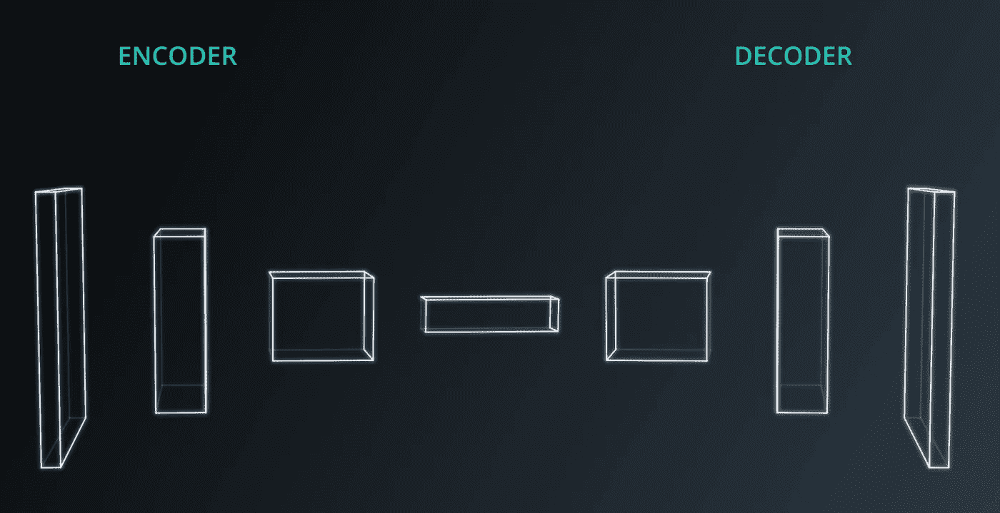
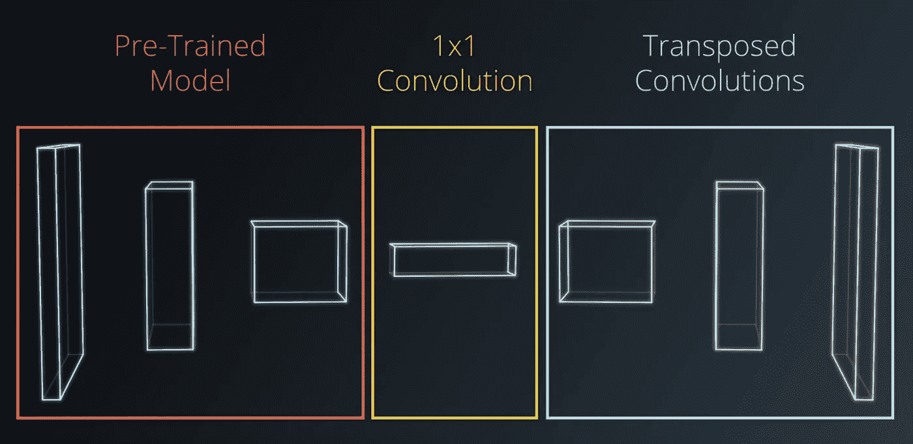
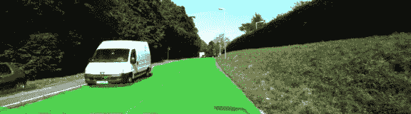

# 使用深度学习的道路场景理解

> 原文：<https://towardsdatascience.com/road-scene-understating-using-deep-learning-c3610f6b1c4?source=collection_archive---------2----------------------->

The final outcome of applying semantic segmentation on road scene

# 场景理解

语义分割代表了深度学习中的一种技术，其中我们通过将图像中的每个像素分配给预定义的类别集来为其分配意义。从上面的 GIF 中，我们可以看到我们在语义分割过程中有两个类( **road** 和 **not road** )被相应地着色。

使用语义分割的方法，我们能够将场景分解成我们特别感兴趣的片段。这对于自动驾驶汽车尤其重要，因为它将能够检测场景的哪个部分是可驾驶区域。

# 这是如何工作的？

语义分割的一种方法是使用全卷积网络(FCN)。加州大学伯克利分校有一篇很棒的[论文](https://people.eecs.berkeley.edu/~jonlong/long_shelhamer_fcn.pdf)，详细解释了方法论和架构。我们的实现也将基于本文。

典型的卷积网络由几个卷积层和完全连接的层组成。这种类型的架构适用于分类问题(例如:*这是一条路吗？*)。但是为了在一幅图像上定位道路(*道路在哪里？*问题)我们需要网络能够保存空间信息。这就是 FCN 发挥作用并提供最先进的语义分割结果的地方。

# 如何建设 FCN？

建造 FCN 有三种主要技术:

1.  用 1x1 卷积层替换全连接层。
2.  通过使用转置卷积层引入上采样。
3.  添加跳过连接。

下面我们来详细看看如何做到这一点。

我们的 FCN 架构有两部分:**编码器**和**解码器**。

FCN architecture

对于**编码器**，我们将使用在 ImageNet 上预先训练的 VGG16 模型。VGG16 模型中完全连接的层将替换为卷积 **(1)** 。编码器从图像中提取将被解码器使用的特征。

下一步是构建**解码器**，这是通过使用转置卷积层 **(2)** 对最后一个编码器层进行上采样来完成的。转置卷积本质上是一种逆卷积。

FCN architecture based on pre-trained model, replaced fully connected layers and transposed convolutions

最后，我们将在特定层之间添加跳过层 **(3)** ，使网络能够使用多种分辨率。这反过来提供了更好的分割结果。跳过连接可以减少信息丢失，使网络能够“看到全局”，因为典型的卷积网络只关注图像的一部分。

Skip connections in FCN

我们在添加跳过连接时应该小心，因为它们会极大地影响模型的大小。

# 最后结局

用于道路场景理解的 FCN 的实施是作为 [Udacity 自动驾驶纳米学位项目](http://udacity.com/drive)的一部分完成的。我已经使用 Python 和 TensorFlow 建立和训练了模型。该模型已经在 NVIDIA 1080Ti 显卡上进行了 30 次训练，耗时不到半小时。

这是推理的输出:

# 结论

相关的源代码可以在我的 GitHub 个人资料中找到:

 [## bdjukic/CarND-语义分段

### 通过在 GitHub 上创建一个帐户，为 CarND-Semantic-Segmentation 开发做出贡献。

github.com](https://github.com/bdjukic/CarND-Semantic-Segmentation)