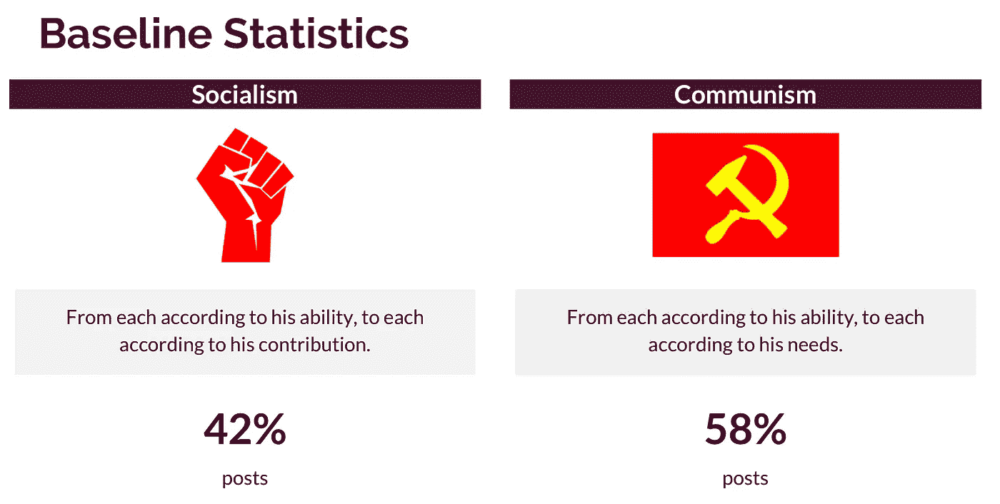
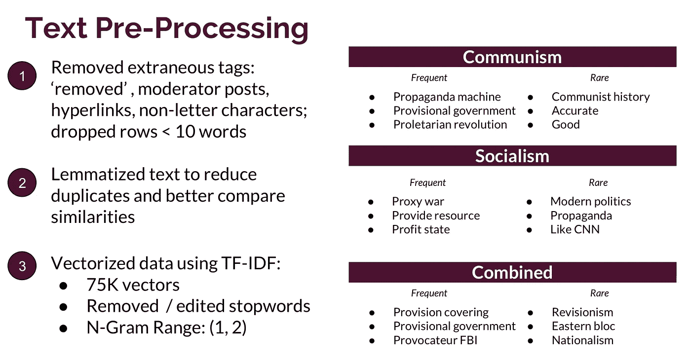
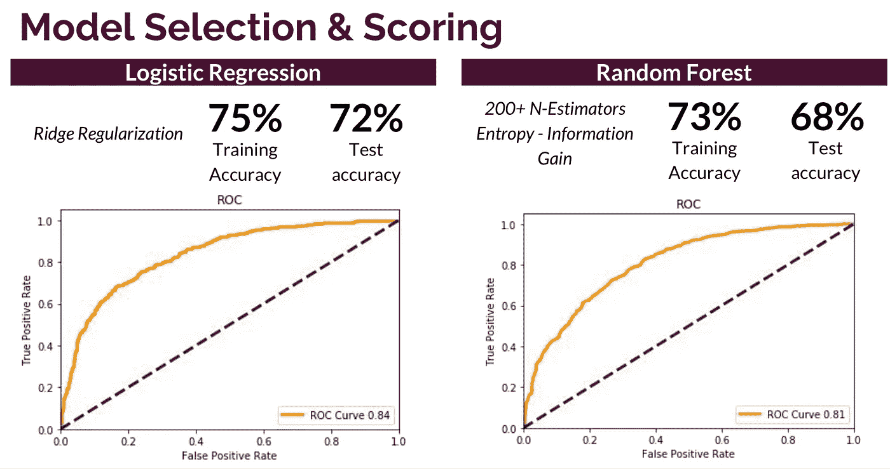

# 革命之路:社会主义 vs 共产主义

> 原文：<https://towardsdatascience.com/road-to-revolution-socialism-vs-communism-8b150c1aa54c?source=collection_archive---------3----------------------->

## *通过 PushShift API 和自然语言处理进行子编辑分类*

我一直认为，在一个社会经济不平等继续困扰社会并阻碍人类真正进步的时代，社会主义和共产主义背后的意识形态非常引人注目。虽然没有一个政治/经济体系是完美的，但我们必须承认资本主义的缺点及其在助长这种不平等中的作用。

在马克思主义理论中，社会主义是继资本主义之后社会向共产主义过渡的阶段。它们都建立在集体合作的理念上，但不同之处在于共产主义者认为合作应该由一个政党组成的政府来管理。无论你同意其中一个，另一个，两个，还是都不同意，我们都可以从这些理论中学到很多关于创造一个更加公正和平等的社会的东西。

由于两者之间的微妙差异，社会主义和共产主义将成为探索自然语言处理能力的伟大范例。为了做到这一点，我进行了一项实验，利用了子编辑[r/共产主义](https://www.reddit.com/r/communism/)和[r/社会主义](https://www.reddit.com/r/socialism/)的文本。使用以下步骤，我可以将这些帖子转换成语料库，用于训练随机森林或其他类型的分类算法:

1.  查询 PushShift API 以检索提交
2.  清理和预处理文本
3.  分析矢量化/标记化的文本
4.  网格搜索跨两种分类算法优化超参数

# 步骤 1:查询 PushShift API

我没有直接从 Reddit(限制最多 1000 个查询)获取提交内容，而是利用了 PushShift API，该 API 创建了大多数子编辑的历史档案。通过这个 API，我能够获取提交的标题、文本、作者和日期。

# 步骤 2:清理和预处理文本

在从两个子编辑中读入合并的文件后，我做了一些清理和预处理:即删除特殊字符，转换成小写，并对结果单词进行词汇化。

此外，我删除了已删除/已删除帖子或版主自动帖子的所有标签(这些标签特定于子编辑，可能会影响训练集):

# 步骤 3:分析矢量化/标记化的文本

为了进一步完善我的文本分析，我需要对词汇化的文本字段进行标记，并确定每个集合中哪些单词最罕见和最频繁。我首先想要移除(通过停用词)组合数据帧中最频繁出现的词，这些词在分类算法中是低预测特征。

# 步骤 4:网格搜索优化超参数

最后，我想比较两种不同分类算法的准确性:逻辑回归和随机森林。这两个都是强大的工具，但我发现逻辑回归是更可靠的预测器，尤其是考虑到 75K+标记化的特征。

虽然随机森林为训练数据生成了可比较的准确性分数，但我想通过比较 ROC / AUC 分数来比较模型，以了解在平均阈值范围内哪个更可靠:

