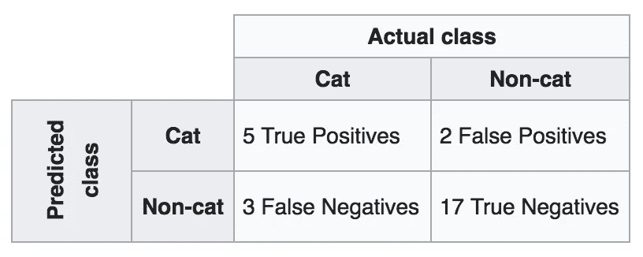
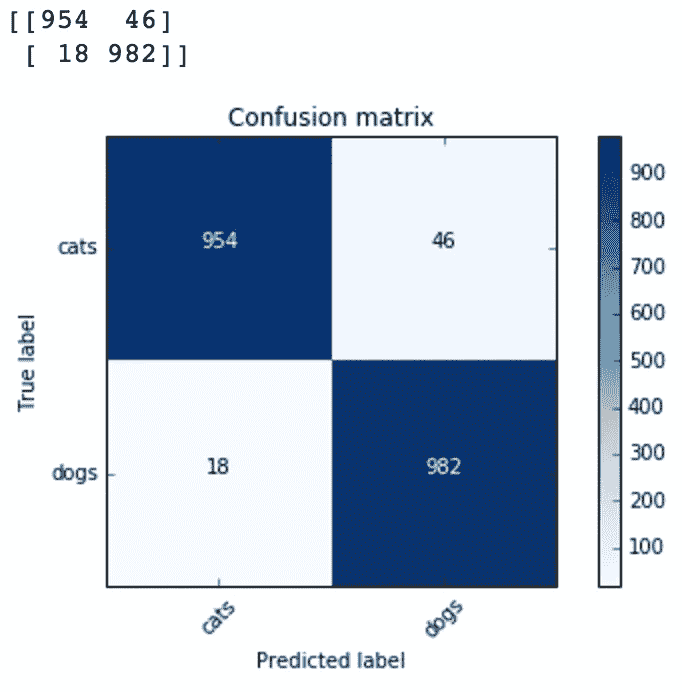
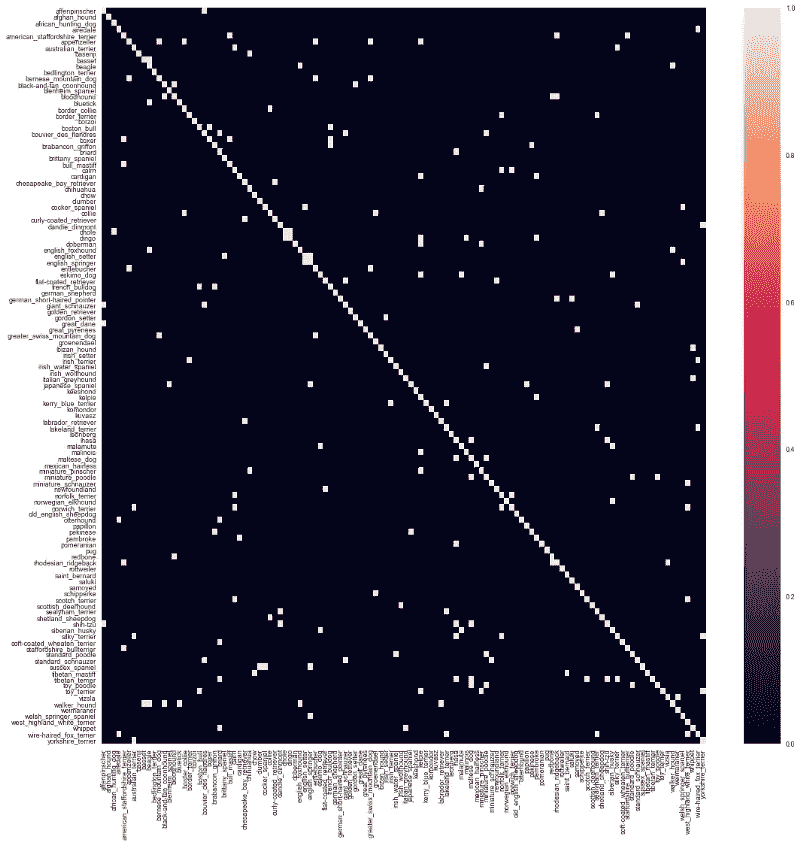
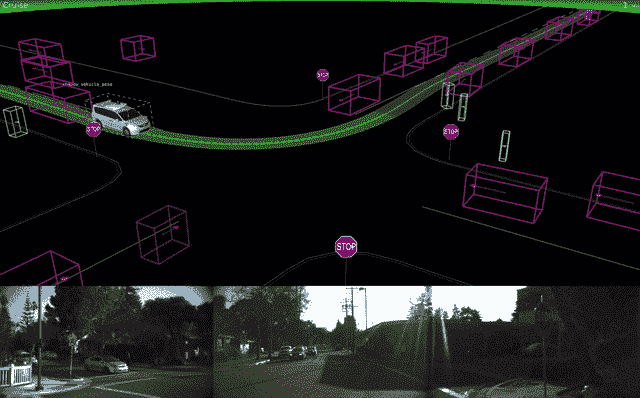
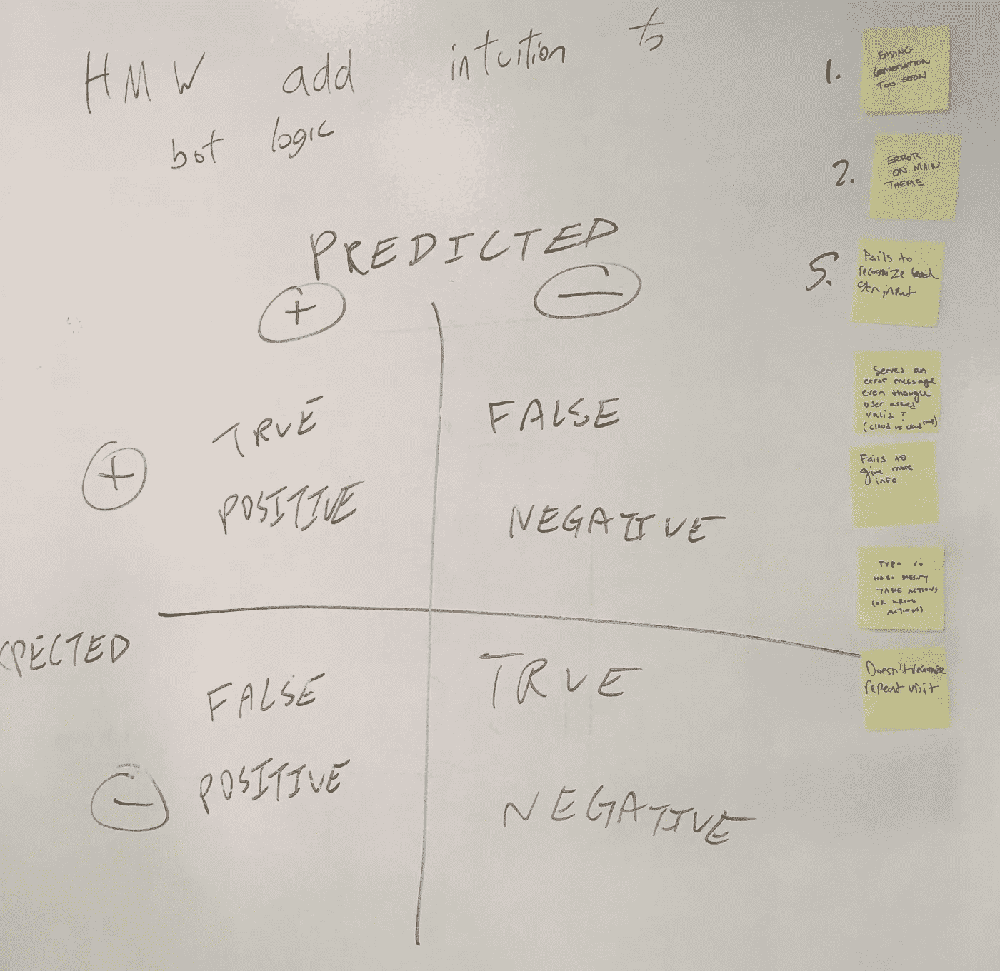

# 机器人也错了——最坏情况下的混乱映射

> 原文：<https://towardsdatascience.com/robots-are-wrong-too-confusion-mapping-for-the-worst-case-2e01b7e19936?source=collection_archive---------5----------------------->

## 这里有龙

Photo by [Seth Doyle](https://unsplash.com/photos/uNCD9kqSemY?utm_source=unsplash&utm_medium=referral&utm_content=creditCopyText) on [Unsplash](https://unsplash.com/?utm_source=unsplash&utm_medium=referral&utm_content=creditCopyText)

上一次计算器不按你的意愿工作是什么时候？一个人最后一次这样做是什么时候？从确定性的角度来看，像机器学习这样的算法介于这两者之间。

今天，我们正在制造比我们所能理解的更复杂的机器，我们需要用不同于以往技术的方式来处理它们。它不再是指定我们想要做什么，然后调试它。

在 [Philosophie](https://philosophie.is/) 我们一直在构建新的工具和练习，如[机器移情映射](https://uxdesign.cc/robots-need-love-too-empathy-mapping-for-ai-59585ad3548d)，为人工智能和机器学习项目带来人类目的。最新的是我们称之为混淆映射，它帮助你更好地为所有可能的非确定性系统失败做准备。

# 混乱矩阵速成班

正如我们从设计思维中窃取了[移情映射一样，我们也从数据科学中窃取了](https://uxdesign.cc/robots-need-love-too-empathy-mapping-for-ai-59585ad3548d)[混淆矩阵](https://en.wikipedia.org/wiki/Confusion_matrix)用于混淆映射。混淆矩阵是分类算法(包括机器学习)的性能可视化。当深入研究系统如何运行时，您需要了解的不仅仅是错误率和准确率。你需要知道它是如何失败的。

这里有一个例子:

It is always about cats, isn’t it?

一般来说，横轴是实际发生的事情，纵轴是在理想世界中预期会发生的事情。有四个象限需要考虑:

*   True positive —系统认为它应该是真的，并且它是真的
*   True negative —系统认为它应该是假的，但它确实是假的
*   假阳性(又名“假警报”或倾向于这些统计的 I 型错误)—系统认为它应该是真的，但它是假的
*   假阴性(又名“遗漏”或第二类错误)—系统认为它应该是假的，而它是真的

混淆矩阵最传统的用法是用于分类问题。例如，如果你想把一张图片归类为一只狗或一只猫，你会在混淆矩阵中考虑两个不同的类别。认为一张猫的照片是一只狗将会是一个错误的结果。在这种情况下，有 18 种情况下狗被错误地归类为猫:

Example of confusion matrix plot for a dogs and cats classifier from the fast.ai course.

对于每个象限，我们考虑正确(或不正确)分类发生的次数。当考虑特定结果与其频率相比的影响程度时，这可能非常有帮助。

通常当它用图表示时，你会看到一条从左上到右下的对角线，在那里你有每一类或预测的真阳性和真阴性。

有些情况下，您可以有许多分类。在 ImageNet 的情况下，有许多许多可能的分类。关于狗，仅狗的种类就有 120 种。

They can be huge!

# 困惑矩阵是关于结果的…

建立解决人们问题的服务的第一步是关注结果而不是解决方案。混淆矩阵通过计算分类器做它应该做的事情的次数来做到这一点。

你需要知道当机器做它应该做的事情时，以及当它正确地不做任何事情时，期望的结果是什么。

当创建混淆矩阵时，他们对原始分类最感兴趣。我们需要更进一步，思考我们的机器按照我们期望的方式工作会有什么样的结果或可能的影响。

让我们以自动驾驶汽车的前方物体检测系统为例。它需要识别车辆前方何时有人或物，以便采取正确的行动，例如紧急刹车或急转弯以避免碰撞。当没有检测到任何东西时，它不应该干扰车辆的其他计划和执行。

对于[我们为现场服务运营](https://uxdesign.cc/testing-ai-concepts-in-user-research-b742a9a92e55) (FSO)所做的一个项目，有一个界面会根据预测算法推荐是否将现场技术人员分配到某项工作。我们要么希望系统指派某人以便他们可以去工作，要么在指派之前要求某人获得更多信息。

A field service operations job detail for a dispatcher with automatically recommended technicians, parts, schedule, etc.

要采取的干预措施是这个例子中最重要的部分。根据所识别的事物的类型，它可能想要采取不同的动作。

# …以及应用程序将如何出错

当我们构建这些类型的智能算法时，它们会出错。原因是我们不会尝试每一种可能的情况组合，只是那些我们认为会发生的情况。如果我们不这样做，将会花费很长时间来建立和训练这些类型的系统。

Watch out for that bicyclist!

对于我们一直在谈论的自主车辆障碍物检测系统，当它认为汽车前方有障碍物而实际上没有障碍物时，就会产生误报。错误的否定是认为车前有东西，而实际上有。这两种情况之间有明显的区别，因为一种是导致不恰当地猛踩刹车(假阳性)，另一种是像人一样撞到障碍物(假阴性)。

假阴性并不总是比假阳性更糟糕。以诊断癌症的算法为例:假阳性可能引发一系列不必要的手术干预，从而导致进一步的问题。从假阴性和假阳性的角度来理解尽可能多的影响是很重要的。

对于 FSO 理工学院的推荐，误报是在工作准备好分配之前分配现场技术人员。如果现场技术人员不合格、没有合适的零件或者只是不知道该做什么，这可能需要返回(对于预测算法来说，这是一种“感觉糟糕”的情况)。在这种情况下，错误的否定是让作业在队列中等待，并在分配之前要求更多的澄清。这可能导致现场技术的利用率下降，并减少计费时间量(对于算法来说，这两种情况都是“糟糕的”)。

# 作为灵感的死亡前

混淆矩阵显示了特定的分类算法是如何特别失败的。[预死亡](https://hbr.org/2007/09/performing-a-project-premortem)是一种帮助我们理解我们的项目和团队将如何失败的技术。他们在复杂的团队结构中特别有用。

预死亡的好处在于，它允许每个人戴上他们的[黑帽子](https://en.wikipedia.org/wiki/Six_Thinking_Hats)，在最坏的情况下发挥真正的创造力。群众的智慧在决定什么是项目中最有可能自己造成的问题方面非常有用。

作为一种方法的前概念和作为一种概念的混淆矩阵是我们在 Philosophie 创建的混淆映射练习的灵感来源。

# 混淆映射方法

当你专注于一个问题和一个可能的解决方案时，这个练习是最合适的。在我们举办的一个研讨会上，在做这个练习之前，我们做了挑战映射(用一个很好的‘我们如何能……’)、[疯狂的 8 个想法](https://uxdesign.cc/honing-crazy-eights-with-randomness-1c8100b94824)和[机器的移情映射](https://uxdesign.cc/robots-need-love-too-empathy-mapping-for-ai-59585ad3548d)。

在这个练习中最关键的是不要担心病例的发生频率。你专注于收集尽可能多的问题。

你应该和一群跨学科的人(例如，数据科学家、工程师、设计师、产品经理、高管等)一起计划大约一个小时。)来完成这些类型:

1.  用“积极”表示你希望实现的功能，用“消极”表示没有实现的功能。
2.  对于四个象限中的每一个，privately ideate on post 都指出了如果发生这种情况会对人们或其他系统产生什么影响。花 3 分钟时间构思每个象限，并在每个象限的生成步骤后立即分享…
3.  你们一起把每个单独构思的项目放在黑板上，如果不明白就澄清，并删除任何共同的项目。在这一点上尽量避免过多的讨论。为此，每个象限大约需要 2 分钟。
4.  现在[点选](https://en.wikipedia.org/wiki/Dot-voting)真实正象限和真实负象限中最重要的项目。按照票数从多到少的顺序把他们排在一边。
5.  接下来[点票](https://en.wikipedia.org/wiki/Dot-voting)假阳性和假阴性象限中最差的项目。Stack 将他们按照从差到差的顺序排在一边。

Photo from our NYC Media Lab Design Thinking for AI workshop.

在这个过程之后，你应该有一个堆叠排列的结果列表，当事情成功或失败时，这些结果是最重要的。锻炼的最重要的方面是团队内部对可能出错的地方的一致和共同理解。

# 少一些困惑

在 Philosophie，我们在从问题到计划的过程中使用这些类型的练习，我想你会发现它们是有益的。

既然你们在团队中已经达成共识，那么有几件事情需要考虑:

*   采用具有更确定性模块的系统方法来调整或指导输出，以避免这些情况。
*   将模型分解成多个具有不同的单一误差指标的模型，作为一个整体，以降低这些误差发生的可能性。
*   开始着眼于评估不同结果的频率。

理解这些系统是如何出错的，是与使用它们的人建立信任的第一步。不使用不受信任的解决方案。